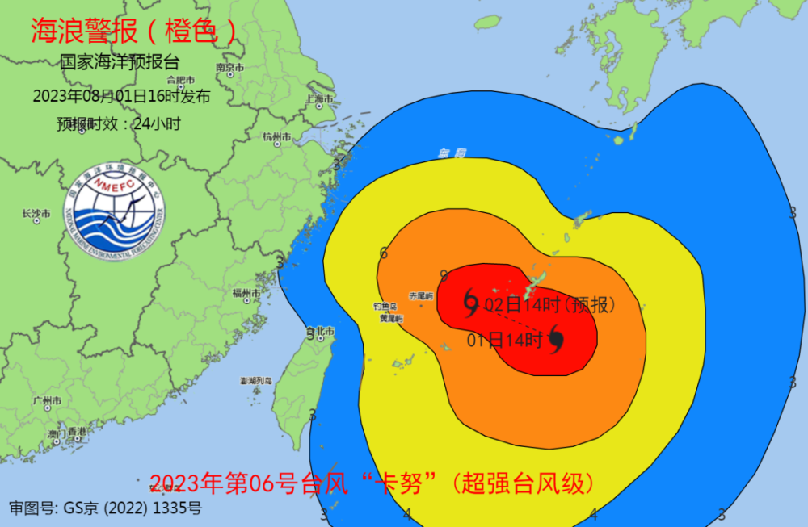

# “卡努”靠近东海，多地拉响风暴潮警报！预测的行进路径却一团乱麻

今早7时，今年第6号台风卡努（超强台风级）的中心，位于浙江玉环东偏南方向约610公里，将以每小时10-15公里的速度向西偏北方向移动，强度还将有所增强，即将进入我国东海，然后逐渐向浙江中部至福建北部一带沿海靠近。

据自然资源部，受今年第6号台风“卡努”（超强台风级）的影响，
**从昨天（8月1日）到今天（8月2日）两天，东海东南部将出现8到12米的狂浪到狂涛区，台风影响区域海况恶劣。**
国家海洋预报台根据《海洋灾害应急预案》，将海浪警报升级为橙色。

**上海、宁波、舟山、温州和福州拉响风暴潮黄警**

据中央气象台消息，今年第6号台风“卡努”（KHANUN）的中心，昨天 **14时位于距离浙江省玉环市东偏南方向约820公里的西北太平洋洋面上**
，“卡努”将以每小时10-15公里的速度向西偏北方向移动，预计今天进入东海。

受今年第6号台风“卡努”（超强台风级）的影响，预计8月1日夜间到2日白天，东海东南部将出现8到12米的狂浪到狂涛区，东海西南部、钓鱼岛附近海域将出现4到7米的巨浪到狂浪区，东海北部将出现2.5到4米的大浪到巨浪区，近海海域海浪预警级别为橙色；浙江近岸海域将出现2.5到3.5米的大浪，该近岸海域海浪预警级别为黄色，福建北部近岸海域将出现2到3米的中浪到大浪，
**上海近岸海域将出现1.5到2.5米的中浪到大浪，该近岸海域海浪预警级别为蓝色。** 请在上述海域作业的船只注意安全，沿海各有关单位提前采取防浪避浪措施。

**国家海洋预报台同时拉响风暴潮黄色警报。** 预计8月1日下午至2日夜间，江苏南通到福建福州沿海将出现30到80厘米的风暴增水。
**上海市、浙江省宁波市、舟山市、温州市和福建省福州市的风暴潮预警级别为黄色。**
浙江省嘉兴市、绍兴市、台州市和福建省宁德市的风暴潮预警级别为蓝色。由于受台风影响岸段的天文潮较高，需要重点关注夜间沿海的天文大潮时段，且台风路径尚有不确定性，国家海洋预报台将密切关注，同时提醒沿海政府及相关部门按照职责做好防御风暴潮的应急准备工作。

**台风外围气流今天影响上海**

要说“卡努”是今年以来最诡异的台风，恐怕不会有人有异议。昨天（1日），超级计算机给“卡努”预测的路径，可以用“天女散花”来形容。

从图中可以看到，数值预报模式认为“卡努”未来有可能的行进路径非常之多。上海中心气象台也认为，“卡努”未来的路径复杂多样。

超级计算机不好使了吗？导致“卡努”变幻莫测的原因是什么？

第一个问题的答案显然是否定的。在“卡努”初期，各家机构的超级计算机基本都给出了登陆浙江的预期。但随着天气系统的变化，预期就变了。

简单来说，现在的海上存在各种各样的天气系统，而且复杂多变，彼此还可能互相影响。这导致影响“卡努”的因子越来越多，越来越杂。就像解一道难题，本来题目就难，你在解题的过程中，变量还越来越多，变量之间还可能互相影响，最后……

**知名科普账号“中国气象爱好者”给出了一段比较专业的解答。**

他们认为，“卡努”在东海陷入鞍场，台风的东南西北都有高压系统，所以移速放慢。未来将在东海拖泥带水，直到近海滞留。但在“卡努”滞留期间，副热带高压调整，西南季风爆发，新的台风胚胎可能诞生，蝴蝶效应指数倍放大，导致“卡努”行踪不定。

大气系统之复杂，也体现在台风强度上。“卡努”的爆发强度也超过了超级计算机此前的判断，达到超强台风级。根据中央气象台最新监测，“卡努”昨天（1日）17时距离浙江省玉环市东偏南方向约780公里，达到超强台风级，最大风力16级。

根据上海中心气象台预测，“卡努”台风中心将在今天（2日）上午进入东海，向浙江中部至福建北部一带沿海靠近。进入东海之后引导气流变弱，移速变慢，4至6日可能在上述沿海海面回旋少动。

但上海市气象部门强调，未来几天，机构对副热带高压形态预测仍存在分歧，加上海上对流活动活跃，需要密切跟踪监测台风行进路径，更要强调的是，对于这枚神秘莫测的台风“卡努”，小伙伴们仍需警惕和敬畏。一方面，
**“卡努”虽然暂时不登陆浙江了，苏浙沪的防台压力小了一些，但影响仍在。**

比如，昨天上午到中午，上海就受到“卡努”外围偏东气流影响，大部分地区出现了中雨，局部大雨，浦东祝桥的雨量最大，达47毫米。要知道，昨天“卡努”距离浙江还有近800公里这么远的距离，可见其威力之大。

**今天，上海继续受台风“卡努”外围偏东气流影响，依然是蓝天白云、乌云、雨水切换的一天！**

另一方面，“卡努”接下来在东海赖着不走，每天形势都在变，登陆的可能性还是不能被排除。以目前路径预测，3日起，上海沿江沿海地区风力增大，阵风可达7级。

综合自《新闻夜线》、上观新闻（作者：戚颖璞）、澎湃新闻、国家海洋预报台、新闻坊、央视新闻

编辑 | 谢钱钱

