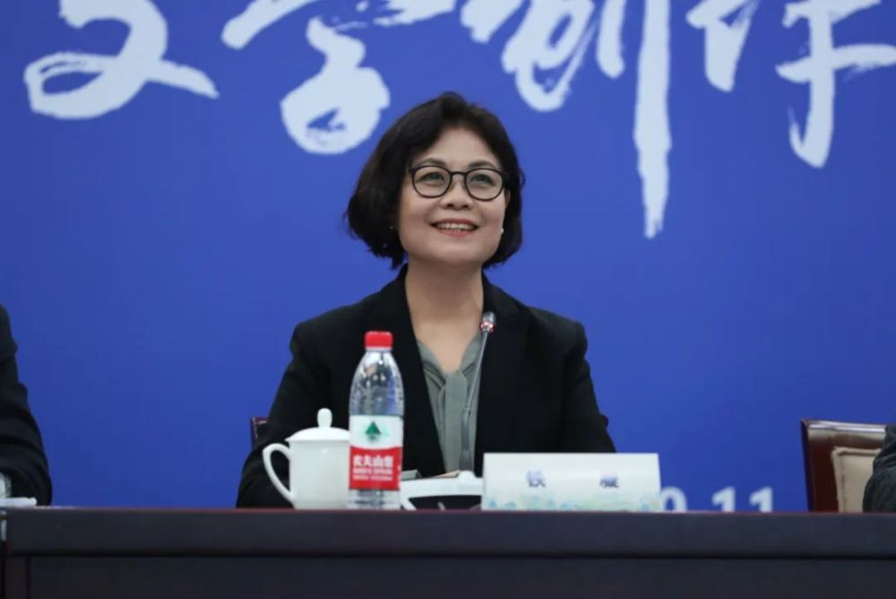

# 中国作协主席铁凝多了一个新身份

**撰文 | 余晖**

据新华社报道，8月1日，全国人大常委会副委员长、 **全国人大中澳议会交流机制主席铁凝** 在京会见澳大利亚驻华大使傅关汉。

双方就中澳关系发展、两国立法机构交往等交换了意见。

上述消息显示，铁凝已任“全国人大中澳议会交流机制主席”。

**新身份**

官方简历显示，铁凝，女，汉族，1957年9月生，河北赵县人，1975年7月参加工作，1975年11月加入中国共产党，高中学历，文学创作一级。

她现任中共二十届中央委员，十四届全国人大常委会副委员长，中国文学艺术界联合会主席，中国作家协会主席。

这是铁凝首次以全国人大中澳议会交流机制主席的身份亮相。

全国人大的定期交流机制到底是什么？

政知君了解到， **定期交流机制，是人大对外工作的特有优势。**

这一机制是全国人大保持与主要国家议会和国际议会组织间对话沟通的一项开创性举措。

**1981年** ，全国人大与欧洲议会建立交流机制，这是全国人大首度与外国（组织）议会建立交流机制。

2008年，新华社刊文称，中国与其他国家议会定期交流“ **着力形成机制，触及实质问题，注重实际效果** ”。

当时，有媒体评价称，与各国建立议会定期交流机制正成为中国“议会外交”的一个新突破点。

这些年来，议会交流机制不断扩大。

今年3月，时任全国人民代表大会常务委员会委员长栗战书在作报告时提到，
**全国人大与21个国家议会和欧洲议会建立了定期交流机制和政治对话机制，同16个国家议会和欧洲议会举行35次机制交流会议**
，实现了多层次、宽领域的交流与合作。

**沟通**

政知君注意到，全国人大和澳大利亚议会建立定期交流机制的时间是在2006年。

2006年8月，中国全国人大与澳大利亚议会众议院在北京签署了建立两国议会定期交流机制的谅解备忘录。

2007年5月30日，中国全国人大与澳大利亚议会众议院定期交流机制第一次会议在堪培拉举行。

当时，中方代表团成员与澳大利亚议会众议院各委员会负责人及重要议员就中澳关系、台湾问题、议会交流、能源环保、全球气候变化以及共同关心的国际和地区问题深入交换了意见。

定期交流机制的背后，体现了两个字——沟通。

2015年，时任全国人大常委会副秘书长曹卫洲曾撰文提到，定期交流机制是全国人大与外国议会加强战略对话、深化务实合作的重要平台。

“确保了全国人大与有关国家议会的交往不因议会换届而中断，不因领导人更迭而改变，保证了议会交往的连续性，丰富了议会交往的内涵，
**为积极探索中国特色大国外交之路作出了积极贡献** 。”

**恢复各领域、各层级交往合作**

政知君注意到，中澳关系备受外界关注。

2022年11月，国家主席习近平在巴厘岛会见澳大利亚总理阿尔巴尼斯。

习近平指出， **中澳关系曾长期走在中国同发达国家关系前列，值得双方珍惜。过去几年，中澳关系遇到困难，这是我们不愿看到的。**

他说，中澳两国同为亚太地区重要国家，应该改善、维护、发展好两国关系，这不仅符合两国人民根本利益，也有利于促进亚太地区和世界和平与发展。

2022年12月，外长王毅同澳大利亚外长黄英贤举行第六轮中澳外交与战略对话。

会谈后，双方发表了中澳外交与战略对话成果联合声明，同意中澳关系应符合两国全面战略伙伴关系定位，
**将保持高层交往，启动或重启双边关系、经贸、地区和国际问题等领域对话沟通** ，支持两国人文交流。

7月13日，王毅在雅加达应约会见黄英贤。

王毅说，在双方共同努力下，中澳关系止跌回稳，得到改善和发展。

王毅说，双方应维护好、巩固好当前良好势头，使中澳关系继续走稳、走实、走远。

“要落实好两国领导人共识， **恢复各领域、各层级交往合作，增进理解互信** 。”

他还提到，双方要相互尊重、平等相待，妥善处理分歧，培育相互理解、相互欣赏的友好氛围，给两国人民带来更多实实在在的利益。

**资料 ｜ 新华社 人民网 央视 中国人大网等**

**【版权声明】本文著作权归政知新媒体独家所有，未经授权，不得转载。**

