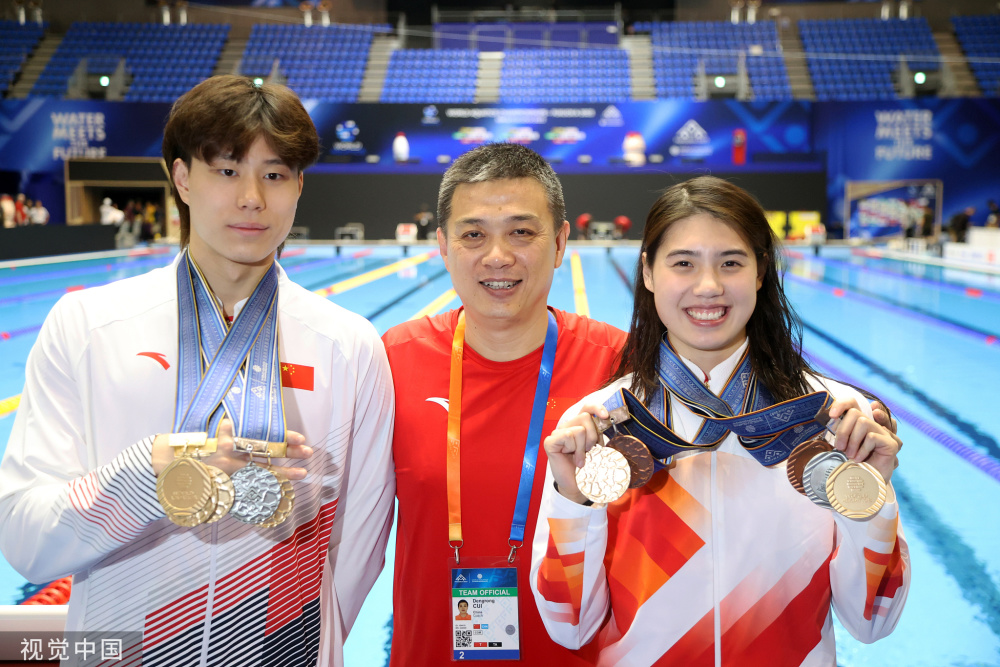
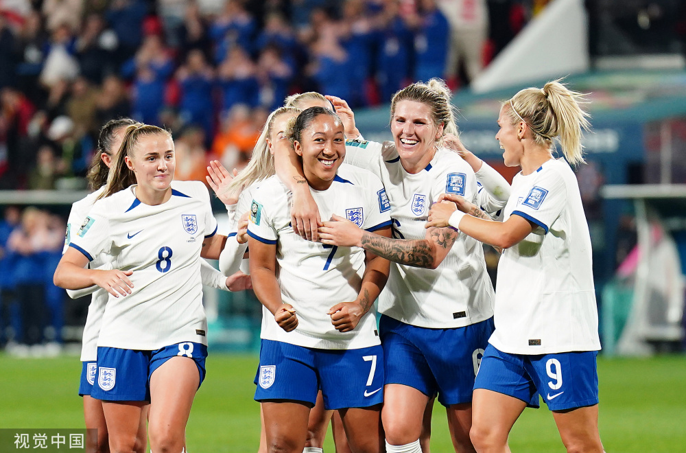

# 体谈丨把女足的问题甩锅给水庆霞，既蠢且坏

**撰文丨霍森**

**编辑丨冯小**

刚刚结束的女足世界杯小组赛最后一轮比赛，中国女足以1-6的比分惨败给英格兰女足，最终以1胜2负积3分的战绩获得了小组第三，无缘出线，就此告别本届世界杯。

回顾女足姑娘们在本届世界杯的征程，对阵丹麦时的进攻无力与对阵海地时的茫然无措，实在是难称令人满意——如果就此进行追责，比如张睿那张毫无必要的红牌，又或者门将朱钰的失误，甚至于水庆霞指导的战术安排等等，或许都难以逃过“事后诸葛亮”式的放大镜拷问。

但这种拷问并没有任何意义，且是愚昧和不可理喻的。

比起1-6的比分，比赛的场面更能说明问题，新科亚洲冠军和新科欧洲冠军之间的差距是全方位的，包括身体的对抗性、足球技术的应用、对战术的理解和比赛的节奏，这场惨败足以揭开某种血淋淋的真相——曾经辉煌无比的铿锵玫瑰，如今已经落后于世界顶尖水平，而且这个落后的幅度，并不算小。

著名解说黄健翔在这场比赛临近尾声的时候，非常艰难地说出了这么一句话：“如果是对女足近几年的发展状况有所了解，并且一直观看着女足比赛的球迷朋友，对这样的结果，其实不会感到太过意外。”

是女足姑娘们没有努力吗？

首战丹麦，水指导巧妙的战术安排和女足姑娘们不惜体力的高位逼抢，一度让我们距离胜利极为接近；次战海地，在绝大部分时间里10打11的情况下依然艰难取胜；即便是最后一轮的惨败，固然是技不如人，但女足姑娘们也肉眼可见的在场上拼尽了全力。

虽然最终的结果难言令人满意，但从整体上而言，这一支中国女足从未失去拼搏到最后一刻的勇气，她们无愧于“女足精神”的传承。

但越是如此，才越让人感到了某种现实倒错的荒愕——既然队员们和水庆霞指导已经尽了全力，却依然收获了这样的结果，才更说明了中国女足的落后不在于某一点，而是全方位的落后。

赛后，王霜在接受记者采访的时候一度哽咽不已：

“我们不是一个特别好的榜样吧。还是希望未来的孩子们能够踢出更精彩的足球。”

“也希望国内的教练们能培养出更多真正会踢球的孩子们，让她们在未来代表国家队的比赛中不至于这么狼狈。”

实在令人唏嘘。

但与此同时，这次的赛后采访中，王霜还说出了另外一句话——

“看看邻近国日本怎么踢，她们为什么能够换了一批又一批的人，但是她们DNA始终不变，而且她们的DNA是越来越好。”

在中国女足惨败的前一天，日本女足4-0狂胜西班牙，在这场比赛里，日本女足展现出了极为优秀的技术和娴熟的配合，并通过坚定的反击战术，成功击溃了来自欧洲的劲旅。

以此为标准，再回过头来看中国女足，这样的差距才更让人感到痛心。

是我们忽视了女足的建设，对女足的投入不够吗？

在本届女足世界杯开打之前，体谈专栏就曾经推出过前瞻性文章《说出来可能不信，中国女足“收入一流、水平二流”》，文章中已经通过详细的数据证明了，中国女足的平均收入，在世界女子足坛里其实是排名前列的，而且这个收入水平是通过国家拨款和部分社会团体的捐赠而非商业收益来实现的。

甚至国家还大力鼓励和支持女足队员留洋——虽然也有着某些执行上的问题，但总体而言，在态度上远比男足要开放得多。

“女足精神”没有丢，收入待遇水平也跟上了，留洋也没有被卡脖子……那么，问题出在哪呢？

还是那三个字：职业化。

欧洲拥有着全世界最为深厚的社区足球积淀，从青训选拔到比赛训练，都远远领先于中国足球，在这样的大环境下，只要稍加重视，欧洲女足的整体强大几乎是没有任何悬念的。

这种对比，就像是工业化生产对小农生产的降维打击，这不是中国女足的问题，这是中国足球整个的系统性问题，是中国体育的系统性问题。

中国体育自95年开始推行的奥运争光战略，重点不外乎“小巧难女少”五个字，小是小球，巧是技巧项目，难是难度大，女是女子项目，少是参与人数少。

在举国体制下，这一战略很快获得了巨大的成功，跳水、乒乓、羽球、举重、射击、体操硕果累累，极大地提升了中国体育在世界体坛里的地位。

_刚结束不久的游泳世锦赛，大放异彩的游泳队运动员覃海洋和张雨霏与教练合影_

但很显然，这一成功固然是前辈体育人拼搏奋斗的结果，也同样得益于项目的职业化程度低，只需要少量的投入就能够迅速获得成绩。

这也是早年的中国女足甚至中国女排成跻身世界顶尖的重要原因之一。

但在欧洲女足和女排职业化大潮风起云涌的当下，依然还抱残守缺的想要依靠举国体制来取得成绩，自然就会显得力不从心，甚至是缘木求鱼。

一个很明显的现象就是，高度职业化的团队项目，中国没有一个是能够拿得出手的。

说回本届女足。

显然，本届世界杯女足姑娘们铩羽而归的原因，不在于一两个球员的表现，不在于主教练是谁，也不在于“女足精神 - 搜索结果 -
知乎”，而是实打实的培养机制的差距。

在2017年，英足总推出了Gamepaln
Growth计划，提出要在2017-2020年间，实现“女子足球运动参与数量翻倍”、“女足国内比赛现场观众人数翻倍”、“女足国家队在世界大赛中力争上游并在2023年拿下世界杯”的三大目标。

此后不到两年，英国女足球队的总数就达到11088支，注册球员120577人，18岁以下球员76625人。

就算是邻国日本，注册的职业女子球员数量也达到了8万人。

而在中国，这个数字是……3000人。

老球迷们无不怀念着孙雯和刘爱玲双星闪耀的黄金年代，但又怎能指望这贫瘠的土壤结出硕果来？

至于为什么愿意从事女足行业的人员如此之少，这是一个深刻的社会性问题，就不多做展开了。

去年亚洲杯后，有不少球迷产生了女足重回巅峰的错觉，高呼着水指导万岁；今年世界杯后，又有不少球迷在失落失望之下，厉声斥责水指导耽误了球员。

这样的行为，其实是在本质上逃避了对中国足球更深一层问题的思考，只想将一切都放纵于情绪的宣泄。

水指导如果真的下课了，然后呢？中国女足会变得更好吗？

很显然，不可能。

这十年里，中国球迷很流行的一个段子是给2002的国足道歉，“我们曾经以为只是个开始，没想到已经是巅峰”。

我想，这句话也可以用在现今的中国女足、女篮甚至是女排上。

因为想要解决这个问题，需要的不是某一个教练或者某一个球员，而是某一代人甚至是整个社会持续不断的投入、付出和小心呵护，包括建立体育社区、培养足球人口、改善足球青训、大力推广校园体育等等……

当然，这些都已是老生常谈。

“知道正确的道路”从来并不难，难的是该如何“朝着正确的道路坚定不移的前进”，以目前中国社会的大环境而言，想要做到这一点，很难。

当下的中国女足虽然惨淡，却已经是黑暗中难得的一缕萤火，还请大家且看且珍惜吧。

