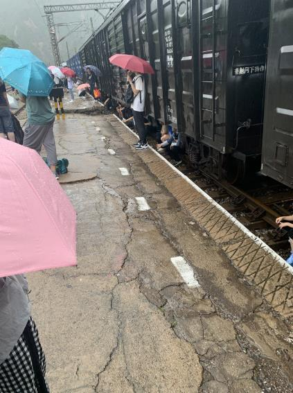
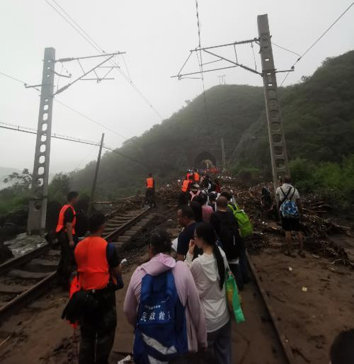

# 北京落坡岭76小时救援：暴雨致三辆列车2700人被困，武警徒步带领转移

“我们由武警带队从落坡岭步行走到斜河涧站后，铁路安排了一辆4节车厢的火车把我们送到丰台站，大家虽然累，但都为了回到家而感到欢呼雀跃。目前，我已经平安到家。”8月2日，K396乘客刘鑫（化名）告诉《华夏时报》记者。

一场突如其来的大暴雨，将人们原本平静的生活打乱。受台风“杜苏芮”影响，北京自7月29日开始连续强降雨，西部、西南部、南部迎来特大暴雨，强度超过了2012年的“7.21”特大暴雨。受暴雨影响，北京门头沟区等地爆发山洪、泥石流，将K396、Z180、K1178次三趟列车堵在丰沙线上，车上乘客超过2700人被困。其中，从乌海西开往北京丰台的K396次列车，是第一辆在互联网上引发关注的受阻列车，车上共有976名旅客和24名乘务员。

面对突如其来的灾难，救援人员和时间赛跑，动员一切力量救人；被困人员也在彷徨茫然之后，迅速团结一致共渡难关。最新消息是，下午4时30分左右，因强降雨被困于门头沟落坡岭的K396次列车第二批近500名乘客抵达北京丰台站。

至此，距离列车被困已过去76个小时。

**滞留落坡岭**

时间线拉回7月30日12时50分，彼时暴雨如注，突如其来的超大雨量冲毁了丰沙线部分路段，乌海西开往北京丰台的K396次列车在仅剩不到70公里的距离时被紧急逼停在门头沟区落坡岭站。

“真是完全没有想到这个雨会下这么大，本身想的是29号晚上走，睡一觉，30号上午九点半就能到。结果早上六点钟就停在落坡岭了。”刘鑫表示。

没食物，是当时车上最大的挑战之一。

面对一车900余名乘客，14时57分，K396次列车工作人员果断向落坡岭站请求物资支援。落坡岭站是个小站，站长马瑞新立刻与村内小卖部联系，带领职工冒雨为车上送上第一批物资方便面。但食物消耗非常快，仅仅一个小时，第二次物资告急的消息再次发出。

“在车上的时候，大部分人的状态基本都是不是很饿。有一开始就和售货员买了很多（食物）吃的人，也有两天都没怎么吃的人，物资这块儿其实是很不充足。列车上一开始免费发了15箱的桶装方便面，还有蛋炒饭，但是量太少，后面就不停地兑水，隔一会儿路过的人手里的粥就会变得更稀。”刘鑫表示。

铁路部门也表示，由武警部队和首都公安投送的部分食品已分发至旅客手中，但总量不足，需要进一步补给。

但相比食物短缺，仿佛没有尽头的等待，加上没信号与外界失去联系，则让乘客更加焦灼。

“信号是从30号上午就开始出现问题，30号上午所有用移动卡的人就一点儿信号没有了。我们还说，可能是打水把移动的信号塔给冲坏了。紧接着下午联通和电信的也都没网了，直到8月2日凌晨我们到了斜河涧站才有了信号。”刘鑫说。

31日清晨，旅客们睡醒一觉后，发现列车依然停靠在落坡岭站，陆续出现情绪波动的情况，旅客逐步向餐车聚集，人越来越多。

雨一直在下，31日中午，信号中断，路基冲刷更为严重。31日中午，为了安全，也是为了安抚旅客，铁路部门决定将全车旅客转移至安全地点避险。一个小时后，700余人由车站6名工作人员和当地居委会分散安排至社区广场、铁路工务工区和居民家中休息。

条件有限，人们们不得不在社区礼堂组了几张凳子，拼成简易床，有些人则是席地而躺，将就着睡了两晚。

“很多人都是打地铺睡的，地上铺的几个尼龙袋，还有用纸板、纸箱子铺的，也有坐在椅子上睡的，还有的用几个凳子拼一个床在上面睡的。”一位乘客表示。

值得注意的是，无论是物资安排还是居住安排，都是老人和小孩优先，一些有床的屋子里以及居民家里，也是以老人和孩子为主。据了解，车上有43名参与研学的孩子，年龄均在11至13岁左右，只有3名老师陪同。转运过程中，工作人员和乘客把条件相对最好的社区大礼堂留给了他们。7号车厢有一名残疾旅客行动不便，7名现役军人自告奋勇轮流背着残疾旅客转移至村民家中。

在其中，落坡岭的社区居委会主任给乘客留下了很深的印象。好几天晚上，睡不着的乘客起来透气，总能看见她晚上还在街上为这些没有吃着饭、没有地方睡的人安排住处和餐食。

**救援艰难展开中**

在车上人员经历困境的时候，救援也在艰难地展开中。

洪水没过钢轨、断枝杂物覆盖线路、泥石流和山体落石处处可见，救援人员一边清理线路，运输物资的列车一边往目的地挺进。

“武警战士很辛苦，他们一人背着两个包，带着物资，1号晚上七点将物资送到了落坡岭站。”刘鑫说。

武警带来的不仅是物资，还有脱困的希望。

“当时说是2号白天可以走，到了晚上十一点半的时候通知我们出发，让年轻的小伙儿都跟上，我们就赶快收拾东西加入了队伍。后面不停还有人加入。”刘鑫表示。

被困两天两夜后，8月2日凌晨1时45分，K396次列车首批328名乘客开始向山下转移。庞大的队伍顺着铁道踽踽前行，道路泥泞湿滑，走起来十分困难。经过桥梁时能看见湍急的河流。路上，有3、4个隧道口被泥石流破坏得很严重，幸亏有武警战士开辟了一条道路。经过隧道时，积水仍然没过脚踝，但相比武警救援时没过膝盖的积水，水位已经明显下降。

由武警带队，从落坡岭步行走到斜河涧站后，铁路安排了一辆4节车厢的火车，将受困乘客送到丰台站。而行动不便的老人和孩子暂时留在原地，等待后续转运安排，住所和吃喝都能保障，随行军医也已经入驻了乘客滞留点。在乘客往山外撤离的过程中，门头沟区成立了临时指挥部，统筹协调各项救援工作。

从时间线来看，8月2日凌晨开始，K396列车乘客已从落坡岭居委会安置点有序向外转移；凌晨5点30分，铁路部门开行临时列车前往河涧站，抵达后组织了328名滞留旅客统一乘车返回北京丰台站；8月2日早晨8点左右，第一批转运的328名乘客已经安全抵达丰台站；下午4时30分左右，第二批近500名乘客抵达北京丰台站。

我已经在10点到达家中。”8月2日上午，刘鑫报了平安。

得救的不仅是K396列车乘客。“Z180次列车900多名旅客一切平安。”8月1日21时20分，海事卫星电话里传来安家庄站站长林景垠的声音，北京西车务段调度指挥中心值班人员长舒一口气。

8月2日上午，铁路部门经过奋力抢修，丰沙线旧庄窝至沿河城站间线路已开通。12时40分，开行临时列车将K1178次列车滞留旅客转移至张家口站后，再换乘京张高铁返回北京北站。铁路部门增派32名值乘人员，为旅客备足食物和水，全力做好服务保障。

目前，三趟列车都已经全部报了平安，但救援仍在继续进行中。

据中国铁路兰州局集团有限公司兰州客运段担当的0K42次列车列车长白叶介绍，8月2日12时许，救援列车已到达距
k1178次列车约10公里处的官厅站，为提高运输效率，0K42次列车在张家口市宣化站被分解成0K42次、57401次及57001次3趟列车，分别承担旅客运输、物资运送、救援人员运输任务，执行抢险救灾及运输任务。

8月2日16时15分，救援列车搭载着K1178次列车旅客已平安抵达张家口站，接下来这些旅客将乘坐铁路部门准备好的高铁列车前往北京或换乘其他列车前往目的地。

Z180次913名旅客和35名乘务人员也全部平安，正在安家庄村大礼堂、居民家中等处休息，铁路部门和地方政府投送的物资和当地村民筹集的食品，基本能够满足需求。

责任编辑：方凤娇 主编：公培佳

