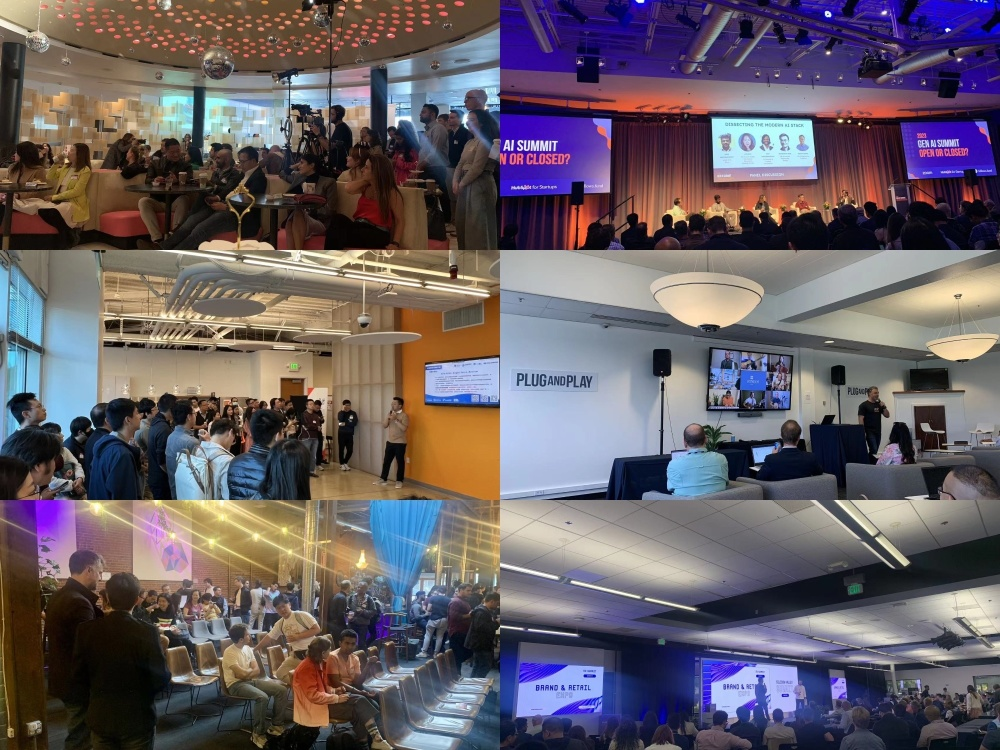
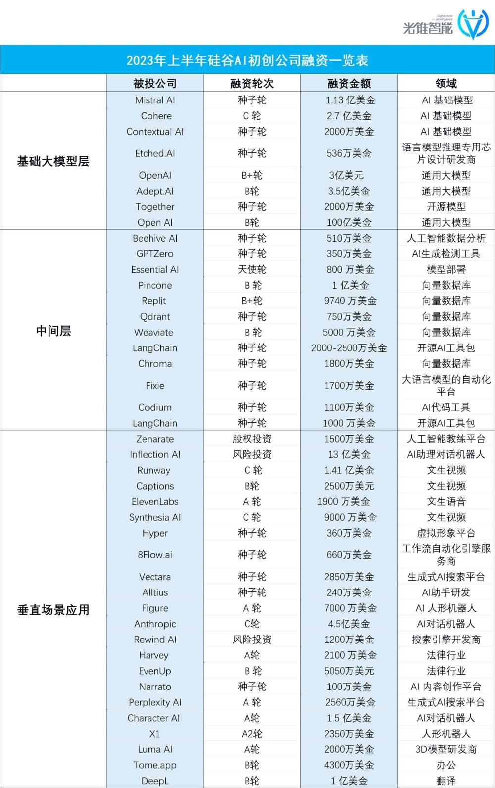
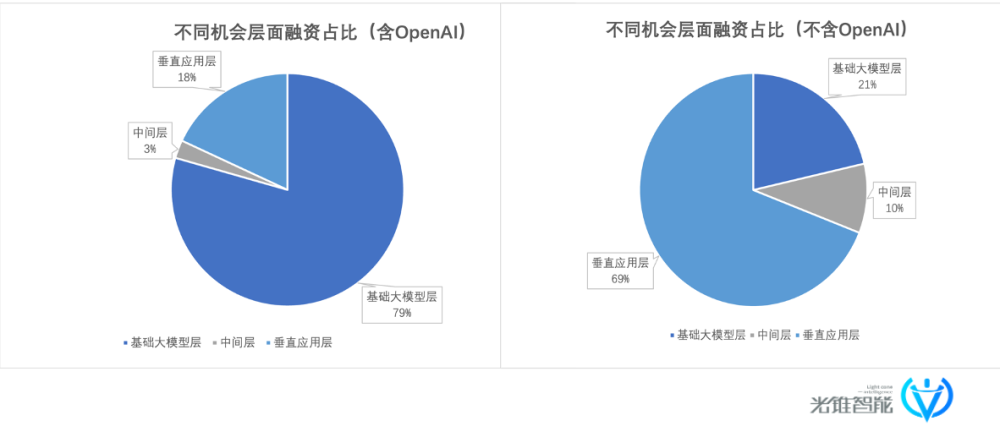
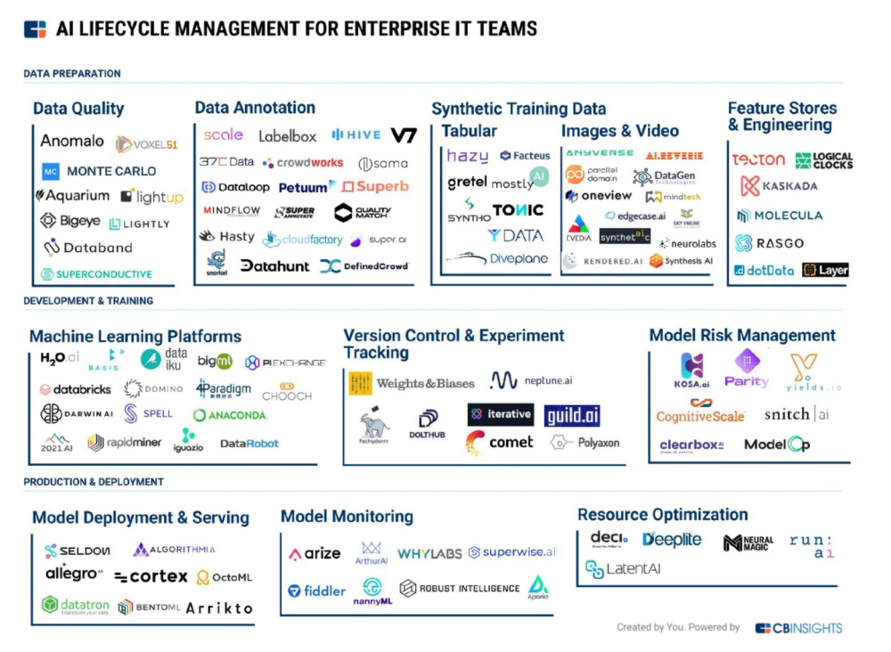

# 半年砸下1000亿，硅谷投资人“烧钱”造神

_《AI未来指北》栏目由腾讯新闻推出，邀约全球业内专家、创业者、投资人，探讨AI领域的技术发展、商业模式、应用场景、及治理挑战。_

**文丨郝 鑫**

**编丨苏扬、刘雨琦、王一粟**

一扫去年裁员、股价暴跌的阴霾，硅谷凭借AI正在以“盖茨比”式的姿态重新站到镁光灯下。

据光锥智能不完全统计，180天里，硅谷在人工智能领域共完成了42起融资、拿下55%全球筹资金额。其中，8家人工智能明星独角兽公司拔地而起，平均轮次融资金额3.3亿美元。

**热钱从硅谷的天空撒下，美元堆起了新故事。**

“对AGI时代来说，今年是过去十年中最好的一年，却是未来十年中最差的一年。”创业的氛围充斥着每个角落，这几乎成为了硅谷的共识。

“一周参加五六场聚会，从技术研讨到应用机会，硅谷这半年都处于AI
的兴奋之中。”毕业于斯坦福，常驻于硅谷的华人孔祥来不仅投身到AI电商导购的创业中，连其偶然发起的AI社区AGI降临派，也在这波热度下意外爆火。

_硅谷AI交流会现场_

身处大洋彼岸的中国创业者也受到了感染，王小川、李志飞等明星创业者和真格基金管理合伙人戴雨森、金沙江创投合伙人周雨桐等众多知名投资人不想再“雾里看花、水中望月”，一月连续三次飞往硅谷。

**中美AGI领域虽然同样火热，但在市场的格局生态却截然不同。**

最明显的区别是，与国内的“百模大战”相比，基础大模型创业在硅谷并不火热。“OpenAI一家独大，只有谷歌和Meta等大公司向其发起挑战，创业公司很少做基础大模型。”远望资本合伙人、迅雷创始人程浩对光锥智能谈到，但在中国，还是有人想赌一把，因为最终谁是中国的OpenAI还不确定，造神的这一过程既危险又性感。

而大模型之外，硅谷却在中间层和垂类应用层里，呈现出百花齐放的热闹。但反观中国，虽然投资人们嗅觉敏锐，早就闻到了“肉香”，却“看得多投的少”；而AI创业领域，也鲜有全新的大模型之外的公司出现，更多是大中型公司的声音。

无论是源于美元基金的撤退，还是国内的AI创业环境，与互联网时代不同，在这一轮科技狂潮中，中国创业者和VC们正在经历着前所未有的迷茫，Copy to
China的策略似乎逐渐失灵了。

“硅谷重视技术，埋头升级大模型能力，而国内则更看重商业模式。”孔祥来对光锥智能说道。AGI时代，各自的商业逻辑依然没有改变。

结合投资人、创业者的深度访谈，光锥智能复盘了今年上半年硅谷AI初创公司的融资和发展情况，希望能从中探寻到AI
2.0创业浪潮中的机遇和警示，以期给国内投资人和创业公司一点启发。

AI掘金潮，热钱撒向哪儿？

据国外风投数据分析公司PitchBook数据显示，上半年全球AI领域共计发生融资1387件，筹集融资金额255亿美金，平均融资金额达2605万美金。据融资服务机构Carta数据显示，2023年Q1，美国A轮AI初创公司融资环比增长58.4%，种子轮公司估值增长了19%。

**热钱一半都流向了硅谷。据光锥智能不完全统计上半年硅谷一共有42起融资，总金额约140亿美元，约合人民币超1000亿元，占世界总融资金额的55%。平均轮次融资金额为3.3亿美元，是平均融资水平的近13倍之多。**

_最全硅谷AI创业公司梳理，制表：光锥智能_

以OpenAI为首的AI新贵成为当之无愧的主角，在获得投资的40家公司中，有近60%的公司成立时间在一年之内。其融资轮次也处于早期阶段，42起融资事件中，种子轮次占了40%，B轮以前（包含B轮）占了86%。

孔祥来告诉光锥智能，硅谷这波创业大多采取小而精方式，早期创业项目团队的人数在3-5人，中期项目团队的规模也控制在十几人～几十人之间，当初Midjourney效果惊艳全世界，凭借早期11个人的团队就做到了一亿美金的营收，“
**AGI领域更重视技术创新，堆人没有用。** ”孔祥来直言。

这跟国内创业方式有很大不同，国内创业团队人数普遍较多，比如媒体报道称王慧文的光年之外解散前有70人，王小川公开信中透露百川智能最初组建人数为50人。

不过，硅谷AI创业团队规模虽然普遍偏小，但其吸金能力却十分惊艳。

截至目前，按融资金额数量的AIGC初创公司的排名分别为：OpenAI（113 亿美元）、Inflection（15.25 亿美元）、Cohere（4.45
亿美元）、Adept（4.15 亿美元）、Runway（1.955 亿美元）、Character.AI（1.5 亿美元）和 Stability AI（约 1
亿美元）。

站在他们背后的，仍是科技圈如雷贯耳的公司和大佬。光锥智能整理统计发现，上半年，微软参与的AI融资项目有5起，谷歌出手4次，英伟达出手6次，OpenAI出手3次，这些巨头加起来累计参与了约43%的AI领域融资。

**将目光更聚焦一些，当下硅谷对AI关注的主要集中在三个方向：一是基础大模型层；二是开发工具、数据库等所在的中间层；三是垂直应用层。**

**程浩向光锥智能介绍，基础大模型除了OpenAI、Anthropic两家公司，其他创业者都在做开源模型；工具层创业者都在动员所有人才精英做开源社区，其核心壁垒在于创造开发者生态；应用层聚集着两类创业公司，一类是像法律、HR招聘垂直领域的公司，一类是与文案、文生图、文生视频相关的通用型公司。应用层普遍扎堆B端，C端产品少很多，属于在巨头夹缝中求爆款的状态。**

从不同机会层面来看，上半年，硅谷基础大模型层有8起融资，中间层有12起融资，垂直应用层面有23起融资。不过，在融资金额上却呈现反比，分别融资金额为110.8亿美元、3.5亿美元和25.2亿美元。

表面上看，基础大模型层似乎是最热的投资领域，但实际上完全由OpenAI一家撑起来，如果把OpenAI的103亿美元巨额融资剔除，整个垂直大模型层的融资占比就直接从79%骤降至21%。

从上图可以看出，目前垂直应用层面是硅谷最热的投资领域，融资次数多，但单次融资金额不高；基础大模型层OpenAI占据绝对的领先地位，其他大模型公司虽然单轮次的融资较高，但难以与OpenAI相匹敌，其业务范畴也在弥补OpenAI的不足；中间层是VC们近期发掘的新大陆，目前，已投出了估值7.5亿美金的向量数据库公司Pincone，半只脚踏入了独角兽行列。

孔祥来表示，“硅谷投资人内部分为了两派，一类只看好OpenAI，认为未来OpenAI会统治2C端应用，因而没必要在C端应用领域投入过多时间，转而去投B端与行业深度整合的AI公司；另一派则持相反态度，积极拥抱开源社区，也会看好2C端的垂直应用，认为在该领域也可以跑出独角兽公司。”

**总体而言，今年上半年以下方向在硅谷掀起了一波又一波的掘金潮：**

基础大模型层：小参数基础模型、通用大模型。

中间层：向量数据库、AI工具链、模型部署工具。

垂直应用层：文生视频、文生语音、AI对话机器人、生成式AI搜索、法律垂类领域应用、人形机器人。

孔祥来补充总结表示，当下硅谷投资人重点看好几个方向，分别是AI
Agents（智能体）、多模态（文生图、文生视频）、解决行业幻觉（法律、医学）、个性化方向（Character
AI等对话机器人）、大语言模型的中间件以及AI深度赋能的行业场景应用。

 _图源：CB Insights_

站在淘金热的风口，这些新贵们的身价随着水涨船高，2022年，ChatGPT和AIGC领域吸金超过26亿美元，共诞生出6家独角兽，而截至到今年5月8日，独角兽俱乐部的成员上升到14家(Midjourney暂无估值)。

1000家VC同时举牌竞价，带来的是成立不到四个月的Baby公司，融到两轮上亿美元融资。6月29日，Inflection
AI完成了13亿美元的新一轮融资，成为融资第二多的生成式人工智能初创公司，资本再次成功造神。

奇迹降临硅谷的同时，淘汰赛也正式开始。

数据，AIGC 时代的唯一壁垒

**仅仅半年，硅谷就已经给AI创业贡献了一波真金白银的教训。**

一类是像Jasper这类靠接入OpenAI API接口成长起来的公司受到了冲击。

作为第一批AIGC独角兽公司，Jasper抓住了这波AI升级机会，估值飙到了15亿美元。但其问题也十分致命，套壳公司产品壁垒非常薄，它的用户体验和品牌很好，但达不到最好，很容易被那些高价值细分领域构建的差异化产品而替代，
**通而不精是其最大的问题。**

程浩认为，Jasper的最大竞争对手是ChatGPT、微软Copilot、NotionAI等巨头竞争对手，这些巨头有品牌，价格也便宜很多，所以那些相对弱需求的用户自然就不愿意继续再为Jasper买单，其根本问题在于创造的额外价值不够厚。对于Jasper这类公司来讲，核心是想办法在数据存储、多人协同以及工作流整合等方面下功夫，增大用户粘性。

另一类是VC支持的聊天机器人团队，在去年的融资热潮下筹集了不少资金，期望今年能向企业销售。但年初市场中的聊天机器人便多如牛毛，
**技术壁垒不高，很容易被复制，再次走向同质化的怪圈。**

另外，面向C端的AI搜索平台Neeva因为商业落地困难，最终被大公司收购，有了这个前车之鉴，硅谷现在几乎所有的公司都开始疯狂进攻企业级市场。

**“初创公司首先要选对路线，究竟是‘+AIGC’还是‘AIGC+’。”程浩认为，选择比努力重要。**

选择“+AIGC”与“AIGC+”的判断标准是，AI在业务全价值链的比例。如果一家公司的AI成分占10%，业务逻辑占90%，那就比较适合走“+AIGC”的创业道路；若其AI成分占比在50%以上，那就更适合走“AIGC+”的路线。

多米诺骨牌已经开始倒下，Jasper之后轮到谁尚未可知，但愈加清晰的是，AIGC时代初创公司也必须死死捍卫自身的护城河。

投资人Chamath Palihapitiya认为，要么你处于绝对底部，掌握数据场景；要么处于绝对顶部，拥有核心算力资源。

“ **对于中间阶段的公司，今天可能价值不菲，但明天可能一文不值。** ” Chamath Palihapitiya道。

**“数据才是AIGC时代的唯一壁垒。”孔祥来道。**

孔祥来认为，模型和算力都不是AIGC时代的护城河。无论模型训练的打榜分数有多高，最终都要落到实际应用中，在场景中积累的用户分布数据会被纳入到企业的微调模型数据集，经过不断的迭代，就会在企业端形成数据飞轮，在这基础上被微调训练的大模型也会越来越精准，形成正向的反馈效应。

随着LLaMA2的开源，大模型的技术壁垒被进一步打破，正如傅盛所言“AI创业公司在半夜笑醒”，技术补齐的步伐加快，数据的竞争也会更加激烈。

中国式AI ，不复制硅谷，也别复制旧自己

真金白银的机遇和教训都摆在眼前，中国式AI 要走向哪里呢？

**“大模型将引发交互革命和生产力革命。”程浩告诉光锥智能，最先受益的是自然语言驱动的行业，所以，智能客服、售前咨询、写作、翻译、垂直领域的法律、HR招聘等将成为交互革命爆发后的第一波受益者，这些“低垂的果实”自然一早就被创业者们盯上。**

但是，“美国法律、心理咨询相关的应用火热，根本原因在于律师、心理咨询师的人力成本非常高，大模型应用的经济模型能够跑通。而在中国，没有这样的环境，盲目Copy走不通。”早在两个月前，便有投资人对美国投资热潮，进行了中国式点评。

除了文生图、数字人，与硅谷一样的是，众多中国创业者也瞄向了新一代智能客服。但与此同时， **对“同质化”的担心和焦虑也悄无声息地弥散。**

“8个 AI
应用创业项目，客服营销竟然占了将近一半”，看着正在路演的竞争对手，同样从事AI客服营销创业的杨季（化名）低声惊叹道。随着路演进程的推进，他的神情也越来越紧张。

杨季告诉光锥智能，技术相对成熟，需求明确，客服营销成为跑得最快的场景，现在已经从国内市场卷到了东南亚。杨季的创业经历反映了一批创业者从互联网到现在AIGC的通病，不想花精力啃下技术硬骨头，只想通过找场景、做应用来走捷径。

**硅谷踩过的坑，中国创业者恐怕也得再踩一遍。黑格尔的这句话再次应验，“人类从历史中吸取的唯一教训，就是人类不会从历史中吸取教训”。**

没有营收预测，没有用户数，PPT式的路演接二连三地上演，令中国VC们无从下手，“ChatGPT刚来，迷茫的是不知道投什么；到现阶段，是没有什么可投的。”

蜂拥而上做简单的应用固然轻松，但AI产业崛起之路没有捷径可图。

包含OpenAI在内的大模型巨头公司，如今也来到了自身的发展瓶颈期。国外开源模型社区Hugging
Face技术工程师尹一峰向光锥智能证实，“至少半年内，技术可能很难有新的突破，这将极大地限制应用的大规模落地。”

**硅谷技术触及天花板，不得不回过头来去强化中间层的技术能力。对于中国来说，这恰恰也是补齐产业链的绝佳机会。**

如果将开发大模型比作是“造房子”，那么中间层的AI Infra（AI
基础设施）就是“工具箱”。参照硅谷的发展趋势，数据工具的打造、企业端移动端的模型部署、AI Agents的实践和应用，都将是下一步的发展方向。

_AI Infra产业链 图源：CB Insights_

克里斯坦森的《创新者的解答》中提到，产业链中有能留住财富的聚宝盆。TMT VC 投资人 Na Liu提到，“当前， **AI
Infra领域的聚宝盆在价值链中正在发生变化，从集成式结构的平台化解决方案AutoML（以性能为主）转向模块化（灵活、速度、便利为主）。”**
这背后切中的是企业想要打开“黑盒化”的过程，希望能够灵活地调整模型和构建工作流程中的每一个组件，以得到最适合其特定需求的系统和分析结果。

最具有价值的环节，也是最难啃的骨头，中国现在正是缺少工具和原材料制造工厂，这也解释了中国为何缺乏有竞争力的大模型的根本原因：底层薄弱，上层爆发乏力。

以AI三要素的数据为例，中国的数据相关产业链，几乎都是云大厂“一站全包”，缺乏在某个垂直领域的深耕，而这对于初创公司而言每一个环节都将是机会，可以做精做专。“数据准备”是中国特色机会，这里面就包括了数据质量、数据标注、数据合成和应用商城与工程。

目前，合成数据公司已经逐步得到资本的青睐。拥有图像合成数据能力的生成式AI公司“跨维智能”去年一年内完成天使及Pre-
A轮亿元级融资；今年刚成立的光轮智能半年内完成了三轮融资，天使+轮次后，其累计融资金额达数千万元人民币。

**走过前期的技术崇拜，越来越多的创业者已经意识到，OpenAI道路不是大模型时代的唯一解，有人向上突破，有人向下做精做专。**

除了大模型，中间层是一条看似小众，但更稳妥的路；而看似最“低垂的果实”的应用层，却是千军万马过独木桥，更容易赢者通吃、中大厂先行。

但对于中国式AI而言，比较容易知道，不能盲目复制硅谷；比较难做到的是，不复制“旧时的自己”，走向堆人抢项目的重交付老路。

**欢迎关注光锥智能，获取更多前沿科技知识！**

