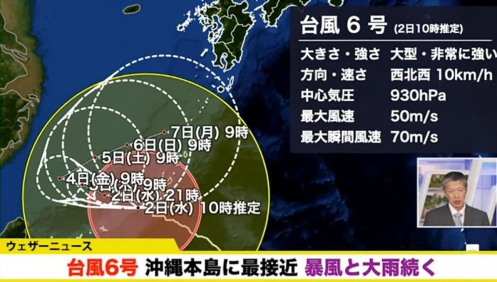

# 台风“卡努”转向日本：冲绳21万户居民停电，车库被吹塌压死居民

极目新闻见习记者 陈洋洋

综合NHK、富士电视台、朝日电视台等日媒报道，8月2日凌晨，今年第6号超强台风卡努已经登陆日本冲绳，本岛地区刮起了猛烈的风，路边随处可见被台风连根拔起的大树，21万户居民遭遇停电，一男子因车库被台风吹塌而死于地下室，另有23人受伤。受台风影响，冲绳本岛地区出现短时强降雨，甚至在远离台风的九州岛等地也出现短时强降雨。其中，宫崎县在木城町设置的雨量计显示1小时内降雨量达47毫米。

_大树被连根拔起（图源：朝日电视台）_

_车库倒塌压死一男子（图源：朝日电视台）_

此外，随着台风的接近，冲绳本岛等地的水位不断升高。南部地区的观测站曾监测到26年来的历史最高水位。海岸和河口附近有因风暴潮而淹没的危险，部分山地地区已经发布了“泥石流警戒信息”，冲绳那霸机场和九州岛鹿儿岛机场已有超500架航班被取消。

_日本气象厅预测（图源：朝日电视台）_

另据日本气象厅预测，未来几天，台风卡努将在临近中国沿海后实现路径“反弹”，不再向西北部移动，而是转为向东北部的日本本土地区移动，并将于7日之后在九州岛地区登陆。目前，气象厅已发布暴风和大浪预警，并呼吁当地民众警惕泥石流、滑坡和洪水等次生灾害，提前前往坚固的建筑物内避难。

（来源：极目新闻）

