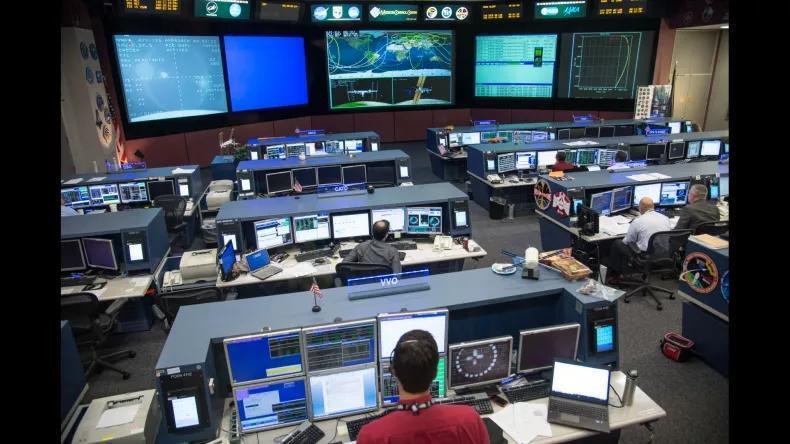

# 国际空间站出现故障，美国部分停电，俄罗斯部分：所有系统正常运行

_国际空间站_

8月1日，国际空间站（ISS）宇航员在与美国国家航空航天局（NASA）休斯敦航天任务控制中心（MCC）进行的直播对话中表示，国际空间站美国部分的供电系统出现了故障，不过没有明确事故发生的具体时间。

随后，俄罗斯联邦航天局宇航员德米特里·佩特林证实，由于一个尚未确定的问题，国际空间站美国部分的自动保护系统触发了电源关闭。“许多设备被自动断开连接。现在一切都恢复正常了。我们的同事正在处理这个问题。俄罗斯部分的工作人员像往常一样工作。”佩特林说道。

俄罗斯航空航天局（Roscosmos）8月1日对此表示，国际空间站美国部分停电，“俄罗斯部分的所有仪器和系统都在正常运行”。

_NASA休斯敦航天任务控制中心内部_

据报道，NASA休斯敦航天任务控制中心一名工作人员在对话中称，“我们的供电系统出现了严重故障，某种原因导致了电涌，因此出现了故障。”由于故障，国际空间站与地面团队的通信出现了问题，但人员安全没有受到威胁。

专家解释称，问题出在空间站的电气设备上，因此美国控制中心要求一名宇航员去俄罗斯部分检查是否有冒烟或起火的迹象。对此，俄罗斯联邦航天局8月1日回应称，国际空间站俄罗斯部分的设备运行正常。

就在一周前，美国休斯敦航天任务控制中心也曾因电力问题，一度与国际空间站失联。据报道，这是国际空间站自2009年全面投入运行以来首次与地面控制失去联系，也是NASA首次不得不启动备用系统来掌握控制权。

7月25日，NASA国际空间站项目负责人乔尔·蒙塔尔巴诺表示，当天休斯敦航天任务控制中心发生大规模停电，与国际空间站之间的通信中断。NASA不得不通过俄罗斯的通信渠道与航天员取得联系。

据报道，休斯顿约翰逊航天中心大楼因正在进行升级维修工作而发生停电，导致任务控制中心失去了与在轨空间站的指挥、遥测和语音通信。停电约20分钟后，“NASA设法通过俄系统与航天员取得联系，所幸航天员和国际空间站都未遇到危险。”

蒙塔尔巴诺表示，停电后，休斯敦航天任务控制中心在90分钟内切换到备用系统，随后与国际空间站的通信、遥测等完全恢复正常。据报道，NASA在距离休斯敦不远的地方有一个备用控制中心，以应对飓风或其他需要进行人员疏散的灾难。但在7月25日的停电事故中，由于灯光和空调仍在运行，工作人员选择留在任务控制中心。

红星新闻记者 徐缓

编辑 潘莉 责编 冯玲玲

