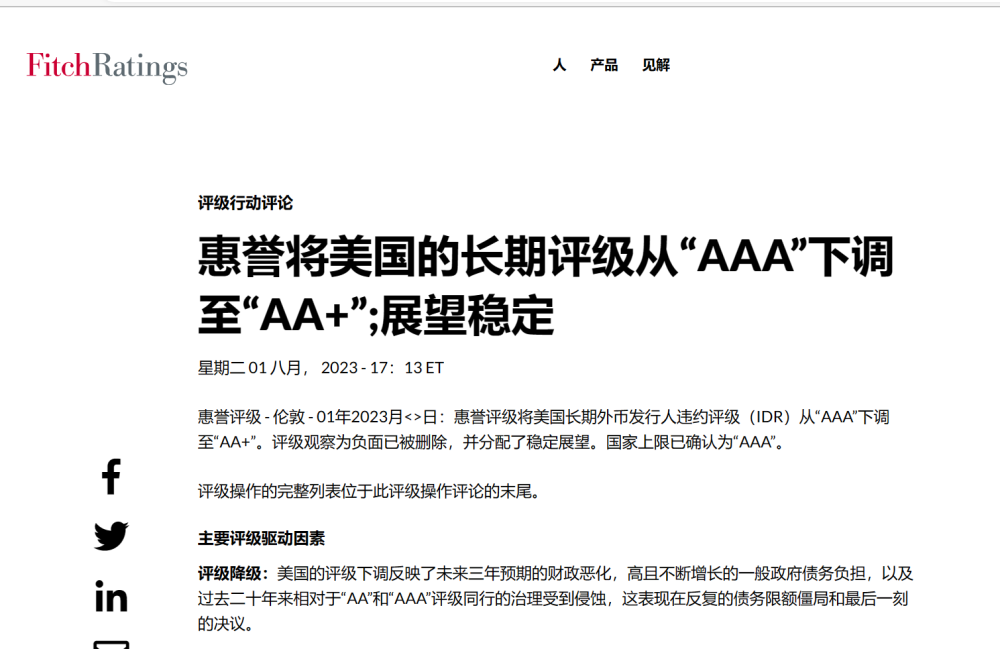
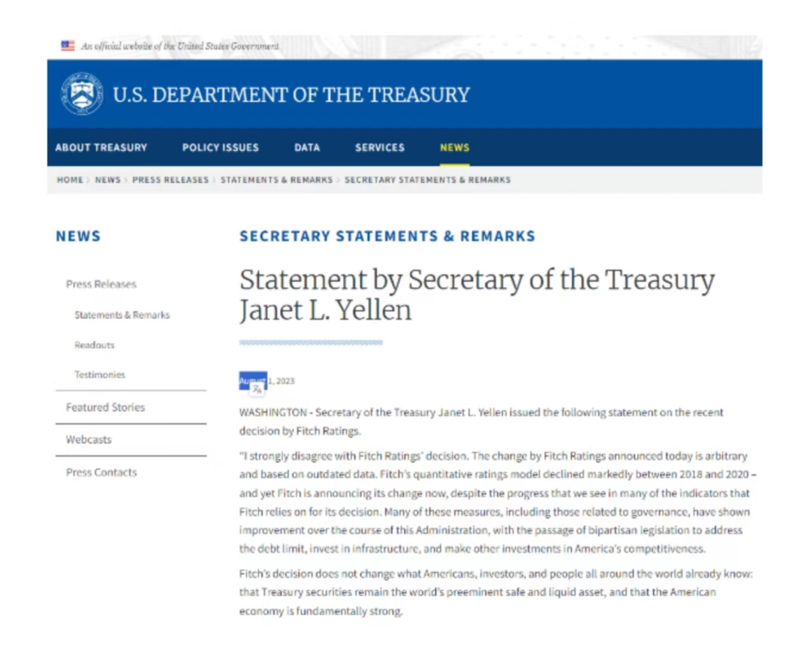

# 惠誉将美国评级从“AAA”下调至“AA+” 美财长耶伦：强烈反对

每经编辑：杜宇

据美国惠誉官方网站8月1日消息，惠誉评级将美国长期外币发行人违约评级（IDR）从“AAA”下调至“AA+”。评级观察为负面已被删除，并分配了稳定展望。国家上限已确认为“AAA”。

_图片来源：美国惠誉官网_

惠誉称， **美国的评级下调反映了未来三年预期的财政恶化**
，高且不断增长的一般政府债务负担，以及过去二十年来相对于“AA”和“AAA”评级同行的治理受到侵蚀，这表现在反复的债务限额僵局和最后一刻的决议。

惠誉认为，过去多年来，包括财政和债务问题在内的治理标准一直在不断恶化。反复的债务上限政治僵局和最后一刻的决议削弱了人们对财政管理的信心。此外，与大多数同行不同，政府缺乏中期财政框架，并且预算流程复杂。这些因素，加上几次经济冲击以及减税和新的支出举措，促成了过去十年的债务连续增加。此外，在应对与人口老龄化导致的社会保障和医疗保险成本上升相关的中期挑战方面进展有限。

未来十年，更高的利率和不断增加的债务存量将增加利息服务负担，而人口老龄化和医疗成本上升将在没有财政政策改革的情况下增加老年人的支出。国会预算办公室预计，到2033年，利息成本将翻一番，达到GDP的3.6%。国会预算办公室还估计，同期医疗保险和社会保障的强制性支出将增加GDP的1.5%。国会预算办公室预计，根据现行法律，社会保障基金将在2033年耗尽，医院保险信托基金（用于支付医疗保险A部分的福利）将在2035年耗尽，除非及时采取纠正措施，否则对财政轨迹构成额外挑战。此外，2017年的减税措施将于2025年到期，但可能会有政治压力要求像过去一样将这些减税措施永久化，从而导致更高的赤字预测。

据美国财政部官网， **美国财政部长珍妮特·耶伦(JanetL.Yellen)
就惠誉下调美国评级一事发表声明称，“我强烈反对惠誉评级公司的决定。惠誉评级今天宣布的改变是武断的，是基于过时的数据。”**

 _美国财政部官网_

拜登政府官员就惠誉下调美国评级发表讲话称，预计下调对美国的借贷成本不会有影响。

周三亚太盘初，标普500股指期货跌0.54%，道指期货跌0.45%，纳指期货跌0.63%。

当地时间8月1日，美股三大指数收盘涨跌不一，道指涨0.2%，纳指跌0.43%，标普500指数跌0.27%。

每日经济新闻综合美国惠誉官网、美国财政部官网

每日经济新闻

