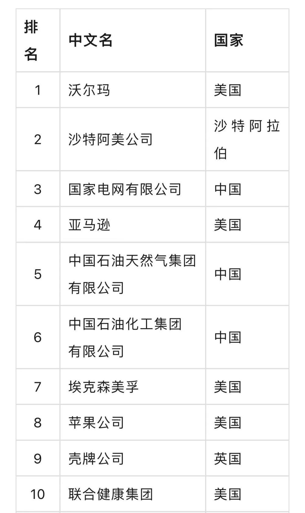

# 最新世界500强出炉：华为跌出100强，互联网8强中国占一半

8月2日，最新的《财富》世界500强排行榜公布。今年《财富》世界500强排行榜企业的营业收入总和约为41万亿美元，比上年上涨8.4%。进入排行榜的门槛（最低销售收入）也从286亿美元升至309亿美元。但受全球经济下行影响，今年所有上榜公司的净利润总和同比减少6.5%，约为2.9万亿美元。

从科技领域情况来看，曾在去年跃居第二的亚马逊下滑至第四，苹果公司从去年的第七位下滑一名到第八。

中国科技公司排名靠前的包括了鸿海精密（第27位）、京东（第52位）、中国移动（第62位）、阿里巴巴（第68位）、华为（第111位）、中国电信（第132位）、腾讯（第147位）等，排名较去年都出现一定程度的下滑。其中华为今年的排名下降了15位，跌出前100名；去年位列266名的小米今年下跌94位至360名；曾经多次上榜的白电龙头格力今年已跌出榜单。此外，中国先进制造业公司立讯精密首次登上榜单。

今年上榜的互联网公司增加至8家，中美各占半壁江山，分别是：亚马逊、Alphabet、京东、阿里巴巴、Meta、腾讯、美团和Uber。其中美团和Uber都是第一次上榜。但值得注意的是，前6家互联网公司中，除Alphabet排名持平外，其余在今年榜单上的名次均出现下滑。

这些科技公司最赚钱

《财富》今年发布的排行榜把所有企业按照其经营领域进行分类，在榜的135家中国大陆（包括香港）企业分属15个经营领域，其中仅有4个领域企业销售收益率超过5%，即金融、运输、电信和高技术领域。

在世界500强整体利润下滑的情况下，仍有不少科技公司实现利润大幅增长。榜单显示，利润榜前五位中有三家科技企业：苹果公司位居利润榜第二位，利润超过998亿美元；微软利润同比大增114亿美元，以727亿美元的利润上升至利润榜第三位；谷歌母公司Alphabet位列利润榜第四位。

上述科技公司中，苹果公司虽然排名下降一位，但在今年成为全球首家市值突破3万亿美元的企业。微软的排名较去年上升3位，凭借对OpenAI的投资与合作市值飙涨，并成为大模型领域的重要玩家。谷歌母公司Alphabet的排名和去年持平，但利润较去年同期有所下降。在生成式人工智能的浪潮中，谷歌与微软正展开激烈的“军备竞赛”。

在中国科技公司中，腾讯、台积公司和中国移动等也成为净利润排名靠前的企业。其中，台积公司去年实现了333亿美元净利润；中国移动去年利润约175亿美元，同比增长8.2%；腾讯的净利润较去年下降了19%，但仍以超过279亿美元的净利润位列前茅。

在利润率榜上，台积公司更以43.9%的利润率位居第三，这家公司今年的整体排名上升超过50位。在中国上榜公司中利润率排前十的公司，除了台积公司和腾讯外，全部是商业银行。腾讯总裁刘炽平此前曾表示，与过去相比，腾讯正逐渐成为一家更具成本意识、效率更高的成熟公司，希望公司的利润增长能够大于或等于营收增速。

净资产收益率（ROE）榜上，家得宝公司以超过1095%的净资产收益率跃升至首位，苹果名列第二，净资产收益率超过140%。中国科技公司在净资产收益率方面排位靠前的有台积公司、联想集团、腾讯、美的、立讯精密、宁德时代等。

中美电商排名均下滑

中美上榜的8家互联网公司中，有3家为电商公司。分别为亚马逊、京东和阿里，上述三家电商公司今年排名有所下滑。

亚马逊为第4名，去年为第2名。这家公司在今年以来持续降本增效，并在1月初宣布了公司历史上最大规模的一次裁员。2023年第一季度，亚马逊净销售额增长9%至1274亿美元，增长幅度与上季度持平。其中北美分部销售额同比增长11%至769亿美元，国际业务销售额同比增长1%至291亿美元。

国内电商公司方面，京东和阿里的排名相较去年也有所下滑。其中京东位居第52名，前一年排名为46名。阿里巴巴位居68位，去年排名为55名。

京东在过去半年经历了巨大的调整。5月11日，原京东集团CEO的徐雷出于个人原因已向公司辞职，CEO一职将由京东集团CFO许冉担任。从业绩看，自去年11月起，京东进入了多方面调整阶段，从零售战略到人事架构都有所调整。最新财报显示，京东目前处于调整的阵痛期。

阿里巴巴也在今年发生重大的组织变革。今年6月，阿里巴巴控股集团董事会主席兼CEO张勇通过全员信宣布，阿里的自我变革正顺利平稳推进，1+6+N的全新业务集群基本成型，各业务集团董事会已开始运行，多个业务的上市和融资计划也已开展，控股集团将主要承担创新孵化大本营角色，由投资背景的蔡崇信出任阿里巴巴控股集团董事会主席。

此外， **美团首次登上榜单**
，位列467位。去年美团收入为2200亿元，同比增长22.8%，经营亏损为58.2亿元，同比收窄74.8%。到了今年第一季度，美团业绩实现扭亏，一季度美团经营利润为35.8亿元，去年同期经营亏损达55.8亿元。

业务调整方面，今年3月，美团网约车业务放弃了自营打车业务，转向聚合模式，并开始在中国香港推出的外卖服务。眼下，它正与字节系抖音在本地生活服务领域展开激烈的竞争。

电子消费企业新挑战

今年的500强榜单中，一些科技企业在经历了疫情期间的爆发式增长后，如今开始面临新的挑战。

疫情中，人们对电子消费产品产生了强劲的需求，一度拉动苹果等科技企业产品的全球热销；疫情过后，包括PC、手机等在内的消费电子都出现了不同程度的下滑。

在手机领域，消费者需求仍呈现比较疲软的状态，手机市场出货量已经连续多个季度下滑。从厂商来看，今年华为排名下降了15位，首次跌出前100名，位列榜单111位。小米集团的排位也从去年的第266位跌至第360位，跌幅较大。

华为排名下滑，表明在手机业务拖累之下，其业绩增长受阻。榜单上，华为营收达到95489.9百万美元，营收和利润均有下滑，其中利润跌幅达70%。但华为的企业业务依然保持较大增幅。

在今年3月的财报发布中，华为轮值董事长徐直军表示：“严峻的外部环境和非市场因素，继续影响着公司经营。身处暴风雨中，我们在继续奔跑，努力保障业务连续，确保对客户的支持与服务；我们也努力多打粮食，使自己既能生存下来，也能为未来的发展打下基础。”

近年来，小米手机在国内市场中的份额也有一定缩减。IDC数据显示，2021年全年市场份额中，小米占15.5%，2022年占13.7%。

小米2023年第一季度财报显示，小米在第一季度实现营收594.8亿元，同比下降18.9%。小米在财报中指出，营收下降主要受手机大盘影响，整体市场不景气。利润增长主要由于该季度小米新品的促销活动及品牌推广减少等原因所致。在消费承压的背景下，各大手机厂商整体将更加追求利润上的保证。

PC领域情况类似，今年全球PC主要厂商联想、戴尔、惠普在500强中的排名都出现不同程度的下滑。全球PC出货量下降主要受到包括全球宏观经济挑战、供应链、消费者购买力疲软等负面因素影响，渠道库存过剩严重。

而传导至产业链上游，包括AMD、英特尔等芯片厂商都提及了消费电子低迷导致芯片市场需求疲软,长期发展或将放缓，市场充满挑战。业界预计，最早也要到今年下半年，PC行业才有望实现同比增长。

白电巨头美的、海尔排位下滑，格力落榜

500强榜单中，中国白电三强表现分化，美的集团、海尔智家排位有所下滑，格力电器落榜。

受疫情等综合因素影响，中国国内家用空调市场已经连续几年负增长，空调营收占比达七成的格力电器业绩被波及。格力电器在《财富》世界500强中的排位，2021年比2020年下降52位至第488位，2022年排在第487位。由于2022年格力电器的营业收入几乎与上年持平，同比仅增长0.59%至1890亿元，因此今年落榜。今年，格力正发力扩展空调外的其它业务。

美的集团受益于To
B板块多元业务的扩张，在2022年家电市场下滑的情况下，整体营收与上年相比基本持平，仅增长0.78%至3439亿元，因此美的排位出现波动，从2021年的第288位，提升到2022年的第245位，今年又回落至第278位、下滑33位。

不过，美的集团推动数字化转型，效率得到提升，连接在2022年、2023年入围《财富》世界500强里中国企业净资产收益率（ROE）的前十名。

海尔智家凭借业务的高端化、全球化，去年实现了营收、净利润的明显增长，营收增长7.22%至2435亿元，在今年排第419位、下滑14位，降幅相对较小。今年，海尔智家继续完善在全球的布局，包括在埃及投资建设海尔埃及生态园。

从全球范围看，家电企业中韩国的三星电子、LG电子和日本的索尼、松下受到欧美通胀令消费电子市场不振等因素影响，在2023《财富》世界500强中的排名均有所下滑，分别从2022年的第18位、第187位、第116位、第193位，下滑至2023年的第25位、第204位、第140位、第218位。但它们凭借更加多元的业务，整体排名仍在中国家电龙头之前。

一家先进制造企业新上榜

半导体周期之下，中国和全球半导体公司以及先进制造业企业在世界500强榜单中的排名也普遍下滑。在国际半导体巨头方面，三星电子的排名从去年的18位下降至25位；英特尔公司的排名从去年的145位下降至211位。

国内先进制造业公司方面，鸿海精密从去年的20位下降至今年的27位，不过依旧是半导体产业链公司中在500强榜单中排名第一的企业。另一家半导体代工巨头和硕从去年的311下降至今年的333位。台积集团则从去年的225上升至今年的168位。

在上述企业中，富士康母公司鸿海精密是苹果公司的最大代工企业。
受益于iPhone新品持续畅销，鸿海精密近两年业绩创均处于高点。不过，这家不容逃避的问题是，公司在苹果产业链的地位正不断下降，其重金押注的新能源汽车以及芯片等新赛道能否在市场获取一席之地，也存在较大悬念。

作为芯片制造商，台积公司在苹果等高端客户处的特殊地位让其能够充分抵御经济低迷的冲击。受益于 5G
高性能计算芯片需求的大趋势和数据中心，以及越来越多地在小工具和车辆中使用芯片，该公司去年盈利10165.3亿新台币（约合10165.3亿人民币），同比增长71.61%；总营收22638.9亿新台币（约合5019.04亿人民币），同比增长42.61%。

在面对未来市场走向时，台积电总裁魏哲家在今年第二季度财报会上的措辞极为保守，他表示当前半导体库存调整如市场预期正持续进行，大趋势比先前预期弱，即便AI需求强劲，但大环境的趋势仍不能完全弥补这些干扰，库存调整到什么时候，一切都要看经济因素。

同样值得关注的是，中国先进制造业公司立讯精密历史首次登上世界500强的排行榜，排名479位。第一财经记者了解到，立讯精密成立于2004年，于2010年在深交所上市。公司主要业务主要聚焦于消费电子、汽车、通信、医疗等产业，通过从零件、模组到系统级产品。

从立讯精密公开的财报可以发现，近三年公司用于研发费用超过200亿元，其中有三分之二用于制程升级与迭代，另外还有三分之一是用于空投。业内人士对第一财经记者指出，中国的制造业都正经历基础原材料的短缺、进口设备的受限、技术的封锁等风险和挑战，唯有重视创新，才能在核心技术面前掌握主动权。

中国运营商表现相对出色

在通信领域，全球运营商的排名大幅下滑，中国运营商表现相对出色。

美国最大的电信运营商AT&T今年在榜单中的位置遭遇“大洗牌”，从2022年的32位下跌至今年的78位。此外，美国另一家运营商巨头Verizon在500强榜单的位置也从去年的54位下降至今年的64位。卡斯特电信公司从去年的73位下降至今年的77位。

除了美国电信运营商之外，其他国家的电信运营商的排名也在下跌。其中德国电信由去年的第62位下跌至今年的79位。日本电报从此前的83位下降至今年的109位；日本KDDI从281位下降至357位。

此外，西班牙电话，Orange，特许通讯公司以及美洲电信等都运营商的排位都出现了不同程度的下滑。前几年还在榜上的英国电信，自去年开始跌出榜单。

国内方面，尽管三大运营商也难逃运营商排名下滑的总体趋势，不过中国移动从2022年的57位下滑至62位，暂时排名全球运营商之首。中国电信和中国联通的排名分别下滑一位以及和去年持平。纵观全球运营商排名的下降幅度，中国运营商以较为强劲的营收实力维持住了排名。

距离5G商用牌照落地已有四年，中国的5G基础设施投资过了巅峰期，美国同样如此。今年一月，在花旗集团投资者会议上，美国三大电信巨头同时表示将会砍缩2023年在5G领域的资本开支。全球运营商当前除了5G的长尾布局之外，需要找到新的业务增长点和有效将业务进行盈利转化的工具。

从财报来看，新兴业务当前正在成为中国三大运营商盈利能力的“增长密码，运营商云网融合、产业数字化等新业务的持续投入未来将进一步推动运营商估值的回升以及业务盈利能力的增强。

