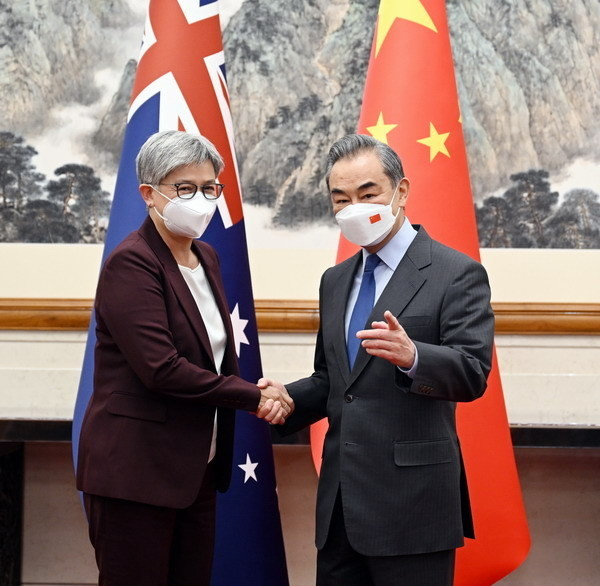
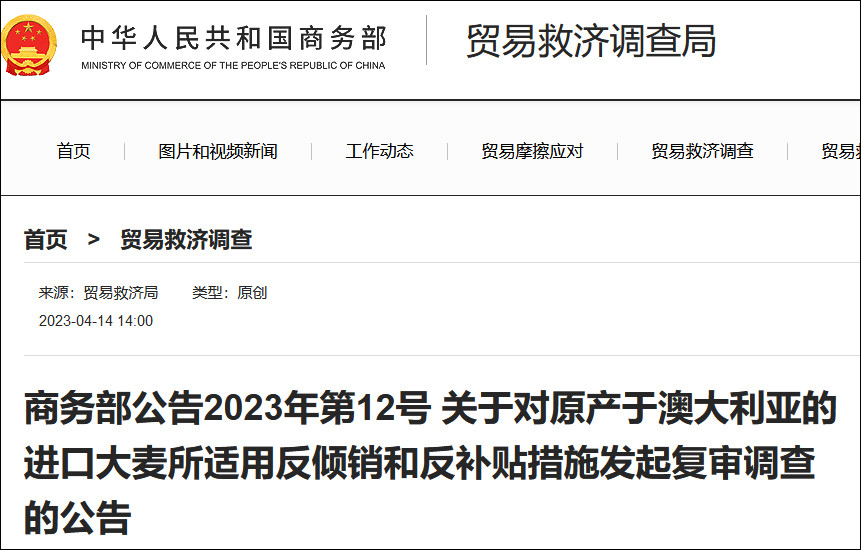

# 澳政府消息人士：澳大利亚已邀请中国外长访澳

（观察者网讯）据香港《南华早报》8月2日报道，多名与澳大利亚政府关系密切的消息人士透露，澳大利亚驻华使馆已向中国外交部长发出访澳邀请，但具体日期尚未确定。

其中一名消息人士称，澳政府邀请王毅前往澳大利亚进行“互访”，这是两国关系解冻期间一系列备受瞩目的政治和贸易相关举措的一部分。

去年12月21日是中澳建交50周年纪念日，澳大利亚外长黄英贤于12月20日至21日对中国进行访问，与时任中共中央政治局委员、国务委员兼外长王毅会谈，举行了新一轮中澳外交与战略对话。

据外交部网站消息，王毅指出，过去几年，中澳关系遇到困难和挫折，这是我们不愿看到的，其中的教训要充分汲取。中澳不存在历史积怨，也没有根本利害冲突，应该也完全可以成为相互需要的合作伙伴。保持中澳全面战略伙伴关系健康稳定发展完全符合两国人民根本利益，也有利于促进亚太地区和世界的和平与发展。

澳大利亚新南威尔士大学中国国际商法与国际经济法中心主任周围欢告诉《南华早报》，澳政府向王毅发出邀请，是“稳定和重振双边关系的又一进展”。他表示，两国关系中的具体问题还需逐步解决。中澳两国应在灵活、妥协和互惠的基础上，继续真诚地接触，这对于解决中澳贸易争端、澳对华投资审查等悬而未决的问题仍然至关重要。

_澳外长于去年12月访华，图自外交部网站_

从2017年年中开始，澳大利亚特恩布尔政府和莫里森政府盲目跟随美国，开始全方位地破坏与中国的双边关系，包括炒作“中国威胁论”、以所谓“国家安全”为由阻碍两国间正常经贸活动，以及响应美国、挑头鼓噪对中国进行有罪推定式的“病毒溯源调查”。

2020年5月，经过一年多的调查后，中国宣布对原产于澳大利亚的进口大麦征收73.6%反倾销税、6.9%反补贴税，征收期限为五年。莫里森政府随即借题发挥，要求中国复审对澳大麦“双反”关税，被中方拒绝后还去WTO告状，于2020年12月正式提起申诉。

阿尔巴尼斯政府上台后有意改善中澳关系，不断寻求和中方展开对话。

去年年底的二十国集团（G20）领导人巴厘岛峰会期间，中澳领导人会晤奠定两国关系破冰的基调，双方高层开启密切往来。去年底的中澳建交五十周年纪念日，澳大利亚外长黄英贤访华，随后澳商界人士也纷纷来华交流，寻求重启贸易合作。

今年4月，澳政府宣布，澳方现已暂停就中方对澳大麦征收“双反”关税一事向世贸组织提起的申诉，澳方希望加快解决大麦关税问题，目前正在寻求与中方就此达成协议。对此，我商务部回应称，已对原产于澳大利亚的进口大麦所适用反倾销和反补贴措施发起复审调查。

 _商务部公告_

但《南华早报》提到，在中澳关系校准航向、再出发之际，澳大利亚与美英之间的“美英澳三边安全伙伴关系”（AUKUS）、澳大利亚对华投资审查等问题，都被认为给中澳关系的恢复蒙上了阴影。

澳财政部长发言人7月21日表示，澳大利亚禁止了一家“与中国有关联”的公司收购一家陷入财务困境的澳大利亚锂矿商。路透社称，这是澳外国投资审查委员会今年第二次阻止中企对该国关键矿产的投资。今年2月，澳政府以国家利益为由，否决了中国域潇基金对该国最大重稀土矿商北方矿业公司增加投资。

据外交部网站消息，当地时间7月13日，王毅在雅加达应约会见澳大利亚外长黄英贤。

王毅说，中澳关系不能再偏航，更不能走回头路。中澳经济高度互补，合作潜力巨大，希望澳方为中国企业赴澳投资经营提供公平、公正、非歧视的营商环境。双方要相互尊重、平等相待，妥善处理分歧，培育相互理解、相互欣赏的友好氛围，给两国人民带来更多实实在在的利益。

**本文系观察者网独家稿件，未经授权，不得转载。**

