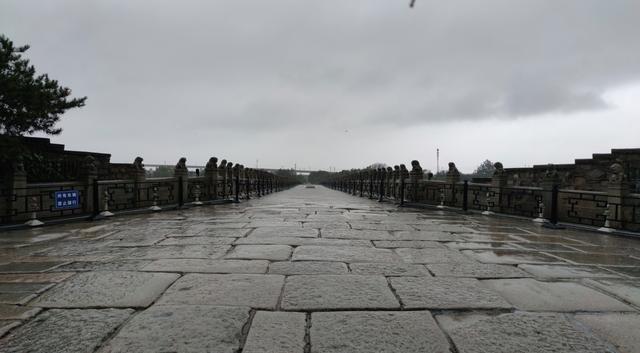

# 800多年卢沟桥暴雨后安然无恙 独特结构使桥孔不易堵塞

7月31日下午，网传持续强降雨致卢沟桥坍塌。记者获悉，坍塌桥梁并非卢沟桥，而是其西侧的小清河桥，目前该区域道路已经暂时封闭。

目前，卢沟桥下水流湍急，水势较大，图片为7月31日下午5点的卢沟桥。

卢沟桥位于北京“母亲河”——永定河之上，始建于金朝大定二十九年（1189年），历时3年建成，距今已有830年历史，是北京现存最古老的石造联拱桥，也是中国华北地区保存最完整的十一孔联拱石桥。

此次强降雨过程中，卢沟桥岿然不动。8月2日，记者从卢沟桥文化发展中心了解到，在此次强降雨过程中，卢沟桥独特奇巧的建筑结构发挥了重要作用。桥墩呈船型，迎水面砌作分水尖，且每个分水尖都有一根三棱形铁柱，俗称“斩龙剑”，用以迎击洪水，使桥孔不易被堵塞，令古桥的承载能力更加强大。

此外，2023年7月29日11时45分，北京市气象局发布暴雨橙色预警信号，景区为确保游客的人身安全，于7月29日13时紧急关闭景区，并于同一时间在微信公众号上发布闭园公告、关闭电子平台购票通道。

大雨期间，中心安排专人对卢沟桥进行24小时值守，特别是夜间保证每两小时进行一次桥体安全巡视和河水流量监控，并汇总及时上报。

监测数据结果显示，短期洪水冲刷对卢沟桥结构整体的影响较小。后续，中心将加大监测力度，为保护卢沟古桥提供科学依据。

目前永定河流域流量已回落至洪水预警标准以下，北京市水文总站2023年8月2日9时解除洪水红色预警，卢沟新桥已正常通车。

综合北京丰台官方发布、中国新闻网

（来源：大皖新闻）

