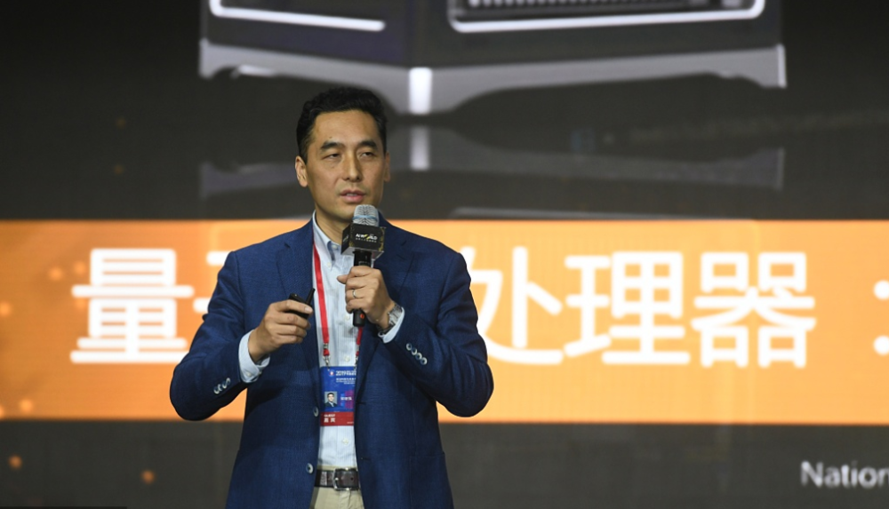

# 专访英特尔宋继强：中国半导体市场即将大爆发，别的国家不可复制

_来源：视觉中国_

作者 ｜ 程潇熠

编辑 ｜ 康晓

出品丨深网·腾讯新闻小满工作室

“如果没有中国客户的订单，英特尔在俄亥俄州建设工厂等项目的必要性就会大大降低。”英特尔CEO帕特·基辛格，在游说拜登政府放弃对华半导体新限制政策时直言不讳。

英特尔原本计划投资至少2000亿美元，在美国俄亥俄州哥伦布市外新建“全球最大芯片制造基地”，如果美国继续加强对华芯片出口限制，全球最大的半导体制造商之一的英特尔可能要因此丢掉约三分之一的营收。

**英特尔研究院副总裁、英特尔中国研究院院长宋继强博士在接受《深网》专访时称，中国有许多其他国家无法复制的新增机遇，这跟中国的标准化建设，还有中国电动车产业的一枝独秀相关。“不光英特尔，其他在中国有相对重量级业务的公司，都要努力抓住中国市场新展现出来的机遇。”**

据报道，日前，英特尔与深圳合作，在南山区启动设立了一个新的科技创新中心，以加强与中国的商业关系，并帮助中国初创企业发展。而美国半导体公司AMD首席执行官也在电话会议上表示，决定效仿英伟达调整芯片规格，以维持对华出口。

在和拜登政府表明立场前，帕特·基辛格还来了趟中国。这是他近三个月来第二次访华，行程颇紧。

帕特·基辛格一面四处拜访，参加第十四轮中美工商领袖和前高官对话、赶赴英特尔成都工厂20周年生日会、拜访了新华三、超聚变等多家客户；一面吹响反击英伟达的号角，推出与英伟达A100、H100
GPU对打，专供中国市场的Gaudi2深度学习加速器芯片，与英伟达争夺中国大模型市场。

ChatGPT点燃了新一波人工智能（AI）热潮，也让全球AI芯片市占率超90%的英伟达身价水涨船高，达万亿市值。英伟达CEO黄仁勋甚至放言：CPU已经是过去式，而GPU才是未来。言下之意，英特尔（全球最大的CPU制造商）已是过去式，英伟达才是未来。

在英伟达不断攻城略地的同时，英特尔也在思考破局之道，AI时代的排兵布阵之法。

**“在这一波大模型浪潮当中，什么样的硬件更好并没有定论。”宋继强告诉《深网》，GPU并非大模型唯一的硬件选择，半导体厂商更重要的战场在软件生态上。芯片可能花两三年时间就做出来了，但是要打造芯片生态需要花两倍甚至三倍的时间。英特尔的开源生态oneAPI比闭源的英伟达CUDA发展可能更快。**

**宋继强认为，“半导体的好日子还在后面，英特尔还要继续推动摩尔定律的发展。万亿晶体管的时代是一定会到来的，否则真的支撑不了未来需要把AI、虚拟现实、元宇宙这些都整合在一起的数字化时代。”**

某种意义上，从成本和市场需求来看，单靠英伟达远远无法支撑下一轮的技术革命。

在与《深网》的专访中，宋继强分享了英特尔对大模型硬件选择的思考、半导体行业未来趋势预测以及对中国发展新机遇的理解。以下是《深网》对话宋继强实录整理，在不影响其原意的基础上有所调整删减。

**“做大模型不一定要用GPU”**

**《深网》：做大模型，一定要用GPU吗？英伟达CEO黄仁勋认为CPU已经是过去式，而GPU才是未来。过去半年中，做大模型和想做大模型的公司也都在尽量囤更多的高性能GPU。**

**宋继强：** 在这一波大模型浪潮当中，什么样的硬件更好并没有定论。

现在仍在早期，大家都在比我的模型有多大？多少参数在训练？硬件能不能支持它快速训练完？还没有真正到相对稳定，开始去做真正的部署、优化，甚至做一些裁剪到客户端去做相应的应用的那个阶段。

就像当年深度学习一样，2013、2014年刚刚开始的时候，大家都在比谁能把这个模型做到1000层，每层还很宽。后来没人在乎了，变成比谁能用更好的性价比落地，把真正的应用业务做起来。

现在是大模型发展初期，因为GPU本身相对灵活的设计，又有这些计算资源和大容量内存，它刚好可以用来做大模型的加速。

但我们很快会看到，在大模型这块有很多种不同的、可以加速的硬件会出现。

**现在如果对于AI的负载要求不那么强，又不想专门去买一个GPU或者AI加速卡，可以用英特尔的CPU完成AI运算。如果需要更大规模的AI加速，可以外接一个独立显卡或者再加一个AI加速卡，英特尔Gaudi2就是一种AI加速卡。**

我实际上就是想说明针对AI这么广泛的领域，对硬件的加速需求是多种多样的。

**《深网》：AI对硬件的需求是多样化的，但更多人拥挤在GPU这条道路上。**

**宋继强：**
这很正常。因为技术突破会来一波商业机会，大家都有可能在这里胜出，所以不管是投资还是产业的资源都会汇聚，把这件事情做大。看谁可以真正做出好的成果、做出好的技术方案。对做大模型的初创企业来说，现在大算力的计算芯片是一个有限资源，大家都去抢也是很正常的。

大家做GPU，当然是很好的尝试，但硬件做出来之后，它的软件能不能很好的嵌入到常用的开发生态里，就变得非常关键。

“ **搭建应用生态比做硬件更难”**

**《深网》：做GPU的难点不在硬件，在软件生态搭建上？就像技术上做一个手机操作系统不难，难的是建立和安卓一样庞大的应用生态。**

**宋继强：** 芯片领域一直都有这样一个问题：芯片可能花两三年时间就做出来了，但是你要打造芯片的生态需要花两倍甚至三倍的时间。

现在AI加速卡这个级别的GPU，从设计到能力来讲，都没有很高的门槛，很多团队确实可以做。问题是做出来之后，怎么能让它真正被用好。现在比较多的情况是一些公司会针对英伟达CUDA的某一个版本做一个自己的对接转换，这样实际上会有一定的滞后性，生态上会受一些牵制。

所以做GPU一定要想好怎么样在软件这一块发力，不要让生态碎片化。最好是说大家虽然都做各种各样不同的GPU，但软件能够保持一个通用开放的标准，这就会事半功倍。否则10家做出10个GPU，每一家都有自己的开发包、开发环境，到最后用户谁的也不敢用，因为毕竟都是初创公司，对未来的路线图、成熟度都是有疑问的。

**《深网》：英特尔oneAPI和英伟达CUDA相比优势是什么？如何说服已经在用CUDA的厂家转用oneAPI？**

**宋继强：** CUDA是封闭的平台（闭源），oneAPI是开放的（开源），这个差别很多。

oneAPI实际上是一个开放的产业标准，英特尔是主要的发起方和贡献者。截止2022年3月，已经有近70家企业和科研高校表示支持oneAPI的架构和开发。你可以用英特尔提供的库，也可以不用，可以找自己合适的版本用，也可以自己开发一个版本。

所以oneAPI能够对接很多种不同的硬件，不需要管到底运行在谁家的硬件上。CPU可以是英特尔的、AMD、国产的，GPU也可以是来自英伟达、英特尔、AMD、寒武纪等等。这样可以保证应用开发出来之后，再过十年上面的程序也不用改，底下这些硬件可以更新迭代，每三年一换都没有问题。

CUDA花了差不多十年的时间，才真正让它变成了一个可以在很多领域应用的软件生态。

oneAPI到现在已经做了4年了，也升级了好几个版本，它可能发展会比CUDA快一些，因为它毕竟是很多厂商一起贡献的。

**“半导体的好日子还在后面”**

**《深网》：在AI爆发时期，半导体公司最应该抓住的机遇是什么？**

**宋继强：** 现在AI的爆发得益于半导体行业的发展，对半导体行业来讲，我们就是要紧跟时代的潮流去做符合趋势需要的硬件。

**AI这个领域，它的兴衰取决于最后这波技术能否真正的落到大规模应用的闭环上。**
如果说能够让商业利润回馈前期的巨量投入，这就能运转起来。要不然，虽然说它能用，但是应用规模非常的小，无法匹配前期这两年的巨量投入的话，就会有一大批的公司倒掉。

前一波的深度学习（引起的AI热潮）已经过了5年多了，真的能够回馈的也就是计算机视觉领域的一些应用。自然语言在深度学习模型时期没做成，大语言模型才算是做成了，但是内容的真实性、逻辑性、完整性、正确性还不达标，在很多领域没有办法用它去做一些工作。

**现在大语言模型达到了一定程度，但是并不代表在应用上真的爆发了。** 等到应用爆发的时候，它需要的计算量那又是比现在大非常多，很多行业都可以受益于此。

比如计算机视觉可以了，自然语言也可以，理解和逻辑推理方面也可以了，能够在很多行业催生出新的应用。这个时候，不管是云端也好，边缘计算也好，都需要更多数量和种类的处理器、内存等等。

**这也是为什么英特尔一直说，半导体的好日子还在后面，还要继续推动摩尔定律的发展。万亿晶体管的时代是一定会到来的，否则真的支撑不了未来需要把AI、虚拟现实、元宇宙这些都整合在一起的数字化时代。**

**《深网》：大语言模型预计什么时候会在应用上真正爆发？**

**宋继强：**
两三年左右就可以知道，现在这一波大模型能够在哪些领域发挥比较大的用处，并且我们也应该能够知道大模型后面下一波的增长点，以及技术方面的提升会在哪些领域。

一般来讲，早期这种火热的状态通常不超过两年。因为第一批冲进去疯狂烧钱的也就是烧个一年半到两年就烧完了。那个时候相对实际的应用以及架构的优化，也开始做出来东西了。

这一波大模型会带来很大的转折点，因为它是基于语言的，而我们这个世界上各种各样的应用都可以转换成语言、语义的表达。

**现在唯一的挑战是：准确性怎么样？可不可以依赖它？真正商业应用的要求是要能用在一些关键任务上，让它产生足够的商业价值。**

我们可以预计，三到五年的发展周期后，就可以看到大模型能够催生出什么样的崭新应用。

**《深网》：现在半导体未来的发展趋势是不是已经很明确了？**

**宋继强：** 我们就是两条路线：一方面继续推动摩尔定律，把晶体管做得更小，让单位面积上能有更多更高效的晶体管。

**英特尔的愿景是到2030年，单一设备里面有一万亿个晶体管，现在是1200亿到1300亿，还有8倍，要继续按照摩尔定律的速度去翻番。**

另一方面，需要更多种类的硬件集成在一起，以异构的方式，甚至是以芯粒（Chiplet）互相整合的方式放在一起。

不可能所有的计算部件都用最先进的制程节点去做，那样太贵了，不符合性价比。半导体行业是非常尊重经济规律的，你做得太贵了，大家就用不起来，所以它一定会选择一个在能效比、性价比上合适的方案。

未来异构计算肯定是针对很多不同的领域有专门的、定制性的加速器出现。未来CPU加一些定制的加速部件，会是一个很正常的组合模式。

**“不同的元宇宙用不同的数字人”**

**《深网》：英特尔中国研究院一直在研究数字人，在你看来，未来数字人与人类的关系是怎样的？**

**宋继强：**
大部分时间里，数字人可以由AI驱动完成工作，甚至跟人去做交互、对接，也可以随时切换成由真人驱动。这有点像我们做自动驾驶分级（自动驾驶分为5级），在前面的1、2级，AI只是一个辅助驱动，人要替数字人做所有决策。但到了3、4、5级，可以逐渐让AI驱动数字人主动做事，人只在需要的时候介入。

比方说4、5级的数字人，可以处理80%-90%的日常事务。特别是我们未来都要去数字世界里工作，大部分的时候，我们的数字人替身可以帮我们去干很多事，到了真正需要人类动用他的知识、脑力、关系去处理的时候，才由真人来驱动数字人。

**《深网》：数字人相当于人类的数字分身？这是为元宇宙做准备吗？**

**宋继强：** 元宇宙里一定需要数字人，相信未来会有多个元宇宙，我们会在不同的元宇宙用不同的数字人。

现在我们能看到医疗场景里有很多相对流程化的事情，比如说初步的问诊、记录和分诊，这些数据人就可以在它的知识范围内搞定，来大幅度减轻医生的负担。到病人做完检查要询问病情的时候，真人医生上阵。

**《深网》：如何理解大模型、数字人、机器人间的关系？**

**宋继强：**
数字人可以成为机器人的大脑，当数字人交互中涉及自然语言对答等情况时，大模型可以让数字人看起来更真实，减少错误的发生。但数字人除此之外还有一整套技术，比如说表情、手势的展现能力等等，这些和大模型没有什么关系。机器人的智能也比数字人更复杂。

**《深网》：4、5级别的数字人大概什么时候能实现？**

**宋继强：**
如果我们仅限于语言、表情、手势这方面的交互，很可能在三五年内就可以取得一个很好的成果。我们现在正在研究一些高保真、高精度的数字人，从外观上来看已经算是可以接受了，现在差的是探索数字人可以在哪些领域内提供服务。目前远程医疗是有相关需求的，很多医生都认为数字人很有用、很方便。

**“把握好中国市场的新机遇”**

**《深网》：最近业界普遍认为，英特尔对决英伟达的关键在中国市场。你认同这个观点吗？**

**宋继强：** 不光英特尔，其他在中国有相对重量级业务的公司，都要努力抓住中国市场新展现出来的机遇。

对英特尔而言，一方面，比较重要的笔记本、台式机、服务器市场，都要把握好中国市场恢复的机遇。另一方面，中国有好几个新增领域在全球都是相对领先的。第一个就是5G，中国的5G基站的部署是全球发展最快，总量占比最大的，现在路都修好了，后边就是推各种各样的落地应用，这些都是新的机会。

还有，“东数西算”这么大规模的国家级的战略，是全球任何地方都没有的，这是一个真正算力网级别的基础设施建设，也是一个很大的“计算+网络+存储”的机会。还有电动车以及后续的车内娱乐体验，自动驾驶，车路协同等等，都是新增的市场机遇。

**目前我们讲到的这些机遇在其他国家都没有办法复制，这跟中国的标准化建设，还有中国电动车产业的一枝独秀相关。**

中国的电动车产业已经达到了可以快速推动智能化改造的水平，包括基于5G、V2X做车路协同，都在开始做标准化，推动试点，我们看到有些城市已经在抢先试点了，北京就是其中走得比较快的一个。

这些机会对于半导体行业来讲非常重要，因为里面每一个功能都需要新的芯片。

英特尔CEO帕特·基辛格提到的五大超级技术力量，其中之一就是AI，它是一种新的技术生产力。但不能忽视的是，除了AI之外还有很多其他东西，比如无所不在的计算、无处不在的连接、从云到边缘的基础设施，以及传感和感知。

