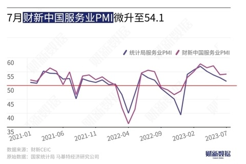

# 中国7月财新服务业PMI为54.1，前值53.9

7月中国服务业景气度略有回升，经营活动仍维持韧性。

8月3日公布的7月财新中国通用服务业经营活动指数（服务业PMI）录得54.1，高于6月0.2个百分点。此前公布的7月财新中国制造业PMI回落1.3个百分点至49.2，时隔两月再次降至收缩区间。主要受制造业PMI放缓的拖累，7月综合产出指数下降0.6个百分点至51.9，为2023年2月来最低。

财新中国制造业、服务业PMI走势与国家统计局PMI不同，综合PMI走势则一致。统计局近日公布的数据显示，7月制造业PMI上升0.3个百分点至49.3，仍低于临界点；服务业PMI下降1.3个百分点至51.5；主要受非制造业PMI走低的拖累，7月综合PMI产出指数放缓1.2个百分点至51.1。统计局服务业和综合PMI均降至2023年内新低，显示企业生产经营扩张步伐放缓。

分项数据显示，服务业供需维持扩张。7月服务业经营活动指数微升，新订单指数在扩张区间反弹，但外需扩张势头明显放缓，当月新出口订单指数降至近七个月最低，仅略高于荣枯线。部分受访企业表示，海外经济前景不明，对服务业出口形成一定制约。

服务业就业情况继续改善，7月服务业就业指数连续第六个月位于扩张区间，且升至3月来最高，主要是因为市场供求两旺，服务业企业增加用工以扩大产能。不过目前仍不足以消化在手订单，服务业积压工作量仍在增加。

主要受人力、原材料、交通运输和住宿成本增加的影响，7月服务业投入价格指数仍高于临界点，略低于前值；受制于市场竞争压力，当月销售价格指数也在扩张区间略降。

服务业企业仍对市场前景保持乐观，但7月经营预期指数在扩张区间降至长期均值以下，为近八个月来最低。部分企业预期未来一年内海内外经济将好转，其他企业则对当前全球经济环境疲弱感到忧虑。

财新智库高级经济学家王喆表示，7月服务业和制造业冷热不均是突出特征，宏观景气度低、经济下行压力大仍是不争事实。中央政治局会议定调当前经济运行面临新的困难挑战，外部环境复杂严峻，强调要积极扩大国内需求，发挥消费拉动经济增长的基础性作用。政策层面保就业、稳预期、增加居民收入仍是重中之重。当前，货币政策对于供给端提振效果有限，针对需求侧的积极财政政策更应成为优先选项。

