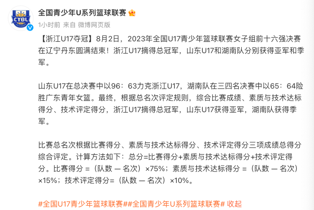

# 中国篮球奇葩一幕：2米27最强新星带队决赛赢球丢冠 对手领奖笑不出来

2023年全国U17青少年篮球联赛女子组前十六强决赛在辽宁丹东结束，在决赛中，山东女篮96-63大胜浙江，可是，她们并没有拿到冠军，反而是浙江最终夺冠，诞生奇葩一幕。

这场比赛山东女篮2米27的张子宇继续无解表现，此战出场26分钟，18投14中，拿到了30分21个篮板，并且荣膺MVP。

张子宇带队赢球了，可是却丢掉了冠军。为何会丢冠呢？因为根据总名次评定规则，综合比赛成绩、素质与技术达标得分、技术评定得分，山东总得分不如浙江，最终，浙江U17获得总冠军，山东U17获得亚军，湖南队拿到季军。

这是全国U17青少年篮球联赛女子组独有的规则，最终成绩要根据比赛得分、素质与技术达标得分、技术评定得分三项成绩总得分综合评定。计算方法如下：总分=比赛得分+素质与技术达标得分+技术评定得分。比赛得分
=（队数 — 名次）×75%；素质与技术达标得分 =（队数 — 名次）×15%；技术评定得分=（队数 — 名次）×10%。

然而，遭遇惨败，却拿到了冠军的浙江青年女篮在领奖仪式上实在笑不出来。队员们一个个表情严肃，板着脸，这个冠军或许让她们自己都觉得有些胜之不武，毕竟拥有张子宇的山东青年女篮才是这个级别最强的球队。

不得不说，这样奇葩的规则真的是世界独一份，也不知道设定这一规则的初衷是什么，难道这会帮助女篮青训更加系统更加科学吗？

