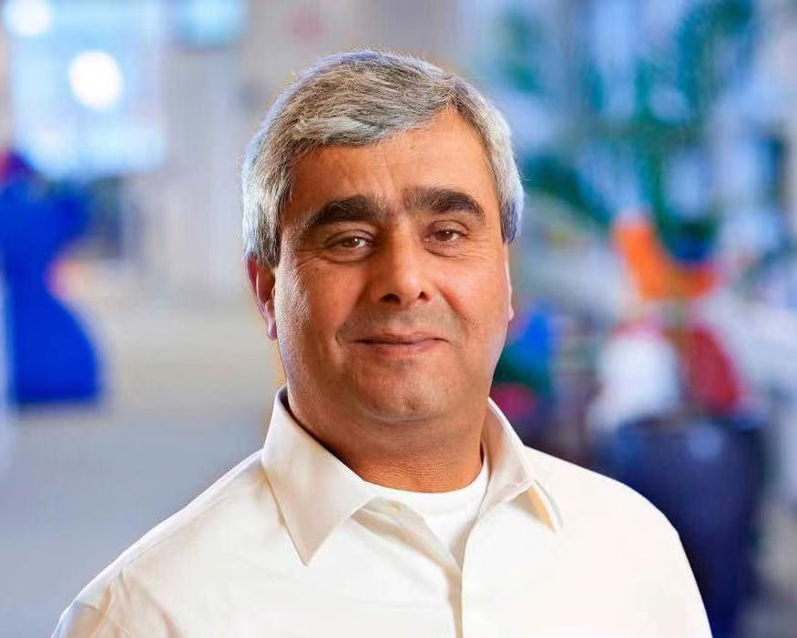

# 乐高凭什么多次穿越经济低迷周期？砍掉10000个组件就能争夺父母口袋

作者：祝玉婷、郝博阳

2022年，受疫情影响，全球经济发展受阻、消费停滞，包括餐饮、旅游、快消、玩具等多个行业的企业均面临破产问题。在如此复杂的经济环境下，乐高集团的财务表现却稳步增长，全年收入达646亿丹麦克朗（包括外币汇率影响），同比增长17%；净利润达138亿丹麦克朗，同比增长4％。

不仅是营收层面，2022年乐高集团逆势扩张155家品牌零售店，全球品牌零售店总数达到904家。

这已不是乐高第一次在全球低迷的大环境下实现增长。在2008年、2009年全球金融危机爆发时，乐高的业绩增幅也达到了12%、15%。

但实际上，91岁高龄的乐高集团，一路上的发展也并非一帆风顺，它也曾在2000年濒临破产，公司存在着业务形式冗余、组件库存与成本畸高、各部门自立门户，毫无协作能力互相推诿等管理问题...

这家世界一流玩具企业表现出的“韧性”让我们对其充满好奇：乐高如何实现扭亏为盈？如何在多次全球经济危机中实现业务增长？如何解决管理、业务中的问题？如何重新建立合适的管理、激励机制？如何看待人工智能发展的强势冲击？

带着这些疑问，腾讯财经与乐高首位非丹麦裔CEO巴利·帕达（Bali Padda），围绕其新书《乐高工作法：让交付变得高效》展开了深度对话。

**以下为腾讯财经梳理对话详情：**

**腾讯财经：** 您在乐高公司工作过17年，并在2000年使几乎破产的乐高扭亏为盈，当时您认为公司管理或业务发展中最需要解决的问题是什么？您是如何解决的？

**巴利·帕达：** 我们当时的业务范围太广了，我们拥有自己的出版公司、电子公司、钟表制造工厂，还涉足主题公园业务...

但问题是，我们应该把注意力集中在什么地方呢？比如我们并不是主题公园的运营商，我们是玩具制造商和设计师，
**所以我们出售了主题公园业务，我们出售了所有不相关的业务。**

另一个问题，公司当时被划分成了许多不同的部门，每个部门都像一个“小王国”，因此，公司并不是一个有机的整体，而是由许多不同的“孤岛”组成的，我们需要把它变成一个统一的公司。

还有一点，公司当时存在“互相推诿”的风气。当出现问题时，大家首先会找出谁该负责任。因此，我们试图创建透明度，然后根据透明度要求每个人对工作负责。举个例子，当时我们有12个配送中心，我们需要花费大量的时间在配送中心之间移动商品，实际上这花费了我们很多钱，而不是把注意力集中在正确的地方。

所以，有许多不同的问题需要我们去一一解决。

**腾讯财经：**
从大的经济环境的角度，您任职的17年间也曾出现过例如2008年的全球金融危机，当时很多企业都面临倒闭，您认为是什么因素帮助乐高公司在不太理想的大环境下维持增长的？

**巴利·帕达：** 是的，那是在公司几近破产后刚刚开始恢复增长，当我们看到那场全球金融危机时，我们确实很担心，像其他企业一样。

但是我们发现人性中存在一种现象： **在艰难时期，父母会尽可能确保他们的孩子安好，并且快乐。因此，我们要做的不是继续创新，而是继续交付。**
但这种与生俱来的人性帮助了我们。

事实上，那段时期我们的业务确实增长了，如你所说，许多公司业绩停滞或破产，但我们在2008年、2009年的业绩增幅达到12%、15%。所以这不仅仅是轻微的增长，而是一个相当不错的增长。

**腾讯财经：**
我们知道乐高是一家玩具公司，它可能成为标准商品，您也曾经与营销主管发生过意见分歧，您坚定地认为企业不能失去创新天赋。您是如何带领乐高维持创新的？

**巴利·帕达：** 在那段时间里，我和市场总监的关系非常紧密。这种紧密关系来自于我们之间非常坦诚的对话和理解，
**我们都知道彼此所做的一切都是为了乐高，而不是为了我们自己。** 这是我们之间非常明确的共识。通过这种理解，我们合作得非常好。

如今，人们认为合作就是对别人说“是”，然后对合作进行妥协。
**我们进行了一些非常困难的讨论。从这些讨论中，我们找到了对乐高最有利的答案，这是公司高层非常重要的一部分，然后是让所有相关员工参与我们所做的事情**
，让他们了解情况， **确保尽可能多的人了解端到端的情况。**

我们并不希望他们详细了解每个人的业务，因为这样他们就无法专注于自己的工作。但是我们希望他们对全局有个高层次的理解，即如果我这样做，它将对那边产生影响。这是一个很大的因素。

**另一方面，我们开展了大量消费者研究**
，了解儿童的玩耍方式以及如何激励儿童。与此同时,我们也在观察市场上正在发生的变化。在西方市场，我们知道当时即将上映《星球大战》电影或《哈利波特》电影，我们要思考如何参与其中。

对我们来说非常有趣的是，从我们几近破产开始转型的时间，大约在1995年、1996年，直到2001年、2002年扭转局面，是同一批设计师参与了整个过程，我们没有更换过设计师。我们提供的是领导力、方向和研究，对同一批人只需要提供不同的方向和动力，他们就创造了一些非常棒的产品。

**腾讯财经：**
您刚才说过端到端的沟通，让每个人都知道公司的方向和目标，以及一个人的决定将会影响团队其他人。在乐高这样一个大公司，如此多的员工，如何确保这一点？

**巴利·帕达：** 我认为关键是建立正确的流程。在许多公司，由于其目标是为了赚钱，所以预算流程成为关键流程。
**但在乐高，我们的两个关键流程是：开发流程、运营流程。** 它们不完全重叠，但有所关联，许多人都参与了这两个流程，比如我和市场总监。

我们通过对业务的共同理解，业务增长得非常迅速，这也使我们能够制定预算。 **所以是业务驱动预算，而不是预算过程驱动业务。**

**腾讯财经：**
您认为高效的交付和敏捷的管理哪个更重要？在乐高的案例中，高效的交付是如何帮助公司实现最高的效率和最好的结果的？是否可以分享一些具体的案例故事？

**巴利·帕达：我认为两者都很重要，不可能只有一个。** 所以我要说的是，要按照公司的优势设计产品或服务，然后以此设计流程。

我刚才提到开发流程和运营流程，我们发现当我们限制乐高的组件数量时，实际上有助于提高交付效率。然后它还使我们更有利可图，并提高了效率。

所以，正如我所说，开发流程和运营流程推动了所有这一切，以获得我们需要的敏捷性，因为有透明度，有端到端的理解。然后因为我们限制了组件数量，这对交付有重大影响。

**腾讯财经：** 您刚才说您限制了某些交付流程中的组件数量，这使交付更具效率，具体是哪些部分呢？

**巴利·帕达：**
2003年，我们有14,500个组件，包括不同的形状和颜色。乐高是一个游戏系统，在乐高中，积木块必须互相嵌合，嵌合得越多越好。我们发现有大量独特的组件，它们与其他组件完全不匹配。
**所以整个游戏系统正在被解体。**

通过减少组件数量，我们增强了游戏系统，不管是对儿童还是成人乐高迷来说都是如此。当他们拿到乐高盒时，这些积木块可以互相交换，用于许多不同的套装。因为我们减少了组件数量，制造过程变得更简单了，我们不需要生产14,000多个不同的组件。我们在乐高最大的资本支出是模具。

**所以减少了模具数量，资本支出会大幅下降。**

随着组件数量的减少，模具利用率提高了，机器效率提高了，我们就可以更好地持有库存，可以更快地提供服务，它变成了一个良性循环，我们不断提供更好的结果。

这种举措可能也影响到世界各地的许多乐高迷，不仅要按照指导书搭建，还要尝试建造自己想要的功能或外观。组件的简化确实使这更容易实现，消费者满意度也提高了，乐高迷可以互换更多的组件。

**腾讯财经：**
为什么在面临供需失衡、财务数据暴跌的情况下，首先想到“减少组件”，而不是抓紧推出更多优秀设计套装呢？当时计算过成本与收益吗？是否可以分享一些战略思考的细节？

**巴利·帕达：**
这个灵感来自丰田，他们有一个共用底盘，可以共用在5-6个不同的型号上；方向盘在8-12个型号上是通用的；刹车在几乎所有汽车上都通用。即使是丰田和雷克萨斯，在平台上也有很多通用性。

我们如何通过学习丰田获得更多利益？正如我所说，乐高是一个游戏系统，积木平台必须互相契合，如果它们不互相契合，它们是独特的，它们在成本上也会是独特的，会有大量的资本支出投入新模具，制作模具也需要一定的交付时间。由于产量不高，你只有一个模具，如果模具损坏了，生产就停止了。因此会有非常多的连锁反应发生。

所以，我们开始相信“创新来自稀缺，而不是丰裕”。
**我们将组件从14,500减少到约4500，这有助于库存保管、客户交货、利润率，还大大减少了资本支出。**

**腾讯财经：**
不管是员工或企业，随着时间的推移、业务的发展就会面临不一样的挑战，从企业、管理者、员工的角度，如何短时间内找到正确的调整方向？遭遇大起大落的事件发生时应该如何应对?

**巴利·帕达：** 我们曾经使用的一个词组 **是“持续性偏执狂”**
，我的意思是：假设我们是一家初创公司，我们时刻警惕，确保没有人赶上我们。要如何不断变得越来越好?如何把理念转化为现实？业务需要持续审查我们正在做的事情，是否还有机会做得更好？
**所以对当前状况不满足是很重要的。**

然后还有这种持续的偏执狂，关于“破产”的记忆一直萦绕在我们的脑海中，虽然我们已经扭转了局面，但这记忆对我们有很大帮助。

然而， **负面影响是，我们变得有点过于风险规避了**
，在某些决策上我们本可以更大胆。我非常清楚地记得，在2006-2009年，我们说我们要增长12%到15%，并相应地设置了目标产能是提高到30%，希望在2-3年内完成，但它在一年就被完成了，我们不敢冒险。

我们过去制定5年计划，但如果需要建造工厂，招聘、开拓新市场，就会需要很长时间，但我们非常反对风险，所以会有点缩手缩脚，我们本可以更快地增长，比如增速达到20%、25%。

**腾讯财经：**
您在书中写到：“过度的复杂性可能会终结一个企业”，比如一些新的举措、新的管理层级、复杂的新产品、加杠杆的金融工具等等，那么在不确定的市场里，如何避免复杂性呢？比如一家创新型小企业可能尚未找到核心竞争力，还处于试错阶段。

**巴利·帕达：**
我认为世界上没有任何企业刻意追求“高复杂度”，每个人都希望简单化。但公司确实变得更复杂了，我们在很大程度上没法对其进行管理。有一个关于“跨度和层级”的例子，公司从首席执行官到蓝领工人之间有多少层，以及每个层级管理多少人？如果您只管理一两个人,基本上您在做他们的工作。我们认为，每个管理者至少应该直接管理10个报告对象，我们对此密切关注并定期检查。这样可以加快决策速度，它有助于沟通。
**如果层级太多，每通过一层沟通就会被稀释，这就不好了。**

在产品方面，我们有一个非常严谨的年度流程，确定接下来要在市场上启动哪些新产品，哪些新组件与之相关，用什么新的包装，什么新的机器。
**这是一个每年进行一次的全面审查。**
比如现在是2023年，所以大约在4、5月，我们会非常详细地审查2025年的情况，然后我们会审查2026年的情况。这个流程一直在那儿，这是个谈判和协作的流程，涉及工程、制造、开发、研究和市场营销部门，
**整个过程在一周内完成，这是一个专门为此设置的时间。**

**腾讯财经：**
正如你刚才提到的，试图使公司的管理层次更少。当管理层次更多时，作为员工，需要爬更多的级别才能达到顶层。当你减少层次时，他们很难晋升到高层。那么，如何平衡这样的情况呢?

**巴利·帕达：**
我认为，这要找到合适的机制来奖励员工，这种机制不是层级上的。我举个很好的例子：假设你是一个异常出色的设计师或工程师，把你提升到下一个层次，但你不是一个异常出色的管理者，那么提升层级就是失败的。这是一个巨大的困境。但是我们必须找到机制来奖励这个设计师，也许是一个头衔或者财务上的激励，不管是什么，但不是为此创造一个层次。

我确定在你的工作、业务中，你也会遇到非常出色的人，他们是“匠人”。但一旦你让他们成为管理者，实际上是让他们无法发挥专业作用，因为他们不是管理型人才。

**腾讯财经：**
您在2017年离开了乐高，从17年至今乐高公司的发展经历了全球新冠疫情这样的黑天鹅事件，很多公司这3年都没有撑下去，但乐高在中国进行了大规模下沉市场的扩张，对此您怎么看？

**巴利·帕达：** 我仍认为，人们遭受全球大流行，被困在家里，想确保孩子们快乐，就会在孩子们身上花钱，这是其中一个原因；

另一个原因是，大约从2010年、2011年左右，我们就一直在关注中国市场，乐高公司在上海的嘉定开了一家工厂，然后又开了一个配送中心，都是为了扩大亚洲市场。我们正在关注一线、二线、三线城市，并对其市场进行分类，现在确实落地了。

在我离开后制定的方案是：乐高应该在中国的三线城市拥有自己的品牌店，这和在印度的策略有所不同，在印度乐高是通过一线大城市来进入市场的。

我在任期间，乐高采用的方法就是站在当地经济运行的角度，看人口变化、经济社会发展趋势、可负担的能力、产品需求等。

**腾讯财经：**
您提到“数字革命是真实的，它正在进行中”，随着人工智能的快速发展，您认为设计师未来有可能面临创意冲击吗？人工智能是否有可能带来供应链成本的下降？

**巴利·帕达：**
人工智能现在无处不在，每个人都在谈论它。如果你回忆互联网刚出现的时候，没有人能预测它对我们的影响。人工智能正在到来，如何与它保持接触？我相信它会改变生活，
**它确实是一个巨大的变革。**

面对变革，你需要对所处商业的位置进行持续审查：在你关注的领域里发生了什么？竞争对手在做什么？

人们经常问谁是乐高的主要竞争对手？我们可以说是美泰和其他玩具公司，但 **竞争对手其实也有苹果，也有任天堂...因为我们一起在争夺父母口袋中的份额。**

所以，要继续审查人工智能正在或可能影响到你的业务的广度，并且保持敏锐。

**腾讯财经：** 企业应当如何有效将人工智能的发展与业务发展相结合？它将如何影响设计？

**巴利·帕达：** 未来的事儿谁知道呢?我绝对认为会有越来越多的人工智能。

至于设计，因为我在一个设计驱动的公司工作，许多决策都是由设计驱动的，这些设计使人们希望购买它。

人工智能已经影响了许多绘画设计或提供了更多设计。我从2017年离开乐高公司后发生了很多事情，我认为我对此（人工智能对设计的影响）进行预测是不负责任的，所以我会避免这个问题。

**腾讯财经：** 乐高的品牌价值一直非常高，比如对比美泰和其他品牌价值可能没有那么高。在这个过程中，您如何看待或建立品牌价值？

**巴利·帕达：** 我认为这是一段漫长的旅程，持续了近60年。这个品牌就像一块砖，人们称它为乐高，它正在成为一个通用名称。

同时，我们也在不断建设它，我们每年有25%的利润都交给乐高基金会。这些钱被用于帮助、培养和发展世界各地的儿童，无论是在阿富汗、乌克兰还是波斯尼亚...这有助于品牌建设。

正如你所说，在三线城市，经济发展相对差一点，乐高也会开设许多品牌店，这也是品牌建设的一部分；还有就是与星球大战、哈利波特等IP持续合作，我确信也会有一些中国的合作伙伴。

品牌不断地发展，也需要确保背后有质量支撑。因为如果品牌建立了但产品质量不行，实际上会损害品牌。

_《乐高工作法：让交付变得高效》，乐高首位非丹麦裔CEO巴利·帕达（Bali Padda）著_

