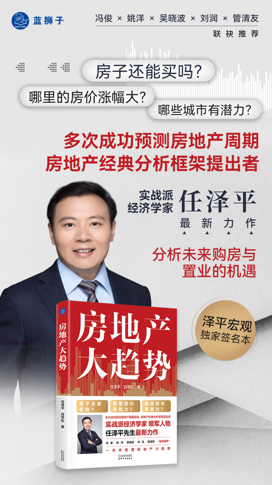

# 任泽平：老百姓房贷都还不起了，银行要适度让利加快下调存量房贷利率

划重点：

  * _1_ 这个时候银行要适度地让利。在经济压力、就业压力、收入压力都存在的情况下，在银行能维持合理利润、存在让利空间的情况下，如果还不下调存量房贷利率，就有点涸泽而渔了。
  * _2_ 全球主要国家中，中国生育率在全球排倒数第二，仅次于倒数第一的韩国。原因并不复杂，就是我们的生育成本太高了。建议在中国每孩每月根据城市的不同补贴500到2000，我觉得基本是合理的。
  * _3_ 过去20年中国老百姓主要还是买房，2022年中国住房市值大约430万亿人民币，是GDP的3.7倍，居民七成财富在房子上。
  * _4_ 房价是否还会继续下跌取决于我们的政策。但总体来说，房子普涨时代已经结束，楼市分化时代到来，买哪里的房子、买什么样的房子越来越重要。

_编者按：2023年盛夏，有关经济复苏、楼市政策、人民币汇率、“活跃资本市场”等话题，再次成为全市场关注的焦点。腾讯财经特推出《年中问计》系列策划，邀请知名经济学家和机构首席建言献策，“问计”中国经济、提振市场信心。_

文 | 张梦洁 叶帆

房地产发生重大变化。日前召开的中央政治局会议首次明确提出，“适应我国房地产市场供求关系发生重大变化的新形势，适时调整优化房地产政策”。

如何理解“供求关系变化的新形势”？目前楼市需要救吗？房地产调控还有哪些空间？怎么看当前的经济形势……腾讯财经特推出《年中问计》，本期嘉宾是泽平宏观创始人、经济学家任泽平。

在他看来，房地产大开发时代已落幕，未来将进入二手房时代，70%的城市或面临着房子过剩。当前最重要的是稳楼市，放松限购、限贷、限价、限售等各种限制性措施。

“在经济压力、就业压力、收入压力都存在的情况下，在银行能维持合理利润、存在让利空间的情况下，如果还不下调存量房贷利率，就有点涸泽而渔了。”任泽平呼吁，现在大家要共渡难关，银行要适度地让利加快下调存量房贷利率。

1、上半年中国经济恢复前高后低，下半年政策逐步友好

**腾讯财经：2023年已经过半，回顾上半年的中国经济，如果用几个关键词总结，您最关心的是什么？**

**任泽平：** 第一个关键词就是 **复苏之路一波三折**
。今年、明年都是中国复苏之年，因为疤痕效应、所谓的流动性陷阱，再加上国际形势诸如美联储加息，俄乌冲突等等原因，以及我们还有一些改革需要深入推进，所以说经济
**一季度是回升的，二季度出现了回落** 。

剔除基数效应，上半年GDP同比5.5%，高于2022年全年增速3.0%，反映经济整体恢复态势；但一波三折，前高后低，一季度和二季度GDP两年复合增速分别为4.6%和3.3%。二季度脉冲式反弹向均值回归，总需求不足问题暴露。

二季度政治局会议对经济形势的看法是，“当前经济运行面临新的困难挑战，主要是国内需求不足，一些企业经营困难，重点领域风险隐患较多，外部环境复杂严峻。疫情防控平稳转段后，经济恢复是一个波浪式发展、曲折式前进的过程。我国经济具有巨大的发展韧性和潜力，长期向好的基本面没有改变”。

当前中国经济增速低于潜在增长水平，意味着财政货币政策有扩张的空间和必要性。根据历史经验，传导的顺序是：政策底、情绪底、市场底、经济底。中国经济潜力大，相信经过一系列务实有力的措施，各界一起全力拼经济，把发展放在首要任务，一定能推向复苏通道。

第二个关键词是 **经济结构出现了明显的分化**
。当前，通过刺激以房地产为代表的传统行业重回高增长是不合适的，你会明显感受到大的周期拐点出现以后，房地产行业面临的最大挑战就是怎么软着陆。

但与此同时，我们的新能源、硬科技等行业的增长还是非常好的，只不过占的体量比较小，所以还不能完全实现对冲房地产下行的影响。

房地产是一个强周期性行业，它跟国民经济是息息相关的。中国今年经济是一季度不错，二季度回落，所以说对应房地产也是一季度是个小阳春，二季度就出现明显的成交乏力。因此包括宏观调控政策、财政货币政策、房地产相关政策都需要在三季度进行发力。

因此，在经济结构、新旧动能转换的过程中，整个经济还是处在复苏的早期，所以说经济结构的分化是非常明显的。

第三，我在这里还是要 **呼吁大家高度地重视人口问题**
。去年我们总和生育率降到了1.1，今年按我们育娲人口的测算，2023年低预测的情况，出生人口在900万左右 **，这样的话总和生育率可能跌破1。**

欧美发达国家它的总和生育率都有1.6-1.7，日本也有1.26，像非洲、印度那就更高了，都在2、3以上。所以，中国总和生育率1这个数据，表明我们现在生育的问题需要受到高度重视。

生育率低的原因主要是生育成本太高。根据我们研究测算，全球主要国家中，中国生育率在全球排倒数第二，仅次于倒数第一的韩国。原因并不复杂，就是我们的生育成本太高了。

2、是该加大生育支持力度了，建议每孩每月补贴500-2000元

**腾讯财经：我们看到这几年陆续有攀枝花等城市发放生育补贴，似乎这些措施对提振生育的效果收效不明显，为什么？**

任泽平：应该说，前几年经过我们的呼吁，大家对于少子化以及生育成本过高有了共识。但是现在对于要不要鼓励生育、多大力度地鼓励生育还没有形成社会共识，甚至对于人口少子化的这种危机感和紧迫感还不够强。

所以，这里是要社会形成共识，要有紧迫感和紧迫性，还有就是出台实质有力的措施。比如欧美很多发达国家的生育补贴都占它其GDP的1%-3%。

比如，发达国家公益托儿所的覆盖率能达到50%多，我们只达到了4%；0-3岁的公立托儿所，我们在这方面的支出还不够。还有法国把辅助生殖纳入社保，我们现在也没有纳入社保。像试管婴儿包括冻卵等，它对女性都是比较友好的辅助生殖技术，现在也没有纳入社保。

我们现在客观来讲对支持生育也有共识了，也发了很多文件，但是发钱的城市还不多，现在部分城市已经出台了生育补贴的具体政策，但补贴力度不算太大。再这样下去，低生育率不仅会影响到我们的房地产，因为房地产根本上得靠人口，而且更重要的是影响我们的创新。

以后年轻人少了，整个社会的创新活力会下降，会影响我们整个民族的振兴，也会影响到我们整个经济未来长期的增长潜力，还有在国际上的竞争力。日本的老龄化就非常严重，少子化，所以它经历了失去的30年。我们要吸取这些教训，避免走弯路。

我相信，未来越来越多的城市也会加入到生育补贴行列当中来。原因并不复杂，因为生孩子是有成本的，而且中国的生育成本又比较高。所以，应该合理地在家庭、企业和国家社会当中来分担生育成本。

而事实上像欧洲每孩每月就补贴两三百欧元就相当两三千人民币。所以，建议在中国 **每孩每月根据城市的不同补贴500到2000，我觉得基本是合理的。**
这对于提升主力生育人群的生育率，甚至对他们家庭幸福都是有巨大帮助的。

毕竟大家都知道，很多人的工资水平可能就三五千、五六千。而生一个孩子是有成本的，完全压在家庭身上也是有压力的。因此，按照国际经验进行一些现金补贴，降低普通家庭的生育成本，能切实解决问题，提高他们的幸福指数，我觉得这是一个善政。

3、目前更重要的是稳楼市，不能再大幅刺激地产

**腾讯财经：如刚才所说，房地产二季度出现了回落，其贡献的GDP同比下降1.2%，是国民经济11个行业当中唯一负增长的。所以，房地产目前是拖经济后腿的吗？按照现在的形势我们到底该不该救楼市？**

**任泽平：**
从长期来看，房地产销售的下滑是大势所趋，因为中国房地产大开发时代已经结束了。房地产长周期拐点出现，市场从高速增长向高质量发展转变，大力刺激楼市有可能导致硬着陆风险，目前更重要的是稳楼市。

首先，房地产高速增长的阶段已经过去，大开发时代落幕，正在步入总量平衡、区域分化的新发展阶段。

为什么这么说呢？一是城镇化进程放缓，过去40多年中国城镇化率从18%增长了超过47个百分点，2022年的最新数据是65.2%，这个数据已经接近国际公认的30%-70%城镇化快速发展区间的上限。

二是人均住房面积接近发达国家水平，住房供给逐渐平衡。过去40多年，中国城镇人均住房建筑面积从8平增长到35平，城镇住房套数从3000多万套增长到3.6亿套，套户比也已经超过1，也就是说中国住房供给总体达到平衡。

三是人口总量达峰，已经开始负增长；置业人群早在2013年左右就见顶回落。以上提到的，都不支持房地产大发展。

其次，从政策这个角度分析，中国对房地产行业的政策从2016年底中央提出“房住不炒”，就奠定了基调。房地产调控不断加码，直到2020年前后“三道红线”出台，叠加人口长周期拐点出现，市场对房价永远涨的预期改变。政策对房地产行业要求是三稳——稳地价、稳房价、稳预期，稳楼市才是正道。

因为房地产是中国经济第一大支柱行业，有观点认为为了扭转中国经济下滑，需要重启刺激地产，这个思路是危险的。

事实上，随着住房饱和、三四线城市过剩、城镇化接近尾声以及人口老龄化少子化到来等原因， **房地产已经无力承担维持中国经济高增长的使命**
，如果大幅刺激，居民加杠杆，金融加杠杆，房价再大涨，一定是饮鸩止渴，酝酿更大风险，包括金融风险，房子过剩风险，而且会增加实体经济成本，扼杀年轻人希望，导致居民收入差距拉大。

冰冻三尺非一日之寒。我们银行风险敞口的30%多信贷都投放到了房地产领域，房地产相关产业链带动的基建、玻璃、水泥、制造业相关投资，贡献了中国就业几千万人。所以，房地产转型有个过程，也不宜急于求成，有一个新旧动能转换的过程。

所以，未来需要稳楼市，放松各种限制性措施，防止硬着陆，但是不能再大幅刺激地产，国家下定决心“房住不炒”，当然这需要付出一定代价，比如经济增速的适度放缓和经济转型的一定时期阵痛，但是大方向没问题，老成谋国是用市场化方式促进房地产软着陆，以时间换空间。

4、建议取消限购限贷等过严政策

**腾讯财经：您认为我们现在需要稳楼市，需要的是“放松各种限制性措施”，这块有多大空间？**

**任泽平：** 我觉得不是救不救的概念，就是让它回归市场化的常态。现在房地产调整过于剧烈，可能跟前期一些过严的政策有关。

刺激是什么？比如通过降息、降准、降低交易的税费，那个是刺激；但是限购、限贷、限价、限售，这是一些过严的政策。

现在房地产市场处于下行期，这时候就应该把过热时期出台的限购、限贷、限价等过紧政策取消，不要采取一些过急、过紧、过严的政策。它不是刺激，是回归常态。

我们要用时间来换空间，用市场化的方式循序渐进地，不宜用猛药。而且要尽快建立人地挂钩、加大对年轻人租赁房建设的新模式，实现供求的平衡防止过剩。

当然，还要稳定预期，对大家刚需改善性的需求要支持，降低二套房的首付比等等。但是对于投机的房子要予以打击，不能指望未来房价还会大幅地上涨。

5、房地产在任何时候都是国民经济支柱行业，未来仍需要发展

**腾讯财经：大开发时代已结束，那房地产还是或者说还应该是我们国民经济的一个支柱产业吗？**

**任泽平：** 我觉得很多人对这个事有误解，其实不只是中国，包括美国房地产都是支柱行业。

第一，你看美国城镇化都结束了，但是由房地产带来的服务业、城市更新、装修，它都是一个国民经济的支柱行业，美国房地产占国民经济的比重是非常高的。

第二，现在中国房地产占中国国民经济的比重，包括房地产投资占整个固定资产投资的20%多，是较高甚至是偏高的，虽然未来可能会下降。

这和我们的发展阶段有关，就是房地产大开发时代是以新房为主。未来进入二手房时代，城市更新、改善性等需求为主，房地产占经济比重自然就会下降了。但是其即使下降了，房地产仍然是国民经济的支柱行业。

因为衣食住行，它都是国民经济包括老百姓离不开的，它必然是国民经济的支柱行业，所以房地产这个行业仍然需要发展，只不过未来房子从“有没有”到“好不好”转变。所以未来应该提高房屋的质量，城市的规划、装修、位置等等的，实现房地产自身的高质量发展。

6、银行要适度地让利，加快下调存量房贷利率

**腾讯财经：最近我们也看到江苏常州、广东广州等地银行下调存量房贷利率的动作，但很快又被辟谣。您觉得存量房贷有必要降低吗？目前难点在哪？为什么这几年大家对调降存量房贷的呼声这么高？**

**任泽平：**
我认为，现在存量房贷利率有下降的空间。3年前我们存量房贷利率5%以上，现在都降到了3点几了，利率差20%-30%，那对普通家庭的影响是巨大的。

比如我一个月原来还5000块钱的房贷，如果说存量房贷利率调整，现在可能一个月还3000多就行了，那你想对于一个普通家庭的影响有多大。

所以，我觉得这个时候 **银行要适度地让利**
。在经济压力、就业压力、收入压力都存在的情况下，在银行能维持合理利润、存在让利空间的情况下，如果还不下调存量房贷利率，就有点涸泽而渔了。

这个时候就要共渡难关。 **老百姓房贷都还不起了，几百亿利润的银行还不采取实质行动让利于民，这不合适。**
而且央行又再次提出，指导商业银行依法有序调整存量个人住房贷款利率。

今年上半年我们出现了大面积的提前还贷潮，这里大家会很奇怪说老百姓不是没钱嘛，那怎么还会提前还贷呢？这是误解。

完全是因为原来的房贷利率太高，所以大家基本都是提前还老的房贷，还旧贷款再借新贷款。这么一折腾，银行也麻烦，老百姓又增加了很多成本，因为中间要资金周转。

所以，这个时候银行就不如直接降低存量房贷利率。当然，这时我们也可以通过货币政策的降息降准来降低银行的负债成本。银行的资金成本下降它也愿意，这个时候国家也得给它提要求，就可以降低我们居民的房贷利率，如此老百姓肯定拍手称快。

现在需要共克时艰。好消息就是我们正在往下调存量房贷利率这个方向推动，但是力度和节奏需要加快。

7、过去20年中国老百姓主要还是买房，七成财富在房子上

**腾讯财经：那从国际可比的角度来看，我们现在房贷负担，大概跟其他国家相比是个什么样的水平？**

**任泽平：我们现在的房贷负担水平还是偏高的，因为中国的利息、利率在全球还是偏高的。**

当然这里有多方面的原因。一个是过去中国老百姓缺少多元理财的方式，中国股市起步相对较晚，还没成为老百姓财富的蓄水池、放大器，包括很多机构投资者、公募基金行情不好的时候也都是血亏，再加上前几年的P2P给中国老百姓造成了巨大的损失。

其实过去20年中国老百姓主要还是买房，所以也造成了老百姓大量的贷款也好、资产也好，都配置在房子上面去了。

又加上在中国经济过去高增长的背景下，中国的贷款利率整体偏高，现在我们增速换挡，经济增速没有以前那么高了，所以这时候就需要把利率中枢调下来。

这里主要还是存量这块怎么解决？因为这几年利率下来以后，存量和新增的利差比较大，这就带来了原来早期的这些购房者贷款的人就比较吃亏。

现在经济增长和收入水平的增长没有以前那么快了，所以这时候就会造成他们还贷的压力和生活的困境，就需要政策进行干预，来降低存量房贷的利率。

**腾讯财经：目前老百姓有多少财富在住房上？**

任泽平： **居民大部分财富在房子上。** 根据我们的测算， **2022年，中国住房市值大约430万亿人民币，是GDP的3.7倍。**

2022年，股市大约是80万亿元，债市大约150万亿元。也就是说居民资产里，股市、房市加债市， **房子大约占总财富的七成左右。**

**6、房子普涨时代已经结束，买哪里的房子、买什么样的房子越来越重要**

**腾讯财经：从3月81%的二手房在上涨，到6月只有21%的二手房在上涨。很多人感觉，房地产从“过热”到“过冷”，似乎只用了短短3个月，大家担心房子会不会一直下跌？怎么看未来的房价走势？**

**任泽平：** 房价是否还会继续下跌取决于我们的政策。但总体来说， **房子普涨时代已经结束**
，楼市分化时代到来，买哪里的房子、买什么样的房子越来越重要。

我们从去年年底到现在反复提的一个观点是：房地产将会出现分化式复苏。今年以来，各方面的数据也印证了我们的观点。首先是一二线城市和三四线城市的分化，人口和高端人才在城市群、都市圈的核心一二线城市集聚，这些城市楼市复苏程度比较高、复苏持续时间也长。

比如北上广深、杭州、青岛、成都等；而没有在城市群、都市圈的三四线城市，人口持续流出，今年楼市复苏势头很弱并且昙花一现、甚至有些城市没有复苏迹象、持续低迷。

其次，在城市内部，各个区域的房子也在分化，核心区域的楼市比较坚挺，远郊区房子潜力比较低。

比如北京，东西城、海淀等主城区处于供不应求的状态，房山这种远郊区楼市表现弱于大势，库存消化难度比较大。

第三，高品质房子与普通房子的分化。高品质可以理解为我们经常提到的改善性住房，这些房子在房屋设计、面积、质量、布局、房龄、小区环境和配套等方面，好于普通住房。

过去大开发时代，房企开发大量土地建房子，随着这批房子老化，以及居民生活水平提高，大家越来越追求高品质住宅，因此，高端住宅供给是小于需求的。

以北京为例，北京中介平台挂牌的房源中，可以发现，每2套挂牌房源中就有1套是房龄超20年的老房子，而房龄10年内的次新房占比一直下降。

总结来说，普涨时代结束，买哪里的房子、买什么样的房子变得越来越重要了， **位于一二线城市核心区域的高品质房子有一定的潜力。**

**腾讯财经：我们目前房价是个什么水平？**

**任泽平：** 我们研究过全球一线城市的房价水平，研究发现， **中国一线城市绝对房价、相对房价在全球都排在前面。**

以绝对房价为标准， **全球前十大高房价城市里，中国占了一半，分别是中国香港、北京、上海、深圳、广州。**

以相对房价做标准，中国一线城市的房价收入比非常高，深圳市中心房价收入比在一线城市最低，是32，但这个数字也远高于全球其他核心城市。外围区房价收入比也远高于纽约、伦敦等城市。

8、住房基本饱和，未来70%的城市将出现房子过剩

**腾讯财经：那未来买哪些城市的房子是有价值的？**

**任泽平：**
在我们的新书《房地产大趋势》中，大家可以详细地从那里面看。我们现在的住房基本饱和了，过去20年整体还是一个短缺时代，现在人均住房面积35平，套户比1.09，总体是一个饱和的状态，但是区域分化。

城镇化率超过60%以后，将会看到人口在源源不断往都市圈、城市群流入。中国有330多个城市，未来70%的城市人口停滞甚至流出，这些城市的住房已经基本饱和了，甚至出现了过剩，因为它的人口还面临着流出，所以有些城市每户家庭已经超过了两三套房子。像东北、西北的一些城市的房子，已经过剩了。

但是，什么地方的房子还有需求？比如说我们的长三角、珠三角这些城市，因为每年还有人口的流入，所以其住房还有需求，主要是新增人口。因为人口是流动的，房子是不能流动的。但是从占比的角度来看，大约也只20%多，所以说未来中国70%的城市住房基本饱和，甚至过剩。中国未来20%多的城市，因为人口流入还有些需求。

从去年开始，中国人口开始负增长，生育率只有1.09%，而美国为1.66%，法国为1.8%，英国1.75%，德国1.61%。未来中国最稀缺的一定是人，尤其是年轻人。没有人，不管是房地产还是其他产业，都没有根基。

