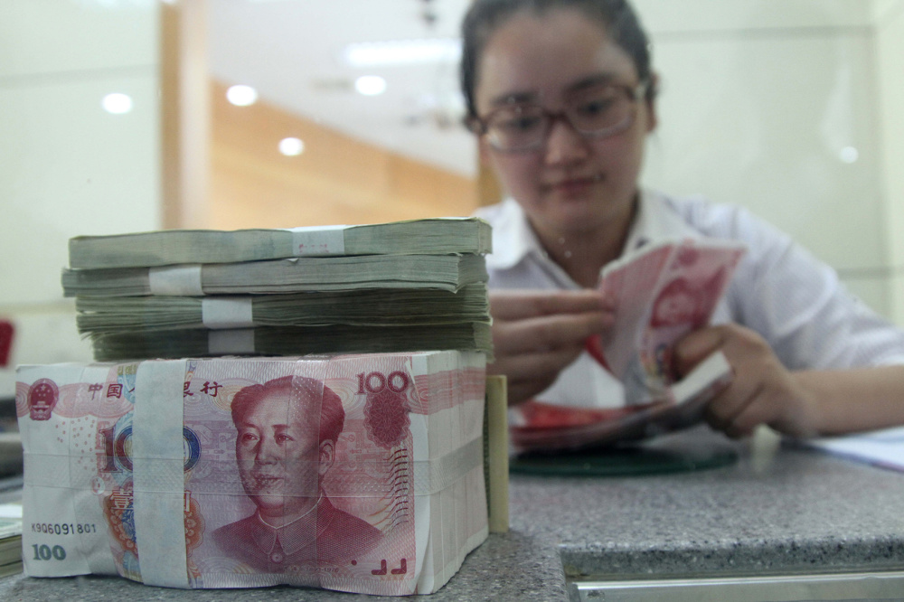

# 利率可到4%，大额存单抢疯了，有银行要求“配货”才能买

每经编辑：毕陆名

“知道爱马仕要配货，现在银行（存钱）居然也要。”

据中国证券报8月2日报道，“知道购买某些奢侈品要配货，现在买大额存单竟然也要配货！说是额度有限，需要搭配其他产品才有购买名额。”小梦在社交平台上发帖吐槽。
**评论区里有网友表示，“我们行就是1:1才给大额存单额度，不卖理财不给额度”“我们行是1:1配定期，但没让卖理财”……**

随着存款利率的不断下行，保本保息、收益率高、灵活性强的大额存单走俏，抢购难度大。有银行正是看中了这一点，搭配其他理财产品，向客户出售大额存单。
**对此，专家提醒，此举可能损害了金融消费者的合法权益。**

有银行要求“配货”才能买

据中国证券报8月2日报道，记者走访多家银行网点时，客户经理均表示，大额存单额度紧俏，需要提前预约或拼手速抢购。此外，若是新客户或者入账资金量大，部分银行的大额存单利率可以更高。“三年期大额存单，若是新入资金，5万元以上利率3.2%，100万元以上利率3.25%。”东莞银行中山分行工作人员告诉记者。

记者调研了解到，有银行人员凭借大额存单的销售热度，搭配定期存款或理财产品，向客户捆绑销售。记者通过小梦提供的联系方式，联系到四川银行成都地区某支行员工小殷。小殷告诉记者，当前该行五年期的大额存单利率为4.05%。“买20万元大额存单，需要配50万-60万元的理财产品，或者是比大额存单利率低0.05%的定期存款。不强求配理财还是定期，看客户选择。成都分行要求就是配售，可能有些网点配比够了才不需要。”他说。

 _图片来源：视觉中国_

8月2日，记者致电四川银行总行营业部，该行工作人员告诉记者：“现在来存，1:1配定期，有其他网点需要1:3配。之前我们也有1:3或1:4的时候，现在因为还有几百万的额度，所以可以1:1配。”当记者问，此举是否为总行规定时，她表示：“相当于银行给大额存单额度，员工需要拉回来存款。”

记者通过社交平台评论联系到称所在银行也需大额存单“配货”的小尚。小尚告诉记者，自己是宁波银行的客户经理，“50万元大额存单得配50万元定期。三年期定期存款利率3.2%，大额存单利率3.3%，综合利率为3.25%。”小尚表示，自己有客户正等着抢大额存单。“大额存单额度少。有其他行甚至不能配定期，只能配理财。可以帮忙争取，看能不能配40万元的定期。”

不过，据红星资本局报道，7月13、14日，记者以客户名义咨询全国多家城商行，多数银行工作人员表示“没听说过买大额还要配货”，并称目前大额存单已没有额度。不过，也有部分银行在询问记者的资金情况后，给出了其他建议。

宁波银行宁波某支行的一名工作人员则向红星资本局表示，目前20万的大额存单没有额度，“资金量大一点最好，如果在100万以上，可能就会有额度。”

东莞银行广州某支行一名工作人员告诉红星资本局，目前大额存单仍有额度，没有配货要求，不过资金多利率会高一些。“3年期的存20万利率是3.05%，50万以上是3.15%。”该工作人员还称，该行大额存单利率在当地属于“天花板”级别，如果储户有意向可以尽快买，“利率可能还会下调。”

发行过多会增加银行负债成本

据红星资本局7月14日报道，“有的银行大额存单利率比较高，所以要配产品用来平均成本。举个例子，你买3.55%的大额存单，可能要另外买一个短期的利率3.3%的理财产品，加权后利率会降到3.5%左右，这样比较符合银行资产负债（管理）的目标。”江浙沪地区某城商行一名客户经理向记者表示。

该客户经理表示，据其了解，这些银行配的产品一般是短期的理财产品，客户也比较容易接受，“如果是配长期的产品，就要综合考虑，计算加权利率。”融360数字科技研究院此前指出，大额存单利率水平高于普通定存，零售大额存单3年期占比一直都比较高，所以大额存单揽储成本要明显高于普通定存。银行想要控制负债成本，需要控制大额存单的量价水平。

记者采访发现，近期不少城商行大额存单利率下跌趋势较为明显，且基本没有额度，为留住客户，部分银行建议购买利率接近的定期存款。“我们下周还会有大额的额度，不过额度也很少，利率是3.5%，现在定期也是3.5%，等不到可以买定期存款。”厦门国际银行上海某支行工作人员向记者介绍。

_图片来源：视觉中国_

招联首席研究员、复旦大学金融研究院兼职研究员董希淼此前接受央广网采访时表示：“大额存单如果发行过多，势必会增加银行的负债成本。今年以来银行的息差下降比较明显，因为一方面银行要向实体经济让利，贷款利率也在下降。所以如果大额存单等这些利息相对较高的存款产品发行过多，那么银行存款成本会上升。”董希淼表示，银行为了压降存款成本，增强向实体经济让利的可持续性，大额存单的发行量会进行一定的调控。

“特色存款”成为存款香饽饽

今年六月以来，国有大行率先开启新一轮存款利率下调，此后多家银行持续跟进，目前一年期、二年期、三年期、五年期整存整取挂牌利率分别已降至1.65%、2.05%、2.45%、2.5%。与此同时，曾经的高息“神器”大额存单也常常一单难求。

在此情况下，对于储户而言，利率上浮的“特色存款”成为存款选择的香饽饽。对于银行而言，“特色存款”也成为新的揽储利器。

业内人士指出，与普通存款相比，“特色存款”在利率上比普通存款有所上浮，在起存金额方面更加亲民，对储户具有更好的吸引力。

招联首席研究员董希淼预计，2023年货币政策将稳健略偏宽松，市场流动性更加合理充裕，降准降息都有可能。总体而言，中国市场无风险利率下行将是长期趋势。

董希淼认为，投资者在进行资产配置时，需调整好心态和预期，平衡好风险和收益，可以在存款之外，适当配置现金管理类理财产品、货币基金以及储蓄国债等产品。

每日经济新闻综合中国证券报、红星资本局、央广网

每日经济新闻

