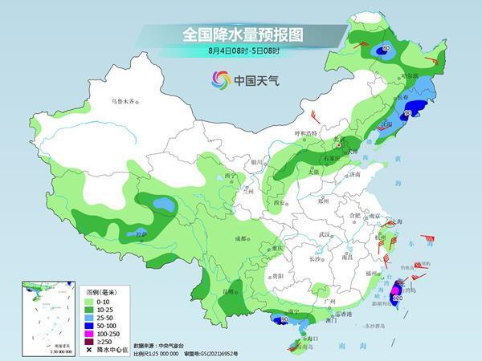
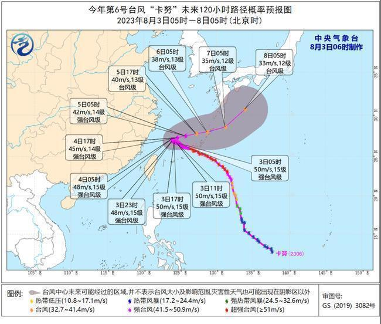

# 台风“卡努”逼近我国东部沿海，将现持续风雨

今明天（8月3日至4日），东北强降雨仍将持续，黑龙江、吉林等地将有暴雨或大暴雨，并伴有雷暴大风、冰雹等强对流天气。另外，今年第6号台风“卡努”已进入我国东海，受“卡努”及其外围环流影响，我国东部沿海和海域将有持续风雨天气。

**东北强降雨持续局地伴有强对流 云南广西降水频繁**

昨天，京津冀地区降雨继续减弱，不过雨水此消彼长，在副热带高压外围暖湿气流和冷空气影响下，东北地区降雨增多、增强。南方的云南、贵州等地，昨天也出现较明显降水。监测显示，内蒙古东部、黑龙江南部、吉林中西部等地部分地区出现大到暴雨，内蒙古兴安盟，黑龙江哈尔滨和牡丹江，吉林松原、四平、长春、吉林等局地大暴雨，吉林长春榆树市、松原长岭县局地特大暴雨；四川宜宾和泸州，湖南湘西和怀化，广西防城港，海南临高、儋州、昌江等局地大暴雨。

今明天，东北还将有大到暴雨出没，局地有大暴雨，此轮降雨过程水汽充沛、能量条件较好，局地易激发对流天气。北方降雨频繁来袭，南方雨水也刷存在感，未来几天云南、广西南部等地强降雨将频繁来袭。

中央气象台预计，今天，内蒙古东部及河套地区、黑龙江、吉林、河北中北部、北京、青海中东部、西南地区、西藏、广西、海南岛、浙江、台湾岛等地部分地区有小到中雨，内蒙古东北部、黑龙江东南部、吉林中北部及云南南部、广西南部沿海、海南岛西南部、台湾岛等地部分地区有大到暴雨，其中，内蒙古东北部、黑龙江东南部、吉林北部、台湾岛等地局地有大暴雨（100～150毫米）。

明天，内蒙古东北部、黑龙江西北部和东部、吉林中东部、辽宁大部、陕西北部、山西北部、河北中部、北京、天津、云南西部和南部、广西东南部、广东西南部、海南岛西部、台湾岛等地部分地区有中到大雨，其中，内蒙古东北部、黑龙江西北部、吉林东部、广西南部、台湾岛等地部分地区有暴雨或大暴雨（100～120毫米）。

后天，黑龙江东部、山西南部、河北南部、山东中北部、青海东部、云南、广西南部、广东西南部、海南岛南部等地部分地区有中到大雨，其中，广西南部沿海局部有暴雨或大暴雨（100～120毫米）。

气象专家提醒，东北强降雨和强对流天气齐来袭，公众需关注临近预警预报信息，外出时避开雨大时段。此外，未来几天华北阴雨天气仍比较频繁，由于地质灾害具有一定的滞后性，即使降雨减弱也不能放松警惕，公众近期仍要避免前往山区等地质灾害易发区，远离河道，保障自身安全。

**台风“卡努”或近海转向 我国东部沿海和海域将有持续风雨**

台风方面，今晨5时，今年第6号台风“卡努”位于浙江省玉环市东偏南方大约390公里的东海海面上，中心附近最大风力有15级（50米/秒）。

预计，“卡努”将以每小时10公里左右的速度向西偏北方向缓慢移动，将于4日上午在浙江南部近海海面（东经123.8度附近）转向东偏北方向移动，趋向日本以南洋面，强度逐渐减弱。

受“卡努”影响，今天，南海大部、北部湾、台湾海峡、巴士海峡、台湾以东洋面、东海及钓鱼岛附近海域以及长江口区、杭州湾、浙江沿海、福建沿海、台湾岛沿海将有6~8级、阵风9~10级的大风，其中台湾以东洋面部分海域、东海南部及钓鱼岛附近海域风力可达9~12级、阵风13~14级，“卡努”中心经过的附近海域风力有13~15级、阵风16~17级。台湾岛部分地区将有大到暴雨，局地有大暴雨（150毫米）。

“卡努”路径还有不确定性，后期或将转向东北向移动。受“卡努”及其外围环流影响，我国东部沿海和海域将有持续风雨天气。建议沿海各地做好防御准备，附近海域航行船舶注意航行安全。

来源 中国天气网

编辑 胡德成

流程编辑 刘伟利

