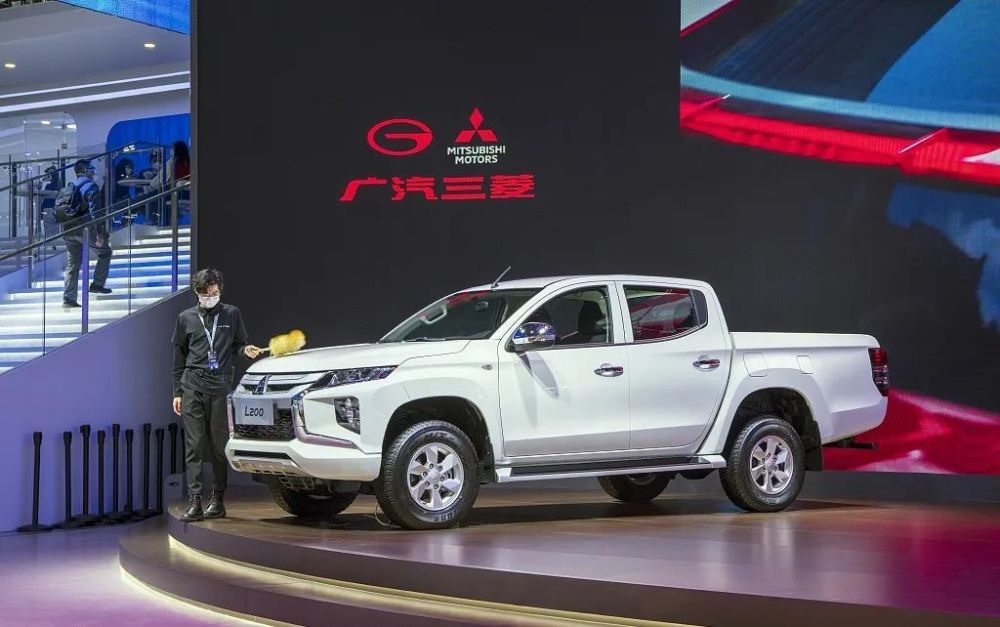

# 在华50年，三菱终被广汽抛弃，合资车的老本快吃完了

_来源：视觉中国_

特约作者 | 胡世鑫

编辑 | 陈弗也

出品 | 棱镜·腾讯小满工作室

广汽三菱宣布停产，车主杨兰（化名）并不意外。

回想十年前自己的购车经历，当时他一眼便挑中了欧蓝德。耗油少、空间大、性价比高是杨兰选择这款车的理由。但他告诉作者：“广汽三菱都比较小众，那会儿身边的朋友还没有买三菱的，很多还是买大众、丰田。”

两年后，这辆欧蓝德被转卖了，他换购了一辆宝马X5，现在开的则是特斯拉。身边朋友也多是如此，“都是从日系车换了新能源汽车，现在路上都很少见到三菱车了”。

作为一家小众合资品牌，广汽三菱在华成立十一载，恰好赶上了合资车企时代最后的红利。2018年可谓它的高光时刻，凭借国产欧蓝德的高销量表现，三菱的年销量达到了14.4万辆。

但好景不长，从2019年开始，这一品牌便走上了下坡路。今年4月在广汽集团的产销快报上，广汽三菱的销售数据消失了。官方称，因该品牌月度产销占小，不再单列。事实上，从广汽集团官网数据显示，广汽三菱从
4 月开始，已经没有销量了。

7月12日，广汽三菱发布全员信宣布停产、裁员。即便官方称股东三方正尽全力推动企业的纾困转型工作，但外界对它将退市的消息深信不疑。笔者向日本三菱汽车询问是否要退出中国市场，客户咨询中心负责人则称仍在与相关部门核实。

一位对广汽三菱了解的人士向作者分析，广汽三菱目前的处境也是不少合资品牌的缩影，这些合资车企适应不了中国市场，退市是必然的。

**股东曾“输血”28亿**

随着一纸全员信传遍全网，广汽、三菱的合作即将走向终点，然这一结果早有迹可循。

2020年的三菱股东大会上，首席执行官加藤隆雄透露，公司将逐步缩减包括欧洲、中国在内市场的业务。消息一出便引发网友讨论，彼时的三菱汽车曾公开辟谣，称中国是三菱汽车的重要市场，三菱汽车会与广汽进一步深化合作。

但现实情况与此有不小的出入。同年5月，雷诺－日产－三菱联盟共同发布了2030年愿景。其中，三菱汽车的运营中心被放置在东南亚和大洋洲；今年2月，这一组织又正式签署了关于联盟重组的框架协议，其中提到了联盟将在拉美、印度、欧洲投入创造高价值的运营项目，至于中国市场的布局并未提及。

其实即便放弃了中国汽车市场，三菱在全球的业绩也相当出色。以2022年为例，这一年，三菱汽车本土产量超44万。在海外方面，全年总计产量超57万，其中、泰国、印度尼西亚两大市场生产的新车就约有55万辆，中国市场完全可以忽略不计。

反观广汽，似乎也在主动放弃一些合资品牌，广汽菲克和广汽讴歌便是例证。

2022年7月4日，广汽集团和全球第四大汽车制造商Stellantis宣布分手，由于广汽菲克近年来持续亏损，且多月一直无法恢复正常生产经营，双方协商终止了合资公司。到10月底，两家公司在官网上发布了广汽菲克破产消息。

就在宣布分手的当天，广汽旗下新能源自主品牌埃安宣布未来将择机上市。

对于广汽讴歌，存在同样的问题。2022年4月，广汽本田及广汽讴歌宣布，2023年起广汽本田将不再生产及销售广汽讴歌的现有产品。今年1月，广汽讴歌的官方网站已经停止了访问，这意味着本田汽车高端品牌讴歌正式退出中国市场。

面对前不久广汽三菱停产的消息，有汽车行业人士预测，它将会是下一个讴歌、菲克，最终走向破产。

广汽集团2022年财报数据显示，截至2022年末，广汽三菱资产总额为59.61亿元，负债总额为59.53亿元，资产负债率高达了99.87%，公司已经陷入资不抵债的困局。

过去一年，为了扭转被动局势，股东们曾前后向广汽三菱“输血”超28亿。

2022年9月，广汽集团曾向广汽三菱伸以援手，输血10亿元来解决现金流方面的问题。今年6月21日，广汽集团又发布了《关于向广汽三菱提供委托贷款的公告》，称广汽三菱各股东按各自所持股比，向广汽三菱提供总额不超过18.84亿元的资金支持。按照股东占比，广汽集团将提供不超过9.42亿元委托贷款。

但这份公告并未曾披露这笔近10亿贷款的担保措施，引发了投资者对其还款能力的担忧。

**三菱在华的50年**

回顾过去，作为较早进入中国的日本车企，三菱旅华至今已有50年的历史。从昔日的辉煌到如今的衰落，三菱在华的旅程终将画上句号。

日系车企第一次与中国市场发生交集还是在改革开放前，1973年，三菱向中国出口了中型卡车。到了20世纪80年代，中国合资创办企业造车模式正如火如荼地进行，三菱又与中国企业合作，开始生产轻卡等商用车型。

1997年，三菱在中国成立了沈阳航天汽车发动机制造有限公司。这是一家由中国、马来西亚、日本三国4家公司出资组建的中外合资企业，主要生产发动机等零部件。

彼时的三菱发动机，可谓撑起了中国汽车市场的半边天，养活了很多国内自主品牌。比如现在的吉利、长城、东风、华晨、北汽、比亚迪等等，都是三菱发动机曾经的客户。然而，随着自主品牌纷纷崛起，三菱发动机也“跌落神坛”。

进入了21世纪，中国正式加入WTO，中国的汽车产业迎来新的篇章。中国汽车市场迅速发展，当时几乎所有国外主流的汽车品牌都来中国成立合资公司。这些品牌也一度占据了中国乘用车的大部分市场。

三菱也不例外，为了加强在中国市场的生产和销售体制，2006年三菱投资了东南汽车，占25%的股权。借助三菱当时的先进技术，东南汽车迎来了自己的黄金时代，带着三菱车标的风迪思、蓝瑟、戈蓝等多款新车型纷纷亮相，在中国汽车市场上都有过亮眼表现。

在度过一段时间的“蜜月期”后，或许是不满自身股权占比低，三菱开始在中国市场寻找“新欢”。

2012年9月，它投入了广汽集团的怀抱，与其合资成立广汽三菱，陆续推出了奕歌、劲炫、欧蓝德等车型。凭借当年SUV的市场优势，广汽三菱销量逐年上升，2018年销量达到了历史最高的14.4万辆。

但时移势易，这几年，分手后的东南汽车与广汽三菱日子都不好过，销量先后被腰斩。

2017年销量还超过15万辆的东南汽车，2018年销量仅有8.9万辆，同比下滑超过40%。2021年4月，东南汽车发生了股权变更。原先持股25%的三菱汽车选择退出，由福州交投正式接棒。这意味着三菱汽车在中国唯一的合资车只剩下了广汽三菱。

广汽三菱的销量则从2018年之后开始下跌，2022年销量仅有3.36万辆，同比下滑近50%。

事实上，从2019年开始，广汽三菱就曾多次被爆出停产和退出中国市场的消息。今年5月一次发布会上，日媒证实了三菱汽车3月至5月在湖南长沙的工厂停产消息，后来便是7月12日，广汽三菱发布全员信，正式宣布停产。

**新能源时代的“诺基亚”**

目前，广汽三菱品牌旗下仅有4款车型在售，燃油车包括欧蓝德、新劲炫、奕歌，新能源车型则只有阿图柯这一款。

上述了解广汽三菱的人士向作者分析，产品少且无法满足市场期待，是广汽三菱销量低的原因之一。多年来，广汽三菱销量过于依赖欧蓝德。只要欧蓝德的销量下滑，广汽三菱的整体销量必定会受到冲击。

事实上，就在广汽三菱销量达到历史最高的2018年，中国汽车市场发生了重要转折，那一年，连续增长28年的中国汽车市场销量首次下跌，此后又连跌了两年。

彼时，长城、吉利、比亚迪等国产自主品牌也开始被越来越多的消费者认可，销量也在稳步增长，尤其是比亚迪，在近两年的时间里，一跃成为了仅次于特斯拉的新能源汽车巨头。理想、蔚来、小鹏等造车新势力也开始被更多的人关注。

汽车行业加速变化，新能源车异军突起，行业竞争愈加激烈，停滞不前的企业终将出局。

广汽三菱的全员信中也提到，目前中国汽车市场正在快速从传统燃油车向新能源汽车方向转型。广汽三菱曾尝试过转型，2022年3月推出了第一款纯电SUV——阿图柯，但销量惨淡。

该车2022年仅卖出631辆，今年一季度，仅卖出178辆，并没能帮助广汽三菱走出危机。由于产品相似，阿图柯还被业界人士嘲讽为“换壳埃安”，但价格却比埃安高不少，官方指导价为19.98万元起。这样的定价，也让广汽三菱流失了部分意向客户。

大浪淘沙之后，包括广汽在内的国内外各大车企，纷纷加快了新能源转型步伐。大众集团前CEO迪斯曾公开说道，公司需要加快转型的速度，一旦在汽车行业中落后，恐怕就是下一个诺基亚。

广汽集团已经拥有了自己在新能源汽车市场的“生力军”，其新能源自主品牌“埃安”的估值达到了千亿，而其母公司广汽集团的市值也仅1200亿。

黄河科技学院客座教授张翔向作者分析，目前国内汽车品牌一共有100多家，近几年新能源转型加快，很多新势力发展迅猛。当市场容量、购买力确定时，广汽三菱作为其中的小众品牌，大象难以转身，没有跟上转型步伐，自然就出局了。

根据作者不完全统计，自从2018年以来，至少已有7家合资品牌退出了中国市场，如昌河铃木、菲亚特、东风雷诺等，这些无一例外，都是传统燃油车。

“（合资车企）一定要跟随汽车行业的发展趋势，首先，积极地做新能源汽车转型，像一汽大众和上汽大众推出的ID系列就是很好的案例；第二，要做智能网联，比如车联网、车的信息娱乐系统、车的软件等等，满足年轻消费者的需求；第三，销售模式要转型，仅在4S店里卖车，效率低，销量跟不上。”张翔向作者分析说。

