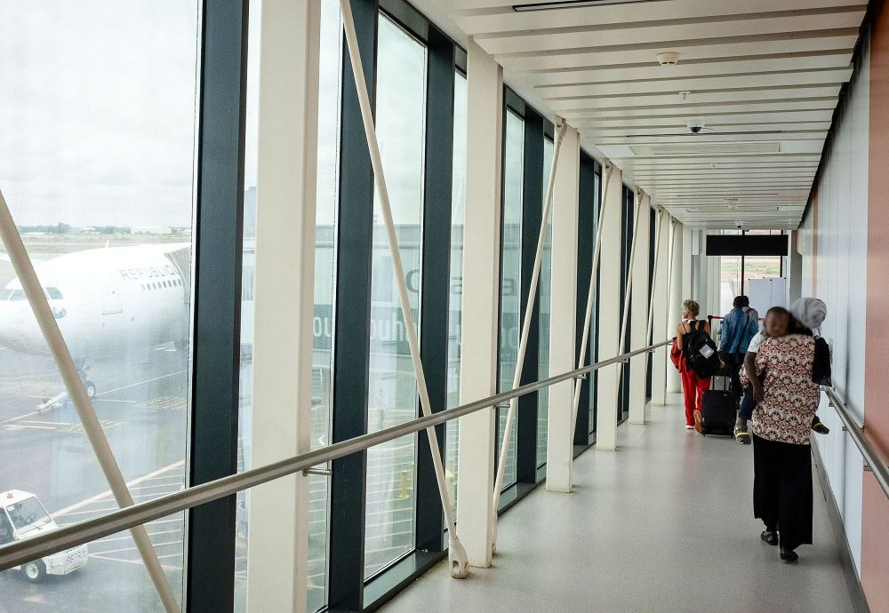

# 尼日尔政变领导人拒绝任何让步，美国下令部分大使馆人员撤离

_当地时间2023年8月2日，尼日尔尼亚美，乘客们准备在迪奥里·哈马尼国际机场登机。 视觉中国 图_

当地时间8月2日，美国方面宣布撤出部分驻尼日尔大使馆工作人员，尼日尔军事政变领导人同日表示拒绝在移交权力方面做任何让步。外媒刊文指出，这可能将导致尼日尔局势进一步升级并加剧武装冲突风险。

据《卫报》8月3日报道，美国国务院2日表示，在尼日尔总统卫队发动政变后，美国方面下令撤离美国驻尼日尔大使馆的一些工作人员和家属。不过，大使馆将继续开放，高级领导层也将继续保留在工作岗位上。

美国国务院发言人马修·米勒（Matthew
Miller）在一份声明中说：“鉴于尼日尔局势的持续发展，出于谨慎考虑，国务院下令美国驻尼亚美大使馆的非紧急美国政府人员和符合条件的家属暂时离开。”对于驻尼日尔大使馆的后续安排，米勒表示，大使馆仍将对美国公民开放以提供有限范围内的紧急服务。

在美国宣布这一消息的同时，尼日尔政变领导人表示，尽管有来自邻国的压力，军政府方面不会让已被罢黜的前民选总统巴祖姆（Mohamed Bazoum）复职。

西非国家经济共同体（西共体）已对尼日尔实施制裁，西共体方面表示，如果尼日尔政变领导人不在7月30日起的一个星期内恢复巴祖姆的总统职位，西共体将可能授权对尼日尔使用武力。8月3日当天，欧盟派出代表团前往尼日尔并试图与政变领导人进行谈判。

西共体政治事务、和平与安全专员阿卜杜勒-法图•穆萨(Abdel-Fatau
Musah)表示:“军事干预是最后的选择，也是最后的手段，但我们必须为可能发生的情况做好准备。”

尼日尔政变领导人蒂亚尼（Abdourahamane
Tiani）在电视讲话中说，军政府“完全拒绝这些制裁，拒绝屈服于任何威胁，无论这些威胁来自哪里”。他同时表示拒绝任何干涉尼日尔内政的行为。

