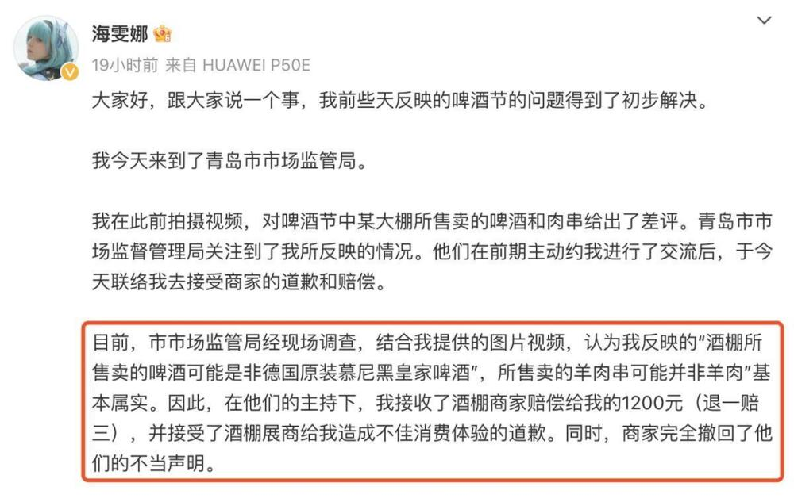
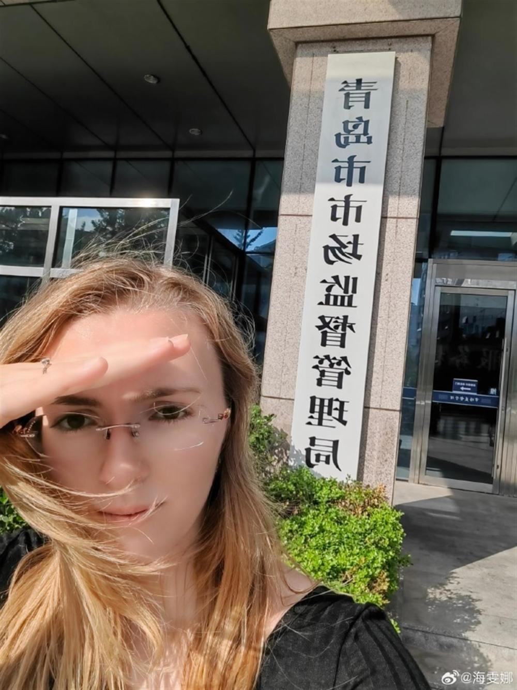
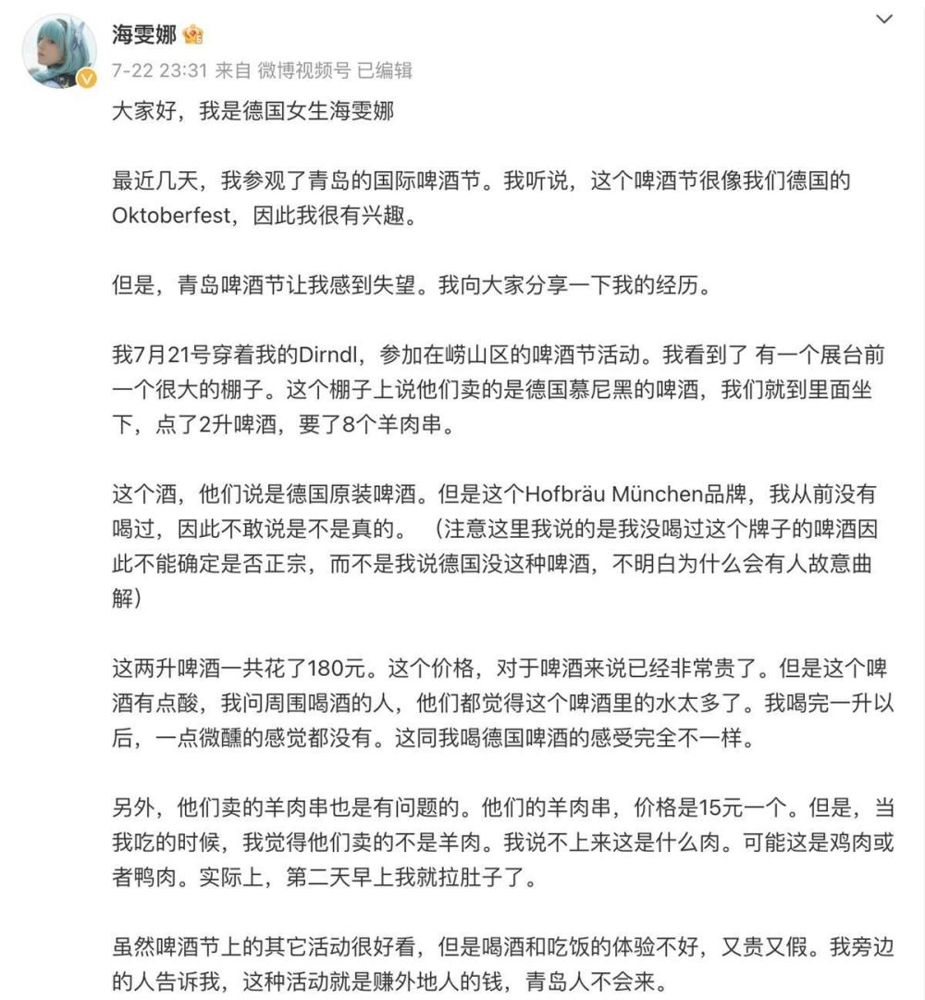

# 德国女孩啤酒节喝假德国啤酒、吃假羊肉获三倍赔偿，当地市监局回应

8月2日，德国女孩海雯娜再次发文称，青岛啤酒节商家售卖假啤酒假羊肉事件已经得到妥善解决。

她表示，青岛市市场监管局经现场调查，并结合图片视频，认为“酒棚所售卖的啤酒可能是非德国原装慕尼黑皇家啤酒，所售卖的羊肉串可能并非羊肉”基本属实。在交流后，接受了酒棚商家的道歉与赔偿的1200元（退一赔三）。商家也撤回了他们的不当声明。

 _海雯娜发文回应_

海雯娜发文称，“虽然经历了这些，我仍然喜爱青岛这个城市，并且期待在所有人的共同努力下城市会越来越好。”

7月21日，海雯娜发文称在山东青岛啤酒节活动中，吃的羊肉串可能是假羊肉，喝的德国啤酒也不是德国的，获广大网友关注。

 _海雯娜称吃到假羊肉_

极目新闻综合凤凰网视频、当事人社交媒体

（来源：极目新闻）

