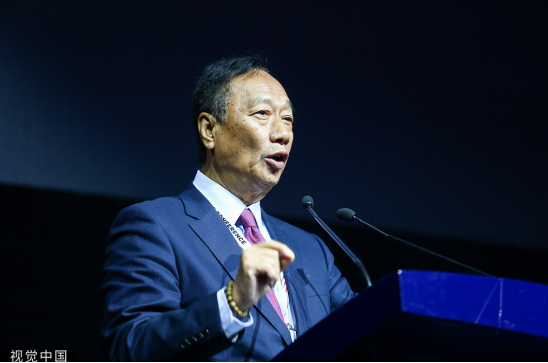

# 恫吓美国？郭台铭突然称台海若发生战争“华尔街股市10秒崩盘”

【环球网报道】据台湾“中央社”2日报道，鸿海创办人郭台铭2日在脸书发文分享与《世界是平的》的作者弗里德曼交流心得。郭台铭称，台湾在世界经济所扮演角色重要性远大于乌克兰，他们两人都同意，若台海发生战争，世界金融市场抵挡不住海啸般冲击。而郭台铭认为，台海若发生战争，只要10秒钟华尔街股市就会崩盘。

_郭台铭 资料图_

报道称，郭台铭2日晚在脸书称，他与作家弗里德曼相谈甚欢，后者弗里德曼今年刚造访北京，试图厘清中美关系僵局究竟所谓何来，并发文称，中美双方在当今世界局势缺一不可，“中国经济崩溃而美国依然能繁荣的想法，根本是天方夜谭”；且认为中美两国“相互竞争是必然，相互合作是必然，找到二者之间的平衡也是必然”。

“台湾在世界经济扮演的角色，重要性远远大于乌克兰”。郭台铭呼应弗里德曼称，只要台湾发生战争，从军事角度也许能够抵挡3个月，但对于世界经济的冲击是巨大的，对华尔街金融秩序的影响是立即的。他还称，“台海若发生战争，不用1个月，甚至不用1小时，只要10秒钟，华尔街股市就会崩盘，世界就会发生天翻地覆的变化。”

对于这个论调，有岛内网友称，“没人希望战争，难道只有郭台铭才不希望战争？别推销恐惧。”

也有网友称，“郭台铭想恫吓美国，事实是台湾需要美国，美国未必需要台湾。”

还有网友表示，台湾地区领导人没有非谁不可，但“没诚信之人”一定不可当。

据此前报道，国民党全代会正式提名新北市长侯友宜参加2024年台湾地区领导人选举后，郭台铭仍动作频频，不仅与多名国民党少壮派“立委”参选人同台，7月23日全代会当天又与花莲县长徐榛蔚、“立委”傅昆萁同框。7月30日他又前往美国争取支持。岛内媒体担忧地表示，无论郭台铭最后是否决定参选，都无益于“下架民进党”。

