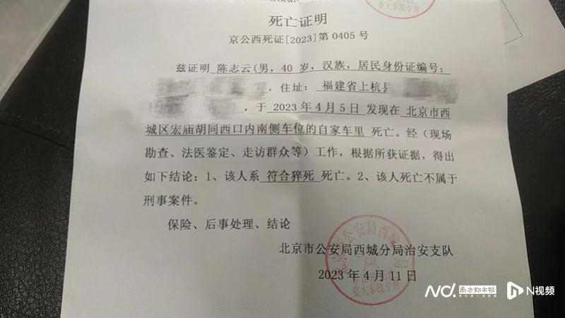
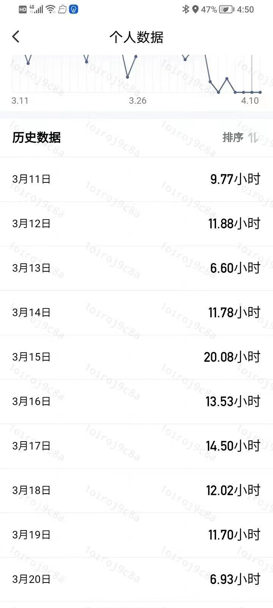
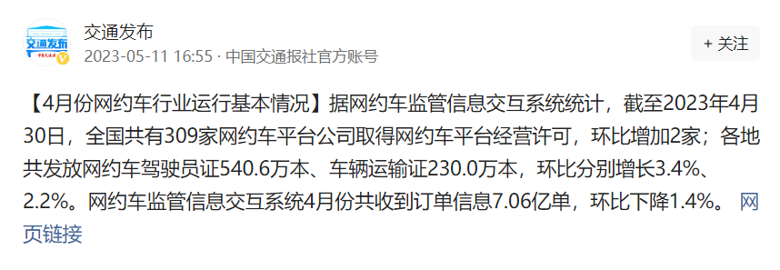

# 网约车司机猝死：曾连续出车24天，平台要求每月出车15天且不能请假

40岁的网约车司机陈志云是突然去世的。

4月3日晚上8点半，陈志云在出车前给妻子发微信“我在天通苑，你睡吧，累吗？”晚上10点46分，平台为陈志云指派了一名乘客的订单，该订单因乘客无法联系到司机而被取消。后台数据显示，陈志云的车开到西城区的一条胡同停下来后，再未移动过。

两天后，警察根据定位找到了陈志云的车，发现陈志云趴在方向盘上，人已没有呼吸。

后台数据显示，从3月11日至4月3日，陈志云已连续出车24天，平均每天出车时长10个小时，最长的一天出车20.8小时。

**发给妻子的最后一条信息**

陈志云与妻子刘火秀都是福建人。20年前他们来到北京做些调料生意。2018年，陈志云听朋友说做网约车司机比较赚钱，就贷款买了一台车，在某平台注册成为司机。

由于陈志云经常要工作到凌晨一两点钟，与妻子作息不同，两人并未住在一起，陈志云住在顺义的一个村子里，刘火秀则住在丰台忙小生意，两人常通过微信联系，丈夫每天出车前都会给刘火秀发微信。

意外是突然发生的。4月3日凌晨，在结束近10个小时的出车后，陈志云回到住处，给自己煮了一碗面，吃过饭就匆匆睡去。下午4点，陈志云醒来准备再次出车，晚上8点半，刘火秀给丈夫发微信询问“你在哪里？”，丈夫回“我在天通苑，你睡吧，累吗？”，这是陈志云生前给妻子发的最后一条信息。

之后，刘火秀给丈夫的信息如投入大海一般，再无回复。4月5日，焦急不安的刘火秀和姐夫一起开车到丈夫在顺义租住的出租屋寻人，被房东告知陈志云已两天未归，刘火秀慌忙报警。

警方从网约车平台调取的信息显示，4月3日晚10点46分，平台为陈志云指派了一名乘客的订单，该订单因乘客无法联系到司机而被取消，陈志云的车开到西城区一条胡同里停下来后，再未移动过。

4月5日晚上8点，警察根据定位找到了陈志云的车，车窗只留了一点缝隙。警察破窗查看，发现陈志云趴在方向盘上，脚搭在副驾驶的位置，两手抱在胸前，已没有了呼吸。

警方出具的死亡证明显示，经现场勘查、法医鉴定、群众走访，可得出陈志云系猝死的结论。

_警方出具的死亡证明。_

**日均接单量12单，评分4.9分**

“我老公跑网约车之后，平时很少休息。”刘秀云回忆，丈夫做网约车司机的五年里，每天至少工作七八个小时，每周最多休息一天。接单数据显示，陈志云在该平台工作共1867天，累计完成订单2.16万，日均接单量12单，评分4.9分。

陈志云生前的3月11日至4月3日，连续出车24天，平均每天出车时长达10小时，最长的一天为20.8小时。

_陈志云生前的出车数据。_

丈夫猝死后，刘火秀联系网约车公司。公司方面表示，如果家属提供接单后24小时内死亡证明材料，可以给予最高20万元的“公益援助金”，如无法提供证明，只能得到一些人道补助。

但陈志云最后一单结束时间为4月3日23时，遗体是4月5日晚被发现，不符合“接单24小时内死亡证明”的要求。

无奈之下，刘火秀辗转找了代理律师，再次来到网约车公司协商。公司方面表示：按照司机与平台的签订的协议，司机与平台只是合作关系，不存在劳动关系，平台没有赔偿义务。

南都记者了解到，陈志云在该平台注册时，曾与平台签订过一份《服务合作协议》，该协议称，“在您接单过程中，我司仅与您就网约车服务发生合作关系”，而对于网约车司机的安全保障问题，该《服务合作协议》提到，“平台将通过个性化的安全保障产品为特定受保障用户（包括驾驶员用户和乘客用户）提供相应的安全保障”。

网约车平台工作人员称，上述协议提到的“安全保障产品”是指公司在订单服务过程中，对于司机和乘客的人身财产安全保障的保险，但陈志云在2021年12月后没有在平台续费购买，导致无法获得保险赔偿。

平台工作人员还表示，“赔偿金额没有谈的空间，最多只能补助六万元”。

**平台要求每月出车15天，不能请假报备**

在刘火秀的代理律师、北京市蓝鹏律师事务所律师李春富看来，网约车平台要求提供“接单24小时内死亡证明”并不合理，平台具有取证能力，可以通过后台数据调取证据，推断陈志云的死亡时间，而家属并没有办法提供相关证据。

对于网约车平台所称的“合作关系”李春富也并不认同。他表示，陈志云从2018年至今年4月，均是在一个平台跑车，也均是由平台负责派单，行驶路线、行驶时长均是平台规定，工资也是平台扣除抽成后发放，因此平台对司机具有实质的管理职责。

例如，陈志云注册的网约车平台有一套严格的为司机评分的机制，还会给司机划定相应等级。分值是根据司机在平台季度内累计口碑值、完成任务及有效平台出车时间等综合计算的，而在如何提升司机分值方式中，出行分是重要方式之一，平台建议司机“通过高峰多出车来提升出行分”。

不仅如此，平台对陈志云还有每月出车时限的要求。刘火秀提供的一份微信群聊天记录显示，平台服务经理陈女士曾在群内提醒司机：“没有任何请假报备一说，所以出车一定要够15天，不然会降级。”

刘火秀称，今年2月初，陈女士再次提醒陈志云春节后早日返京，称“这个月只有28天，早点回来，15日天卡得挺严的。”

就死亡赔偿一事数次沟通未果后，今年5月，刘火秀将平台所在的公司告上法庭，要求赔偿陈志云死亡赔偿金、丧葬费、精神损害抚慰金等各项损失共计350万元。目前，北京市东城区法院已对此立案。

7月5日，网约车平台工作人员联系到李春富，称经考虑，赔偿金额由5万元调整至10万元，被刘火秀拒绝。下午，工作人员再次联系李春富称“免除证明24小时死亡”的义务，可按20万元赔偿，刘火秀再次拒绝。

刘火秀告诉南都记者，丈夫离世后，她要独自抚养两个孩子、赡养老人、还房贷车贷，经济压力很大。目前，她和两个孩子已回到福建老家，送孩子在老家上学，北京对他们来说已成“伤心之地”。

**接单量下降收入减少，高负荷成网约车司机常态**

陈志云长时间出车的高负荷工作状态，是网约车行业的缩影。南都记者随机采访了多位网约车司机，发现他们普遍面临接单量下滑、每公里收入减少的现状。

网约车司机李师傅明显感觉到，与疫情前相比，今年跑车的接单量与到手的钱都有所减少， “以前一天跑12小时，可以挣六七百块钱，但今年只能挣五百多。”

李师傅还表示，活跃度是平台派单的重要衡量指标之一，活跃度越高，司机会越容易接到单，“如果每天跑单时间不长，就很难接到单”。

_“交通发布”4月份网约车行业运行数据。_

据交通运输部发布的今年4月份网约车行业运行数据显示，网约车监管信息交互系统4月份共收到订单信息7.06亿单，环比下降1.4%，而取得网约车驾驶员资格证的司机数量上升了17.7万人。这意味着，单个司机的接单量有所下降。近期还有多地发布网约车市场风险提示称，该地区网约车数量已经饱和。

网约车司机赵师傅没想到，由于达不到A平台单日跑车时长要求，他被平台“踢了出去”。

赵师傅告诉南都记者，两个月前，他在A平台注册了网约车司机，平台管理人员告诉他，每月必须在平台跑够80单，且保证单日至少在线10个小时。后来听说B平台单子大一些，赵师傅同时注册了B平台接单，导致在A平台接单时长达不到10小时，管理人员称其“完不成任务”，禁止赵师傅再在A平台接单。

赵师傅认为，平台的机制基本是在激励、倒逼司机“多跑分”，例如，在线时间长的司机可以获得更高的积分，积分高的司机也会更容易获得平台派单，除此之外，平台对一天不出车的司机还会给予“减分”。

每天出车时间长达十几个小时，赵师傅明显觉得靠跑网约车赚钱变难了。他算了一笔账，如果每天出车收入400元，除去140元的租车费（赵师傅是跟租车公司租用的京牌新能源车），70元充电费，实际净收入只剩不到200元。即使按一个月30天不休息算，一个月到手才6000元。

**劳动关系认定难，监管部门要求杜绝超时劳动**

近年来，网约车司机猝死案件频频进入公众视野，但由于司机与平台之间未签订劳动合同，导致司法维权中面临诸多困境，普遍难以认定劳动关系。

例如，北京市海淀区人民法院 （2020） 京0108民初 334
号民事判决书显示，网约车司机葛师傅在运送乘客期间突然昏迷，与其他车辆碰撞导致死亡，家属向法院请求认定工伤。法院认为，葛师傅与平台之间尚未达到劳动关系中用人单位与劳动者形成的稳定的、持续的、管理与被管理的紧密关联程度，而是相较于劳动关系更为松散、灵活的劳务关系，因此不予认定。

在另一起司机诉平台案件的判决书中，法院也表达了类似的观点，称“网约车司机有权根据个人意愿决定是否接单或者抢单，网约车平台对服务车辆无法实现有效控制，因此不属于劳动管理”。

有学者认为，虽然平台对劳务提供者的控制程度弱，两者之间不成立从属性劳动关系，但平台劳动者也应当受到劳动标准等劳动法律的保护。中国社科院大学法学院教授周宝妹曾撰文称，比照传统出租车司机和出租车企业之间劳动关系的确立，网约车司机和平台企业之间的关系应当“以劳动关系为一般、以非劳动关系为例外”。法律应当承认网约车司机劳动的灵活性，在确认双方之间劳动关系的基础上，通过非标准工时、特殊的社会保险等制度安排保护包括网约车司机在内的出租车司机的权益。

随着互联网经济的发展，网约车运营模式也在发生变化。2017年，高德地图率先推出网约车聚合模式，随后百度地图、美团等也陆续上线了网约车聚合服务。聚合平台被称为“平台的平台”，为其他网约车平台企业提供流量，但是，作为一种新生事物，聚合平台也带来了责任边界不明等问题，网约车司机与聚合平台、网约车平台之间的劳动关系也更为复杂。

南都记者关注到，2021年7月，人力资源和社会保障部等八部门发布
《关于维护新就业形态劳动者劳动保障权益的指导意见》中指出，“对采取外包等其他合作用工方式，劳动者权益受到损害的，平台企业依法承担相应责任”，这在政策层面对平台劳动者权益保护进行了规范。

今年3月，人社部发布了《新就业形态劳动者劳动合同和书面协议订立指引(试行)》，明确企业要与符合确立劳动关系情形的新就业形态劳动者订立劳动合同，与不完全符合确立劳动关系情形的新就业形态劳动者订立书面协议。

网约车司机超时劳动、人身安全等问题也引发监管部门关注。7月26日，交通运输部发布公告称，交通运输新业态协同监管部际联席会议办公室组织对多家网约车平台、聚合平台公司进行约谈，要求平台加强运输安全管理，优化派单机制，杜绝超时劳动、疲劳驾驶、超速驾驶等行为。约谈还要求，加快网约车合规化进程。严把司机和车辆注册关，加快清退不符合条件的人员和车辆。

采写：南都记者 刘嫚 王森 实习生 唐小狄 发自北京

