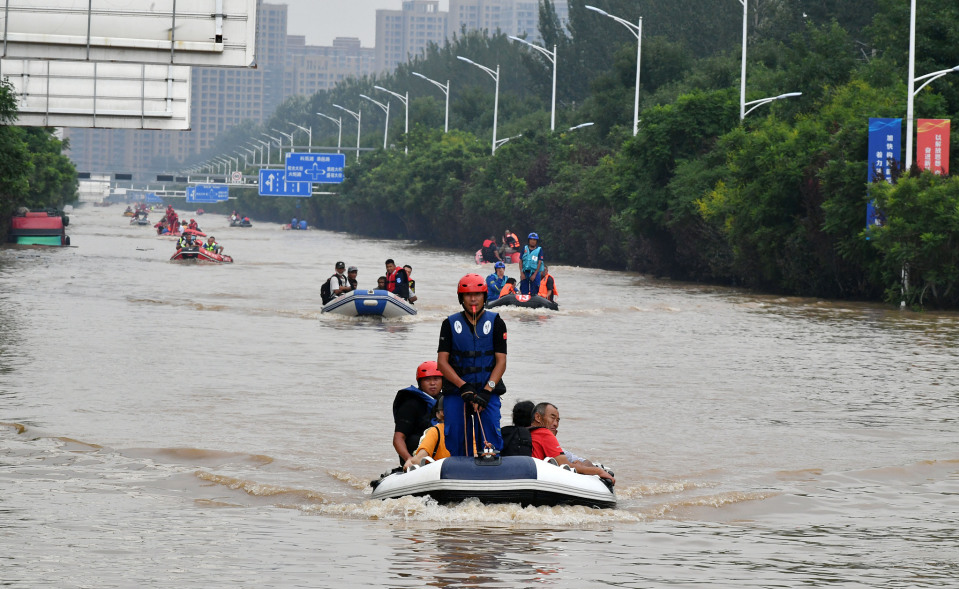
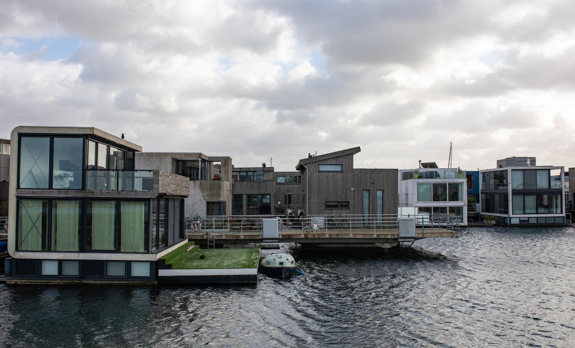
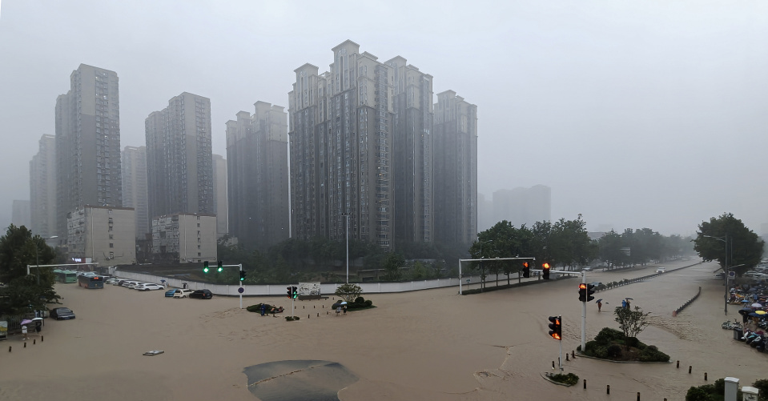
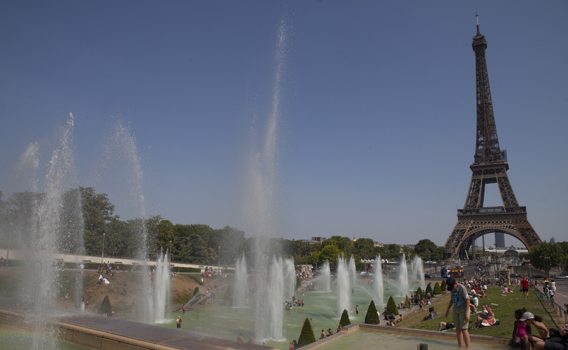
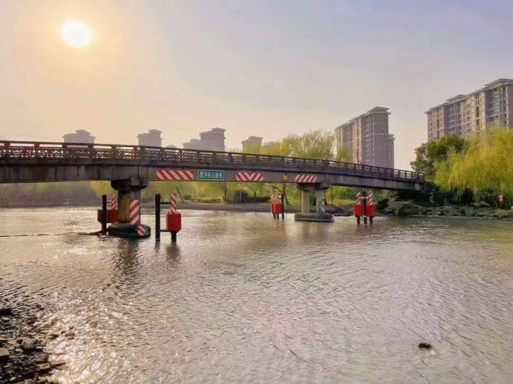
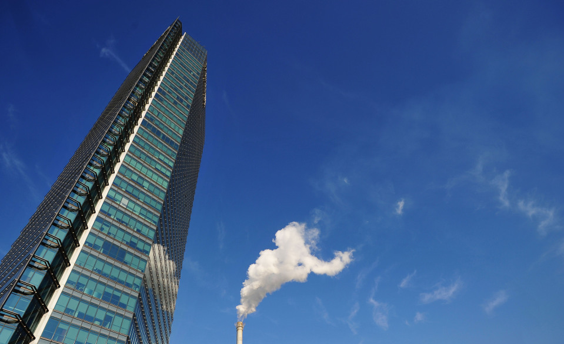

# “不要以为这次暴雨不会再来”，专家：对极端天气莫再抱侥幸心理

台风“杜苏芮”给京津冀地区带来的暴雨和洪水还未消退，网络上随处可见这样的图片：洪水在城市蔓延，甚至即将淹没红绿灯。但在百年一遇的暴雨之前，我们刚经历了有记录以来最曝晒的6月。地球的夏天正变得愈发古怪，让我们回想一下去年这个时节：广东遭遇了百年一遇的洪水，热射病和高温成为多地的高频词，四川和重庆的高温干旱导致了持续多日的电力短缺，重庆的山火蔓延，再往前倒退一年，2021年7月20日，郑州连遭暴雨袭击。

我们不是孤例，全球范围内，从欧洲的高温，到澳大利亚和美国加州的山火，纽约的蒙尘，菲律宾的暴雨，使得我们必须要面对一个事实：极端的气候正在变得愈加频繁。

_涿州暴雨，受灾群众乘坐船只转移 ©视觉中国_

是时候从更长远的角度来思考：如何帮助我们的城市抵御未来可能出现的气候灾害？交通与发展政策研究所（ITDP）东亚区主管刘岱宗先生推崇“韧性城市”的概念，他曾在世界资源研究所工作，也是北京市交通委员会第三届专家委员会委员，他一直致力于关注城市的可持续发展以及城市的规划与设计。既然气候变化已成定势，如果一些灾难不可避免，我们需要让城市在灾难发生后恢复得更快，更有韧性——这是“韧性城市”的核心要义之一。

我们请刘岱宗先生介绍了一些优秀又巧妙的“韧性城市”案例，也向他请教，作为普通人，我们每个人能做什么。他警示我们，不要再抱侥幸心理，以为这一次的暴雨走了，就不会再来，“气候变化的趋势下，大家都在面临同样的风险......一定要有长远的、系统性的规划。”

我们要提供系统性的解决方案

**谷雨：** 您能先介绍下什么是韧性城市吗？

**刘岱宗：**
我们目前的城市建设，对气候变化的准备是不足的。这几年我们总呼吁建立“韧性城市”，韧性（Resilience）城市是指你没有办法阻止城市遭到各种各样的打击，但是你能快速地恢复，就跟弹簧一样。

韧性城市的范畴是非常大的，比如跟气候相关的，包括（如何从）高温、低温、干旱、洪水中（快速恢复），新冠也是，城市（居民）的健康被打击了，你要想办法快速恢复，还包括恐怖袭击，比如911之后如何快速恢复，再比如住房危机、社会不平等，等等。如何抵御极端气候是韧性城市里面非常重要的内容。（注：下文中“韧性城市”专指城市从极端气候中恢复的能力。）

**谷雨：** 那在诸多极端气候里，放眼全球范围，海平面上升、风暴和降雨带来的洪水是其中威胁性最高的吗？

**刘岱宗：**
洪水带来的灾难是可视性最强的。如果我们想打造可以从洪水中快速恢复的韧性城市，就应该分两块，一个是短期应对的、战术性的，水来土挡，交给应急减灾部门。还应该有长期的、战略性的，这个是我们缺乏的。这两年你会发现气候灾害越来越频繁，短期的投入越来越大，但你的下水系统、你的建筑、你的生活方式，是几乎没有改变的。

**谷雨：** 但像一些大城市，它的下水系统已经建成那么多年了，对它改造也不现实吧？

**刘岱宗：** 你可以看看荷兰，这个国家很大一部分国土面积是在海平面以下的，但洪水对它来说压力并不大。它靠的可不是一年又一年短期地应对洪水。

1953年，荷兰爆发了一次非常大的洪水，把国土很大面积给淹没了，之后它痛定思痛，进行整体的改造，用了四五十年，方方面面、全社会系统性的改造。它用了四十年建了马仕朗防洪大坝，是世界上最大的可移动防风暴大坝，它的大小是埃菲尔铁塔倒下那么大。不仅仅是改造河道，你可能觉得这就是水务的问题，对吧？

其实还包括城市的适应性改造。比如荷兰有好多的建筑物是可以漂浮的，它沿着河会修一些建筑，底下有根杆戳到河床底下，当洪水来的时候，你摇杆子那个房子就会慢慢给升起来，洪水走了，房子又可以回归原处。

 _荷兰阿姆斯特丹的漂浮房屋 ©视觉中国_

还有一个重要的方法是提高城市的水储存能力，荷兰城市里的很多建筑都是可以帮你储水的。一个公园可能平时是篮球场，但被设计成雨水天气可以储存雨水，来防止周围的街道被淹没。再比如鹿特丹的“1平方公里可持续屋顶景观城市中心”行动，鼓励居民改造绿色屋顶，也可以提高城市的蓄水能力，还能降低城市温度，增加生物多样性。

看看荷兰，你就知道“逢雨必涝”是可以打破的。

日本也是，很容易受到台风影响，但东京极少出现内涝的局面。你看《唐人街探案3》里那个巨大的地下宫殿，是1992年到2006年间，日本政府投资20亿建的排水系统，用来蓄水和排洪的。平时游客还可以花点钱去参观。它的核心是暴雨来的时候就往那里面储水，然后通过底下的排水隧道和筒仓再把水往城市外围排，整个系统每秒泄洪可以达到7000立方英尺，只需要不到3秒就可以排空一个标准游泳池里的水。

这些都是系统性的解决方案。

_日本埼玉县的世界上最大的下水道系统 ©视觉中国_

**谷雨：** 这里面有个特别好的解决方案，就是修建一些公园的同时，把它作为储水的地方。我看您朋友圈也分享了泰国建筑师Kotchakorn
Voraakhom在曼谷设计城市公园的案例。

她认为“混凝土抗洪”的方法已经落伍了，她在曼谷设计的城市公园不仅是为了美观和娱乐，也是在帮城市处理水。她把整个公园设计成倾斜的，这样地心引力就会把雨水带到低的那一端储存起来。旱季的时候，平时收集起来的雨水可以浇灌公园一个月。她还设计了很多水上自行车让人们去蹬，蹬的同时又可以净化储存起来的水。她说，“当生活给了你洪水，你在水里玩得很开心”，真是很巧妙的设计。

**刘岱宗：** 所以韧性城市是需要全社会一起努力的，不止是水利部门，它干不过来的。市政交通、建筑师都要参与进来。

其实科技公司也可以做许多事，谷歌就做了洪水的地图，叫Global Flood
Mapping，通过一些大的数据分析来看哪里比较容易积水。比如洪水来了，救援队都没办法找路进去，大家也不知道水的深浅，只能空投物资，人出不来。如果有一个洪水的地图对救援是很有利的。

当然我觉得要设计很好的市场机制，到底谁来花钱？我举一个简单例子，纽约洪水脆弱性地图上线后，对房地产影响是非常大的，有的房子立刻就贬值。郑州暴雨后山上的房子也涨价。对个人资产有影响的话，很多人可能就愿意花钱。

_郑州暴雨的十字路口 ©视觉中国_

**谷雨：** 如果一些上游城市提高了储水能力，下游城市的风险会降低？

**刘岱宗：**
打造韧性城市是需要跨区域协同的，洪水来了它可不管行政区域（划分）。我们在一个长三角的沿海城市做韧性城市的项目，它要在自己行政边界内修一个很大的泄洪区，你说沿海城市土地价值多高，与其花这么多钱，不如把钱投资到上游，多修点坝，把河道整治一下，对吧？可能性价比更高，也更有效。

但是它没有这种跨境投资的机制，也没有回补的机制，所以就没办法。随着这两年洪水问题越来越多，我觉得需要政府想明白，大家同心协力，按照流域来做整体的治理，做整体的规划，这是很重要的。

其实大家都在面临同样的风险

**谷雨：** 您刚才说洪水是我们面临的气候灾害中可视性最强的，其实这两年高温也很多发。

**刘岱宗：** 欧洲的高温问题比较明显，每年死于高温的人远多于死于洪水的人，因为它会把很多高温引发的心脏病等都计入进去。

针对高温也有很多韧性城市的举措，比如法国有个凉岛规划，它要保证任何一个人步行7分钟，能找到一个降温的地方。有可能是公园，有可能是有顶棚的公交车站，或者是图书馆、喷泉。巴黎重修了很多喷泉，加了喷雾功能，就是帮助降温的。政府部门还专门做了一个APP，你可以快速在上面找到降温点。这也是系统性的解决方案，至少你别在公共场所热晕了。

_2022年7月，法国巴黎气温突破40摄氏度，民众在喷泉池内解暑降温 ©视觉中国_

纽约有一个叫清凉屋顶的项目，特别便宜，就是在最容易受热的社区安装反光屋顶或者在侧面涂反光涂层，它把太阳光就返回到天空里去，经评估，夏天建筑物内部的温度最高可以降低30%左右，节约10%-30%的空调开支。这都是一些很有趣味的解决方案。

城市河流的改造也很重要，芝加哥有个“野生一英里”项目，是把一个功能性的工业河流改造得具有生态性，从而改善城市热岛效应。北京的亮马河也是如此，可以帮助沿岸降温。

**谷雨：** 听起来是不同国家各有各的优点。

**刘岱宗：**
反正就是大家互相学习，你总能够学到一些有意义的东西。国内在抵御洪水这块，长三角地区跟珠三角地区是做得还不错的，深圳、广州、宁波、上海、苏州，这些地区又有钱，又在下游靠海。

有一些很好的案例，比如浙江境内的瓯江下游航道建的防撞墩，就是桥的主墩前面还有一个墩子，用来阻挡上游漂下来的房子、船什么的，防止把桥墩给弄坏了。就是防撞墩可能没那么好看（笑）。上海松江的洞泾镇也修了保护桥墩的“护膝”，要好看一点，但是不如前一个经撞。

 _上海松江洞泾镇为9座大桥戴上“护膝” ©洞泾镇分中心_

我们的很多基础设施是缺乏对洪水的韧性的。尤其要提高出行交通体系的韧性，对抗洪水的冲击能力，淤泥、坡度、排水，都要考虑。铁路、机场以后的修建，都要考虑越来越多变的气候。

**谷雨：** 而且北方城市也该提高警惕了。

**刘岱宗：**
其实这些东西每到夏天就会有人来找我聊，郑州暴雨过后也是，我们也在公众号推了很多韧性城市的案例，然后一过了夏天，大家就忘了，老有下一个气候灾害不会发生在自己身上的侥幸心理。等下个夏天来了，还是那些应急的措施，没有长期的战略。

现在气候变化的趋势下，其实大家都在面临同样的风险。

我们打造韧性城市的速度还跟得上气候恶化的速度吗？

**谷雨：** 您一直以来提倡的绿色出行，其实是另外一个层面，是从根本上缓解气候问题的。

**刘岱宗：**
对，气候它分两个，长期叫气候问题，短期叫气象问题，现在气象问题越来越频繁，肯定是因为根基变化了，也就是长期的气候发生变化了。根本之道还是解决气候问题，而交通是第二大（温室气体）排放源，仅次于能源系统。所以绿色出行是帮助我们从根本上解决自然灾害的。

**谷雨：** 除了韧性城市，这两年还总谈一个词语叫，“气候适应性社区”？

**刘岱宗：**
气候，一方面是减缓，大家都知道，减排二氧化碳就能减缓升温。另外一个叫适应，我举个例子，如果把所有排碳的都转移到东南亚，转移到非洲，我们就碳中和了对吧？

_碳排放 ©视觉中国_

但是你会发现地球仍然会变暖，海平面仍然会上升。“气候减缓”是你做好自己的工作，“气候适应”是你做好自己工作的基础上，可能别人做的慢了或者不如你了，仍然提高了气候恶化的风险，你要做好适应，要做好防御。

欧洲好多城市很接近碳中和了，但是他们还是要投入很大资金来做适应，因为它知道自己做得再好没用，你还是要提升你城市适应气候变糟的能力。

**谷雨：** 打造气候适应性社区，其实也就是韧性城市中抵抗气候变化的部分，这和节能减排，哪个更重要？

**刘岱宗：**
“气候减缓”必须要做，而且它是掌握在我们手里的。我们是最大的排放国，所以我们必须要把气候减缓解决掉，而“气候适应”是我们决定不了的，我们归零了，人家使劲排，所以“气候适应”是防御性的。一个主动性一个被动性，你说哪个重要，我觉得都挺重要的。“气候减缓”是要国际一起努力的，“气候适应”是我们自己的事，没有别的国家来帮你做适应。

**谷雨：** 我们普通人能做些什么呢？

**刘岱宗：** 普通人能做好多呢，比如你衣服尽量减少购买，或者每件衣服尽量能穿的时间更长一点，然后你的出行是用绿色出行，尽量地使用可再生能源。

未来我们要鼓励大家使用可再生能源，比如说把各种电器的使用都放在风能或者光伏比较高峰的时候，比如说在风电比较充裕的时候，你用微波炉热东西，然后再保温就好了。

_绿色出行 ©视觉中国_

**谷雨：** 我怎么知道什么时候风电能源比较丰富？

**刘岱宗：**
所以欧洲就推出了一个智能电表，它走字是按照碳排放走，比如光伏多的时候，它就3毛钱，火电的时候，它可能就贵，5毛钱，它利用价格来引导你的消费行为。以后人工智能也可以介入，你电饭煲接上，给它设定碳费便宜的时候自动启动，帮你把饭做了。手表、汽车充电都是一样。

我们也可以主动拥抱不同的消费行为，所以未来我们需要各种碳标签，比如我买了一双鞋子，“碳标签”显示从制造到运输到我手上，一共耗了230克碳，买另一双鞋子是260克碳，那我就买230克的鞋子，对吧？

国外专门有那种带碳标签的超市。未来可能就像粮票一样，你去超市，我给你两公斤碳票，在这个范围内你买东西免费，超出了，你就额外付钱。

**谷雨：** 我们打造韧性城市的速度还跟得上气候恶化的速度吗？

**刘岱宗：**
《巴黎协定》达成共识，长期目标是全球平均气温较前工业化时期上升幅度控制在2摄氏度以内，并努力把温度上升幅度控制在1.5度。现在大概已经升了1.2度-1.3度，很多科学家已经不太乐观，认为1.5度是保不住的。

但1.5度有个好处，就是你哪怕突破了，大家努力还是能把它拉回来。但两度或者三度就很难了，它就会继续升温下去。

我本来是不太乐观的，但自打2021年我们设立了“3060目标”，就是二氧化碳排放力争2030年前达到峰值，力争2060年前实现碳中和，我还是抱有积极心态的。“3060目标”肯定将在我们生活方式转型上面起到引领作用，是一个很大的战略机遇。我们的新能源汽车现在就搞得不错，也差不多搞了十五六年了，所以一定要有长远的眼光做事。

作者 | 荆欣雨 编辑 | 张瑞 出品 | 腾讯新闻 谷雨工作室

版权声明：腾讯新闻出品内容，未经授权，不得复制和转载，否则将追究法律责任。

