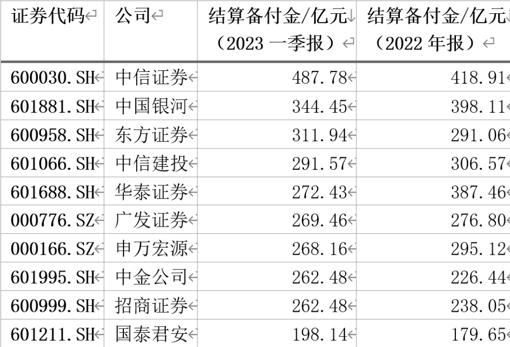

# “股市降准”，市场预估释放资金量超200亿，牛市要来了吗？

_来源：视觉中国_

特约作者 | 温世君

编辑 | 陈弗也

出品 | 棱镜·腾讯小满工作室

7月24日，中央释出了“要活跃资本市场，提振投资者信心”的信号，这是一个并不常见的表述，被外界视为“政策底”的一种表现。

时下，上证指数从3164.16点上探至3300点大关附近，已经上攻了一段时间的资本市场进入了“三根红线改变信仰”的关键时刻。在此前的几轮股市周期中，券商股往往是市场反弹的先行者，具有标杆意义，此次也不例外。

8月3日深夜，一则针对券商的利好政策出台，引发资本市场的关注。

中国证券登记结算有限责任公司（以下简称“中国结算”）发文称，2023年10月起，降低股票类业务最低结算备付金缴纳比例，由现行的16%调降至平均接近13%。同时，实施股票类业务最低结算备付金缴纳比例差异化安排。

这意味着，在券商股票交易中，无论是自营交易还是作为股票经纪方，均需在中国结算缴纳的“保证金”降低了，券商可以支配的资金提升了。

因此，市场把此举称为“股市降准”，并预测，释放资金量超过200亿元。

_图：万得券商指数与沪深300指数变化情况 来源：wind_

**无成本释放资金**

受这一消息的影响，8月4日开盘，券商股开始加速上攻。

万得券商指数突破10000点。截至8月4日收盘，东方财富成交量突破200亿，中信证券、太平洋超100亿，信达证券、首创证券涨幅突破10%。

在当下的时间点选择降低股票业务备付金，被外界视为有“呵护市场”的意味。

7月下旬以来，中央及各部委、地方政府迅速出台了经济纾困、利好政策，对于A股来说，资本面也逐步改变了观望、短线操作的策略，开始为一轮新的牛市做准备。

但从外围来看，压力依然存在，美国经济数据尚未出现明显转向，美元降息周期也并没有如部分市场预期的那样到来，对非美元资产价格的压制尚未缓解。从国内来看，地产、金融的市场部分风险事件依然在暴露，对于“比黄金更重要”的市场信心，刚有恢复的苗头。

在这样的情况下，关怀、呵护是当下政策面的必然选择。

市场是资金的集合，对市场最有效的支持，就是资金的支持。

此次中国结算发布的消息，则提出明确要求，降低股票类业务最低结算备付金缴纳比例。这次“股市降准”的本质和目的，和银行降准非常类似，就是通过释放一部分被“锁定”的资金，降低交易成本，提升市场流动性，进而提升资产价格，带热股市，实现正向循环。

事实上，“放出”的这些资金本来就是在市场上的资金，几乎没有成本。

**头部券商，获益更多**

这一次“股市降准”，其实也是系统性货银对付（DVP，Delivery Versus Payment）改革的一部分。

DVP，简而言之，就是一项保证证券交易钱货两清交易安全的制度，备付金是这个制度中较为关键的环节。2019年底，中国结算将股票类业务最低结算备付金收取比例由20%降至18%。2022年1月，证监会启动DVP改革。同年4月，这一比例又降至16%。

今年4月，中国结算再次发布消息称，在将缴纳比例降至16%的基础上，拟正式启动缴纳比例差异化调降，“预计需要2个月准备时间，正式实施时间将另行通知。”

4个月后，靴子落地，根据中国结算发布的规则，股票类业务最低结算备付金缴纳比例根据资金收付时间点不同而进行差异化收取：9点前、11点前和11点后对应的付款比例分别由14%、16%、18%调降至13%、15%和16%，取款时间在9点前和9点后对应的取款比例分别由18%、14%调降至16%和13%。

这是一种更为细化的监管思路，对于券商而言，精准到小时的差异化收取比例，为精细化资金运营给出了腾挪空间。毕竟资金的时间价值，就是金融最为底层的意义。

特别是在整个市场估值处于相对低位，券商业务蓄势待发的当下，如何匹配新的备付金规则，升级资金调配效率，进而实现自身利润率、市场竞争力、客户满意度的同步提升，已经成为必选题。

_图：结算备付金前十位的券商。来源：Wind，作者绘制_

对于交易体量更大的头部券商来说，这种资金的释放方式可能有更好的加持作用。

券商的交易量越大，被锁定的备付金就越多，释放出的资金也就越多，很显然，这又是一个强化马太效应的因素，叠加人才、运营、管理方面的优势，券商头部效应在此规则落地后或许会越发明显。

（本文仅代表作者观点，展示市场信息，不作为投资理财建议）

