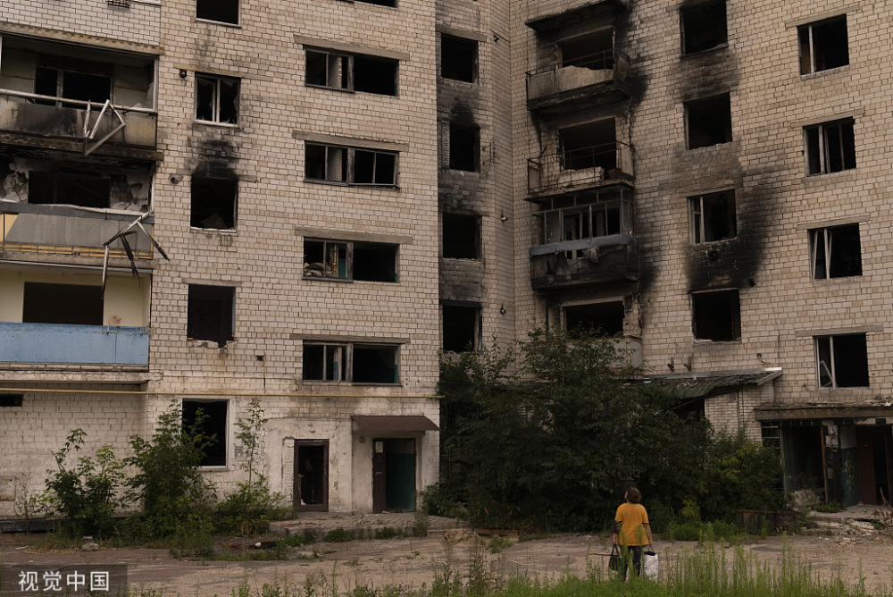

# 【环时深度】俄乌冲突肥了美军工五巨头

【环球时报记者 黄兰岚 环球时报特约记者
李静】7月31日，五角大楼宣布与美国军工巨头通用动力公司的一家子公司延长此前签订的合同，让该公司继续提供“艾布拉姆斯”主战坦克的维护服务。这份价值3380万美元的合同，只是通用动力因俄乌冲突获得额外收益的冰山一角。冲突虽然给俄乌两国带来了严重的人员和经济损失，却让美国军工巨头及其所属的军工复合体获得巨额利润。美国军工复合体发战争财可谓人尽皆知，就连该国资产管理巨头贝莱德公司的一名员工都表示，战争对生意“可太有好处了”。

**乌克兰和欧洲都没少买**

在美国阿肯色州卡姆登市的市中心，大量店面关门。从外向一些店里看，里面光线十分昏暗。这里昔日的繁荣已经不复存在，取而代之的是落寞和萧索。不过，距离这里仅10分钟车程的高地工业园区却是另一番景象，人员熙熙攘攘，车辆来来往往，忙着将这里生产的“海马斯”多管火箭炮系统、大口径弹药等运往其他地方。

20多年来，卡姆登经济不景气、人口外流严重。俄乌冲突的爆发及持续给这个拥有多家兵工厂的城市带来了“机会”，这里甚至出现了“用工荒”。卡姆登的“枯木逢春”是俄乌冲突爆发后美国军工企业及其所属的军工复合体“欣欣向荣”的缩影。

_当地时间2023年8月2日，乌克兰博罗江卡，一名妇女停下来查看一栋在俄罗斯袭击中严重受损的公寓楼。（视觉中国）_

所谓“军工复合体”是指由美国军方、军火制造商、国会议员、国防科研机构、智库、舆论界等组成的庞大利益集团，是一个隐秘的超级利益集团联盟。美国的军工五巨头，即波音、通用动力、洛克希德·马丁、诺斯罗普·格鲁曼和雷神，就是这一集团的重要组成部分。在20世纪90年代，美国有51家大型国防承包商，而现在仅剩5家，而且美国国防部大多数合同都给了这5家企业。

根据德国在线数据平台Statista的数据，俄乌冲突爆发前，乌克兰很少从其他国家购买武器，而2022年却突然成为世界第三大武器进口国，在美国主要武器出口目的地中排名第五。美国国务院今年1月25日公布的2022年美国对外武器销售数据显示，美国军工企业去年直接向外国政府出售的武器和军事装备达1537亿美元，较2021年增长约48%。美国国务院承认，对外军售额的显著提升在很大程度上源于俄乌冲突升级以来美国对乌克兰持续的武器输出。

“它们正在‘乘风破浪’。”美国智库昆西治国方略研究所高级研究员哈通表示，俄乌冲突是美国军工五巨头的巨大利润来源。据美国《连线》杂志今年7月9日报道，自俄乌冲突爆发以来，美国给乌克兰的安全援助拨款超过480亿美元。美国《国家》杂志等媒体报道称，军工五巨头每年能从五角大楼获得价值超过1500亿美元的合同，占五角大楼总预算的近20%，而俄乌冲突给这5家公司带来了更多的合同。2023财年，美国的国防预算为8580亿美元，而国内军工企业获得了其中的4000亿美元。最近，美国参众两院通过了2024财年国防授权法案，规定国防预算为8860亿美元。有媒体预测，近一半的国防预算将流向武器制造商，这样美国就可以“保持对中国的军事优势”，同时持续关注俄乌冲突。

合同的增加让美国军工企业产量大增。据澳大利亚广播公司报道，洛克希德·马丁公司将“标枪”反坦克导弹的产量从每年2100枚增加到了近4000枚，而其“海马斯”多管火箭炮系统的产量从每年60套升至96套。

拜俄乌冲突所赐，美国军工五巨头中除了波音公司因所谓的“供应链问题”市值缩水外，其他4家公司的股价和市值都大增，其中诺斯罗普·格鲁曼公司、通用动力公司、洛克希德·马丁公司和雷神技术公司的股价2022年分别增长了37%、26%、24%和17%，市值分别增加了164亿美元、108亿美元、160亿美元和148亿美元。

除了乌克兰，美国军工企业还从欧洲国家获利不少。据美国“政治新闻网”报道，许多欧洲国家正在购买雷神公司和洛克希德·马丁公司生产的“标枪”反坦克导弹，波兰今年签署了一项价值14亿美元的合同，购买116辆M1A1“艾布拉姆斯”坦克，斯洛伐克正在购买F-16战斗机，罗马尼亚正在就购买F-35战斗机进行谈判。2022年，中西欧国家的军费开支增长了13%，达到3450亿美元，是冷战结束后的最高值，而这其中很大一部分用于购买美国装备。

斯德哥尔摩国际和平研究所的统计显示，近期许多欧洲国家的军费开支一半以上流向美国公司。美国智库保卫民主基金会则估算认为，从乌克兰危机升级到2022年年底，美国军工企业从伙伴国家获得的军售订单总价值近220亿美元。美国国防部去年8月专门成立一个工作小组，由五角大楼的政策办公室及其采办和保障部门共同领导，负责评估并加快执行对外军售。

**入则为官，出则为商，穿梭套利**

为了把更多的钱装进口袋，美国军工复合体将自己的利益诉求伪装成国家利益，通过各种方式影响政府制定政策，包括资助游说者和智库，通过“旋转门”雇用前政府官员等。

俄乌冲突期间出现了一个有趣的现象：美国一些著名的游说公司无偿为乌克兰服务，代表基辅对美国政府进行游说，推动华盛顿加大对基辅的军事支持。在他们所谓“人道主义援助”乌克兰的借口背后，是打得山响的算盘。据英国《卫报》、美国《纽约时报》等媒体报道，俄乌冲突爆发前，在美国无偿为乌克兰进行游说的公司有11家，而现在这一数字上升到了25家。美国名为BGR政府事务的游说公司就是一个例子。该公司从2022年5月开始为乌克兰进行无偿游说，而这是为了自己的军工企业客户。雷神公司就是其中之一。BGR政府事务公司去年从雷神公司获得了24万美元的报酬。

资助智库是美国军工复合体加大宣传并影响政府决策的方式。昆西治国方略研究所6月发布的一份报告显示，在美国27个可以确定捐助者的智库中，有21个获得了军工企业的资助。该报告还发现，美国媒体“过度依赖”由军工企业资助的智库的评论。报告称，在有关美国与乌克兰的文章中，媒体引用这些智库的次数是“不接受军工企业资助智库”的7倍。

更不用说臭名昭著的“旋转门”机制了。在这种机制下，美国国防部门官员、国会议员及相关工作人员“入则为官，出则为商”，不断穿梭以实现政治套利。即使是在职期间，这些人为了以后的利益也会优待军工企业。有数据显示，为了能从国防预算中多分一杯羹，美国军工企业2022年雇用了820名注册说客游说国会，而这一年前三季度的游说费用就达到1.01亿美元。

据美国“公开的秘密”网站透露，过去20年，为影响国防政策，美国军工企业仅游说就花了25亿美元。2014年至2019年，包括美国前防长马蒂斯等在内的1718名国防部高级官员或者采购官员跳槽到军工企业。美国联邦参议员、民主党人沃伦的办公室4月发布的一份报告则显示，美国近700名前高级政府官员现在为军工企业工作，其中包括前将军。报告称，波音、雷神和通用动力分别聘用了85名、64名和60名前政府官员担任高管或说客。

**流血的世界养肥美国1%的人**

在第一次世界大战之后，美国成为全球第一工业强国。二战结束后，军工复合体逐渐兴起。1956年，美国知名政治学家米尔斯出版《权力精英》一书，首次从学术角度讨论军工复合体。1961年，时任美国总统艾森豪威尔在离任演说中警告说，强大的军事组织与庞大的军工企业的“联姻”是美国历史进程中的一个新现象，美国必须防止军工复合体有意或无意地获得不应有的影响力。有学者警告说，美国军工复合体不仅决定着武器的研发、采购、部署，还决定着谁是美国的敌人。

美国军工复合体大发战争财，却给世界以及美国本国留下巨大隐患。军事专家警告说，从长远来看，大量致命武器和人工智能设备和系统源源不断地流入乌克兰，可能会对乌克兰人民的安全和隐私构成严重威胁。据美国媒体报道，至少有38个人权组织公开反对向乌克兰转让集束炸弹。集束炸弹被100多个国家禁止。中国社科院美国研究所副所长袁征告诉《环球时报》记者，集束炸弹可能几十年后还会突然爆炸，或将造成更多无辜的伤亡。

英国“分析者”新闻网报道称，在俄乌冲突爆发之前，乌克兰就已经是欧洲最大的武器黑市之一，未来冲突结束后，西方向基辅提供的武器可能带来安全隐患。报道提醒说，美国提供给乌克兰的军事装备可以使用几十年。有学者担心这些武器如果流入黑市，可能落入不法分子或者恐怖分子手中，进一步助长暴力。袁征表示，这对乌克兰和世界安全来说，是个潜在的不确定因素，没有人能知道这些武器最后会落到谁手里。他批评说:“美国不会关心这些流入乌克兰的武器是否会给乌克兰乃至世界带来灾难。”

除了威胁世界安全外，军工复合体也给美国自己带来不少问题。“休克疗法”之父、美国哥伦比亚大学可持续发展中心主任萨克斯发文称，2000年，美国政府债务为3.5万亿美元，相当于当时国内生产总值（GDP）的35%。2022年，美国政府债务约为24万亿美元，相当于GDP的95%。萨克斯表示，美国政府债务飙升的一大原因是它沉迷于战争和军事开支。根据美国布朗大学沃森国际和公共事务研究所的数据，从2001财年到2022财年，美国的战争成本高达8万亿美元。根据美国国会预算办公室的数据，如果目前的政策保持不变，到2052年，美国债务将达到GDP的185%。

这将对美国其他领域的发展造成极大影响。美国《雅各宾》杂志发文称，在军工复合体的主导下，大量原本可以在清洁能源、基础设施等领域创造更多价值的资金被投入军工行业，“这是军火商们喜闻乐见的政策，只服务于社会顶层1%的人的利益”。

美国反战人士和时事评论家多尔说，美国的敌人不是别人，而是“掠夺了这个国家数万亿美元的军工复合体”。复旦大学美国研究中心教授张家栋称，美国军队和武器的规模已超出其维护国家安全的需要，华盛顿对军工企业的过度重视将导致更激烈的军备竞赛，并破坏本已脆弱的大国关系，“这对世界和平与稳定来说，不是个好消息。”

