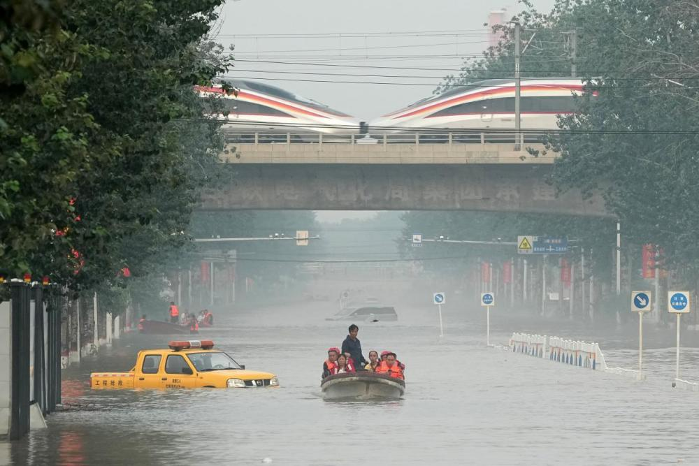
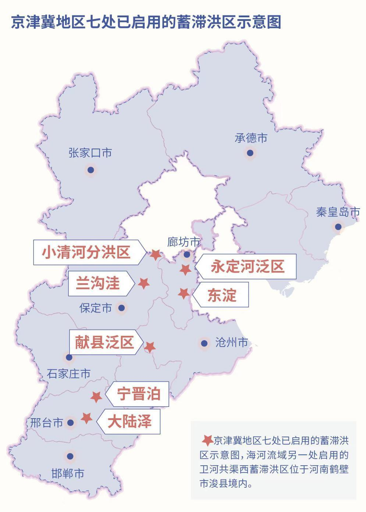
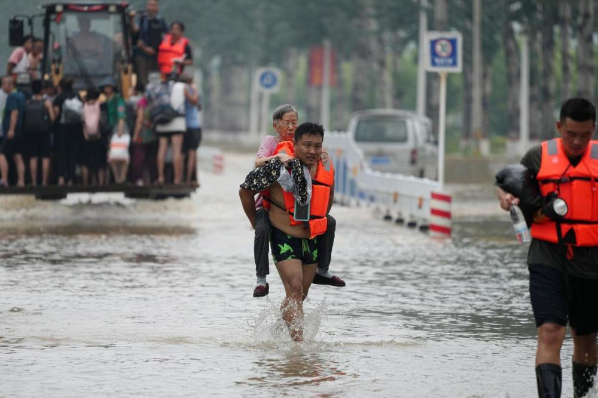

# 专家释疑蓄滞洪区：河北涿州何以“保全大局，牺牲局部”

_2023年8月2日，涿州民众乘坐船只转移。（人民视觉/图）_

从2023年7月29日始，在北京140年来最强暴雨的冲刷之下，一场洪水突袭京津冀。北京河流全面行洪，洪水涌向河北平原，河北省涿州市等地成为洪水重灾区。

与洪水同样汹涌的，是“上游泄洪下游受灾”的网络争论。

“水都是从高处往下流的，不能说下游受淹就是上游的问题，上游也不能建个闸把水全部拦住。”8月2日，水利部海河水利委员会国际合作与科技处处长张存龙向南方周末记者解释。

在涿州被淹成为全网关注点后，一个较为陌生的专业词汇“蓄滞洪区”亦开始进入公众视野。

7月31日，河北13个蓄滞洪区陆续启用7个，分别是大陆泽、宁晋泊、小清河分洪区，兰沟洼、东淀、献县泛洪区，永定河泛区。

中国水利水电科学研究院防洪抗旱减灾工程技术研究中心洪水管理部主任李娜介绍，蓄滞洪区主要指河堤外临时贮存洪水的低洼地区及湖泊等，是一个不可或缺的防汛“底牌”。历史上的蓄滞洪区一般都在比较低洼的区域设立，即经常被洪水淹没或有淹没可能的区域，启用后达到削弱洪峰蓄滞洪水的作用。

短短三天时间，如此大规模启动蓄滞洪区，在多位受访者看来，这都是历史上很罕见的举措。京津冀洪水防御应急响应四天连升三级，从7月28日的Ⅲ级应急响应，到8月1日升至Ⅰ级。泄洪刻不容缓。

8月1日，中国水利报社官微“中国水事”表示：“当洪水太大，超过堤防防御能力时，启用蓄滞洪区蓄滞洪水便成为防洪的必然需要，这也是为保全大局，而不得不牺牲局部的全局考量。”

“不能说下游受淹就是上游问题”

汹涌洪水之下，涿州这座拥有65万人口的北方小城，一夜之间成了一片汪洋。据涿州市委宣传部官微“涿州发布”，全市受灾人数已达15万人，受灾村居146个，面积225.38平方公里，经济损失不可估量。

泄洪这一说法由此进入公众视野并引起争议。

“我们说的泄洪，一般指水库泄洪，但北京永定河官厅水库以下没有大型水库。”中国人民大学环境学院教授沈大军向南方周末记者介绍，北京门头沟之所以被洪水淹没，也是因为缺乏大型水库的拦蓄。“当降水量太大时，在没有拦蓄的情况下，山区降水直接形成大洪峰，向下游排泄。”

从地图来看，涿州处于燕山山脉山前区，从北京到涿州，地势一路降低。另一方面，涿州水系发达，当上游的洪水从山区灌下来，拒马河、大石河、永定河都变成了行洪道，三个方向的洪水一齐涌向地处平原的涿州地带。

“这场降雨上游主要在山区，山区渗雨量少，降雨强度较大，呼啦一下就汇流出了山，流到平原。”张存龙介绍，这一位置使得涿州面对洪水措手不及，洪水发布预警时间有快慢，各地方政府提前都应该做好预案。“但涿州紧邻山区，山区洪水来得速度太快，有可能来不及撤离人员，水就到门口了，预警时间太短。”

7月30日，涿州市启动防汛I级应急响应，次日，大清河水系在涿州市内的拒马河张坊水文站，流量涨至1610立方米/秒，涿州市防汛抗旱指挥部即刻发布北拒马河红色预警，已经来不及了。

一位涿州市大马村的村民在接受媒体采访时称，洪水来临前村干部在群里发了泄洪通知，“但并没有强调原因和具体危害，没有强制转移，所以很多人没当回事”。

反之，处于下游的天津东淀蓄滞洪区的预警时间就相对长一些。8月1日凌晨2点，天津决定启用东淀蓄滞洪区大清河以北部分，当日开始撤离滞洪区内居民。但洪水预计在一个星期后才能到天津，预警期与涿州相差甚大。

此次洪水漫过的海河流域，总面积约1.04万平方公里，总容积约198亿立方米。海河主要支流均发源于太行山和燕山山区，流经华北平原，注入渤海。

值得注意的是，在整个海河流域内，山区河道与平原河道几乎直接相连，山区河道坡陡流急，平原河道坡小流缓，洪流进入平原受到阻塞，常漫溢泛滥，而位于山前平原前沿附近的低洼地带就成为滞蓄洪水的天然场所。经过自然演变和人工整治，逐步形成现在的平原区多处蓄滞洪区。这些蓄滞洪区在汛期发挥滞洪削峰作用，为下游河道安全泄洪提供条件。

_（梁淑怡/图）_

31日23时30分，河北省决定启用兰沟洼蓄滞洪区分滞洪水。兰沟洼蓄滞洪区地处大清河水系北支中游，面积228平方公里，滞洪量3.23亿立方米，为大清河系北支超标准洪水滞洪洼淀，承担分滞白沟河、南拒马河洪水，减轻雄安新区防洪压力的重要任务。

小清河蓄滞洪区和兰沟洼蓄滞洪区均有一部分正处在涿州市内，这也是涿州灾情加剧的一大原因。8月1日，“涿州发布”称，为展开两个蓄滞洪区启动工作，已转移群众超过十万人。

“小清河是一条细条型的河流，需要承纳永定河和北拒马河的一些洪水，小清河分洪区要起到滞洪作用，洪水下泄到大清河下面的东淀，从上到下流是一个流程，水总得往下游来。”张存龙分析。李娜也向南方周末记者印证了这一点。“涿州灾情比较严重的地方，在小清河分洪区，那里本身就是一个蓄滞洪区，按照整体的流域防洪安排，在洪水达到一定量级时就要启用。”

“牺牲局部，保全大局”

《国家蓄滞洪区修订名录》显示，中国有98处国家蓄滞洪区，总面积约3.4万平方公里，总蓄洪容积约1067亿立方米。其中，长江流域44处、黄河流域2处、海河流域28处、淮河流域21处、松花江流域2处、珠江流域1处。

依据防洪法规定，当流域内发生流域性较大洪水时，洪水泛滥可能淹及的地区就是防洪区，分为洪泛区、防洪保护区和蓄滞洪区。洪泛区是指尚无工程设施保护的，洪水泛滥所及的地区；防洪保护区是指在防洪标准内，受防洪工程设施保护的地区。

而蓄滞洪区主要是指河堤外洪水临时贮存的低洼地区及湖泊等，包括行洪区、分洪区、蓄洪区和滞洪区。

行洪区指天然河道及其两侧或河岸大堤之间，用于宣泄洪水的区域，作用在扩大行洪断面，增加泄洪能力；分洪区是利用平原区湖泊、洼地、淀泊修筑围堤，或利用原有低洼圩垸分泄河段超额洪水的区域，即备用河道，负责分散洪流，也称分洪河道或分滞洪区。

_（人民视觉/图）_

沈大军向南方周末记者举例：“我们目前看到天津的一条条减河，实际就是行洪的河道，也称排水河，因为已经下完雨，现在水利部门的主要任务就是把这团水送到渤海里去。”

严格来说，蓄洪区和滞洪区是分洪区发挥调洪性能的两种类型。“蓄，是把洪水装起来，可能达到一定程度，会将洪水当作水资源留住再利用；滞，指暂时留下来，让急流缓一缓，一旦条件允许，就让水流下去。”水利部防洪抗旱减灾工程技术研究中心原总工程师黄金池介绍，当河道的洪水达到一定水位，启用蓄滞洪区，把一部分洪水先留住，减轻下游河道的泄洪负担，保证下游防护对象的安全。“有些人工水库我们叫它蓄洪区，蓄洪再利用，因为我国不仅仅有水灾，旱灾没水也是个问题。”

于2021年2月1日起施行的《河北省蓄滞洪区管理办法》显示，河北省列入国家蓄滞洪区名录的包括永定河泛区、小清河分洪区、白洋淀、东淀、文安洼、贾口洼、献县泛区、宁晋泊、大陆泽、盛庄洼、兰沟洼、永年洼、大名泛区等13处蓄滞洪区。

在沈大军看来，处于流域中下游的蓄滞洪区，作用实际相当于水库，蓄滞河道里面的水量，削减洪峰流量，将泄洪时间拖长。“这次洪水出了北京，就走到蓄滞洪区这一步。因为下游河道行水能力不足，水排不出去，这时候如果不启动蓄滞洪区，靠河道硬排，洪水灌入人口稠密的平原区，会出很大问题。”

多位受访者向南方周末记者介绍，蓄滞洪区的启用跟洪水大小直接相关，洪水大，蓄滞洪区启动的可能性相对高，所有启动程序在《海河防汛抗旱总指挥部防汛应急响应预案》和《水利部海河水利委员会水旱灾害防御应急响应工作规程》中均有明确规定。

“蓄水洪区启用与否要按照提前制定的调度方案，根据洪水流量、水位或工程情况，综合来判断蓄滞洪区是不是达到启用条件。”李娜记得，海河流域在2021年“7.20”郑州大水时，也启用了11个蓄滞洪区，“2021年和今年运用得比较多”。

黄金池告诉南方周末记者，从国家的角度看，建不建蓄滞洪区跟保护对象的重要性直接相关。“如果要保护的对象非常重要，考虑到相对高标准的安全，就对应建设蓄滞洪区，以备不时之需。”

本质上，蓄滞洪区的启动相当于牺牲一小部分人的利益，保全大部分人的利益，目标是将整个流域的损失降到最低。

相应的，蓄滞洪区经采用后，国家也要对区域内居民的损失进行补偿。8月1日，水利部水旱灾害防御司也表示，蓄滞洪区内居民“舍小家、保大家”，为流域防汛作出了贡献，会依法得到补偿，确保尽快恢复生产生活。

黄金池介绍：“蓄滞洪区内，一般不容许特别重大的国家建设在里面发展，但是容许一般的普通的社会经济发展。例如人员居住、农业生产都没问题，尤其对一些常年不用的蓄滞洪区，人们自然而然地认为它是安全的，所以就在里面发展生产。”

这意味着，一旦启用蓄滞洪区，居民和政府的损失都比较大。“一般情况下对下游影响不是特别大的话，启用蓄滞洪区还是比较困难的。”黄金池说。

根据《蓄滞洪区运用补偿暂行办法》相关规定，蓄滞洪区运用后，会对农作物、专业养殖和经济林三方面，分别按照蓄滞洪前三年平均年产值的50%-70%、40%-50%、40%-50%补偿，具体补偿标准由省级政府根据实际水毁情况确定。在住房方面，按照水毁损失的70%补偿；家庭农业生产机械、役畜以及家庭主要耐用消费品，按照水毁损失的50%补偿。

公开资料显示，河北省邢台市大陆泽、宁晋泊蓄滞洪区建成以来，先后经历了两次补偿：2016年邢台市大陆泽、宁晋泊蓄滞洪区运用核灾申报补偿金额16527.52万元，2021年申报补偿金额7372.54万元。

_2023年8月2日，在涿州市码头镇，救援人员背着一名老人涉水转移。（人民视觉/图）_

“上拦、中滞、下泄”

“蓄滞洪区是防汛措施中非常重要的组成部分，也叫防御洪水的最后一道防线。”李娜说，水库、河道堤防和蓄滞洪区，是中国防洪“三大件”。

中国河道水系防洪普遍采用“上拦、中滞、下泄”的防洪安全保障措施。上拦，指通过修建蓄水工程调蓄部分洪水，一般是通过上游的水库先来拦截洪水；中滞，是指通过中下游的蓄滞洪区，滞蓄部分洪水减轻河道行洪压力；下泄，是通过修筑一定标准的堤防保障河道泄洪能力，利用多条河道尽快将洪水排向海里。其中，如若上游抬高水位，洪水淹没范围大，就要考虑在下游加大泄洪量。

一旦进入汛期，水库作为第一道防线，就要降低水位，到规定汛限水位，将库容腾出来。当洪水来临，保证水库有足够的库容蓄滞洪水，减轻下游的洪水负担。

在此次暴雨中，7月29日15时，水利部海河水利委员会向北京、天津、河北等六省市下发《海委关于做好河道闸坝调度的通知》，要求各省市抓紧调度闸坝预泄，为河道大流量行洪做好准备。

当水库蓄水到一定水位，难以再承载时，为保证大坝的安全，当地水利部门会根据后续降雨和来水情况，考虑相配套的水库调度措施，或放大闸门，或继续关闭闸门等一系列措施。

这一整套流程，在防洪法、防汛条例中均有严格的对应标准，各省市亦会制定蓄滞洪区管理办法或管理条例。

泄洪措施到达“中滞”环节，主要是通过启动中下游的蓄滞洪区，将河道的洪水的量分散，降低河道水位。

“一般在启用蓄滞洪区之前，水利部会把启用调令下发到各级政府，政府按照相关预案规定组织人员转移到安全区。”李娜说，具体要转移到什么地方，怎么转移，各行政区会根据当地实际和洪水风险情况和避险转移方案定。

例如，《河北省蓄滞洪区管理办法》第二十七条规定，蓄滞洪区启用前，蓄滞洪区所在地设区的市、县级人民政府防汛指挥机构应当根据汛情变化情况及蓄滞洪区运用预案，及时发布运用准备、转移清场、蓄滞洪三级预警信息。预警信息应当包括预测的洪水位、洪水量、分洪时间、撤退道路、撤离时间和紧急避洪措施。

当中下游的蓄滞洪区也达到一定水量，最终一部分水流会通过河道“下泄”，被排入海。

7月31日，海河下游管理局发布通知，称其将全力提闸泄洪，将在未来几天，全力确保上游北运河与大清河来水顺利下泄。

截至8月2日8时，河北省大中型水库拦蓄洪水近30亿立方米。全省大中型水库总蓄水量44.63亿立方米，超汛限水位水库31座，正有序放水泄洪。

“降雨已经停止了，整个河道的水位在持续回落，但是这个衰减也是有一定时间的。”8月3日，河北省水利厅副厅长回应媒体，河北已经启用的蓄滞洪区，对于一些进水的村庄来说，因为村基较高，可能很快退水；但一些耕地退水还是有一个时间的。“快的估计一个星期有可能就会退去，慢的来说可能会持续的时间比较长，达到一个月左右。”

南方周末记者 郑丹 南方周末实习生 黄艺南

