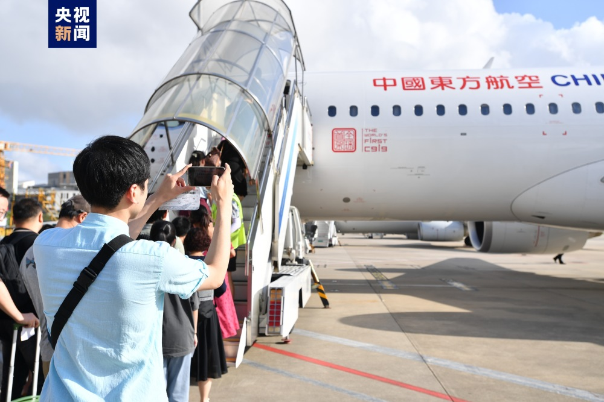
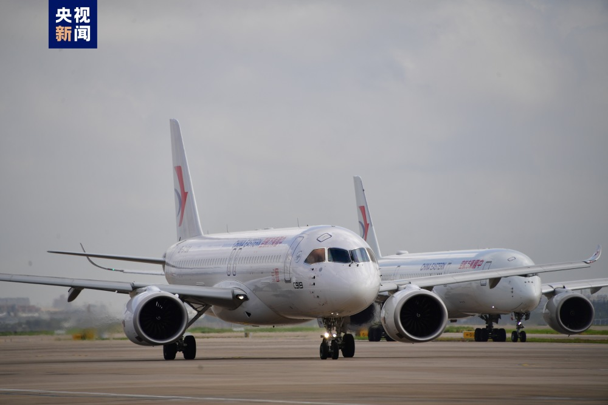
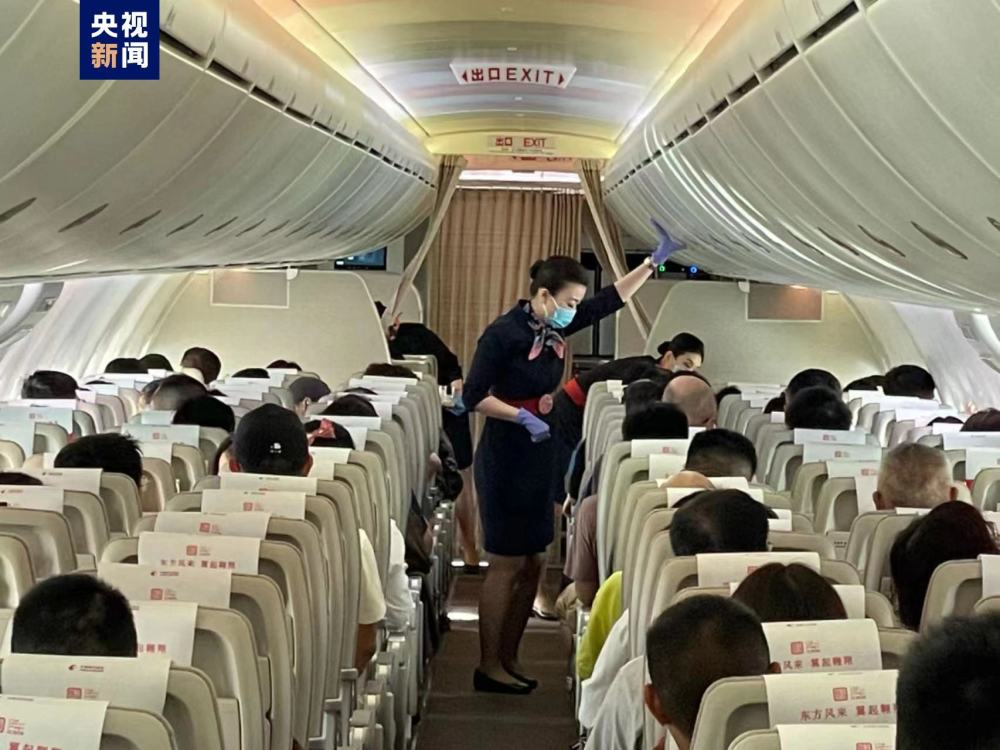

# 东航C919大型客机首次“双机运营”上海-成都航线

今天（4日），东航已经接收的2架C919国产大飞机首次开启“双机商业运营”，同日执行“上海虹桥—成都天府”航线。

据了解，C919执飞沪蓉快线的往返航班号分别为MU9197/MU9198和MU9189/MU9190。按计划，每逢周一、周三、周五、周日，东航C919将在上海虹桥—成都天府执行4个航班；其他时间，每天执行2个航班。广大旅客体验国产大飞机将有更多选择。

2022年12月9日，东航作为全球首发用户，正式从中国商飞接收全球首架C919大型客机。2023年5月28日，东航圆满完成C919首个商业航班“上海虹桥—北京首都”的往返飞行，此后首架C919在沪蓉快线上服务旅客，截至7月31日，首架C919共执行商业航班125班次，累计商业运营360.32小时，累计服务旅客超1.5万人次。7月16日，东航正式接收第二架C919大型客机，商业运营稳步推进。

C919投入商业运营以来，旅客乘机体验反馈良好。C919充满“中国风”的安全演示视频、主题餐食、带有“中国印”的机供品、C919专属电子登机牌等特色服务，也受到旅客的喜爱和好评。

（来源：央视新闻）

