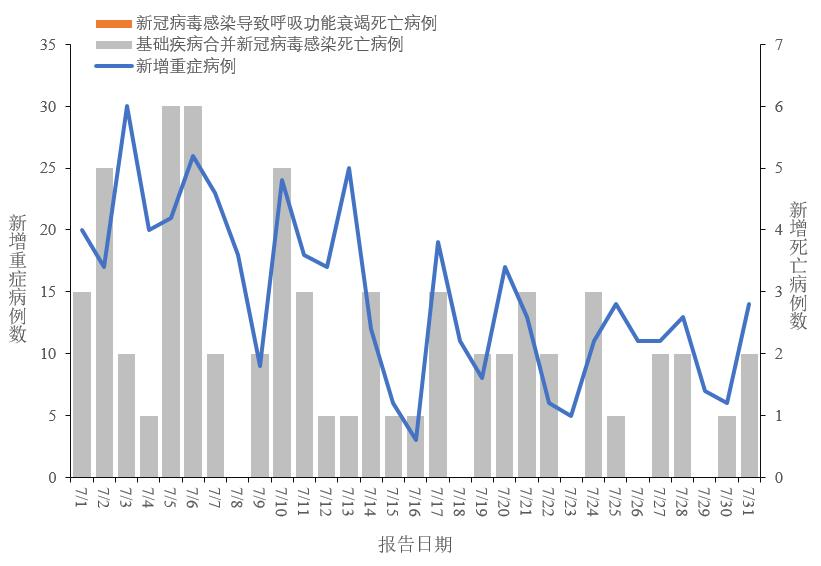
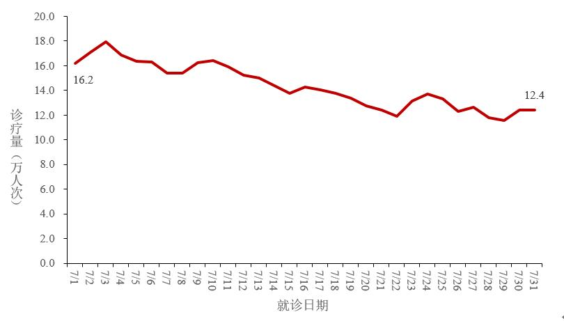
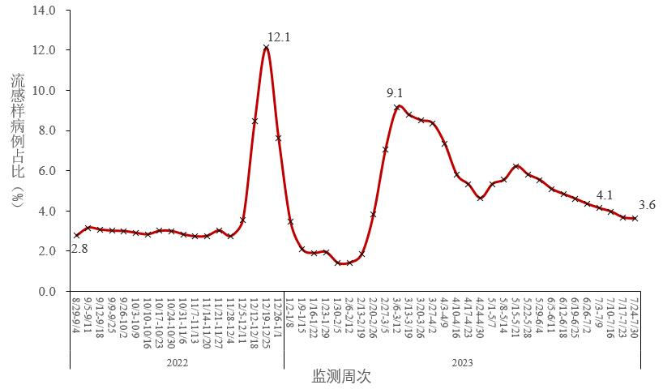
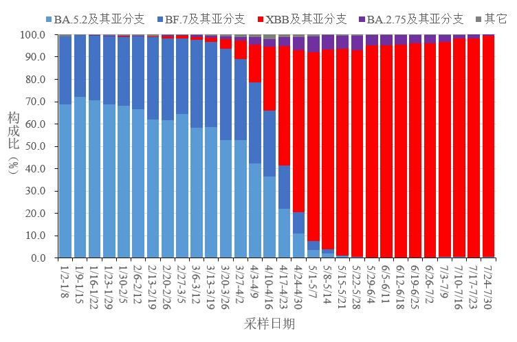

# 中疾控公布7月全国新冠感染情况：重症455例、死亡65例

中国疾控中心

**全国新型冠状病毒感染疫情情况**

**（2023年7月）**

**一、全国新冠病毒感染重症和死亡病例报告情况**

2023年7月1日-7月31日，全国31个省（自治区、直辖市）及新疆生产建设兵团报告新增重症病例455例、死亡病例65例（其中新冠病毒感染导致呼吸功能衰竭死亡病例0例、基础疾病合并新冠病毒感染死亡病例65例）。见图1。

图1 全国新冠病毒感染新增重症和死亡病例报告情况

**二、全国发热门诊（诊室）诊疗情况**

全国31个省（自治区、直辖市）及新疆生产建设兵团发热门诊（诊室）诊疗量从2023年7月1日的16.2万波动下降至7月31日的12.4万。见图2。

图2 全国发热门诊（诊室）诊疗人数变化趋势

**三、哨点医院监测情况**

全国哨点医院流感样病例占门（急）诊就诊人数比例从2023年第27周（7月3日-7月9日）的4.1%持续下降至第30周（7月24日-7月30日）的3.6%。见图3-1。

图3-1 全国哨点医院报告的流感样病例占比变化趋势

流感样病例新冠病毒阳性率从第21周(5月22日-5月28日）的42.5%持续下降，第28周（7月10日-7月16日）下降至12.0%后开始略有上升，第30周（7月24日-7月30日）上升至13.4%。见图3-2。

图3-2 全国哨点医院流感样病例新冠和流感病毒阳性率变化趋势

**四、本土病例病毒变异监测情况**

2023年7月1日-7月31日，全国31个省（自治区、直辖市）及新疆生产建设兵团共报送9591例本土病例新冠病毒基因组有效序列，均为奥密克戎变异株，涵盖116个进化分支，主要流行株为XBB系列变异株，占比前三位的分别为XBB.1.9及其亚分支、XBB.1.16及其亚分支、XBB.1.22及其亚分支。

根据采样日期，XBB及其亚分支的占比逐渐增加，从2023年第27周（7月3日-7月9日）的96.3%，增长到第30周（7月24日-7月30日）的99.1%。见图4。

图4 全国新型冠状病毒感染本土病例变异株变化趋势

