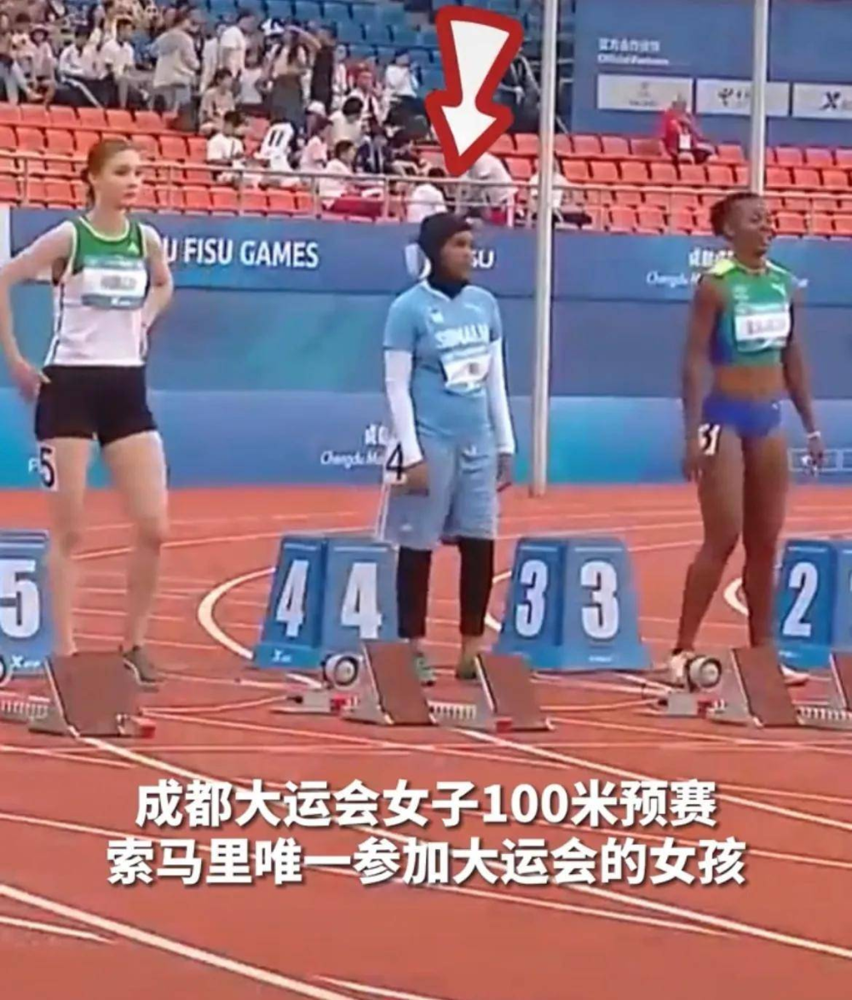
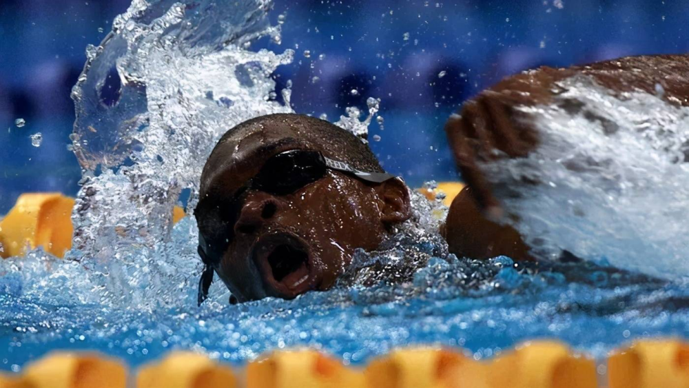
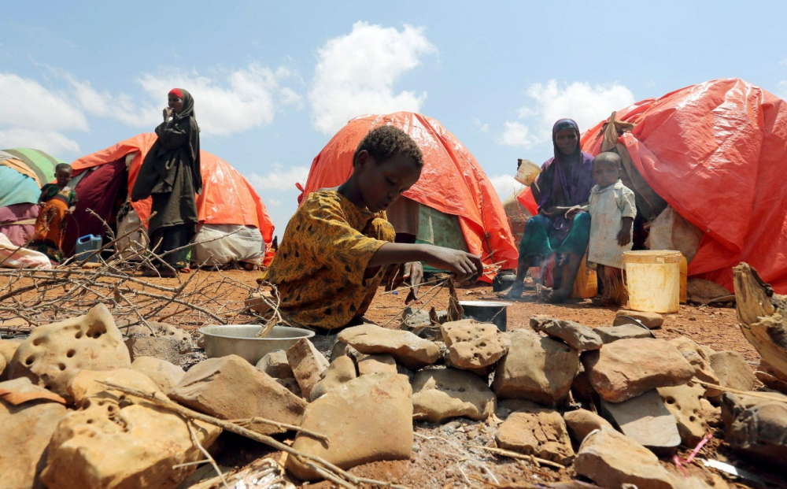

# 体谈 | 20多秒跑完100米！这不是励志，是走后门的耻辱

**撰文 | 于睿寅**

**编辑丨冯小**

你还记得你小学、中学直至大学阶段的体测，100米短跑的成绩是多少吗？身体天赋和爆发力或许因人而异，可但凡是四肢健全、发育正常的年轻人，成绩落在“十几秒”这个区间段，应该符合大多数人的普遍认知。

可要告诉你，在世界级综合性大赛中有选手100米跑了20多秒，你大概会以为是一则中途受伤，坚持到底的励志故事。实则不然。在前几天成都大运会的女子100米预赛中，一位来自索马里的选手纳斯拉·阿里·阿布卡就创造了这样的“神迹”。21秒81的成绩毫无悬念地在所有完赛的选手中垫底，比同组第一的选手落后近10秒。在差距以毫秒计的100米跑道，你大概能想见这是多么天壤之别的差距了。

_图说：阿布卡甚至被部分自媒体塑造成励志偶像，可事实远没有那么简单。_

阿布卡的成绩到底有多差劲呢？我找出了我国颁布施行的《国家学生体质健康标准》，不妨参考一下其中大学阶段的体测数据。虽然《标准》中短跑只设了50米，没有100米，但大抵也能做一番推算。众所周知，作为全程加速跑的100米比赛，正常情况下选手后50米速度是高于前50米的。那么，即便阿布卡的21秒81用匀速来拆解，50米成绩在10秒9左右，按照《标准》是处于“不及格”一档的，而且在100分总分中只能得到30分……

_按照中国大学生的标准，阿布卡参加短跑体测都是不及格的水平。_

不同国家选手训练水平、竞赛成绩有参差可以理解，可你派一个通过普通大学生体测都费劲的姑娘，代表国家来参加世界大学生最高水平的赛事，是不是过于离谱了？

这个大乌龙并没有逃过世界范围内媒体和网友的火眼金睛。英国《每日邮报》的评论还算是客气的：“虽然21秒81对于普通成年人来说可能是一个合理的时间，但它绝对不符合世界大学生运动会的标准。”索马里国内的纳税人可没有那么宽容了，一位名叫埃尔哈姆·加拉德的国内记者直接在社媒上发难：“他们怎么能选拔一个从没训练过的女孩，代表索马里参加大运会田径比赛呢？这实在让人震惊，在国际上对我国形象也造成了负面的影响。”

索马里体育主管部门的回应倒也算及时。该国体育部长穆罕默德·巴雷在比赛第二天就承认，阿布卡没有受过任何专业训练，他也不知她是如何通过选拔为国出战的。后又迅速又内幕消息传出称，
**阿布卡其实是索马里田径协会主席卡迪贾·阿丹·达希尔的外甥女，靠着裙带关系，才获得了这次来中国“公费旅游”的资格——这对于“世界最不发达国家”名单中的索马里年轻人，也算是很诱人的福利了。真相如何，仍在发酵，但达希尔的确已被光速解职，而巴雷部长也许诺会追查到底。**

可也有为阿布卡鸣不平的声音，觉得这番铺天盖地的讨伐，对于好不容易走出非洲的姑娘太过苛刻了。更有人举出了赤道几内亚游泳选手埃里克·穆桑巴尼的传奇奥运故事作为辅证。

2000年悉尼奥运会男子100米自由泳比赛中，赤道几内亚选手埃里克·穆桑巴尼的经历同样让人印象深刻。除了南非等国诞生过零星几位白人游泳名将之外，非洲大多数国家与世界级游泳比赛几乎是“绝缘”的，遑论人口不到70万的赤几。可穆桑巴尼在奥运开始前几个月意外听到一则选手招募的广告后，在全国没有一块专业泳池的情况下，在一家私人酒店的泳池苦练达标，最终通过选拔，带着50镑零钱和一面国旗，生平第一次走出国门，来到了悉尼奥运赛场。

穆桑巴尼的成绩也很“菜”。他用狗刨式艰难完成了此前极少挑战的100米（他之前训练主项是50米），后半程体力不支，动作变形，几乎溺水。看着这诡异的场面，全场观众原本的惊诧和讪笑逐渐变成真挚的喝彩，最终激励着穆桑巴尼以1分52秒72的成绩完成比赛——比晋级线慢了40多秒。然而这“史上最慢100米”却成了奥运泳池中的佳话，以及让赤几全国欢呼雀跃的光荣，连泳坛传奇伊恩·索普都感叹说：“也才是奥林匹克精神。”

_2000年悉尼奥运会上的穆桑巴尼，差点游到溺水但仍获得了全场的掌声。_

的确，穆桑巴尼是奥运乃至体育史上最令人动容的励志故事之一。 **但请一定要注意：它的性质和如今的阿布卡完全不同。**

阿布卡和穆桑巴尼的差别到底在哪儿？赤几人民也许在国内只能找到一个克服万难、游到终点的穆桑巴尼，可在索马里也许有成千上万的适龄姑娘能跑得比阿布卡更快。她能站上大运会起跑线的原因，是她那位担任田径协会（前）主席的舅舅。穆桑巴尼慢得离谱的成绩没有遭到嘲笑，因为完成100米自由泳对于任何四肢健全、发育正常的人，都还是有门槛的一件事，而他的坚持让祖国在奥运泳池上第一次有了存在。可阿布卡？用比走路快得有限的速度敷衍地跑完全程，不仅让其他追求速度极限的大学生选手觉得被嘲弄，也挤占了一个原本有机会为国出战的姑娘本应获得的名额。

**赛场本身的公平和正义，阿布卡并没有破坏。可在此之前的选拔过程，正是她和她的主席舅舅破坏了程序正义，才一步一步酿成了让索马里蒙羞的闹剧。阿布卡即便不是始作俑者，作为最终受益者，承担眼下的这些责难一点儿也不冤枉。算是有据可循的大运会参赛人员遴选，都能如此肆无忌惮地运作，在很少有信息公开的前期发掘、培养、选拔过程，那就是实打实的“黑匣子”了，公平和正义基本是奢望。**

这件事儿为什么让索马里国内出离愤怒呢？援引几个数据就不难明白：2022年索马里的人均GDP是461美元，在世界银行公布的排名中200名开外，倒数前五。同时，根据2015-16年左右公布的数据，人均预期寿命55.4岁，用电人口占全国人口的15%，全民识字率28%，小学入学率42%，婴幼儿死亡率也持续高企……坐上飞机出趟国，这在一部分人眼中没啥大不了的经历，却让阿布卡像极了含着金汤勺出生的，幸福的少数人。更何况，她不是凭公平的竞争赢得这个机会的。

如果跑得更快些，阿布卡也许会享受到她人生迄今最美妙的暑假。如果不是这则新闻，她本可以在若干年后“骄傲地”提起参加大运会的经历——虽然在预赛就遭淘汰，但我代表祖国完成了比赛。那甚至可以成为她一生的光环：开幕式跟随在国旗后入场的幸运儿，在成都观摩了世界大学生最高水平的赛事，顺带着畅游天府之国，体验索马里国内见所未见的吃喝玩乐项目。现在油管上还能找到一段阿布卡作为索马里运动员代表，出征大运会前拍摄的视频；如果剪辑精巧，运作得当，她甚至有机会打造励志人设，蹿升成为非洲网红。

_在民不聊生的索马里，阿布卡可能挤占了另一个同龄女孩的体育梦想。_

可世界的另一头，那些曾经刻苦训练却未达参赛标准，但远比阿布卡有资格来到中国的平凡姑娘们，大概连通过电视、网路目睹这可笑一幕的机会都没有。比丧失这次参赛机会更致命的，是理想和信念的崩塌。自上而下、遍布各个环节的体育领域腐败，让这个本就以海盗闻名的国家再被抹黑，而且进一步加剧了阶级固化——在走不出的非洲，靠体育（或是其他选拔性质的艺能）实现跃升，变得愈发不可能。

其实这又何止是索马里的问题？从这贫瘠的国土上，看似没啥油水的青少年、大学生赛事选拔，到体育世界金字塔尖的奥运会申办、世界杯贪腐——不论蛋糕是大是小，只要有利益的空间，就总挡不住热衷于逐利的那些人，披体面之皮，行龌龊之实。千里之堤，溃于蚁穴；川壅而溃，伤人必多；自上而下形成系统性的腐败之后，结局不仅仅是一项赛事、一支队伍、一个领域的大溃败，更会伤了人心——所有那些正直的参与者、贡献者、支持者的心。

作为我们，在接连目睹重拳反腐下中国足坛“全员恶人”般的塌房时，也不免会想，这一切当初是源自一个“阿布卡舅舅”式的“小问题”吗？

