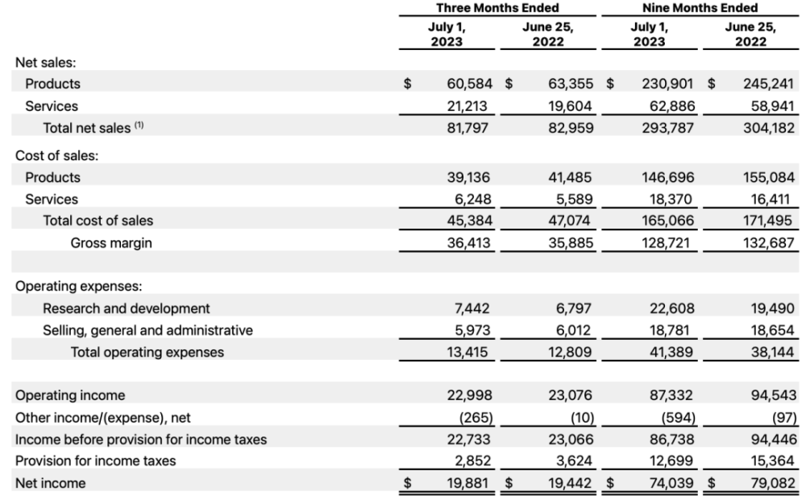
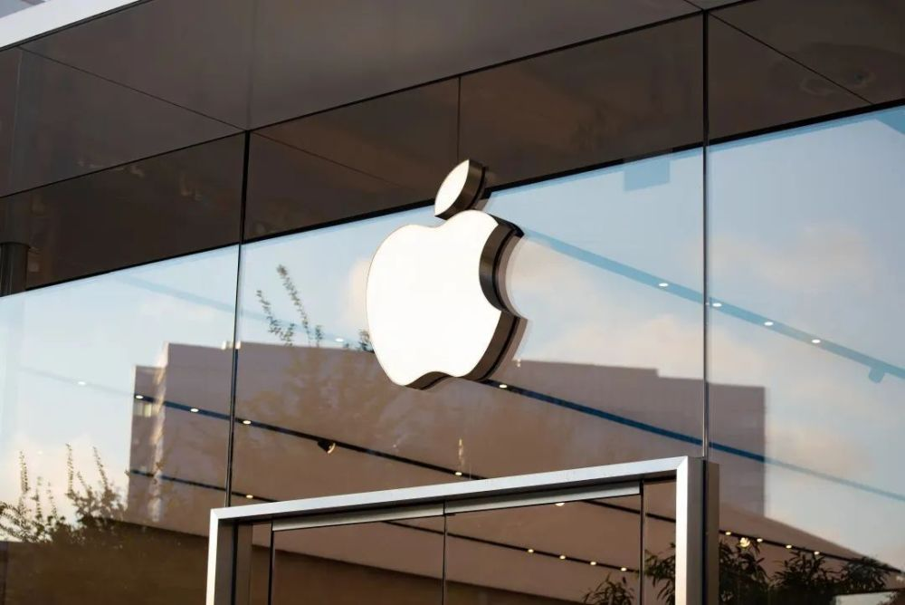

# 印度iPhone销量暴增近六成，还是带不动苹果

苹果仍旧未能从营收下滑的泥潭中走出。

北京时间8月4日凌晨，苹果公司发布2023财年第三财季（即2023年度第二季度）财报。当季财报显示，
**苹果第二季度营收约818亿美元，同比下滑1.4%，创造了自2016年以来首次连续三个季度营收同比下滑的新纪录。**

但 **好在苹果净利润增速开始回正。**
二季度，苹果净利润达到约199亿美元，同比增长2.3%。帮助苹果净利润同比由跌转涨的过程中，大中华区无疑是一股重要推动力。
**苹果CEO库克在财报发布后坦言，“美国智能手机行业目前形势严峻，但来自安卓用户转移到iPhone的人数很高，特别是在大中华地区。”**

二季度财报数据显示，苹果大中华区营收约158亿美元，相比去年同期的146亿美元，大增7.9%，成为当季增速最高的区域；欧洲区营收约202亿美元，同比增长4.8%，成为苹果唯二实现正向增收的地区。

相比之下，苹果第一大市场美洲区营收同比下降5.6%，降至约354亿美元；日本营收同比下降11.5%，降至48亿美元。

尽管库克仍然对外表示新兴市场正在持续增长，但从财报数据上看，
**一季度还是苹果营收增速最高地区的亚太其他地区，今年二季度营收由涨转跌，同比下降8.5%，降至约56亿美元。**

被库克视为未来增长重地的印度，尽管在二季度取得了iPhone同比增长56%，并跻身苹果五大市场之一的成绩，但尚不足以挑起亚太其他地区增收的重任，离取代中国则更为遥远。

受大部分区域营收不振影响， **苹果核心硬件产品均遭遇营收下滑。** 具体而言，二季度iPhone
营收约397亿美元，同比下降2.4%；Mac营收约68亿美元，同比下降7.3%；iPad营收约58亿美元，同比下降19.8%。

当季苹果可穿戴、家居等产品线营收实现2.5%同比增长，达到83亿美元。作为第二增长曲线的服务业务，继续保持增长势头，营收同比增长8.2%，达到212亿美元。

库克等一众苹果高管对公司财报数据的解读，显然未能打消资本市场的担忧。美东时间8月3日美股收盘后，苹果股价盘后下跌逾2%。

A

今年二季度，营收连续同比下滑两个季度的中国市场，重回增长轨道。

去年第四季度，苹果大中华区营收约239亿美元，较上年同期258亿美元下降7%；到了今年一季度，苹果大中华区营收约178亿美元，相比去年同期的183亿美元下降3%。

**随着二季度大中华区营收扭转跌势，库克在接受采访中直接表示，自己已经在中国市场看到了“明显的加速”。**

来自调研机构的手机销量数据也能证明这一点。IDC手机季度跟踪报告显示，2023年第二季度，中国智能手机市场出货量约6570万台，同比下降2.1%，但苹果成为唯二（另一个是华为）实现出货量逆势正增长的厂商，市场份额由去年的14.1%增长了6.1%，达到15.3%。

**苹果在中国市场的优异表现，离不开其在二季度展开了一系列促销和渠道扩张计划。**

5月31日晚，苹果在中国电商平台开启全球首场直播带货，上架了包括iPhone、Apple
Watch、耳机、充电头等在内的24款商品。凭借苹果产品的吸引力，一小时的直播中，苹果直播间涌进128万人次，据界面报道，当晚成交额破亿元。

中信证券分析指出，促使苹果近些年加码中国市场促销的原因之一，在于二季度是苹果手机的传统销售淡季，老款iPhone需求逐步消化，消费者倾向于等待iPhone新品发布。苹果清库存的同时，电商平台也能够借此为平台带来人气和流量。

直播带货之外，苹果还盯上了腾讯、抖音、阿里等互联网公司的流量池，以扩宽销售渠道。

进入7月份，苹果Apple
Store微信小程序正式开通，微信用户可以直接通过小程序购买iPhone、iPad和Mac等苹果产品，且所有订单享受免费送货和退货服务。

借助微信小程序的上线，苹果在挖掘微信内部流量转化之余，还能借此把线上零售网络的触角伸向更为庞大的安卓设备用户群。

B

中国市场重回增长的同时，包括印度等新兴市场在内的亚太其他地区，其继续增长的节奏却被按下了暂停键。

**被库克视为“下一个中国”的印度，二季度并未能再次挑起亚太其他地区的增收重担。**

一季度，包括印度在内的亚太其他地区，营收增长至81.19亿美元，相比去年同期的70.42亿美元大涨15%，成为一季度苹果营收增速最高的地区。

得益于上述成绩，iPhone才有了在一众苹果硬件产品中逆势上涨的表现。一季度，来自iPhone的营收513.34亿美元，相比去年同期的505.70亿美元，同比增长2%。

今年二季度，尽管iPhone在印度仍然高歌猛进，实现了56%的同比增长，并在549美元以上的高端细分市场占据59%的份额，顺利挤进苹果前五大市场。但包括印度在内的整个亚太其他地区，营收却不增反降，由去年同期的62亿美元，下降8.5%，至56亿美元。

归根到底， **印度等新兴市场增速固然喜人，但其整体规模仍然较小。相比中国市场近20%的营收贡献比，印度当前对苹果整体的营收贡献比，还不到2%。**

但在全球智能手机市场进入下行通道后，坐拥全球第二大手机出货量市场的印度，已经成为各大手机厂商争夺的重中之重。市场分析机构Wedbush
Securities分析师艾夫斯曾对此表示，“中国、美国和欧洲市场仍然是苹果的心脏，但随着这些市场趋近饱和，苹果寄希望于印度在未来几年担当主要增长动力。”

摩根士丹利分析师Erik
Woodring更是大胆预测，未来5年，印度有望为苹果贡献15%的新增收入，和20%的新增用户。未来10年，苹果在印度年营收将达到400亿美元。作为对比，中国市场当前的年营收约在750亿美元。

**但基础设施投资不足，正在牵绊苹果在印度的进一步发展。** Canalys印度分析师Sanyam Chaurasia表示，
“厂商正投资于当地供应商，扶持零售商并紧跟政府的愿景。在大众市场和高端市场，消费者倾向于线下购买智能手机，这将持续推动厂商进行有效的线下战略布局。”

二季度内，除了4月份先后在印度孟买和首都新德里开设了两家苹果直营店外，苹果暂时尚未有进一步的线下扩店计划。

C

相比如何加大培育未来的印度市场，如何将苹果拉回营收增长的轨道，或许是库克眼下更为操心的问题。

哪怕有中国市场的逆势增长打底，放眼全球，苹果也依然承受着智能手机整体销量不振所带来的压力。

Counterpoint研究显示，2023年第二季度，全球智能手机市场销量年同比下降8%，环比下降5%，连续八季度出现年同比下降。

**受外部需求低迷影响，近期供应链端传出消息称，苹果已经下调了即将在三季度发布的iPhone 15系列备货量，**
从原有的8500万部至9000万部之间，调低至8300万部至8500万部之间，低于2022年iPhone 14系列的备货水平。

但在维持苹果营收和利润率稳定的前提下， **与调低备货量一起传出的另一个消息是，苹果iPhone 15系列将要全线涨价。**

英国巴克莱银行分析师Tim Long在出具的最新报告中表示，iPhone 15 Pro系列起售价将上调100-200美元。

智能手机市场的具体表现，也在某种程度上给予苹果上调价格的勇气。

尽管中国智能手机整体市场持续呈现低迷状态， **但600美元以上高端市场，成为二季度唯一实现增长的市场。**
IDC数据显示，第二季度中国600美元以上高端手机市场份额达到23.1%，相比2022年同期逆势增长3.
1%。借助高端市场需求的韧性，苹果赢得有史以来最高的第二季度中国市场份额。

在市场调查机构Counterpoint看来，消费者换机周期的延长、手机创新趋同化形势的加剧，以及翻新智能手机市场的日趋成熟，都大幅削弱了消费者对中低端市场的需求。

反而随着成熟消费者追求卓越体验，加上许多主要地区提供的便捷消费金融政策，高端市场保持韧性增长，并未受到诸多限制的影响。

**苹果成为这一“高端化”浪潮的最大受益者，** 并在多个通常不被视为其核心市场的新兴市场中获得创纪录的份额。印度就是一个典型例子。

一旦iPhone 15系列加价成真，苹果在印度的营收增长就多了一个新的驱动力。

