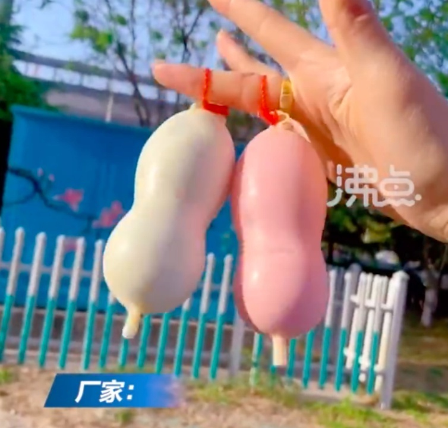
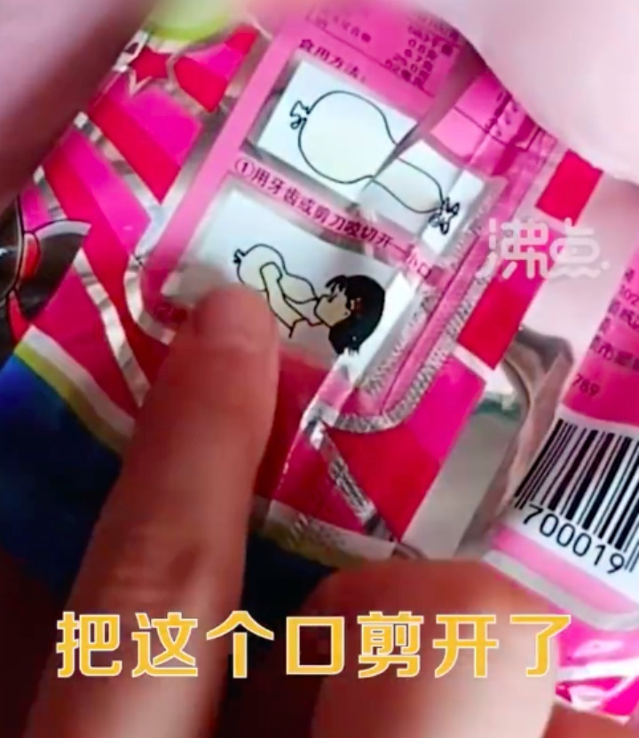
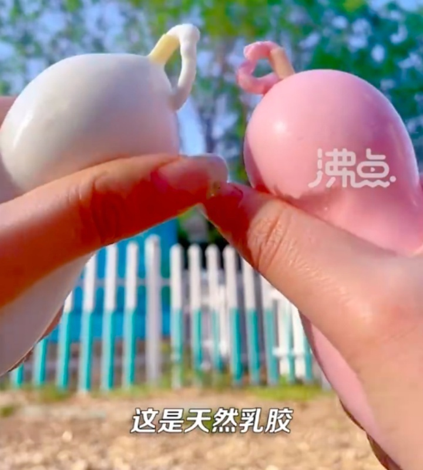

# 家长质疑雪糕外形似避孕套，厂家：是人的思想问题，20多年从未被质疑

8月4日，据都市时报援引“沸点视频”报道，近日，山西大同一家长发视频称孩子买的雪糕包装形似“避孕套”，质疑会误导孩子。

视频中，一女子质疑说道：“这就是孩子买回的雪糕，它外面是塑料的。把这个口剪开了，从这里吸，这是个啥？”

8月3日，该韩式泡泡雪泥雪糕厂家工作人员表示，“什么避孕套啊？胡扯八道，这都是天然乳胶材质，是一个国家专利产品，奶嘴的胶度。已经卖了20多年了，也没有孩子说是避孕套。”

工作人员还表示，“孩子懂得啥是避孕套啊？误导什么啊？是人误导，这是人的思想问题。”

对此，有网友认为，“因为家长心里肮脏，以前只觉得像葫芦”，“这玩意我二十年前就在卖了，而且为什么你想到的不是气球？”“这个家长怎么长大的，自己小时候吃没事，轮到他小孩了什么都脏了？”

也有网友觉得，孩子不会因为一个避孕套就变坏，但是性教育需要普及和提前才是真的。

**【来源：九派新闻综合都市时报、沸点视频、网友评论】**

