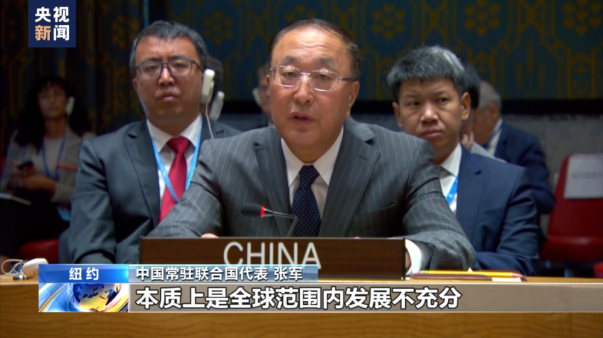

# 布林肯在安理会会议上激烈指责俄罗斯，中方在同场会议上表态

【环球网报道 记者
张晓雅】俄罗斯退出黑海农产品外运协议持续引起关注。当地时间8月3日，联合国安理会就冲突及饥荒问题举行公开会。据美国有线电视新闻网（CNN）最新报道，美国国务卿布林肯在会上激烈指责俄罗斯。

在安理会开会前一天，俄罗斯总统普京2日重申俄方退出黑海港口农产品外运协议的原因，并称准备在西方履行对俄义务后重返协议。

_普京 资料图 图自俄卫星社_

CNN称，布林肯在安理会会议上称，“受够了把黑海当作要挟。受够了再把世界上最脆弱的人当作筹码，”
“受够了这场不公正、和不合理的战争”。他声称，“安理会的每一个成员，联合国的每一个成员都应该告诉莫斯科：够了。”

_布林肯3日在联合国安理会冲突及饥荒问题公开会上讲话 图自美国C-SPAN电视台_

在他发表上述言论之际，CNN提到，美国于8月起担任联合国安理会轮值主席国，与此同时，俄方于7月退出了黑海农产品外运协议，土耳其方面一直在与莫斯科接触，试图恢复该协议。

“加强粮食安全对于实现联合国宪章的愿景至关重要。”布林肯还说。报道称，美国国务院一位高级官员当地时间2日称，美国正在牵头发表一份联合公报，“谴责将食品作为战争武器”。该公报目前已有75国签署。

在3日举行的联合国安理会冲突及饥荒问题公开会上，中国常驻联合国代表张军表示，解决粮食危机，要牢固树立共同安全的理念，加快弥合南北发展鸿沟，并完善全球粮农治理体系。中方重申黑海粮食外运协议，以及关于俄罗斯粮食化肥出口的谅解备忘录对于维护全球粮食安全具有积极作用。中方希望有关各方加紧对话协商，坚持相向而行，争取平衡解决各方合理关切，早日恢复俄罗斯与乌克兰粮食与化肥的出口。

 _中国常驻联合国代表张军在会上讲话_

中方表示，当前全球粮食安全形势更加严峻。中方支持联合国机构发挥专业优势和协调作用，动员国际社会特别是发达国家，加大人道援助的力度，补齐全球人道享用的资金缺口，缓解有关国家人民的燃眉之急。在应对好紧迫问题的基础上，要彻底解决粮食难题，必须聚焦根源性问题进行系统审视。

俄罗斯和乌克兰2022年7月22日在土耳其伊斯坦布尔就黑海港口农产品外运问题分别与土耳其和联合国签署相关协议，协议有效期为120天。协议去年11月、今年3月和5月多次延长，于7月17日到期。俄方7月17日向土耳其、乌克兰和联合国通报，不再延长该协议。俄外交部当时发表声明说，这一协议的执行遭公然破坏，继续执行“毫无意义”。

俄罗斯总统普京8月2日在与土耳其总统埃尔多安通电话时说，俄方准备在西方履行对俄义务后重返黑海港口农产品外运协议。普京在通话中重申俄方退出黑海港口农产品外运协议的原因，并表示俄方正在制定可靠的粮食供应方案，包括无偿供应方案。他还表达了与土耳其和其他国家在这一领域合作的意愿。

