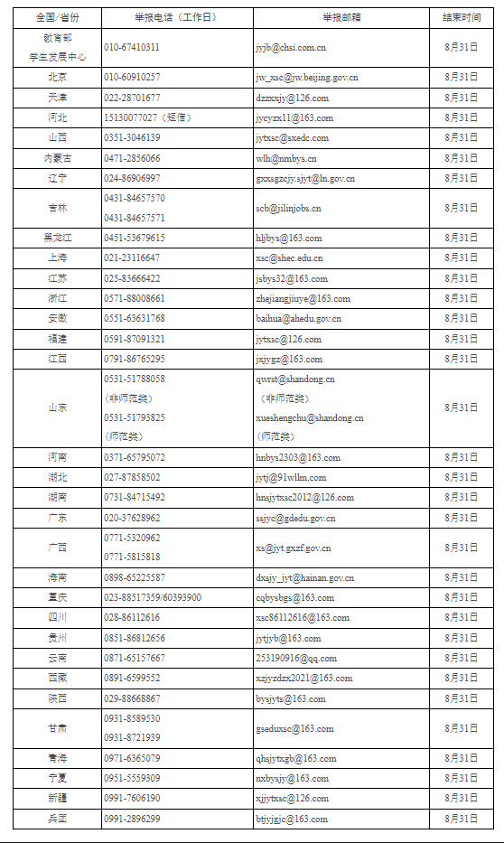

# 教育部派工作组赴各省开展专项核查 严查高校毕业生就业数据弄虚作假

教育部高度重视高校毕业生就业数据监测工作，专门下发2023届高校毕业生就业数据核查工作通知，召开各省教育部门核查部署会议。近日，教育部派出多个工作组，赴各省开展专项核查，严查就业数据弄虚作假。

教育部工作组以直奔主题、直插一线的方式，深入高校、院系，通过检查就业数据自查清单、核对自查报告、抽查相关就业佐证材料，结合有关问题举报线索和存疑信息逐一开展调查核实和现场约谈，对高校规范开展毕业去向登记监测、严防就业数据弄虚作假等情况开展了针对性核查。对核查发现的问题，要求地方和高校立查立改、及时纠正；对经核实存在虚假签约、虚假证明等违规行为的，责成有关部门依规依纪严肃处理，并追究相关高校和人员责任，切实维护高校毕业生就业合法权益。

教育部要求，各地各高校要严格执行就业工作“四不准”“三不得”规定（不准以任何方式强迫毕业生签订就业协议和劳动合同；不准将毕业证书、学位证书发放与毕业生签约挂钩；不准以户档托管为由劝说毕业生签订虚假就业协议；不准将毕业生顶岗实习、见习证明材料作为就业证明材料；不得不切实际向高校和学院提去向落实率具体指标；不得层层加码向辅导员摊派就业任务；不得将单一的去向落实率指标与就业工作人员或者辅导员的绩效考核、评优等挂钩），严守就业数据真实准确底线，严格审核每位毕业生的就业材料，重点核查灵活就业等相关数据，以“零容忍”的态度严肃查处就业违规行为。

教育部和各省级高校毕业生就业主管部门已开通监督举报电话和邮箱，接受就业违规问题举报。对相关举报信息，督促各地逐条核实，举报一个、查处一个。教育部已向2023届高校毕业生发送信息，提醒毕业生及时登录全国高校毕业生毕业去向登记系统（https://dj.ncss.cn/）确认本人毕业去向信息。8月起，还将委托国家统计局和第三方调查机构在全国范围内开展2023届高校毕业生去向落实情况抽样调查。

教育部将继续督促各地各高校严格落实就业监测工作要求，实事求是、规范有序推进就业工作，严防就业数据失真。同时，指导各地各高校持续为离校未就业毕业生提供不断线就业服务，并会同人社部门帮助未就业毕业生尽早就业。

教育部和各省级就业主管部门举报电话、邮箱

