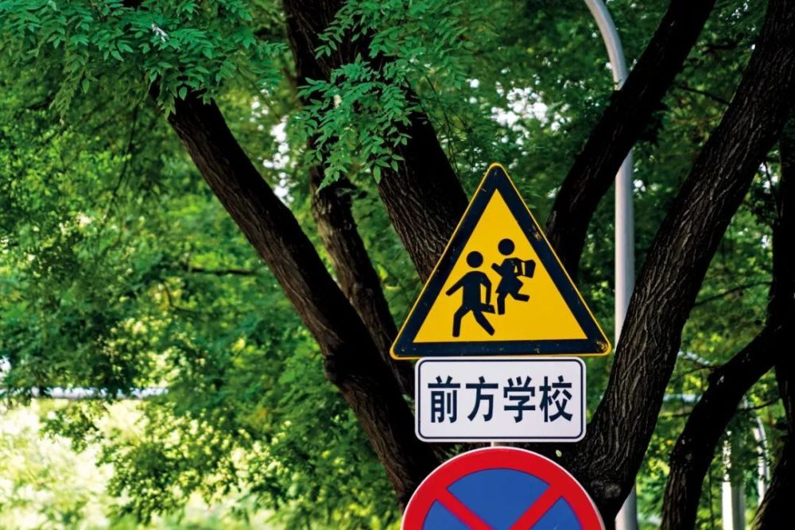

# 直降百万，学区房砸手里了？

“不出意外，‘7·31’之后购房的连续第三年全部调剂出区，部分‘四老’房本儿的，也被调剂出区。”7月初，伴随北京幼升小结果出炉，学区房市场再次引发关注。

“北京西城最严学区房政策（2020年7月31日后购房家庭，不再对应登记入学划片学校，全部以多校划片方式在学区或相邻学区内入学）实施满3年，热门学区部分房源直降百万。”这样的消息不断涌现，赚足了关注度。然而，看到这样的内容，深耕学区房的房产经纪人张波却“毫无波澜”。

2016年“全面二孩”政策带来的出生堆积，直接导致2022年优质学区的学位前所未有的紧张。亲历了市场的剧烈震荡，张波认为，与其说是政策彻底刺破了“学区房神话”，不如说是阶段性的出生堆积带来阶段性的“调剂出区”，2023年不过是2021年7月以后市场的延续。

在同样推行了多校划片政策的上海与深圳，学区房市场也经历了大幅回调。

以上海浦东新区为例，因曾与名校明珠小学对口，区内“老破小”朱家滩小区一度被称为“上海最强学区房”，单价在2021年冲上近15万元/㎡的高峰。但在经历多校划片政策后，贝壳数据显示，如今的朱家滩小区单价多在10万元以内。记者注意到，有急售房主已将单价降至87000元左右，然而这套房挂牌已有8个月，仍然未能售出。

_许多家长关心学区房需求高峰过后，生育率的持续走低将会对市场带来怎样的影响。图/中新_

今年春节后，连续两年经历价格回调的深圳学区房市场有所回暖。乐有家研究中心数据显示，全市名校片区的学区房成交价相较其他二手房，较参考价有更大幅度的偏离，以参考价成交的学区房占比从1月的55.5％减少至3月的38.4％。

“比起三年前的高点，价格的确降了。比起今年初的行情，价格也仍然在降，但这只是少数急售房源，大部分业主并不急着出手。好学校永远在那里，不可能搬走，出生高峰带来的学位紧张也会在2026年过去，优质资源富集的学区因为价值够高，所以交易量和价格的底线还在，没有什么绝对的‘神话破灭’，也用不着一惊一乍。”张波告诉《中国新闻周刊》。

从市场表现看，学区房热度已经连续两年出现降温，达到了政策预期。但这个市场并未消失，学区房还有没有价值？这个问题一再被追问，不论是计划购房、换房的家长，还是房产经纪人，每个人都在寻找答案。这个答案甚至会影响到区域内下半年的房价走势。

**求稳还是择优？**

张波已经总结了一套学区房价走势的变化规律。

7月，“幼升小”调剂出区结果揭晓，价格下调，客户观望两到三个月，10月开始出手，要赶在次年5月信息采集以前迁完户口。较高的交易量最晚持续到次年3月，这时一套房的总价要比前一年的低点涨50万到80万。“7·31”执行的第三年，市场波动已有较为稳定的规律。“学区房毕竟是学区房”。张波告诉《中国新闻周刊》。

“7·31”政策，出自2020年4月30日，北京市西城区教育委员会发布《关于西城区2020年义务教育阶段入学工作的实施意见》。其中的核心是，“2020年7月31日后在西城购房的家庭将全部多校划片在学区或相邻学区”，政策向市场明确了破除学区房狂热的决心。

为了赶在“关门前”上车，2020年下半年，心急如焚的家长们纷纷出手。年底，经历了当年的政策执行和几个月的市场观望，为了获得资源最为均衡的德胜学区入场券，家长们在两个月的时间里，将14万元的单价猛推至18万元。

4个月后，首次执行“新政”的“幼升小”结果出炉，“7·31”后购房的家庭，孩子被全部调剂出区，最好的派位结果是新街口学区的志成小学。

“买19万的房，上12万的学。”一夜之间，庆幸自己拿到入场券的家长成了“学区房爆雷”的当事人。过去，金融街、月坛、德胜因优质教育资源富集而被合称为“金德月”，而2021年7月空前的政策执行力度，让烈火烹油的德胜市场遭遇重锤，比起较少调剂出区且自身产业、区位优势巨大的月坛、金融街，德胜这颗“学区皇冠上的明珠”立即黯淡下来。

打开贝壳App，选择“东西海”的著名学区，进入“配套”一项，不难发现，购房者最关心的仍是教育，“大家一般都选择上哪个小学？”

“看德胜的房子，一般都还是冲着学区来的。”张波介绍。执行多校划片政策以后，德胜学区内的资源优势更加凸显，划片小学有育翔小学、西师附小、三帆附小、实验二小德胜校区，而德胜学区小升初派位对应的中学是三帆中学、十三中分校、北京四中、北京八中等。

 _图/视觉中国_

不过，对张波来说，服务的深度取决于一项关键信息：“您的孩子哪一年入学？”

如果是2024年9月入学，张波会劝他不要冒险，“大概率还是出区。”如果孩子1到3岁，则是张波要锁定的“重点人群”：“2026年以后，‘7·31’以前的学位需求释放完了，入学孩子一年比一年少，您家孩子肯定能在德胜上。”

但家长们心态矛盾。一方面，他们知道近三年德胜的调剂出区是在入学高峰的背景下产生的，但另一方面，相较金融街、月坛等学区，市场默认德胜是政策瞄准的“出头鸟”。即便孩子入学时，学位不再紧张，可只要抑制学区房的政策基调还在，选择德胜学区房就依然有不可知的风险。

而张波和同事们则有一套自己的话术：“到时候孩子数量那么少，各个学区抢人还来不及，怎么可能再调剂呢？不过，即便是孩子少，德胜依然有最优质的教育资源，有条件的父母还是会争取来德胜，德胜学区房依然是稀缺资源，越早入越稳。”

一些求稳的家长索性把目光转移到德胜调剂出区主要的承接学区新街口，“绝大部分调出德胜的孩子都进了新街口的志成小学，那我干吗不直接买在新街口，买在志成呢？”“买在新街口，你的孩子是能稳上志成。但是买在德胜，等孩子入学，你很有可能上育翔。”张波深谙家长稳中求进的心态。

究竟哪种分析更可靠？市场给出的答案倾向于后者。贝壳数据显示，德胜门7月均价约在15.5万元，六铺炕在14.3万元，而调剂出区对应的新街口，均价则在11.8万元左右。

进入各论坛的学区房版块，讨论仍然热烈。只是，不同入学时点的家长关注的重点有所不同，近两年入学的家长“不求优但求稳，只要避开坑校，怎么样都行”。而2026年以后入学的家长，仍然关注如何帮助孩子“择优”。

**急售大降价，买方仍在观望**

6月以来，深耕德胜学区的中介刘敏比往年更加焦虑。

“往年都是7月份结果出来才降价，今年是6月就开始降价，问的人多，但带看量和交易量都不高，楼龄新的也不像过去那么好卖。”

为了完成转化任务，即便是晚上12点来询问房源信息的客户，刘敏也会立刻打起精神，给出带有最大信息密度的回复，并尝试提出电话沟通，如果客户拒绝了，他也会竭力争取立刻添加微信，争取带看机会。

贝壳数据显示，目前德胜门挂牌房源在160套左右，在今年二三月份的高点，该片区每月成交量接近90套，而进入4月，成交量腰斩到40套，5月则进一步跌至30套。

“6月份降价以后成交上来了一点儿，恢复到4月份的水平了。”张波告诉记者，目前德胜学区房的总价整体已经比3月份下降了50万到100万。7月截至23日，德胜成交了33套房，最近成交量有所回升，但仍然不及预期。

6月以来，德胜的房价提早下行已不是秘密，反而成了房源的新卖点。“着急卖的降得更多，因为有些房主定了房的，老房子必须得卖。”张波介绍。

同样的情形亦出现在月坛。“德胜的居民户数量是月坛的1.6到1.8倍，相比德胜，月坛受‘7·31’影响不大，甚至是整个西城学区受影响最小的片区，虽然也有调剂，但基本都能上实验二小和复兴门外一小。”房产经纪人崔明明告诉《中国新闻周刊》。

“我发给您的都是捡漏房源。”崔明明向记者前后展示了三套房源，其中一套位于月坛南街19号院，43㎡，南北通透的一室一厅，售价678万元。“同户型的房子之前卖709万元，今年9月还卖了一套不带电梯的，692万元。现在这个价格，如果只想落户，非常适合。”不出所料，这套单价15.58万元的“捡漏房”在挂牌两天后售出。

另一套大降房源位于复兴门北大街，1989年建成的楼栋，东、西、北朝向的精装小三居，单价12.9万元，远低于该小区14.7万的均价。上一套同户型房源以1060万的价格成交，而这套标价940万元，降幅高达120万。这套房源挂牌不到半天就成功出售。

不过，另一套位于复兴门外大街的“老破小”，单价为14.1万元，与该区域14.87万的均价有不小差距，由于该小区一向成交活跃，这样的降幅也堪称“捡漏”。但今年5月以来，交易频率显著降低，这套总价775万元的“捡漏房”挂牌一周，未能出手。

在过去有学区房风向标的海淀学区盘蜂鸟家园，房产经纪人表示，海淀“1911”政策在2021年严格执行后，蜂鸟家园经历了总价200万元的跌幅后，目前成交量很少，所以整体降幅不明显。但如果业主急售，降价幅度也在10％~15％左右。“这两年就要入学的‘刚刚需’买了也没用，2026年以后入学的不着急买，这就是现在学区房的尴尬之处。”前述经纪人告诉记者。

顾清的女儿今年两岁，一家人户口都在丰台，居住的房屋在老人名下。今年5月，北京二手房交易不及预期，顾清看到相关报道后，认为出手时机快要到来，便从6月开始看房。由于这是夫妇俩的首套房，预算相对充足，“未来政策不明朗，但德胜的资源毕竟还是最好的，我们看房龄新的房子，贬值风险也小。”

顾清属意教场口9号院的一套三室一厅，小区2005年建成，楼栋21层，有电梯、精装修，去年10月挂牌，目前的价格是1180万元。“中介说这套房最近三个月两次降价，5月降了30万，6月降了50万。”顾清告诉《中国新闻周刊》。房子临街，噪音较大，但顾清对朝向、户型都还算满意，唯一的问题是时机。

“中介一再告诉我，80万是相当大的降幅，再降的空间不大了。但我仔细了解了这套房的带看情况，7月份，贝壳只有一条带看反馈，市场这么冷淡，我们觉得还有落的空间，现在还不是最低点。”顾清显得颇有把握。

“极端的情况不是没有。之前有一套北广家园的房子，报价1160万，980万就卖了。但这是捡漏，卖了就卖了，很长时间都不会再有。”张波告诉《中国新闻周刊》。

“现在您就看急售的房子，我们推的也都是这种。大部分的业主并不着急卖，等两三年对他们来说不是问题，所以他们没有降价的意愿，您看这种房源也没有意义。”多位房产经纪人都持相似态度。

**“楼龄新的也扛不住了”**

刘敏焦虑的另一重原因，是他发现德胜学区内，楼龄新的房源也在大幅降价，而买方仍在观望。

“‘7·31’以前，学区房的价值100％体现在学区，楼龄、房型、朝向这些都是附加值，顶多再加20％~50％。但‘7·31’以后，学区价值占比大降，楼龄等房产特性本身的价值凸显出来。”刘敏告诉记者，在市场上，这意味着楼龄越新的房子越稀缺，议价能力越强。

回顾德胜今年2月以来的成交数据，不难发现，市场因疫情结束而反弹的前两个月，量价双高。从成交价与挂牌价的差额来看，当时的议价空间与楼龄新旧密切相关。上世纪50到60年代的楼房，成交价与挂牌价有30万到50万的差额。80年代到90年代的房屋，差额在十余万元。2000年以后建成的房源，除了总价高、流动性较差的大三居，挂牌与成交价基本一致。

此外，学区内不同小区仍然对应不同的划片小学，同时对应育翔小学与西师附小的房子价格更加坚挺。

然而，等到4月，情况就变得微妙起来。西城区德胜的成交数据显示，4月交易的2000年后的房源，成交价相较报价降幅明显。其中，大三居的降幅分别为20万、58万、66万。更值得注意的是，70平方米左右大小的房源，降价幅度分别为24万和74万。

“4、5、6月是最差的。”这是房产经纪人的共识。5月，楼龄为2000年后已售房源，成交降幅分别为80万元至90万元，高一点的达到了120万元。6月，情况进一步下滑，降幅最大的房源，面积不到100平，成交价比报价降了253万元。

“中介一直跟我说，楼龄新的房子稀缺，每年入市挂牌的就不多，降价卖得更快。但实际上，楼龄新的房子持续降价的也不在少数，到现在也没卖出去。”顾清还想再搏一搏。

她向记者展示了一处房源，所在小区盛晖家园2009年建成，面积为84.09㎡，单价不到15万元，总价为1260万元。“无论是从面积、楼龄还是房型上看，这种房子过去流动性都很高。但实际上，它5月份降了20万，6月份降了30万，还能再谈，可见楼龄新的房子也愁卖。”顾清说。

“想观望，这是肯定的，谁也说不好最低点在哪里。不过，最近市场热起来了，交易量也有所回升，想趁低点进场，时间窗口不多了。”张波告诉《中国新闻周刊》。

**“择校焦虑”能缓解吗**

市场起伏不定，而昌平妈妈陈明已经等不及了，她决定将昌平的大三居卖掉，她的孩子明年9月上小学，她打算拿出900万元的预算，选一套学区房上车。

陈明的单位离互联网总部聚集的上地更近，原本打算在上地“入门”，但今年“幼升小”结果显示，在2019年1月1日后购房的家庭，被调剂到清河北外附，“上地也不稳了”。

“不稳”意味着有概率进入“坑校”，这是陈明最大的担忧。“孩子自认为自己不错，但他还那么小，我实在不敢赌。做父母的总想给孩子托个底，能‘混’多好看孩子，别太差就行”。

时逢西城学区房价格下行，陈明相信，与海淀相比，西城的资源水平更为平均，当然，鉴于德胜当前的价格下行，范围可以进一步限缩到德胜。“就算出德胜，也在西城里面，还是符合预期的。”她把自己的纠结发进水木社区的学区房版块。

很快有人打破了西城带给陈明的安全感。“过来人告诉你，西城已经回到从前，开始卷了。”收到众多反馈后，陈明更郁闷了：“我现在没办法确定孩子是不是属于前30％……老母亲的心，想让她快乐成长，又怕她跑慢了。”

除了近两年以“避坑”为首要任务的家长，更多人将目光投向了学区房需求高峰过后，生育率的持续走低将会对市场带来怎样的影响。

这两年，北京的幼儿园、小学入学形势正在发生微妙的变化。2022~2023学年，东城、西城、海淀、朝阳4个教育强区的小学招生人数比去年减少。

《2022-2023学年度北京教育事业发展统计概况》中透露，在2022~2023学年，东城、西城、海淀、朝阳的小学招生人数全部负增长，分别比上年减少664、937、864、1295人。其中，东城、海淀、朝阳已经是连续两年负增长。

但同期，北京全市小学招生人数比上年小幅增加。尽管小学招生人数相对稳定，但出生人口减少大趋势下，幼儿园招生难现象已经开始出现，并会逐渐扩大和蔓延。传导到几年后，入学人数下降，也是大概率事件。

当入学人数下降，北京优质学区房会真正降温吗？家长们会更加理性吗？

“学区房的出现是出生人口增加遇到了教育不均衡导致的，学区房的出现是发展问题，当下的政策基本集中在降低获得优质资源的难度，但优质资源依然存在，比如西城、海淀的高中录取率依然全国最高。”中原地产首席分析师张大伟判断，“出生人口变化，会导致2到3年后学区房需求锐减。”

中央财经大学国际金融研究中心客座研究员张启迪认为，随着出生人数不断下降，学生越来越少，优质学区的学区房价值也会下降。“由于出生人数持续减少，而优质学区资源相对固定，更少的学生对应固定的学区，这也就意味着优质学区房的稀缺性也会下降。”

不过，也有分析认为，小学入学的择校需求会长期存在，东城、西城、海淀、朝阳的入学人数减少可能只是暂时的，一旦学位压力缓解，供给再次大于需求，还是会有更多适龄儿童涌入教育强区。

（应采访对象要求，本文受访对象均为化名）

发于2023.8.7总第1103期《中国新闻周刊》杂志

杂志标题：学区房连续降温了

记者：王宇

