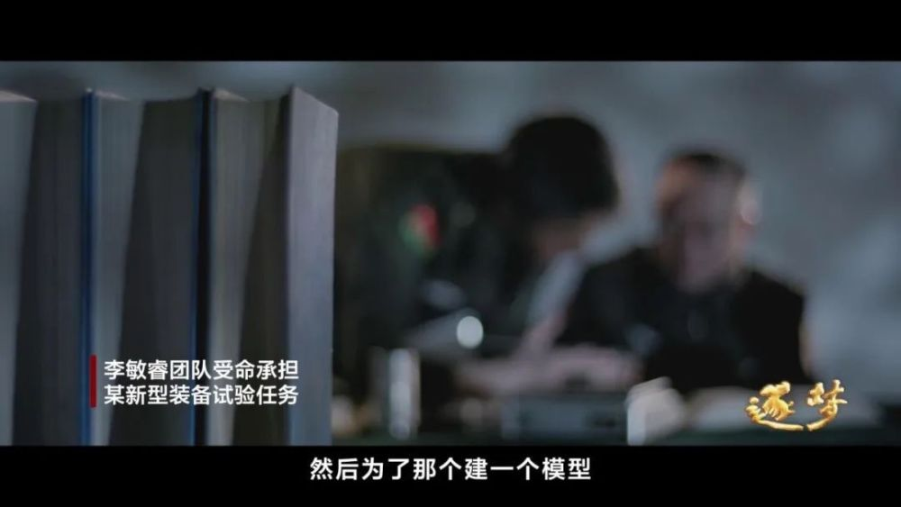
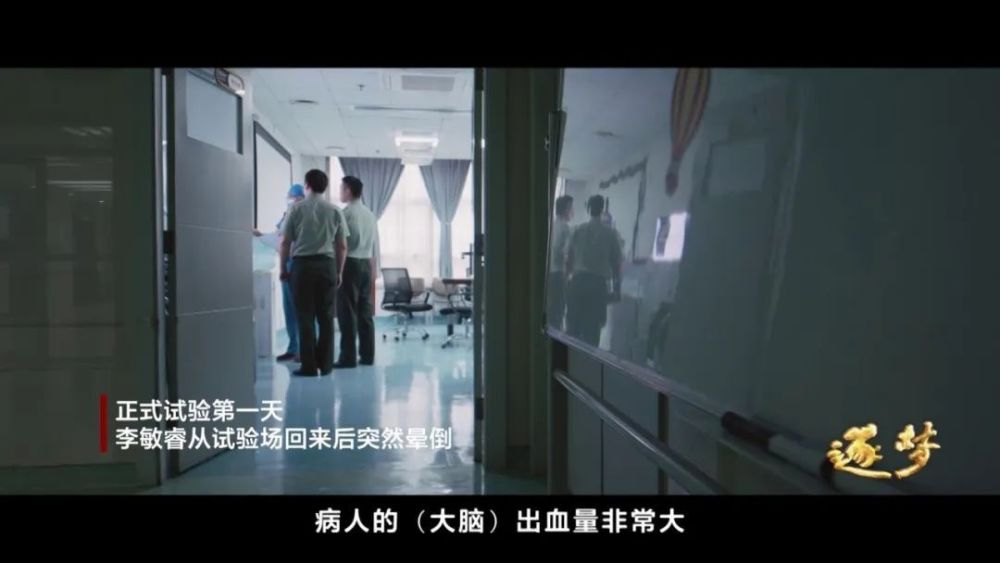
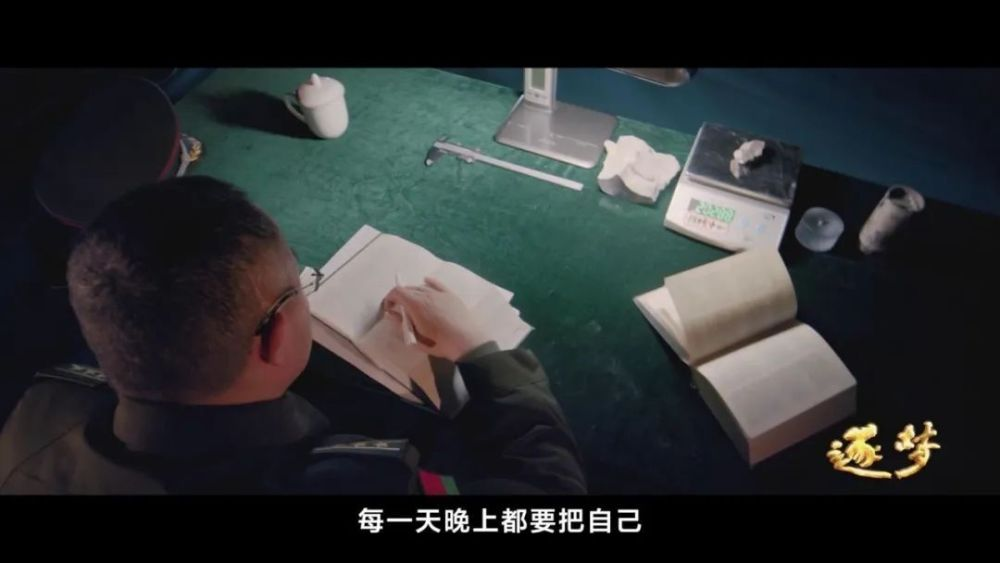
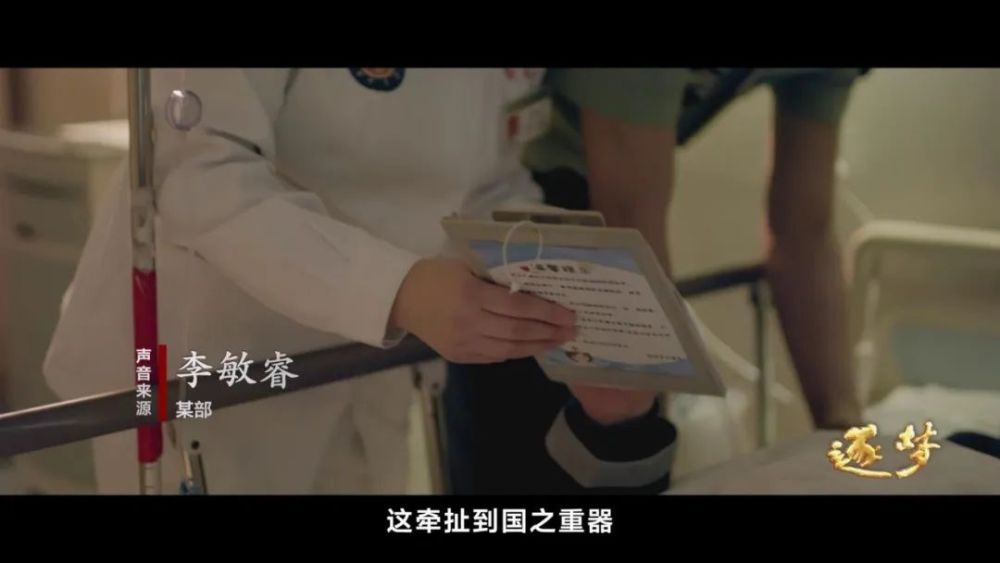
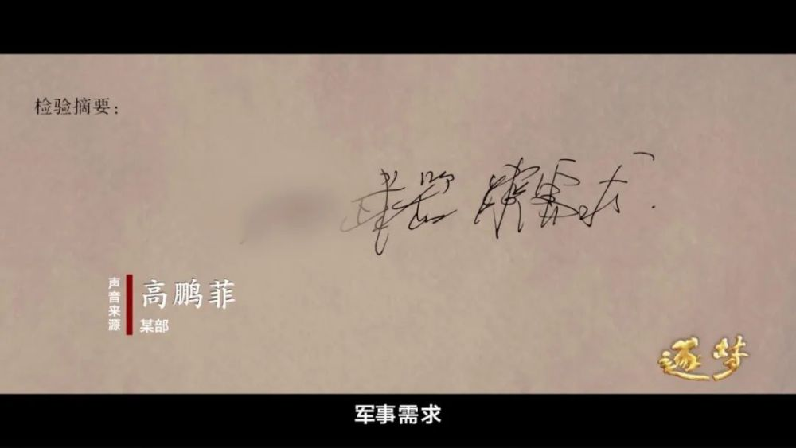
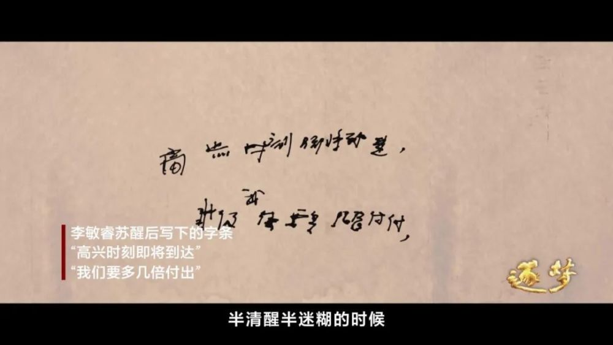
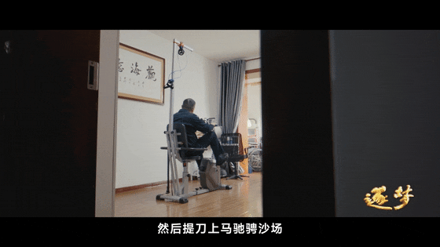
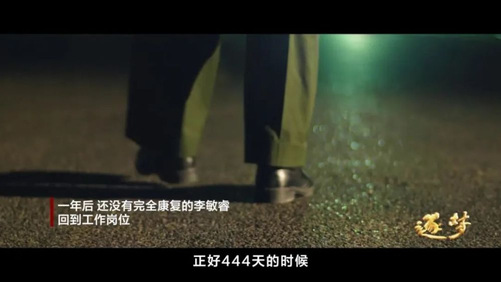
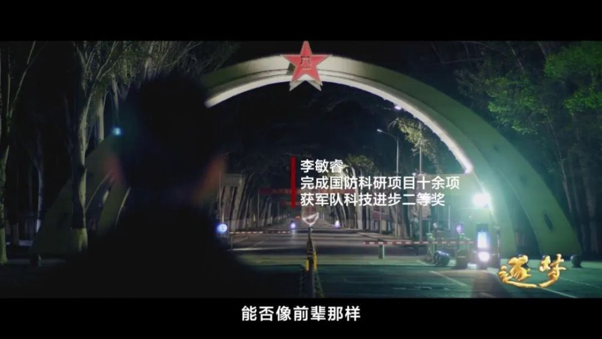

# 第一次公开报道，这位顶尖科学家却不能露脸

这是第一次公开报道他的故事

他是我军顶尖科学家，研发的装备，填补了某新型装备的空白。“经历过生死后，想为祖国铸更多重器”为保护他，在这篇报道中他本人、妻子、同事的名字均为化名，采访只用模糊的侧影。

试验期间他突发脑出血，醒来写下的第一句话让人泪目。

李敏睿（化名）和团队，受命承担某新型装备试验任务。他知道此任务关系着国防安全，之前没有任何经验可借鉴，但只许成功，不许失败。

李敏睿带领团队夜以继日工作，试验任务终于进入倒计时攻坚阶段。正式试验第一天从试验场回来后，

他突然晕倒，被送入医院，医生诊断为脑出血，两次下达病危通知书。

李敏睿的妻子付婧（化名）知道消息后，哽咽落泪。之前所有的担心化为了现实

“他都是几天几夜不眠不休，每晚都要把自己这一天所干的事情像过电影一样在脑海中过一遍。压力非常大，责任也特别重，我做了最坏的心理准备。”

同事看望时李敏睿还没有完全苏醒过来

同事临走之前在他耳边说：“主任，我们回试验场那边，咱们试验还继续开展着。”

没想到昏迷的李敏睿听完后，手就跟触电了一样。身子抖动起来，情绪很激动。

妻子说，李敏睿半清醒半迷糊的时候，对工作的事情都记得清清楚楚，却说不出自己家的门牌号。

手术后第七天，昏迷的李敏睿终于苏醒。睁开眼睛以后，要求拿来纸和笔

写下的第一句话就是“某某武器，军事需求”

又写下“高兴时刻即将到达”“我们要多几倍付出”

李敏睿后来回忆说：“ **我想告诉他们这个试验不能中断，这牵扯到国之重器祖国的安全底气。** ”

试验圆满成功，他积极复健重回岗位。最终，团队不负众望试验成功，填补了某新型装备的空白。

李敏睿坦言“两弹一星”的精神一直激励着他，他也积极复健

“前辈们在那么艰难的环境下，都没有放弃，我也不能放弃。我希望尽快恢复，然后提刀上马驰骋沙场，早日投入科研工作。”

还没有完全康复的李敏睿在第444天回到了工作岗位

他说：“左半边身体基本上不能动了，但我的大脑思维还清晰，右手也没受影响。 **经历过生死，余下的时间，想为祖国铸更多的重器。** ”

2007年成为某部科研团队一员时李敏睿曾在心里问自己“1958年，前辈们隐姓埋名，为国铸盾我能否像前辈那样潜心铸造大国重器？”

其实，早已有了答案。

十几年来，李敏睿多次参与大国重器研发，完成国防科研项目十余项。

获军队科技进步二等奖，他和团队研发的某型装备，曾出现在新中国成立70周年阅兵式上。

**干惊天动地事，做隐姓埋名人，致敬！**

**监制丨刘一鸣**

**主编丨白晨**

**编辑丨谷帅**

**©央视军事**

