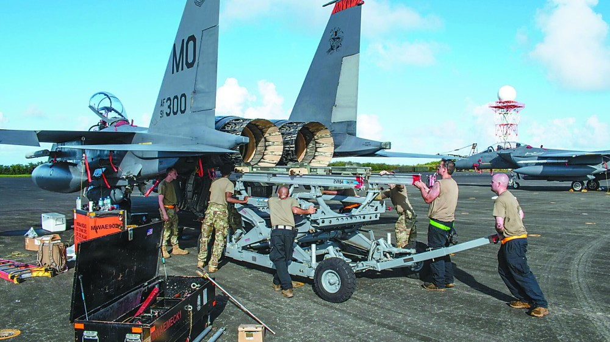

# 美导弹射程增加20%，意在中国？

【环球时报特约记者 魏 齐】
编者的话：据美媒报道，美国官员希望为美军部分导弹使用新的燃料，增加导弹射程，使美军能够在距离中国更远的地方部署和发射导弹，从而在太平洋地区获得优势，提高自身的生存能力。同时，美国还在西太地区针对中国演练“敏捷部署”。不过专家认为，这并不能完全解决美军跨越广袤太平洋与其他大国作战带来的问题。

_美军演练在硫磺岛为F-15更换发动机。_

**美国会成立专门机构加快高能材料应用**

据路透社8月3日报道，两名美国国会助手和两名美国官员透露，五角大楼和国会正在考虑通过使用更强大的推进剂和更轻的弹头，将某些现有武器的射程增加20%。

报道称，美国参议院上周公布了法案，指定至少1300万美元用于规划、扩大和制造可用于推进导弹或取代弹头中爆炸材料的化合物（含能材料）。“印太地区的距离和（中国）海军的庞大规模，意味着美国需要更多能够抵达遥远目标的反舰导弹。”美国众议员迈克·加拉格尔表示，“不幸的是，五角大楼对20世纪40年代的含能材料已经感到满足，而忽视了像‘中国湖20号化合物’（CL-20）这样的先进含能材料，这些技术对于增加我们部队的武器射程和杀伤力是必要的。导弹射程每增加一英尺，美军就离危险远一英尺”。

路透社称，下年度的“国防授权法案”将启动五角大楼的一项计划，使用CL-20等化学物质来增加现有武器的射程。含能材料技术中心（ETC）称，美国军队使用的几乎所有能源技术都可以追溯到至少80年前。在美海军研究办公室的资助下，著名化学家阿诺德·T·尼尔森在上世纪80年代首次在海军航空武器中心合成了“中国湖20号化合物”。ETC表示，CL-20与HMX炸药性能差异巨大，其侵彻深度增加了40%，这对于特定场景而言，弹头整体杀伤力显著增加。

更大的爆炸力也意味着使用CL-20 的弹药射程更远，但制造CL-20比合成 HMX更具挑战性，因此美国工业界需要数十万磅或数百万磅的CL-20订单量。

一名美国高级国防官员表示，2021年发表的一项研究称，用CL-20重新为火箭提供动力以及其他改变可以将射程增加约20%。报道称，含能材料技术中心的一篇论文表示，这种新的高能材料使400磅炸弹与当前1000磅炸弹具有相同的杀伤力，论文还补充说，中国“以工业规模制造CL-20并将其用于武器系统中”。中国在自身武器中使用了CL-20，并且在先进含能材料方面远远超过美国。

**三种弹药或被增程**

为了加快追赶步伐，美国参议院指定资金将用于在国防部内设立一个高能材料办公室，听命于美国防部副部长凯瑟琳·希克斯。该办公室将成为美国陆军、海军和空军的协调机构，以消除机构的繁文缛节。

路透社称，美国战略与国际问题研究中心武器专家汤姆·卡拉科表示，为美国库存武器重新提供动力或使用新的爆炸性化学物质的成本可能高达数十亿美元，这一数字在很大程度上取决于为哪些武器更换动力系统以及有多少武器被改装或采购。而根据《国防日报》网站之前的报道，美国众议院军事委员会
（HASC）的战术空军和陆军小组在其拟议的该委员会2024财年国防授权法案草案中要求美国防部启动一项试点计划，将CL-20炸药纳入3种弹药中。

《国防日报》称，位于马里兰州的含能材料技术中心一直在评估6种弹药中的哪些适合配备CL-20，其中洛克希德·马丁公司的AGM-158C远程反舰导弹（LRASM）和AGM-158B增程型联合防区外空地导弹（JASSM-
ER）将是测试的最佳选择。而路透社称，含能材料技术中心的鲍勃·卡维茨基表示，其他可能的武器包括波音公司的“鱼叉”反舰导弹以及“标枪”反坦克导弹。《国防日报》表示，迄今为止，美军使用CL-20的弹药很有限，包括美国防部向乌克兰提供的“弹簧刀-300”巡飞弹以及用于触发高能材料（炸药、推进剂和烟火）的起爆装置。诺斯罗普·格鲁曼公司每年生产1万到2万磅CL-20，但该公司能够大幅扩大生产规模，如果订单增加，成本将会下降。

LRASM有多种部署与投射方式。

**测试敏捷基地**

除了使用新型含能材料让导弹飞得更远、威力更大，以便在西太平洋和中国争取优势地位外，美国还加强在西太地区的“敏捷基地”测试。“突发防务”网站1日题为“敏捷基地在太平洋北部边缘接受现实世界测试：在小岛上更换F-15发动机”的文章称，首次在太平洋较温暖地区举行的“北部边缘”演习的亮点之一就是测试一些关键概念，例如横跨距离中国更近水域的敏捷基地。该演习通常在阿拉斯加最北端及其水域进行，今年演习从7月2日开始，持续到7月21日。

报道称，7月9日，“北部边缘”演习的一个演练场景是：一架F-15战斗机不得不迫降在硫磺岛更换发动机。在接到F-15发动机故障并迫降在硫磺岛的消息后，驻日美军岩国基地迅速出动一架装载备用发动机的C-130运输机前往硫磺岛，并在12小时内将这架F-15战机修复。报道称，这些工作对于“敏捷战斗部署”（ACE）至关重要。这个想法是让美军飞机跨越太平洋，使中国或其他任何国家更难摧毁停泊在大型基地的美国及其盟友的飞机。

而在另一演练中，美军模拟了一架
F-35A在太平洋岛国帕劳着陆后出现制动器液压油泄漏故障。飞行员通过无线电呼叫关岛，一架C-130携带必要的部件起飞并在4个半小时内让这架战机得到修复并投入战斗准备。而在一个拥有维护人员和部件的主基地，这样的修复通常只需要半个小时，大部分时间都花在从关岛向帕劳运送部件上。

对于美国种种针对中国的举措，中国军事专家张学峰表示，美国宣称，如果美国主动与中国爆发冲突，第一岛链内的美军基地难以自保，所以美国提出“敏捷部署”概念，在后方分散部署，然后快进、快打、快撤，同时又提出增加导弹射程的办法。但广阔太平洋会天然地削弱美军向西太投送兵力的强度，这是美军面临的最大挑战之一。而为一些巡航导弹增加大概1/5的射程并不会扭转局势。这更像是拿中国当幌子，升级其含能材料生产体系。

而据路透社报道，非营利组织“武装暴力行动”执行董事伊恩·奥弗顿表示，从某种意义上说，军备竞赛总是以糟糕的结局收场。“更大、更致命的武器会让我们更安全吗？答案是清楚的：不会。在过去十年中，当爆炸性武器在人口稠密地区使用时，全球报告死亡或受伤的人员中有90%是平民。”

