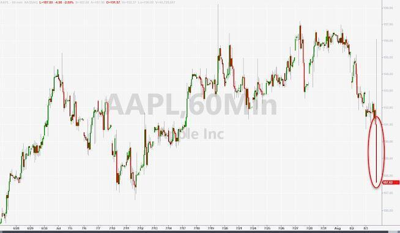
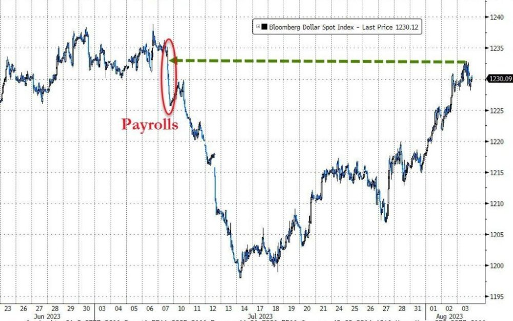
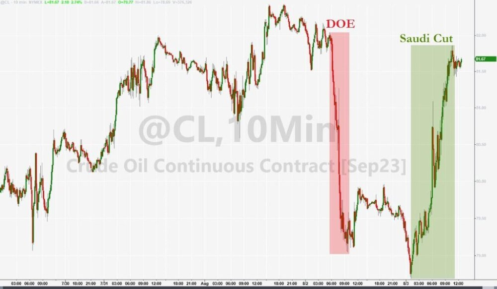
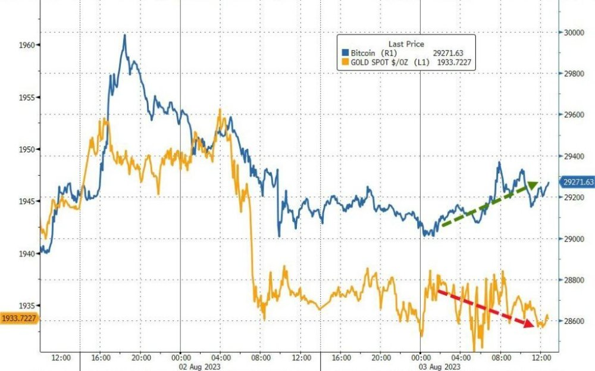

# 美股收盘：三大指数小幅收跌 中概股逆市上涨 美国超导跌超16%

美债海啸将至，长期美债收益率再度飙升，被称为“全球资产定价之锚”的十年期美国国债收益率连续第三日盘中至少升约10个基点，和三十年期美债收益率双双再创去年11月以来新高。

“全球资产定价之锚”被撼动，金融市场面临巨震威胁。本周稍早在交易商普遍预计美国财政部将扩大发债规模时，就有分析认为，随着美联储一年多来持续加息，不断攀升的美债利率会将私人投资排斥在外，并削弱股票价值。

美股承压继续下挫。高通和英飞凌的财报暗示，需求疲软继续影响部分芯片企业业绩。室温超导概念股又遭打击。韩国学界初步判断，论文提及的实现室温超导材料LK-99并非超导体。此外，发布论文的研究团队背后为私营公司，被指涉嫌捏造合作关系。美国超导（AMSC）连续第二日两位数大跌。而中概股逆市大反弹，一扫连日回落的颓势。

周五美国重磅非农就业报告出炉前，周四公司的劳动力市场数据未能留下全线向好的深刻印象：上周首次申请失业救济人数略超预期回升6000人，波动相对较小的四周均值降至四个月来低位，凸显劳动力需求的韧性；7月ISM非制造业指数显示，服务企业活动较6月扩张超预期放缓，部分受制于就业分项指数增长疲软，而价格指数升至三个月高位，体现需求的支持。

ISM数据公布后，长短期美债收益率均曾收窄升幅，两年期美债收益率一度转降；连日创将近一个月来新高的美元指数再度转跌。美元回落助推非美货币反弹。离岸人民币盘中涨幅扩大到300点以上，脱离周二和周三连日所创的一周来低位。

评论称，7月上涨后，科技股吃重的纳指对美债收益率上行非常敏感。此外，周四美股盘后，两家科技巨头苹果和亚马逊将公布二季度财报。一些股票交易者正利用收益率飙升、以及苹果和亚马逊财报前的一些紧张情绪，作为锁定部分利润的机会。

周四英国央行的行动迅速引起市场反应。英央行如市场所料加息25个基点，同时暗示会在较长时间内维持较高利率，即使通胀回落到正常水平，也不会立刻开始降息。英债收益率先刷新日低，后有所回升。英镑兑美元在英央行决议公布后迅速刷新一个月来低位，美股盘中随着美元转跌，逐步抹平跌幅。评论称，英央行本轮加息周期中首次承认其货币政策是紧缩的，虽然央行对未来加息持开放态度，但分析人士预计，英央行的利率接近峰值。

大宗商品表现不一。据沙特国家通讯社报道，沙特决定，将100万桶/日的自愿新增减产行动再延长到9月，还称减产可以延长或是延长且幅度更大。后有报道称，俄罗斯副总理诺瓦克表示，俄罗斯9月会减少出口30万桶/日。国际原油盘中加速反弹，盘中曾涨近3%，脱离周三所创的一周低位。美元盘中小幅回落，但中长期美债收益率上行继续打击黄金，期金继续跌离周一所创的两个多月来高位。

三大美股指反弹失利 财报后亚马逊盘后大涨10% 苹果加速下挫 中概本周二度跑赢大盘

三大美国股指继续集体低开。早盘标普500指数曾跌超0.6%，道琼斯工业平均指数曾跌约160点、跌近0.5%，纳斯达克综合指数曾跌近0.7%。纳指早盘尾声时纳指转涨，午盘刷新日高时曾涨超0.4%，但未到尾盘又转跌。午盘标普和道指曾转涨，刷新日高时标普涨超0.1%、道指涨超60点，约一小时后又转跌。

最终，三大指数连续两日集体收跌，标普和纳指连跌三日，道指两连跌，跌幅都较周三明显缓和。周三收跌1.38%创4月25日以来最大跌幅的标普收跌0.25%，报4501.89点，刷新7月12日以来低位。周三收跌348.16点创7月6日以来最大跌幅的道指收跌66.63点，跌幅0.19%，报35215.89点，刷新7月19日以来低位。周三收跌2.17%创2月21日以来最大日跌幅的纳指收跌近0.1%，报13959.72点，连续两日刷新7月12日以来收盘低位。

价值股为主的小盘股指罗素2000收跌0.28%，两连跌至一周低位，远离周一所创的去年8月以来高位。科技股为重的纳斯达克100指数收跌0.11%，连跌三日，刷新周三跌2.21%所创的7月12日以来低位。

_三大美股指午盘都曾转涨，但最终收跌_

标普500各大板块中，周四只有涨近1%的能源、涨超0.3%的特斯拉所在板块非必需消费品，以及涨不足0.1%的金融三个收涨。跌超2%的公用事业领跌，房产跌超1%，其他板块跌不足0.65%。

周三集体至少收跌超1%的龙头科技股大多反弹，力挺主要股指盘中曾转涨。周二和周三均跌超2%、跌至6月27日以来低位的特斯拉收涨近2.1%。

FAANMG六大科技股中，周三连跌两日至一周来低位的亚马逊收涨近0.6%，盘后公布的二季度业绩和指引均优于预期，股价迅速拉升，盘后涨涨幅达10%；奈飞收涨0.3%，未继续跌离周一所创的7月19日以来高位；周三连跌两日至7月25日以来低位的谷歌母公司Alphabet收涨不足0.1%、而Facebook母公司Meta收跌近0.4%，连跌两日至一周来低位；微软收跌近0.3%，连跌两日至6月8日以来低位；苹果收跌逾0.7%，连跌三日至7月14日以来低位。盘后苹果公布的总营收和EPS盈利高于预期，但主力产品iPhone的营收低于预期，苹果股价先小幅上涨，后迅速转跌，盘后曾跌超3%。

_苹果公布财报后股价盘后曾跌超3%_

周三大跌的芯片股总体继续下挫，周三收跌约3.8%的费城半导体指数和半导体行业ETF
SOXX分别收跌近0.1%和0.3%。收盘时AMD涨超3%，英特尔和美光科技涨超1%，英伟达涨近0.6%，而周三盘后公布二季度营收超预期下降23%、三季度指引也逊于预期、继续加速下滑的高通盘中跌超10%，收跌8.2%；博通和安森美收跌约0.8%。

周三集体大跌的AI概念股大多继续下挫，继续跑输大盘。SoundHound.ai（SOUN）跌超2%，C3.ai（AI）、Palantir（PLTR）、Adobe（ADBE）跌超1%，而BigBear.ai（BBAI）涨超1%。

总体连跌两日的热门中概股强劲反弹，继周一之后本周第二日跑赢大盘。早盘纳斯达克金龙中国指数（HXC）盘中涨超4%，收涨3.5%，开始接近周一所创的近半年高位。个股中，收盘时B站涨约9%，老虎证券涨超8%，蔚来汽车涨超6%，拼多多涨超5%，理想汽车涨超4%，京东、小鹏汽车涨超3%，阿里巴巴、百度、腾讯粉单涨超2%。

连日齐跌的银行股指数反弹。周三连跌两日至7月18日以来低位的银行业指标KBW银行指数（BKX）收涨近0.7%；地区银行指数KBW Nasdaq
Regional Banking Index（KRX）收涨0.8%，开始靠近周一刷新的3月9日以来高位，周三连跌三日至7月25日以来低位的地区银行股ETF
SPDR标普地区银行ETF（KRE）收涨近0.9%。

大银行多数上涨，美国银行涨0.7%领跑，而摩根士丹利和花旗跌0.2%。地区银行中，阿莱恩斯西部银行（WAL）涨超3%， Zions
Bancorporation（ZION）涨超2%，Keycorp（KEY）涨超1%，而西太平洋合众银行（PACW）跌0.2%。

波动较大的个股中，周三收跌近29%的美国超导（AMSC）收跌16.2%，势将在周二大涨60%后连续第二日大跌收官；二季度营收低于预期且三季度指引疲软的在线旅游公司Expedia（EXPE）收跌16.4%；二季度盈利优于预期但下调业绩指引的电商Etsy（ETSY）收跌13.7%；二季度EPS盈利符合预期、但二季度营业利润率低于预期的支付公司PayPal（PYPL）收跌12.3%%；二季度运营资金同比下降约3.8%的地产REIT巨头Simon
Property Group（SPG）收跌4.6%；上调全年核心利润指引的外卖配送公司DoorDash（DASH）盘中曾涨超4%，尾盘转跌，收跌0.6%。

而二季度营收高于预期、EPS意外盈利、并未如预期亏损的烧烤设备制造商Traeger（COOK）盘中曾涨超50%，收涨42%；二季度营收远超预期、EPS亏损远低于预期的电动汽车充电网运营商EVgo（EVGO）一度涨40%，收涨21.7%；二季度亏损低于预期的光伏股Sunrun（RUN）盘中涨超10%，收涨7.6%；二季度盈利和收入均高于预期的家庭清洁用品制造商高乐氏（CLX）收涨9%。

欧股方面，周四公布的7月欧元区综合PMI降至八个月来低位，连续两个月陷入50以下的收缩区间，且低于初值，令市场更担心欧元区企业活动收缩恶化，加之部分企业业绩不佳。泛欧股指连跌三日，不过跌势较周三明显缓和。欧洲斯托克600指数收盘跌幅不到周三的一半，在周三创7月18日以来新低后，又刷新7月17日以来收盘低位。

主要欧洲国家股指周四继续齐跌，跌幅都较跌超1%的周三缓和。德股和西股分别连跌四日和五日，德股继续跌离上周五所创的收盘历史高位，英法意股连跌三日。

各板块中，科技跌超1.7%领跌，受累于德国芯片巨头英飞凌重挫9.3%，该司因PC和智能手机需求疲软而公布的四季度营收指引低于预期。公用事业、电信、医疗、化工、食品板块也都跌逾1%。而得益于原油反弹的油气板块涨近0.8%；季度盈利优于预期的法国第三大上市银行法国兴业银行涨3.5%，支持银行板块逆市收涨逾0.7%；周三跌近2.7%领跌的矿业股所在板块基础资源小幅收涨0.1%。

十年期美债收益率升超10个基点 和三十年期收益率再创九个月新高

欧洲国债价格涨跌各异，英国央行宣布决议后先都刷新日低，后逐步回升，部分转升。

到债市尾盘时，英国10年期基准国债收益率收报4.46%，日内升7个基点，英央行宣布加息后先曾下破4.40%刷新日低，后迅速转升；2年期英债收益率收报4.92%，日内降3个基点，英央行加息后先曾下破4.85%，后收窄多数降幅；基准10年期德国国债收益率收报2.60%，日内升7个基点，英央行宣布加息后曾下破2.54%刷新日低；2年期德债收益率收报2.99%，基本持平周三水平，英央行加息后曾下破2.97%。

美国10年期基准国债收益率周四保持升势，美股早盘曾逼近4.20%，连续两日创去年11月以来新高，日内升近12个基点，连续三日盘中至少升约10个基点，到债市尾盘时约为4.18%，日内升幅略超过10个基点，连升四日。

30年期美债收益率在美股早盘升破4.32%，连续三日创去年11月以来新高，债市尾盘时约为4.29%，保持超过10个基点的日内升幅。

_30年期美债收益率盘中曾接近去年10月末的高位_

在美国ISM数据发布前，对利率前景更敏感的2年期美债收益率曾升破4.92%刷新日高，向上周四升破4.95%所创的7月10日以来高位靠近，日内升近5个基点，ISM数据发布后加速回吐升幅，美股早盘曾转降，刷新日低时下破4.86%，日内降近2个基点，午盘有所回升，到债市尾盘时约为4.88%，日内升不足1个基点，在周三止步两日连升后反弹。

长短期美债的收益率盘中走势背离。5年和30年期美债收益率曲线在美股早盘曾结束倒挂状态，早盘息差达到+2.472个基点，为6月13日以来首次结束收益率曲线倒挂，到美股尾盘时息差为-0.072个基点。

_5年与30年期美债收益率曲线盘中一度结束倒挂_

美元指数连创近四周新高后转跌 离岸人民币一度接近7.17、涨超300点

追踪美元兑欧元等六种主要货币一篮子汇价的ICE美元指数（DXY）在周四亚市和欧股盘中曾不止一次短线转跌，欧市盘初曾涨破102.80，在连续两日创7月10日以来盘中新高后，又连续两日刷新7月7日以来高位，日内涨超0.2%，美股早盘ISM数据公布后再度转跌，午盘曾跌破102.40刷新日低，日内跌0.2%。

到周四美股收盘时，美元指数接近102.50，日内跌不足0.1%，止步三连涨；追踪美元兑其他十种货币汇率的彭博美元现货指数午盘转涨，美股收盘时微涨不足0.1%，继续刷新7月6日以来高位，连涨四日。

_彭博美元现货指数基本收复7月公布6月美国非农就业报告以来的跌幅_

非美货币中，英镑兑美元在英国央行宣布加息后曾跌破1.2630、接近1.2620，创6月末以来新低，日内跌近0.7%，美股开盘后持续回升，美股盘中转涨；日元，美元兑日元在亚市盘中曾接近143.90，日内涨约0.4%，刷新7月7日以来高位，欧美交易时段持续下行，美股早盘曾跌破142.10刷新日低，日内跌近0.9%，后逐步抹平跌幅，美股收盘时几乎零涨跌；欧元兑美元在欧股早盘曾靠近1.0910，继续刷新7月7日以来低位，美股盘中转涨，美股午盘曾涨破1.0960刷新日高。

离岸人民币（CNH）兑美元在亚市盘中曾跌至7.2089刷新日低，欧股盘前转涨后保持涨势，美股早盘曾接近收复7.17、刷新日高至7.1702，日内涨307点，脱离周三跌至7.2128而连续两日刷新的7月24日以来盘中低位。北京时间8月4日4点59分，离岸人民币兑美元报7.1820元，较周三纽约尾盘涨189点，结束两日连跌，8月内首次上涨。

周三回落的加密货币盘中转涨。比特币（BTC）在欧市盘初曾跌破2.9万美元刷新日低，后持续回升，美股早盘曾涨破2.94万美元刷新日高，较日低回涨超400美元、涨超1%，美股收盘时处于2.93万美元上方，最近24小时涨不足1%，和周三盘中涨破3万美元所创的7月23以来高位仍有距离。

原油反弹 涨超2%脱离一周低位

国际原油期货在周四欧股早盘转涨后保持涨势，美国WTI原油在美股盘前就重上80美元关口。美股午盘刷新日高时，美油涨至81.86美元，日内涨近3%，布伦特原油涨至85.41美元，日内涨近2.7%。

最终，连续两日收跌的原油反弹，抹平周三至少跌约2%的跌幅。WTI
9月原油期货收涨2.59%，报81.55美元/桶；布伦特10月原油期货收涨1.94美元，涨幅2.33%，报85.14美元/桶，和美油均脱离周三刷新的7月26日以来收盘低位。

周三美股早盘美国能源部（DOE）下属能源信息署（EIA）公布，上周美国EIA原油库存环比减少逾1700万桶，创有纪录以来最大单周降幅，市场预期仅减少105万桶。EIA数据公布后，油价曾短线回涨超1美元，但此后很快重回跌势。当时评论称，美国单周原油库存剧减不足以支持油价走高，惠誉下调美国评级被视为打击整个金融市场的负面，而且美债收益率在美国财政部公布增加发债的详情后攀升，美债收益率上扬推升了美元，油价也遭美元走强打击。

 _周三美国能源部（DOE）公布上周原油库存创纪录剧减，美油当天仍下跌，周四沙特延长新增减产的预期带动油价反弹_

美国汽油和天然气期货涨跌不一。NYMEX 9月汽油期货收跌0.4%，报2.7647美元/加仑，连跌三日，继续刷新7月20日以来收盘低位；连跌三日的NYMEX
9月天然气期货收涨3.55%，报2.5650美元/百万英热单位，走出周三刷新的6月14日以来收盘低位。

天然气上涨受益于，周四公布的上周美国EIA天然气库存环比增加140亿立方英尺，增幅低于分析师预期，也低于五年均值，因此库存相对五年平均水平的盈余有所减少。

伦锡涨超2%走出近四周低位 黄金三连阴 继续跌离两个半月高位

伦敦基本金属期货自7月28日以来首次集体收涨。涨超2%的伦锡领涨，和伦铅都止住三日连跌，分别走出将近一个月和一周多来低位。周三跌至逾一周低位的伦铜涨超1%，和伦铝都在连跌两日后反弹。周三大幅回落逾3%的伦锌和伦镍小幅收涨，伦锌未能接近周二所创5月上旬以来高位，伦镍暂别周三所创的一周多来低位。

纽约黄金期货周四全天保持跌势，美股盘前刷新日低时，主力合约12月合约跌至1964.5美元，日内跌近0.6%。

最终，COMEX
12月黄金期货收跌0.31%，报1968.8美元/盎司，继续跌离周一自5月15日以来首次收盘突破2000美元关口所创的5月15日以来高位，连跌三日，但跌幅继续较周二收跌1.51%所创的4月14日以来最大跌幅明显缓和。

_周四比特币反弹，现货黄金继续下挫_

