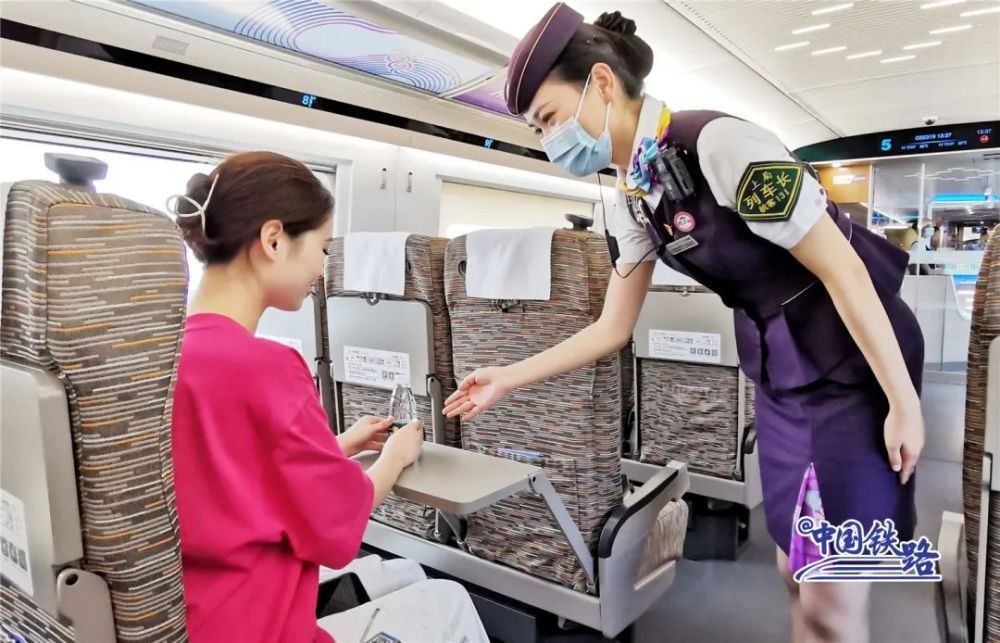

# 设计时速350公里！新款复兴号开跑

8月4日，杭州亚运会迎来倒计时50天。专为杭州亚运会打造的复兴号亚运智能动车组列车迎来首次试乘体验。

12时40分从杭州西站开出的G55318/55319次复兴号亚运智能动车组列车，途经合杭高铁湖杭段德清至桐庐东区间，进行了近两小时的试乘行驶。

近百名旅客参加了此次试乘体验活动。

该车为8辆编组，车辆定员578人，设计时速350公里。

车辆内外装饰分别以“中国特色、浙江风采、杭州韵味”和“润泽江南”为设计主题，外观主色调采用亚运会主形象色“虹韵紫”。

车身两侧喷绘有不同竞赛项目的杭州亚运会体育图标。

全车覆盖高速5G网络，高速率、低延时，让旅客在使用手机“冲浪”时更加顺畅。

1号和8号车厢座位设置的智能交互终端提供高铁娱乐中心、无线投屏、运行信息等功能，旅客可在旅途中看电影、听音乐。

便于残疾人出行的4号无障碍车厢拥有更宽阔的过道，各处盲文可以引导、提示旅客找到座位。这里还专门设置了轮椅存放区和大件行李存放区。

无障碍卫生间和轮椅放置区域为行动不便的旅客提供便利。

座椅、轮椅固定处、卫生间等视障旅客便于触及的区域设有盲文标识。

在节能环保方面，车头采用“鹰隼”仿生学设计，可大幅降低空气阻力。

列车配置车内气压与温度自动调节系统，可有效减少、舒缓车辆穿过隧道时气压变化致人耳鸣等不适症状。

今天，亚运会吉祥物组合“江南忆”也随车打卡，吸引众人目光。列车经停德清站、杭州西站、桐庐东站期间，不少体验者下车与吉祥物合影，气氛轻松热烈。

“颜色真好看！我给这款车的涂装打满分。”“特别平稳，几乎没有颠簸感。”“江南文化在这趟列车上生动展现。”……体验者们纷纷点赞。

此次试乘体验是复兴号亚运智能动车组列车通过运行试验后的首次载客运行。按照亚运服务保障计划，该车后期将安排在浙江省内高铁线路上运行。

杭州客运段从上千名乘务人员中遴选出44名业务技能精、综合素质强的乘务员，组建亚运服务专班。很快，他们将投入到杭州亚运会、亚残运会期间的高铁乘务工作中。

富春江边、西子湖畔、钱塘江岸，随着杭州进入亚运时间，让我们共同迎接盛会的精彩时刻。

供稿：《人民铁道》报业有限公司上海记者站（上海局集团公司融媒体中心）

文字：吴少妮 胡晓炜 卢思丹 陈俪 陈怡宁

图片：吴少妮 朱明轩 沈克勤 吕杰琛 周围 叶飞

视频：刘文俊

编辑：孙晓远

实习编辑：周沫

审校：李孝佺

