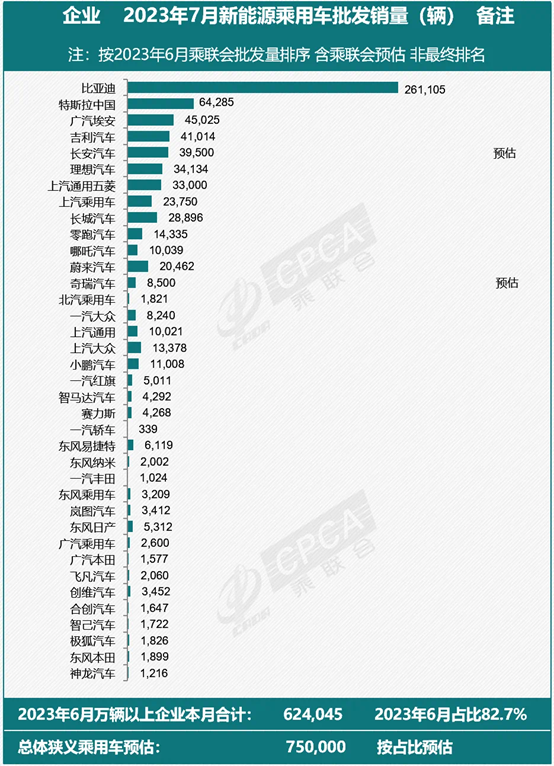

# 车企7月成绩单：存量市场厮杀，小鹏蔚来都翻身，谁被割了肉？

腾讯汽车 特约作者 余跃

车市下半场刚刚开启，主流新能源车企集体晒出的业绩单似乎都“电力十足”，与之相对应的，则是传统燃油车企的销量持续下探。

刚刚过去的7月份，比亚迪整体销量为26万辆，稳居新能源汽车销量第一宝座；广汽埃安同期销量超过4.5万辆，位居国内品牌第二；理想汽车也以3.4万辆的交付量，继续领跑造车新势力阵营。就连之前相对惨淡的蔚来和小鹏，也都打了个翻身仗，蔚来7月新车交付破2万辆，小鹏也再度回归万辆行列……

 _（图片来源于乘联会官网）_

“有人拉阳线，必然有人被割肉。”全国乘用车联席会秘书长崔东树对腾讯汽车表示，毕竟7月份国内乘用车市场只维持了一个微增长的态势。在这个国内车市的传统淡季，这些新能源销量数据无疑都足够亮眼，但“新能源车爆发与燃油车落寞”的特征也较为明显。

据乘联会8月2日公布的最新销量统计数据显示，今年7月份，全国乘用车销量173.4万辆，同比下降5%，环比下跌8%。其中，新能源乘用车销量为64.7万辆，同比增长33%。在这个承上启下的关键节点，7月份的新能源车大爆发，一扫今年上半年因大降价带来的车市阴霾。

但大家更关心的是，今年下半年乃至未来两年的国内车市，真的能让所有人都开心吗？

**蔚小理领衔，新能源车集体逆势上扬**

一如过去新势力品牌快速公布业绩抢眼球的习惯，刚进入8月份，各大新能源车企就相继发布了7月销量成绩单。

在新势力阵营中，理想、蔚来、零跑、小鹏、哪吒继续占据前五名。其中。理想继续蝉联新势力榜首，连续两个月交付突破3万辆；蔚来7月首次单车型月交付破万辆，整体销量突破2万辆；零跑位居第三位；小鹏终于依托G6的陆续交付恢复月销过万。

即便是在新能源汽车渗透率持续攀高的当下，新势力品牌的交付量也显得尤为不易。尤其是今年三月份的车市集体大杀价，打了大家一个措手不及。从今年二季度开始，作为新造车势力代表的蔚小理，也开始出现了分化，理想持续一路狂奔，蔚来苦苦挣扎，小鹏则一直无法止住销量下滑的颓势。

今年6月份，蔚来发布的第一季度财报显示，一季度蔚来净亏损47.395亿元，交付量创新低。6月份，蔚来整体交付量仅为1.07万辆。此间，李斌也曾自我调侃，“如果蔚来还总是每月交付一万辆，那么我真的该找工作了。”

随后的6月12日，蔚来官宣全系车型价格下调3万元，并将新购车用户免费换电的权益与新车解绑。通过一系列的营销策略调整，以及全新ES6等新车的发布，蔚来终于在7月份稳住了势头，月交付量突破2万辆，李斌也终于“保住了工作”。

而在小鹏G6上市发布会上，何小鹏也以唯一产品model的身份走上T台，从产品力讲解到价格公布，从XNGP技术升级到渠道政策调整，无不一一卖力讲解。好在作为“全村的希望”的G6也确实争了一口气，上市后的首个月交付量就达到3900台。按照此前公布的订单量，目前终端交付的缺口依旧很大。“小鹏正在积极提升G6的产能，后续能进一步提升交付量。”小鹏汽车相关人士对腾讯汽车表示。

从总体上来看，新造车势力中，“蔚小理”在7月份均实现了较大的突破，零跑（7月交付14335辆）和哪吒（7月交付10039辆）也保持着良好的势头。

而传统车企的新能源车销量也水涨船高，广汽埃安7月销量为45025辆，这已经是其今年连续五个月销量超过4万辆；极氪7月交付量为12039辆，已连续6个月同、环比双增长；长安深蓝7月交付达成13172辆，其中深蓝S7累计交付9197辆。

“7月份作为车市传统的淡季，却有着超预期表现，更多是由于补贴政策和促销刺激因素叠加导致。”崔东树表示，预计今年下半年，国内新能源汽车消费需求和销量表现，会在政策驱动下理性持续增长。

**“电上油下”，车市存量之战愈演愈烈**

国内车市红红火火已经多年，“微增长”的提法也已有时日，但谁也没真的想过有一天，大家需要在仅有的存量空间中，找到各自的未来增长点，且只有更具竞争力的产品、更贴合市场的品牌传播和更创新的营销手段，才能获得更多的“蛋糕”。

据乘联会8月2日公布的最新销量统计数据显示，今年7月份，全国乘用车销量173.4万辆，同比下降5%，环比下跌8%。其中，新能源乘用车销量为64.7万辆，同比增长33%。1-7月份，全国乘用车销量为1125.9万辆，同比增长1%。其中，新能源乘用车累计销量373.3万辆，同比增长37%。

“无论是7月单月，还是今年1-7月份，新能源车销量增幅都超过了30%，但整体乘用车市场却是一个微增长的结果，说明的问题是，传统燃油车尽管仍旧占国内车市的消费主力，但在增速方面还是拖了不小的后腿。”知名汽车评论员张志勇对腾讯汽车表示。

一面是自主品牌车企凭借新能源汽车的红利水涨船高，一面是合资品牌没有抓住电气化转型的节奏，无论是战略调整，还是新产品的推出节奏，都没有跟上市场发展的速度，所以在与自主品牌的竞争中丢失了不少的“阵地”。

这一点，从今年上半年的销量统计数据就能看出来。比如，今年6月份，一汽-
大众销量为197721辆，同比下滑7.4%，1-6月份整体销量为846871辆，同比下滑1.1%；上汽大众6月份销量为95833辆，同比下滑24%，1-6月份销量为503289辆，同比下滑12.4%；上汽通用6月份销量为93000辆，同比下滑25.8%，1-6月份销量为450958辆，同比下滑11%。

要知道，一汽-
大众、上汽大众和上汽通用这个“金三角”，过去一直处于国内单一车企销量排行榜的金字塔尖。如今，在国内车市进入电气化的新周期，尽管在绝对销量上依旧位于合资阵营头部，但整体发展势头已经每况愈下。

“在汽车行业转型升级的当下，整个供应链跟此前有较大差距和变化，受企业原有理念等因素束缚，很多传统车企较难‘破圈’，因此也许无法适应快速的行业变化和激烈的市场竞争。”汽车行业分析师田力表示。

而随着国内汽车市场竞争愈发刺刀见红，可以预见的是，存量之争下的淘汰赛，不仅在以新能源为主的新势力阵营中开打，在传统合资车企中也正在上演。“电车上油车下的终端销量走势，已经促成了自主品牌对合资品牌原有市场份额的蚕食，今年下半年乃至未来两年，这种势头似乎还不可逆转。”张志勇表示。

只见新人笑，不闻旧人哭。这个7月份，国内车市在销量端出现的两种截然不同的走势，至少也会给下半年车市带来一个很大的预警。

