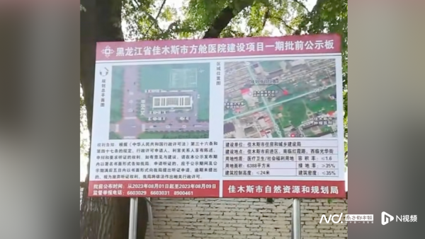

# 还建方舱医院？为花钱而花钱的现象必须遏制

_佳木斯市方舱医院建设项目公示牌。网络截图_

近日“佳木斯方舱医院”的相关话题频频登上热搜。有网友发视频称黑龙江省佳木斯市前进区附近居民区正在设立方舱医院，这位网友质疑：“为何全国都在拆除方舱医院，这边的社区还在设立方舱医院？”

面对质疑，佳木斯市相关部门的回应不但未能止疑，还引发了更大的热议。一曰：“项目申请资金用的方舱医院，是疫情防控期间国家给予的专项资金，现在经费已经批下来了，不建不行。”二曰：“该方舱医院在名义上是隔离点，但实际用途现在做的是文旅类项目，主要是文旅、潮玩、宾馆。”

以当下的疫情状况，还需要大建方舱医院吗？相信这是佳木斯方舱医院最初引发围观的根本原因。

没想到，奇怪的事情还不止佳木斯一例。随后媒体报道，不仅佳木斯，哈尔滨也在为方舱医院建设招标，云南文山也爆出，将耗资2200万建永久性方舱医院。

如果说当下一些地方准备建方舱医院的消息已让人惊诧，那么当地有关部门的回应遭遇强烈质疑就更不意外了。

“经费已经批下来了”，但过去批这笔经费是鉴于当时的疫情，现在情况已经发生根本性变化，这笔钱就一定要花吗？

以预算已批作理由站不住脚，改换名目也要用完经费，其性质同样恶劣。因为其项目公示里明确写着要建方舱医院，如果以建方舱医院的名义申请专项资金，实际却是规划建设文旅、宾馆类项目，岂不是涉嫌预算造假？

一言以蔽之，在实际情况和用途已经发生根本改变的情况下，置低效甚至浪费的后果于不顾，还要执着按原计划花完经费，这就是为花钱而花钱，是对公帑的巨大靡费。

当下一些地方大建方舱医院，很容易让人想起“突击花钱”现象。

长期以来，一些部门一度嗜好在年底“突击花钱”。在其看来，花的这些钱经过了正常审批程序，而且并未突破预算，所以花起来心安理得。

然而，是否突破预算当然是一个问题，但更重要的难道不应该是看这笔支出是否必要和正当？

近年基层财政状况并不宽裕，中央屡屡重申，要“节用裕民”，“钱要用在刀刃上”，当下又值防灾救灾的时节，岂容公帑以各种名义白白消耗？

无论如何，这种漠视实际情况，置低效甚至浪费的后果于不顾，也要强行花光预算的现象亟须得到遏制。

