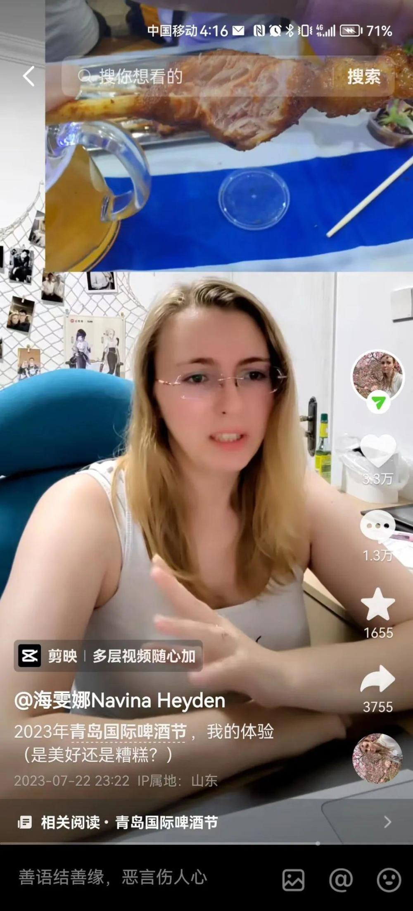
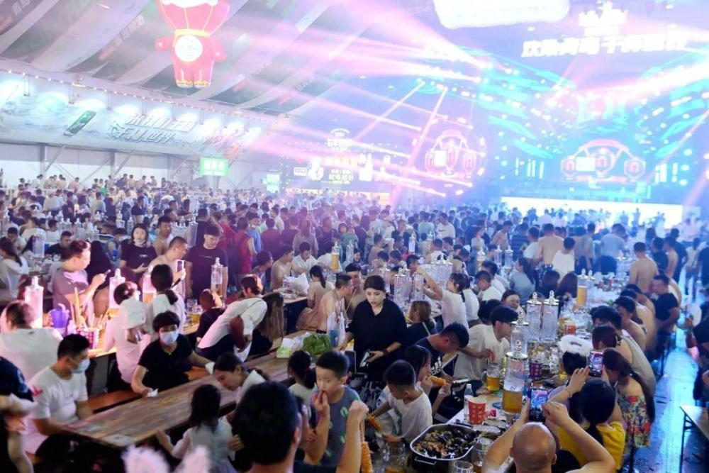

# 青岛啤酒节，“又贵又假”？

近日，来自德国的留学生海雯娜在社交媒体上分享了她在青岛啤酒节上不愉快的经历，她认为啤酒价格昂贵、口感发酸，并质疑羊肉串有问题，“又贵又假”，引发关注。

青岛市崂山区文旅局一位工作人员告诉中国新闻周刊，关于海雯娜反映的问题，他们已经掌握相关情况，目前正在会同区里其他部门进行调查。“检查结果现在在进行中，我们会积极加大对文旅行业，对商户的监管力度。”

8月2日晚间，海雯娜在社交媒体发文说，青岛市市场监管局主动联系她，就此事到该局接受商家的道歉和赔偿。

_海雯娜在视频中展现了她认为有问题的羊肉串。_

南开大学旅游与服务学院副教授于海波对中国新闻周刊表示，青岛在全国游客心目中的地位很高，发生这类影响口碑的事件，反映出该市旅游接待和文旅市场综合监管存在薄弱环节。

“旅游舆情事件的表层影响因素通常是具体事件涉及的消费价格、诚信和安全问题，但深层次原因是网友对同类问题未来可能反复出现的忧虑。”她说。

**“基本属实”**

海雯娜告诉中国新闻周刊，因为听说青岛国际啤酒节很像德国慕尼黑啤酒节，因此穿上德国传统服饰前往体验。

在啤酒节上，海雯娜点了2升啤酒，8个羊肉串。其中，2升啤酒花了180元，海雯娜认为价格昂贵，且口感发酸。“这个酒，她们说是德国原装啤酒，但是这个Hofbräu
München品牌，我从前没有喝过，因此不敢说是不是真的。”

她还认为，他们吃的羊肉串“有问题”，她觉得并不是真的羊肉，“可能这是鸡肉或者鸭肉”。

海雯娜的文章和视频一经发出就引发了广泛的争议。有评论认为海雯娜在博关注，也有网友表示赞同：“青岛啤酒节我也去过，她说的我信。”

海雯娜告诉中国新闻周刊，视频发布之后，涉事商家专门在社交媒体上创建了账号，发布了一篇名为《关于澄清网络不实言论的声明》，并关联了她。“他们指责我诽谤。”她说。

这篇声明指海雯娜利用其“特殊身份”，用没有事实依据的臆断言论误导网络舆论，认为这些背离事实的网络谣言严重影响了企业声誉，对啤酒节造成不良影响。并提到，他们将保留追究虚假不实言论法律责任的权利，包括但不限于民事诉讼和刑事告诫。

该声明署名是“崂山啤酒节慕尼黑啤酒花园参节团队”。

对于商家的声明，海雯娜表示，她只是表达一个普通人消费之后的感受，而商家在对她的声明里使用了一些带有威胁性的词语。

她在另一段发布在社交媒体上的文字中写道：“我没有攻击你们的目的，我没有在视频里展示你们的名字，我通过视频对你们的服务打差评，也是法律给我作为消费者的权利。”

北京合川律师事务所律师李雷对中国新闻周刊表示，《消费者权益保护法》第十五条规定，“消费者享有对商品和服务以及保护消费者权益工作进行监督的权利”。

他认为，消费者对商品和服务进行评价是监督的最基本的形式之一。经营者的名誉权和消费者的监督权之间，存在着一定的张力，消费者并非专业人士，对商品和服务的评价即便存在一定的误差也应该是允许的。

而随着舆论的关注，事件也有了新的进展。8月2日晚间，海雯娜发文说，青岛市市场监管局经现场调查，结合自己提供的图片视频，认为她反映的“酒棚所售卖的啤酒可能是非德国原装慕尼黑皇家啤酒，所售卖的羊肉串可能并非羊肉”基本属实。

她说，在青岛市市场监管局的主持下，她接收了酒棚商家赔偿给她的1200元（退一赔三），并接受了酒棚展商给她造成不佳消费体验的道歉。同时，商家完全撤回了他们的不当声明。

 _青岛国际啤酒节。中新社发 俞方平 摄_

**并非孤例**

海雯娜的遭遇并非孤例，前段时间，青岛良友味道酒店因“一桌收取三次费用”“多收取6000元餐费”等登上热搜。

在崂山区发布的《情况通报》提到：6月9日晚，刘女士与周先生、肖先生等朋友在该酒店“户外1桌”聚餐，其同事在“大厅7桌”就餐。在客人就餐过程中，周先生付账结算了“户外1桌”的账单，随后肖先生又来结账时，酒店工作人员以为是“户外5桌”的客人，导致账单出错并结付了该账单。之后，肖先生和刘女士在结算“户外1桌”和“大厅7桌”的账单时，与酒店梳理账单时发现结账有误。工作人员将错收的“户外5桌”的费用3400元当场退还。

该通报还提到，崂山区市场监管局调查核实，“多收取6000元餐费”的情况不属实，错收的3400元餐费已于事发当晚当场全额退还。

在崂山发布该通报之后，当事人刘女士写了一份《良友味道重复收费事件情况说明》介绍当晚发生的情况。

刘女士在说明中说，是她结账时遇到了等候开发票的肖先生，和正好经过的周先生，彼此沟通后才发现账单有问题。在声明的最后，她认为，崂山发布的调查不该只听信商家一家之言。

在人民网“领导留言板”中，一位网友留言称青岛第二海水浴场没有提供免费冲水的地方，冲脚上的沙子还得扫码付款，2元只能冲30秒，并认为这种做法与青岛国际旅游城市定位相违背，旅游体验很差。“公厕都能做到免费，难道沙滩免费冲脚做不到吗？”

在该留言下，署名为“市公安局”的账号回复称，冲脚设施收费并非二浴单设，其他浴场与景区都存在此类情况，收费标准全市统一定价。

也有网友留言称，其在青岛旅游期间，遇司机恶意绕路，被他们发现后，却遭遇了司机辱骂，该司机称其可以随意调表，想要调多少钱就多少钱，并关闭车门，不让他们下车。在他们无奈选择报警后，110虽到现场核实确实是司机绕路多收钱，但是对出租车司机辱骂乘客宰客问题未作任何解释处理，只是让他们付费后让司机再次送他们回酒店，结果途中再次被司机辱骂。

青岛市交通运输局回复称，该网友所乘坐的出租车当次营运情况涉嫌违反《青岛市客运出租汽车管理条例》相关规定，已依程序对驾驶员进行处罚。

一位旅游业内人士对中国新闻周刊表示，虽然当地交通运输部门对涉事司机进行了相应的处罚，但在确认涉事司机存在绕路多收钱的行为后，仍让该司机送游客回酒店，致使游客在途中再次被辱骂，显然影响了游客的旅游体验。

**专家：加强监督及执法力度**

于海波认为，旅游市场秩序是很多热点旅游城市的老大难问题，加之近些年游客消费足迹扩大到了市民生活区，旅游市场秩序涉及的范围和成因通常非常复杂，治理难度也非常大。

所幸的是，当下各地政府对文旅市场秩序难题形成了不少有效经验。如哈尔滨设立旅游诚信基金，建立涉旅投诉先行赔付制度；三亚近期也设置智慧监管系统，对海鲜餐饮、旅游购物点都进行了信用赋码，消费者扫码就可以查看具体摊点的信用分值、消费投诉信息等。

深圳大学旅游发展研究中心研究员刘杰武表示，青岛是沿海发达地区，客源市场又相对稳定，面对上述问题，青岛应加强对市场主流文旅产品的动态监管，尤其是主动性监管，加强对违规商户、不诚信商户不当行为的预防。

在他看来，应建立重要旅游季及重大文旅活动的重点监察制度，在重要旅游季，重大的文旅活动中，尤其要加强监督及执法的力度，对于各个环节严加管理，及时应对各类突发事件。

作者：陈淑莲

