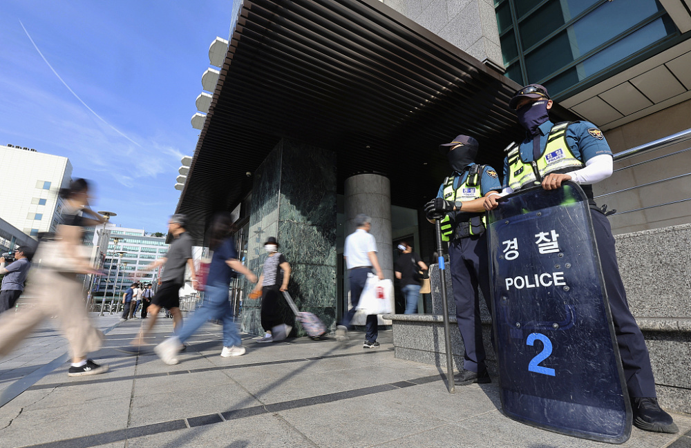
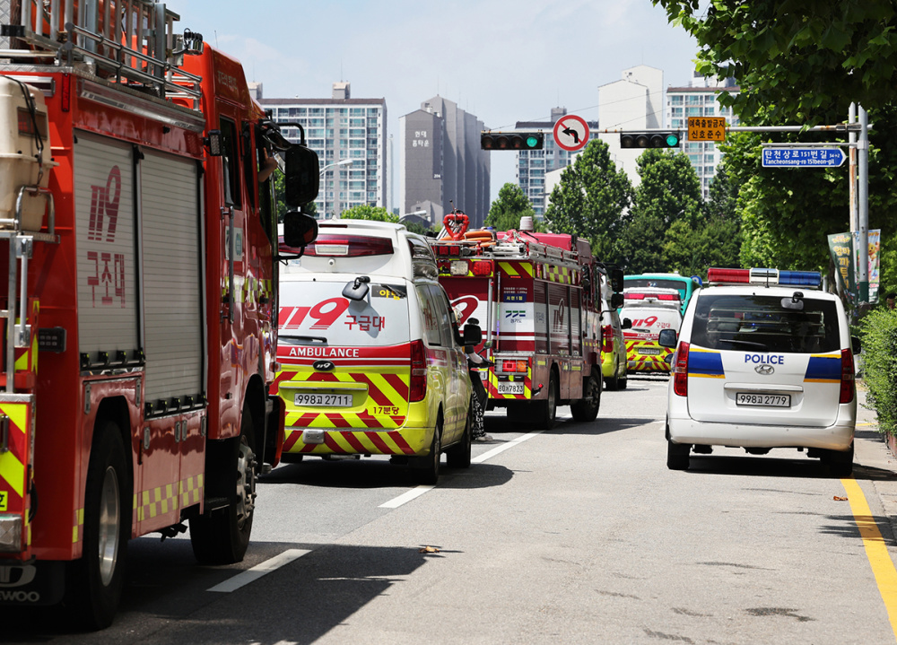
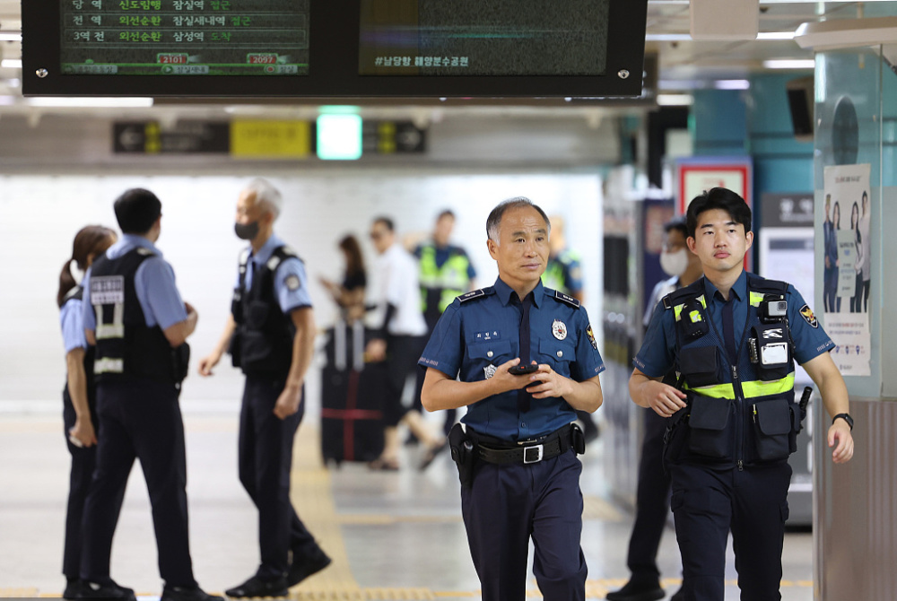
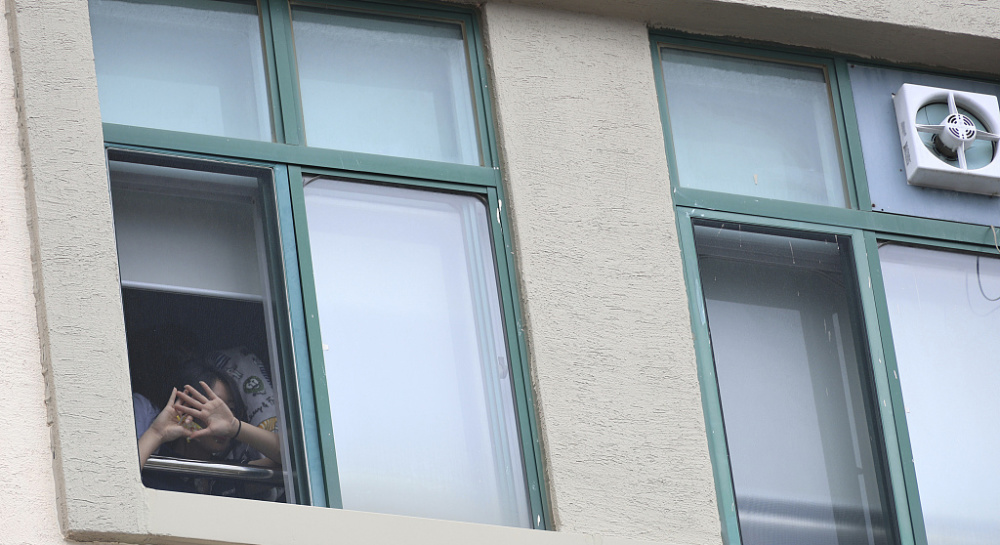
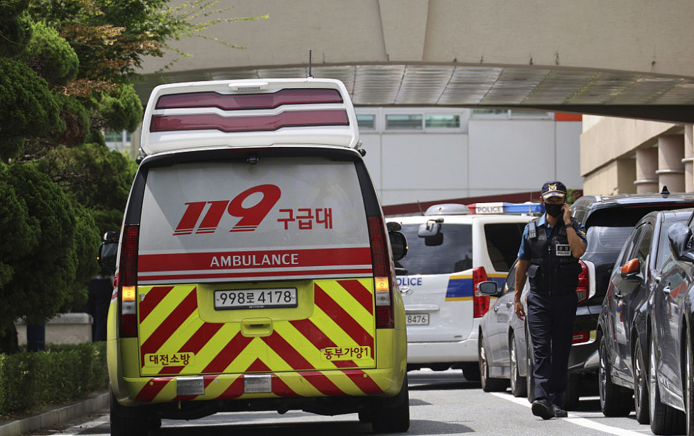
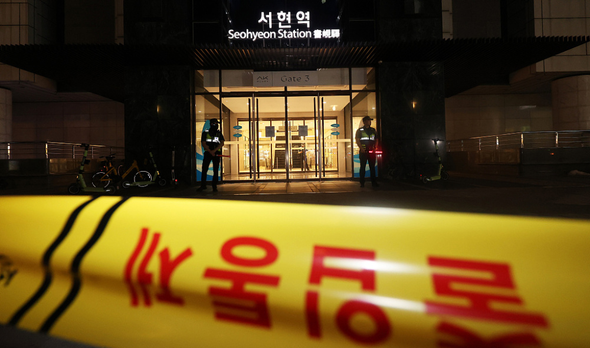
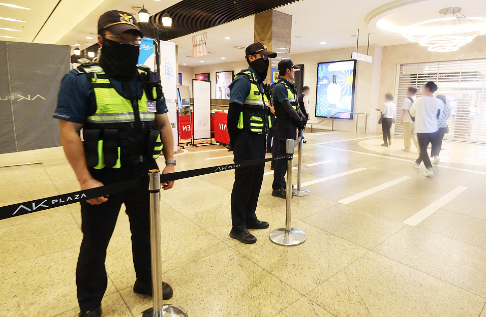

# 韩国接连出现“杀人预告”，政府动员警力予以超强硬应对

据韩联社8月4日最新报道，韩国国内网络平台“棒球画廊”今天凌晨出现题为“今晚7点将在江南站杀死100人”的帖子，内容为“在江南站十字路口用卡车将人群推散，并用凶器刺伤他们应该很有意思”。此前，针对京畿道城南市3日发生“无差别袭击事件”及此前出现的行凶威胁帖，韩国总统4日下令，要求政府动员全部警力予以超强硬应对。

_当地时间2023年8月4日，韩国城南市，警察在西岘地铁站附近站岗。_

韩联社称，在京畿道城南市盆唐西岘站附近发生“无差别袭击事件”后，相继有首尔市内指定为犯罪场所的“杀人预告”文章上传到网上。韩国警方4日称，3日19时左右，韩国一个网络社区上传一则内容为“明天早上将在蚕室站杀死20人”的帖子。当晚23时左右，网络再次出现写有“明晚10点将在汉堤站动刀杀人”等内容的预告帖子。目前，相关帖子均已被删除。各地接到报警后，警方进行通宵搜查，截至今日上午，韩警方仍在预告帖子中提到的各大地铁站、俱乐部等人员密集区域开展搜查工作。

 _当地时间2023年8月4日，韩国城南市，警察在西岘地铁站加强巡逻。_

_当地时间2023年8月4日，韩国城南市，警车和消防车在西岘地铁站严阵以待。_

当地时间2023年8月4日，韩国首尔，警察和地铁站相关人士在蚕室站警戒，这是网络中指定为犯罪场所之一。

_当地时间2023年8月4日，韩国首尔，警察在地铁蚕室站巡逻。_

在当地时间8月4日，据韩国警方透露，在大田市大德区的一所高中发生了持刀伤人事件，一名教师受伤，目前已经失去意识。据目击者描述，行凶者是一名外部人员，他到教务处询问受害教师相关情况后，在受害教师授课的教室外等了一小时左右，下课后尾随受害教师并持刀行凶。据悉，犯罪嫌疑人已被韩国警方抓获。

 _当地时间2023年8月4日，韩国大田市，一所高中发生持刀伤人事件。_

_当地时间2023年8月4日，韩国大田市，当地一所高中发生持刀伤人事件，警方正在追捕犯罪嫌疑人。_

_当地时间2023年8月4日，韩国大田市，一所高中发生持刀伤人事件，救护车在等待受伤人员。_

此前据韩国媒体报道，当地时间8月3日下午6点左右，韩国京畿道城南市盆唐区一座购物广场附近发生“无差别袭击事件”，造成十多人受伤。据现场目击者称，嫌疑人是一名年轻男性，事发时该男子先驾车冲向人行道造成5名行人受伤，随后下车进入商场挥舞凶器伤人。

 _2023年8月3日，嫌疑人戴着黑色墨镜，穿着深色裤子和鞋子。（视频截屏）_

_当地时间2023年8月3日，韩国京畿道，城南市购物广场发生“无差别袭击事件”后，警方封锁现场。_

 _当地时间2023年8月3日，韩国京畿道，城南市购物广场发生“无差别袭击事件”后，警方正在控制现场。_

韩总统室公报首秘金恩慧在8月3日记者会上透露，韩国总统尹锡悦表示，城南“无差别袭击事件”是针对无辜市民的恐怖袭击。鉴于社交媒体上也出现了行凶威胁帖文，政府要通过预先投入警力、配备强力有效的压制工具进行防范。

**图文来源：央视新闻客户端、环球网、视觉中国、澎湃影像**

