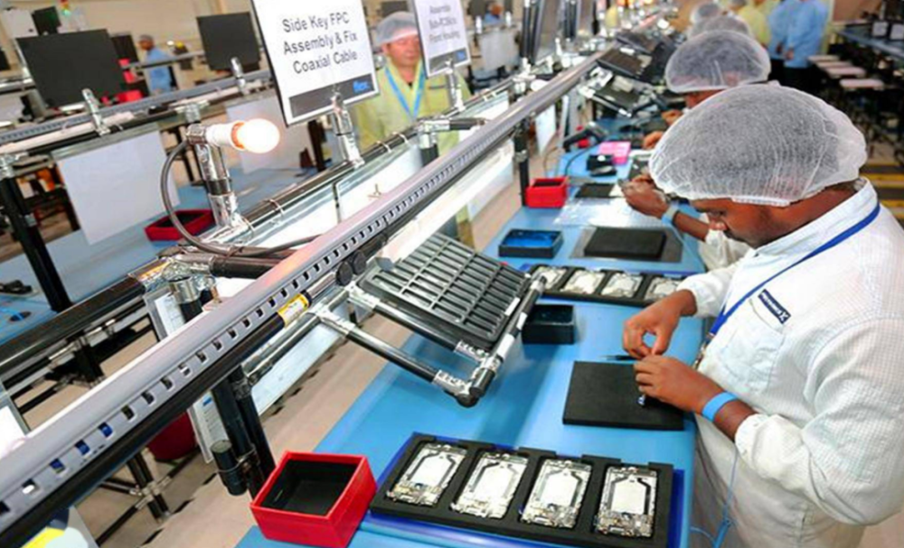
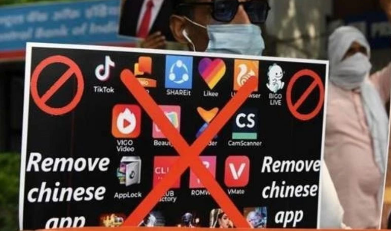
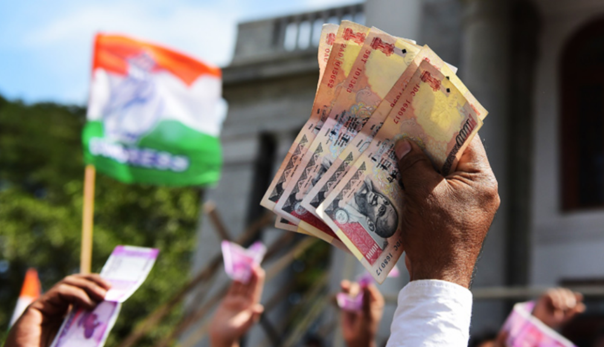
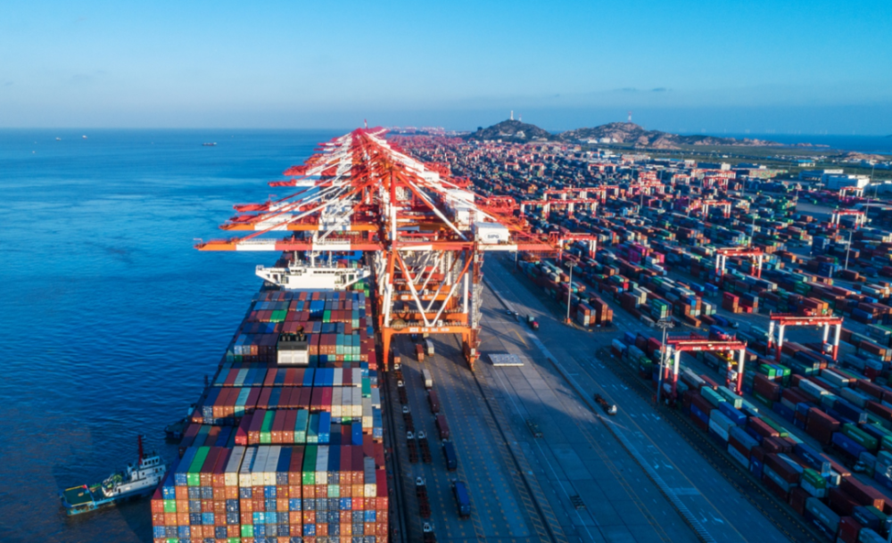
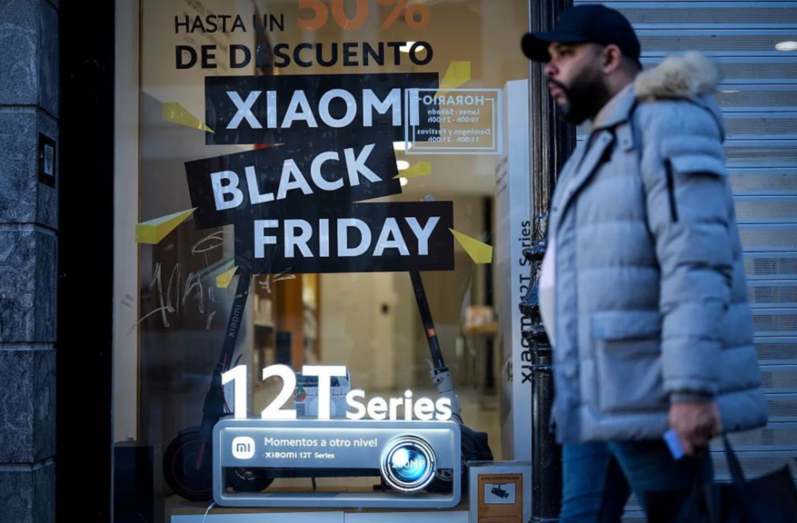
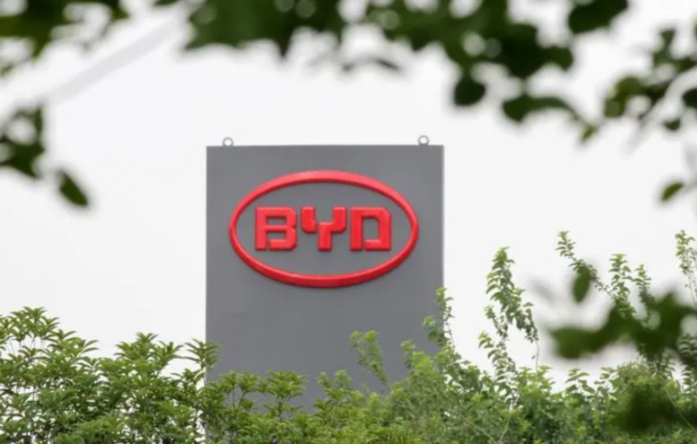

# “养羊又杀羊”！曾是中企必争之地的印度为何变为“外资坟场”

文 | 白嘉嘉

看起来，在印企业的受害者名单又要扩编了。

8月3日，印度政府通知，印度限制了笔记本电脑、平板电脑和个人电脑的进口，即刻生效，以推动本土制造。

**即刻生效，主打一个“偷袭”。**

根据印度政府数据，笔记本电脑、平板电脑和个人电脑约占该国年进口总额的1.5%，其中近一半来自中国。

对此，印度电子行业协会MAIT的前总干事阿里·阿克塔尔·贾夫表示：“此举旨在推动印度制造业。这不是轻推，而是强推。”

这不是印度政府第一次以推动本土制造业为由割外企韭菜，长长的受害者名单中，微软、比亚迪、小米、OPPO、富士康、vivo等一众企业覆盖各行各业。

中国社科院亚太与全球战略研究院副研究员刘小雪指出，印度法律环境有其特点：一般而言，纸面上的法律规定很多、很繁琐，但实际执行的情况则完全不同。

法律规定和执法力度之间的落差是印度营商环境的常态，这种“常态”导致的结果有两点，
**一是严格遵守法律条文的企业很难在市场赢得竞争优势甚至难以生存，二是印度执法部门由此获得了选择性执法、根据需要执法的操作空间。**

**所谓操作空间，就是“养羊杀羊”的空间。**

印度身上有许多充满想象力的标签，世界第一人口大国、全球经济增长最快的国家之一、人口结构年轻等等。

但这些充满诱惑的标签背后，却是营商环境不成熟、法制不健全、政治对立、社会构成复杂、基础建设落后等阻碍，让无数企业折戟沉沙，血本无归。

**这些弊病有些是印度政府有意而为之，有些是经济体发展过程中绕不过去的弯路，而毫无疑问的是，想要在这块“新大陆”占有一席之地，理解印度是所有企业的必修课。**

莫迪钓产业链，意在技术

“世界需要一个可靠的供应链，谁能是比世界上最大的民主国家更值得信赖的伙伴？”

在7月28日举行的印度半导体论坛（Semicon
India2023）开幕式上，面对台下数百名半导体行业高管，印度总理莫迪卖力“推销”起印度作为半导体产业基地的“可靠地位”。

莫迪在致辞中形容，印度政府已经为全球半导体企业“铺开了红地毯”。在他看来，印度赢得了不少投资者信心，因为印度有着“稳定、负责和以改革为导向的政府”，不断发展的基础设施和科技以及庞大的人才库。

暂且不论印度到底有没有一个“稳定、负责和以改革为导向的政府”，莫迪的致辞至少透露出了一条信息， **印度对产业链的极度渴望** 。

但有意思的是，在不久之前，富士康刚刚退出了与印度矿业集团韦丹塔（Vedanta）成立的价值195亿美元的半导体合资企业。

是铺开的红毯不够红吗？

对此，“双向奔赴的互坑”是最贴切的描述。

按照富士康和韦丹塔的合作备忘录，双方将共同投资建设28nm制程的12英寸晶圆厂及配套封测工厂，并预计在2025年正式投入使用。

这意味着，印度将拥有首座由印资控股的12英寸晶圆厂，为“印度制造”十年计划添上浓墨重彩的一笔。

然而，富士康其实没有高端芯片代工的经验，它距离芯片最近的一次，是收购了夏普的40nm制程的8英寸晶圆厂，无论在开发难度还是工艺转化成本上，距离28nm都还有相当长的距离。

为了打破尴尬，富士康和韦丹塔拿出了一份颇具“临时抱佛脚”色彩的解决方案—— **找到欧洲半导体巨头意法半导体，寻求生产技术许可。**

印度政府本就不太看得上40nm，现在和更具技术实力的“大牛”扯上了关系，那能让他随随便便跑了？

雁过拔毛的印度政府邀请意法半导体“参与到更多的游戏中”，比如，入股富士康与韦丹塔的合资公司。

项目的进展由此陷入了僵局。

意法半导体不愿意深度参与印度市场，28nm技术谈判陷入僵局。印度政府看不上40nm制程，从而延缓了激励资金的审批。
**富士康眼看补贴迟迟不能到账，于是决定及时止损。**

**星星之火被掐灭，不仅意味着富士康的“转芯”战略阶段性失败，更给为其它有意投资印度的半导体厂商敲响了警钟，而莫迪本人也只好亲自上场吆喝。**

**从富士康的案例中，不难看到印度摆在明面上的对产业链的渴望，以及写在“附录”里的“优惠政策仅限高精尖技术”。**

这一基本原则塑造了印度“两面派”的形象， **继而导致印度的制造业发展迟迟难以步入正轨。**

**任何高精尖技术的落地，都离不开背后庞大的基础建设和产业链，而不愿意踏踏实实地干”苦活累活“的印度，意图靠几家掌握核心技术的企业从无到有地建起一座“空中楼阁”，这种先“上车再补票”的思维，无疑是将所有对印度市场抱有善意的企业放在火上烤。**

和其他成熟市场相比， **印度的基础建设相对薄弱，常发生停电** 。

而芯片产业链则是出了名的耗电。

芯片巨头台积电2022年耗电超过200亿度，而印度2022年的总发电量只有1.8万亿千瓦时。

这意味着，仅仅一家台积电，就要消耗印度超过1%的总发电量。

更关键的是，对手机组装产险来说，停电可能只会导致延期交付，但放在芯片领域，就有可能导致这一批次的产品全部报废。

显然，没有企业会愿意承担这样的风险。

**之所以印度在产业链和基础建设上显得缺乏耐心，主要是因为印度所能打出的最大的王牌——人口红利，并没有想象中的那么令人惊艳。**

20世纪70年代以来，印度的总和生育率持续走低，从1971年的5.2%下降到2019年的2.1%（该数值被认为是人口世代更替水平）。

同期，农村人口总和生育率从5.4%下降到2.3%，城镇人口总和生育率从4.7%下降到1.7%。

有学者指出，从1993年至2004年，印度青年人口和老龄人口增速分别为1.9%和3.5%。而在2004年到2018年期间，印度的青年人口和老龄人口的增速分别是1.8%和5.1%。

这两个数值的一升一降， **说明印度将比预期更快进入老龄社会** 。

如何在越来越短的人口红利窗口期内实现印度制造？答案尚未浮现，但连连出手的印度镰刀，却暴露了印度的急躁。

“外企”为何在印度总是水土不服

按理说，同为发展中国家，中国恰好只领先印度一个身位，印度需要外资来创造就业和提升基础建设，中国也需要新兴市场出口过剩的产能，彼此之间非常互补。

但为什么印度政府对于和中国展开合作总一副“不情不愿”的样子？

**历史遗留问题引发的民族主义情绪，是中印贸易正常化的最大绊脚石。**

**中印边境问题是昔日英国殖民者留下的产物，中国一直主张从全局视野和战略高度看待和发展中印关系，认为边境问题并非两国关系的全部，但印度近年来坚持“边境对峙不解决，中印关系就不正常”的立场，一心将两者捆绑挂钩，试图迫使中方让步。**

2020年，在加勒万河谷，中印爆发了激烈的肢体冲突。

对于这场冲突，中方释放出的视频明明白白地回答了谁越线在先、违约在先、动手在先的问题，责任清清楚楚。

但两年多来，印度政要、媒体但凡在国际场合谈及中印关系，都会摆出“受害者”模样，将冲突及此后对峙的起因归咎于中国。这种心态已经深埋在部分印度人心中长达60年，甚至可以追溯到1962年边境冲突的失利对一些印度精英和大众心理上产生深远的影响。

这一点从印度媒体对中国企业的报道中可见一斑。

在虎嗅的一篇报道中显示，同样是查税事件，印度媒体对其他国家公司的评论就较为中性，但对中国公司的描述就较为负面，有时会上升到“间谍”这类的字眼。

而且当媒体放大中国企业税务问题后，民众的情绪往往会被挑起，能获得更大的流量。

**在民粹思想和民族主义情绪的助推下，印度政府将本来隐藏在经贸背后的政治动作摆上了台面。**

2020年6月，印度禁止国有电信公司及其母公司印度国营电信公司使用中国华为和中兴的产品升级4G基础设施。

2020年7月23日，莫迪政府以国家安全为由修改《2017年财政总则》，限制从所有与印度陆地接壤的国家购买包括公私合营的项目在内的大型公共项目，阻止中国参与印度电信、电力、煤炭和石油等战略行业。

2021年5月，印以国家安全为由将中兴和华为踢出5G试验，给中兴和华为带来数千万美元的损失。

甚至连绝地求生这样的游戏，印度政府也没有放过。

“损害印度主权、国防、国家安全和公共秩序”，
**印度政府为抖音、微信、绝地求生在内的多个APP定了调，并接连开展了5次所谓的数字打击，分别禁止了59、47、118、43和54款中国APP。**

据报道，TikTok和Helo应用程序的母公司字节跳动公司曾计划在印投资约10亿美元，由于上述禁令，字节跳动将在印市场损失至少60亿美元，多于所有其他被禁应用程序的潜在损失之和。

**市场上有一种论调，认为印度在“坑外企”这件事上做到了“一视同仁”。**

**客观来说，这种描述并不准确，从政治、历史脉络上站不住脚。**

但从现象上来看，确实不止中国企业被坑，为什么？

关于印度，最广为人知的矛盾一面在于，一边饥荒，一边出口粮食。

据2021年全球饥饿指数排名显示，印度在116个发展中国家中排名第101位，属于“重度饥饿”区域。

然而，2021年至2022年，印度农产品出口超500亿美元，创下了新纪录。

并且这一数字还在不断扩大。印度商务部长皮尤什·戈亚尔表示，2022到2023年，印度的小麦出口可能超过1000万吨。

**矛盾背后，是宛如中世纪的欧洲领主般割据于各个产业、地区的政党、家族、种姓和地主。**

**为了将分散在各个集团手中的权力和资源收拢回来，避免财富通过贸易逆差、移民等方式流向国外，莫迪政府选择培植效率更高、也更听话的“国家资本”。**

根据印度国家证交所的数据，20220年，印度最大的20家企业的利润占到总量的80%。

同时，根据华尔街日报的数据，
**印度的六大财阀，如今控制着印度25%的港口、45%的水泥生意、三分之一的钢铁产业、近69%的电信用户和45%以上的煤炭进口。**

根据《连线》杂志在2015年的数据，与莫迪关系极其紧密的企业家大约有6-8名。

这些几位企业家掌管的企业总共欠印度银行35万亿卢比，而印度整个银行业的总资本当时也不过50万亿卢比。如果这些印度企业破产，整个印度70%左右的银行资本将消失。

**与印度经济的高度绑定，使得这些企业“大而不能倒”，但与韩国财阀不同的是，印度财阀并没有很强的国际竞争力，只能在政治保护伞下摘低垂的果实，或对外国公司“敲竹杠”来壮大己身。**

而这也是印度成为“外企坟场”的核心原因，
**印度政府既需要这些企业来提升效率，增强政令的影响力，又不得不小心翼翼地保护它们不在与国际巨头的竞争中遭受损失，从而影响印度经济。**

如今的印度就像一枚被高高抛起的硬币，正反两面不断翻转，甚至呈现出相互促进的景象，但硬币总有一天会落地，在尘埃落定之前，印度需要让制造业步入正轨、加快城镇化进程、转换产业人口结构、提升人均受教育水平……

想要完成这条长长的任务清单，不论印度情愿与否，中国都是唯一的选择。

中国企业和印度，剪不断理还乱

学术界有一个共识， **寄希望于利用经济手段以实现政治或外交政策目标往往无用或适得其反。**

这一点也在印度对中国的脱钩政策中应验。

**尽管印度政府发起了对中国产品的种种抵制，但中印之间的贸易仍在蓬勃发展。**

在2020至2021财年，中印双边贸易达1256.2亿元，同比增长43%，超过美国成为印度最大的贸易伙伴。2022年，中印双边贸易再创新高，达1359.84亿美元。

细分来看，2021年中国对印出口约为975.9亿元，同比增长46%，印度对华出口也增长约34%，达到280.3亿元。

根据印商工部数据，印进口8455种物品，包括纺织品、电子产品、汽车零部件和化学品等。印度还进口了一系列中间工业产品，因为本土生产数量不足，且无法轻易从其他国家采购。

这一数据表明， **不论印度政府和民间反应如何，至少在眼下这个阶段，印度对从中国进口产品还有着相当的依赖性。**

**而对中国企业来说，在印度这一新兴市场站稳脚跟，虽然不得不走许多弯路，但其实也是必须要做的选择。**

拿频频被坑的小米和比亚迪来说。

日前，印度执法局向小米在印度的分公司、部分高管以及相关银行发出正式通知，指控他们向国外转移资金、涉嫌违反印度的《外汇管理法》。

这意味着小米去年被印度冻结的48亿元很可能被正式罚没，也这是印度政府成立以来最大数额的资金没收。

然而，7月26日，小米印度公司却表示，公司正在大力投资10000到15000卢比（约872到1308元人民币）的设备市场，从而夺回失去的市场份额。

小米印度公司总裁Muralikrishnan
B透露，该公司已经重新制定了战略，将专注于成为“印度最受欢迎和最值得信赖的智能手机”和“注重效率和可持续性，并拥有安全基础”的物联网品牌。

越罚越起劲？斯德哥尔摩综合症吗？

当然不是。

从2017年开始，全球的智能手机市场就开始逐渐走弱，从增量市场转为了存量市场。

根据IDC数据，2022年全球智能手机出货量为12.02亿台，同比下降11.09％，同比自2017年以来连续5年负增长。

**全球智能手机市场持续收缩的情况下，印度市场却展现出强劲的活力。**

2022年，印度的智能手机渗透率约为50%，相较于中、美目前超过90%的渗透率，至少还有超过40%的增量——以印度人口估算，约等于5.6亿台智能手机销量。

**另一方面，印度还呈现出消费升级的趋势。**

Counterpoint的数据显示，印度售价120美元(约合829元)以下手机的市场份额已从两年前的41%降至2022年的26%。相比之下，售价在3万卢比(约合
2505元)以上的高端手机在同一时期的市场份额翻了一番，达到11%。

苹果正是印度消费升级的受益者之一。2023年第一季度，苹果在印度的销量同比增长56%，并在549美元以上的高端细分市场占据了59%的份额。

**2014年开始布局海外市场的小米，其实也是是印度市场快速发展的受益者。** 自从2017年登顶印度智能机榜首后，曾连续20个季度保持第一。

去年，小米在印度市场的智能手机出货量为2490万台，约占总出货量的20%，对企业的全球化战略形成了有力支撑。

与手机市场类似，印度的汽车市场规模在2022年实现了对日本的反超，成为仅次于中美的世界第三大汽车市场。

而比亚迪在印度的布局，和小米相比更是有过之而无不及。

据《汽车行业关注》此前报道，比亚迪入局印度市场已有15年历史，从2007年起比亚迪开始布局印度市场并建立分公司。

迄今为止，比亚迪已在印度市场投资超2亿美金，其中，比亚迪在印度设有一家工厂，主要用于生产比亚迪e6。

今年1月，比亚迪比亚迪印度电动乘用车业务高级副总裁Sanjay Gopalakrishnan公开表示，希望到2030年能够占领印度电动汽车市场40%的份额。

**垂涎印度市场的车企显然不止比亚迪一家。**

无论是放出噱头“希望以印度为主要生产基地，出口在印度生产的车型到全球”的特斯拉，还是心甘情愿向印度投资者出售更多股权，加深子公司名爵印度的本土化程度的上汽，亦或是目前印度市场的车王——玛鲁蒂铃木（日本铃木的子公司），对任何一家想要全球化发展的车企来说，印度都是个不可能放弃的市场。

事实上，和中美欧日韩等成熟市场相比，
**印度的营商环境确实相对恶劣，但放眼全球，政局稳定、人力资源充沛、有消费潜力，满足这几项条件的国家并没有想象中那么多。**

也正是因此，即便印度被冠以“外企坟场”的名号，仍有企业前赴后继地涌入其中。

而印度眼下存在的政策法规、税收等问题，或许应该有的认识是， **现在和未来都不会有秩序井然的新兴市场等待开发，“走一步看一步”从来都是企业的必修课。**

