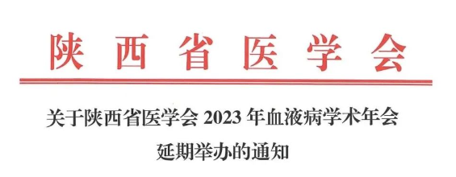

# 医药反腐大风暴！多场学术会议延期，医药代表带“资料”进医院被抓

医药领域反腐正驶向深水区。

随着近期监管部门连续多次表达对医疗反腐的行动和决心，我国医药反腐风暴再次升级：据不完全统计
**，今年以来全国已有至少155位医院院长、书记被查，数量已超过去年全年的两倍。**
随着医药反腐力度持续加大，全行业风声鹤唳。药企紧急召集业务员培训推广合规内容，多场学术会议延期或取消。

各地医疗卫生系统违法违纪案件的整治也在不断深化。根据贵州发布的数据显示，仅遵义市今年已查处医疗卫生系统违法违纪案件46件，党纪政务处分47人，同步督促卫生健康系统自查问题142个。医疗领域腐败和不正之风的案例中提到，“定制式”招投标、“空床式”欺诈骗保。

**十部门联合整治医药领域腐败**

**今天又有医院书记落马**

据中新网，近日， **国家卫生健康委** 会同 **教育部、公安部、审计署、国务院国资委、市场监管总局、国家医保局、国家中医药局、国家疾控局、国家药监局**
，联合召开视频会议， **部署开展为期1年的全国医药领域腐败问题集中整治工作。**

另据中央纪委国家监委网站消息，7月28日，纪检监察机关配合开展全国医药领域腐败问题集中整治工作动员部署视频会议召开。

此前的7月25日，刑法修正案(十二)草案提请十四届全国人大常委会第四次会议审议。草案加大对行贿犯罪惩治力度，增加惩治民营企业内部人员腐败相关犯罪的条款，并提出
**在食品药品、教育医疗等领域行贿需从重处罚。**

据第一财经，根据塞柏蓝的不完全统计，今年至今，全国已有至少155位医院院长、书记被查，数量已超过去年全年的两倍。
**除了“落马”的院长、书记之外，被查的科室主任更是众多。**

7月25日，据山东省纪委监委网站消息， **山东省立第三医院原党委书记吕涌涛** 涉嫌严重违纪违法，主动投案，接受审查调查。

7月29日，据湖北省纪委监委消息， **湖北中医药大学副校长、湖北省中医院原院长何绍斌** 涉嫌严重违纪违法，目前正接受湖北省纪委监委纪律审查和监察调查。

8月5日，据西藏自治区纪委监委消息， **西藏自治区藏医院党委书记唐荣科** 涉嫌严重违纪违法，目前正接受西藏自治区纪委监委纪律审查和监察调查。

**多常学术会议延期或取消**

**医药代表：因为反腐“非常头疼”**

据证券时报报道，随着全行业、全链条反腐行动的深入， **近期已有多场学术会议延期或取消。**

 _截图自各协会网站_

原计划于8月6日举办的太原市医学会病理专业委员会第十届病理学术会议暨中华医学会病理分会胸部学组肿瘤病理诊断学习班，于8月3日宣布延期举办，原因是“受客观因素影响”。

此外，原定于8月12日~13日在广州越秀国际会议中心召开的“2023华南腔内影像及功能学高峰论坛暨CCEC·花城影秀”也宣布延期举办，官方表示原因是“由于时间冲突”。

尽管会议延期的原因各异，但业界大都认为与此次反腐行动有关。

8月2日，浙江省医学会学术部发布了一份关于延期召开“2023年浙江省医学会骨科学学术会议”的通知，称由于杭州亚运会保障，原定于8月10日~12日召开的会议将延期。但由于杭州亚运会开始时间为9月下旬，与此次会议时间还有一段距离，因此业内人士对此理由存在不同解读。

从以往通报的商业贿赂案件细节来看，药企通过举办学术会议， **存在以会议赞助费、专家讲课费、培训费等方式为行贿披上“合法外衣”的情形。**

此外，据第一财经 **，一些医药代表表示，医院纪委现在紧盯医药代表。**
“还是可以进医院见客户，但是电脑、手机等设备是不敢带进去了，生怕会被没收。”有医药代表表示，
**“近期有人带着‘资料’进医院见客户，结果被抓了现形，相关产品全部被停了。”**

还有一名医药代表表示，最近因为反腐“非常头疼”。“一天之内3位客户取消参会。”

**学术推广或暗藏猫腻**

**送完礼还要“好好招待”医生**

据新京报，Wind数据显示，医药（中信）成份项下460家上市公司（剔除4家退市公司），2022年销售费用共计约3397.3亿元，同比增长4.5%。对于医药企业而言，新品推出后的学术推广，成为快速打开市场的关键。这也使得学术推广费在药企的市场推广费用构成中保持较高的占比。

这背后，学术推广成为众多药企保持销售额增长的关键。与此同时巨额市场推广费中也可能暗藏“猫腻”。近期，上交所在《上交所发行上市审核动态》中指出，医疗企业销售费用占营业收入比例往往较高，销售推广活动的真实性、合规性颇受市场关注，销售推广费往往存在名目复杂、类别多样、可能用于隐性支出等问题，一直是审核关注的重点。

医法汇创始人张勇律师分析，医药企业研发新药周期较长，产品入市后销量无法保证，因此存在研发风险。面对这种风险，许多企业宁愿投入营销费用去维护关系，也不愿将钱投入研发。张勇律师指出，这种现象不利于打造公平竞争的市场环境，“企业不重视药品质量和研发，而是把过多的精力投入到营销甚至是违法犯罪，这影响了其他正规企业的经营，造成‘劣币驱逐良币’。”

据人民日报，目前多个学术会议宣布暂停，北京市鑫诺律师事务所高级合伙人展曙光接受采访时表示，这也与新一轮的反腐行动相关，有部分药企之所以热衷举办医疗学术会议，主要是出于扩大药品知名度及影响力的目的。
**“凡是开会时有讲座讲他们的产品的，还有礼品相送。会后的活动，还能让医药代表好好招待一下医生。这就让学术会议变味了。”**

展曙光表示，盯紧医药代表，获益方开始承担相应的责任，就会倒逼着医药生产企业，加强对自己医药代表的管理，规范整体销售行为，当销售方没有很大动力去做这件事时，医疗领域的腐败行为就会减少。“现在各项举措对医药代表都提出了高要求及严管，这会使整个行业更加规范，如果以后医药代表行业就拼学术、拼产品，不去承担任何销售指标，行业前景可能会更好一些。”一位外企的医药代表表示。

**编辑|** 王月龙 杜恒峰 易启江 **校对|** 程鹏

每日经济新闻综合中新网、第一财经、证券时报、新京报、人民日报、公开信息

每日经济新闻

