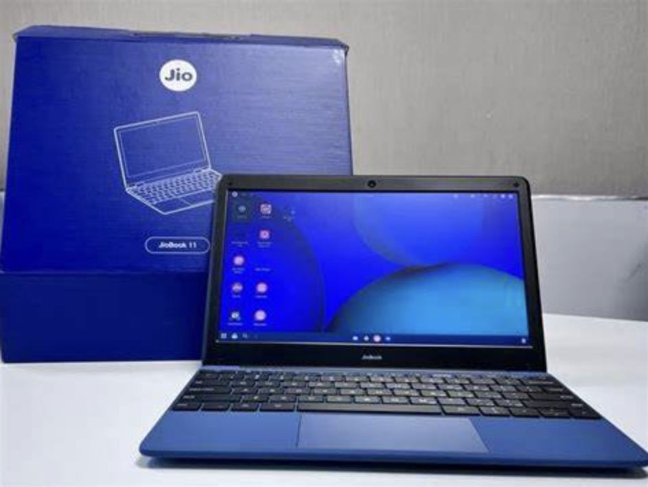
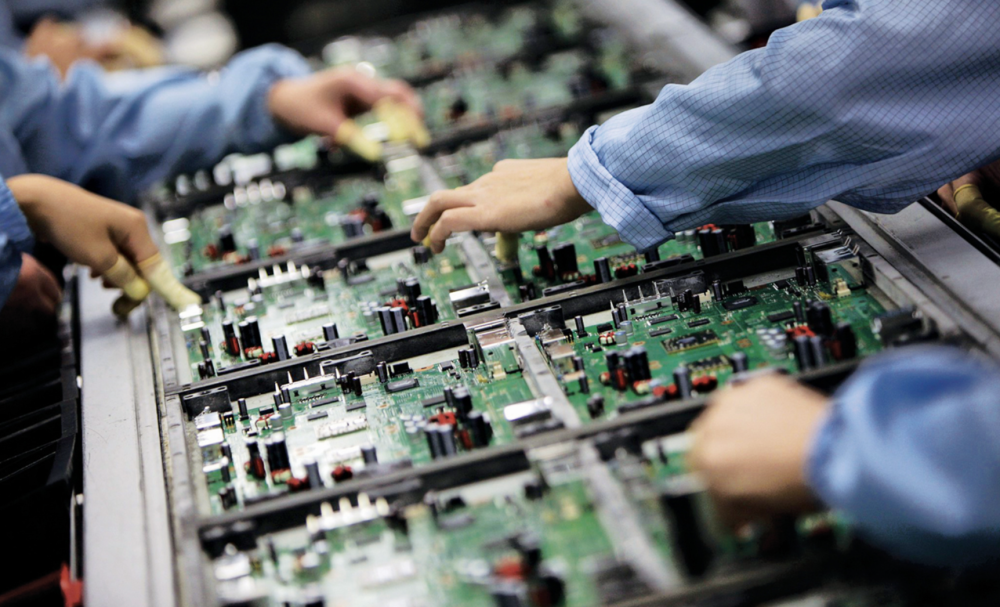

# 压力给到苹果三星们：印度突然限制进口笔记本电脑，还推出千元国产机

本文来源：时代周报 作者：马欢

印度突然给进口电子产品当头一棒。

当地时间8月3日，印度政府宣布，限制包括笔记本电脑和平板电脑在内的个人电脑的进口，以提振本土电子产品制造业。

在当天发布的一份通知中，印度商务部下属的外贸总局(DGFT)表示，从即日起，企业将需要获得有效许可证，才能将此类设备运往印度。

“这不是轻推，而是强推。我们要进一步推动印度制造业。” 对此，印度电子行业协会MAIT的前总干事贾夫里说。

在印度发布限制措施后，苹果、三星电子和惠普等巨头纷纷停止向印度出口笔记本电脑和平板电脑。

消息人士表示，这一通知让整个行业措手不及。 目前，各家科技公司都在与印度政府商讨，如何才能最迅速地获得许可证。

同时，印度品牌正跃跃欲试抢夺本土市场。7月31日，信实集团子公司Jio发布了一款最新的廉价笔记本电脑Jio
Book，亚马逊定价16499卢比，仅为人民币1431元左右。

 _印度的千元笔记本电脑Jio Book 图源：社交媒体_

看得出来，印度对振兴电子产品制造是非常着急了，那么实际成效又会怎样？

**市场基本靠进口**

印度出台限制政策的背后，是多年来进口产品独霸市场，而本土制造始终起不来。

在印度，笔记本和平板电脑市场全部被进口品牌包围了。

以今年上半年为例，笔记本电脑市场份额排名前五，分别是惠普、戴尔、联想、宏碁和华硕；平板电脑排名前五则是三星、苹果、联想、Realme和宏碁。

这些销售笔记本电脑和平板电脑的公司，基本上都是从亚洲其它国家进口大部分产品或零部件。

印度移动与电子协会的联合报告也承认，笔记本电脑和平板电脑的全球制造中心仅限于少数几个国家。在这当中，中国是全球主要供应商。安永会计师事务所的报告指出，印度销售的笔记本电脑和平板电脑中，分别有80%和2/3从中国进口，而且这个数据还在不断增长。

路透社的数据显示，2023年4-6月，包括笔记本电脑、平板电脑和个人电脑在内，印度电子产品进口额为197亿美元（约合人民币1415亿元），同比增长6.25%。

面对这种局面，印度只好放出限制进口这一大招。

截至目前，苹果和三星等制造商还未就印度限制一事做出回应，但各方分析认为，印度此举会给他们后续生产和销售带来压力。

_印度孟买新苹果商店的效果图 图源：Apple_

新规定生效后，这些企业如果想要继续在印度销售这些进口产品，需要获得特别许可证。业内人士表示，以印度一贯的官僚程度和办事效率，这意味着每款产品进入印度市场的等待时间将会延长，且需要提前申请，这大大影响了商家们的销售。

印度方面显然是在向这些厂商施压，希望倒逼他们将生产基地转向印度，让更多的笔记本电脑和平板电脑能够在印度本土化生产。

毕竟，印度是全球第一大人口国，市场的诱惑力太大了。

其实在此之前，苹果已经在印度建厂，不过生产的只是手机，目前还没有涉及平板电脑和笔记本电脑的生产。

但印度方面觉得远远不够，苹果们的努力不足以真正提振印度制造。

**一直在打压**

2014年9月，印度总理莫迪提出“印度制造（Make in India）”倡议。

印度政府希望，通过一系列的改革组合拳辅之以积极的经济外交吸引投资，实现制造业大幅增长并在全球市场进一步扩张，最终将印度打造成为全球制造业中心。

然而，多年来，印度本土制造业的发展却不尽如人意。

为此，印度政府不断修正促进制造业发展的政策了，包括提高进口关税，限制进口产品对国内产业的冲击等，从而保护国内产业发展。

早在2018年，莫迪就曾大规模提升进口产品的关税，从平均13%提高到20%。此举，让当时的美国总统特朗普批评印度是“关税之王”。

到了2023年印度新财年预算案出炉之时，印度继续表示，将采取一系列关税和非关税措施，以削减非必需消费品和电子产品的进口。

此外，印度政府还推出一些激励政策，鼓励本国生产。

 _图源：社交媒体_

就在2021年，印度启动了一项价值约合9亿美元（约合人民币64亿元）的计划，以提高当地制造业，并建立起笔记本电脑、平板电脑和个人电脑等IT产品的出口。

不过，这一政策被认为补贴数额太小，不够吸引力。

媒体透露称，当时苹果公司拒绝了这项提议，认为这个政策不足以补贴在印度生产iPad的成本。

今年5月，据彭博社报道，印度政府提高了激励的数额，又公布了一项价值约合20亿美元（约合人民币144亿元）财政激励计划，以吸引笔记本电脑、平板电脑和其他电子设备硬件制造商转移至该国生产。

根据印度政府的公开资料，该计划为每家制造商提供最高5.49亿美元（约合人民币40亿元）的补贴资金。当然，需要这些外国企业5年内都在印度投资一定金额，用以生产笔记本和平板电脑。

不知对于苹果三星们来说，这一次印度“打个巴掌给个枣”的方式，诱惑力如何呢？

