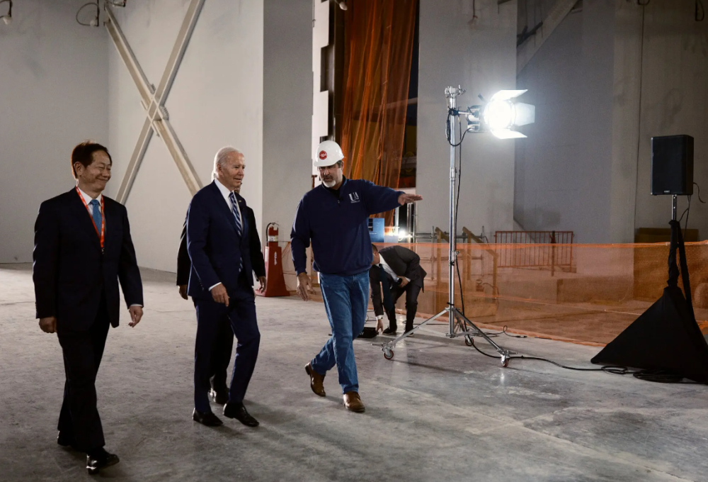
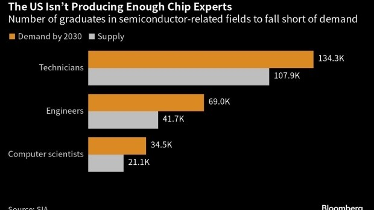

# 台积电董事长向美媒表态：虽在美投资建厂，但仍需根留台湾

（观察者网讯）8月4日，美媒《纽约时报》以“为何台积电在走向全球的同时，仍会扎根台湾”，刊登了对台积电董事长刘德音的专访报道。报道中，刘德音明确表态，尽管台积电正在美国投资建厂，但要在美国复制台积电在台湾制造的产品将极其困难，除了台湾，“我们不能把它（台积电）放在其他地方”。

_刘德音（左一）去年陪同拜登视察台积电位于亚利桑那州工厂，图自《纽约时报》_

专访中，刘德音谈到在美投资时称，台积电“与美国国会、商务部和白宫之间保持着非常好的关系”。

刘德音还回顾了台积电决定在美国建厂的原因。他表示，早在2018年，特朗普政府时期的美国商务部官员就敦促台积电在美投资，一些美国客户也在私下接触时强调在美投资的必要性。

“我想，也许台积电是时候走向全球化了，”刘德音透露，不久后，特朗普政府便向台积电示好，当时负责经济增长、能源和环境事务的美国副国务卿基思·克拉奇说，需要台积电来帮助“促进”美国半导体行业。

不过，《纽约时报》认为，台积电近年来在美国、日本等地投资建厂的行动，是对美国官员有关“减少对台湾芯片依赖”呼吁的响应行动。美国商务部长雷蒙多今年4月曾公开表示，美国在芯片领域过度依赖台湾地区，“这是不可持续且危险的”。

《纽约时报》还称，台湾地区地缘政治紧张，美国“离不开”台积电，因此斥资数百亿美元推动《芯片和科学法案》，并资助台积电在美业务。对台积电来说，除了在美投资建厂，“根本没有明显的第二选择”。

2020年，台积电承诺在美国亚利桑那州凤凰城投资120亿美元建厂，目标是到2024年底在美国本土生产高端半导体。此后，台积电更是“加码”，宣布将原计划的120亿美元投资额增加两倍以上，达400亿美元，其在凤凰城建造的两座工厂，分别计划于2024年和2026年投资生产4纳米和3纳米芯片。

彭博社等美媒此前指出，这不仅是台积电在台湾地区以外的最大投资项目，同时也是美国历史上最大的境外直接投资之一。

但刘德音明确表示，尽管台积电正在美国投资建厂，但要在美国复制台积电在台湾制造的产品将极其困难。他说，快速开发和生产公司最尖端的芯片需付出巨大的努力，需要多达3000名研究科学家来开发一代技术，因此除了台湾，“我们不能把它（台积电）放在其他地方”。

_台积电在美国凤凰城工厂已宣布推迟投产，图自《纽约时报》_

此外，刘德音称，他已向美国政府提出建议，除《芯片法案》中520亿美元的补贴外，美方还需要提供激励措施，用以购买美国制造的芯片。“否则，（台积电在美投资）计划很快将碰到瓶颈，这就是摆在桌面上的事情，台积电目前还想不到解决的办法”。

刘德音这一表态是对近期台积电在美工厂进度落后、与美国工人关系紧张等问题的回应。

7月20日，台积电宣布，由于缺少熟练的劳动力以及美国当地成本等原因，其在亚利桑那州的第一家美国工厂的投产时间，将从原计划的2024年底推迟至2025年。

这则“推迟投产”的消息，暴露出拜登政府“芯片本土化制造”政策的脆弱性。美国半导体协会（SIA）7月25日发出预警，称美国将没有足够的工程师、计算机科学家和技术人员来支持未来十年的快速扩张，新增职位的空缺率或达到58%。

_美半导体行业称“2030年新增岗位将空缺58%”，彭博社制图_

彭博社曾分析指出，这一投产时间在2024年美国总统大选之后，而亚利桑那州则是明年大选的关键战场州，这一消息对拜登来说不是好兆头，他的竞选连任之路以其经济立法为核心，所推动的许多产业政策也与共和党相左，因此选情可能会受到影响。

然而，台积电上述“由于缺少熟练的劳动力而推迟投产”的声明，引来美国当地工人和媒体的不满。

据台媒日前报道，美国亚利桑那州最大工会之一、亚利桑那建筑贸易协会会长阿伦·巴特勒7月26日在《凤凰城商业报》上发表署名文章说，当地工人拥有的技术及经验足以应付台积电的任务需求，并批评台积电想以此为借口，引进“薪资较低的外籍劳工”。

**本文系观察者网独家稿件，未经授权，不得转载。**

