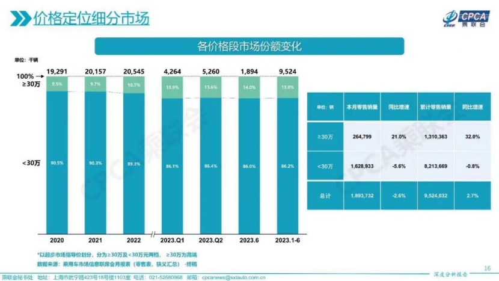
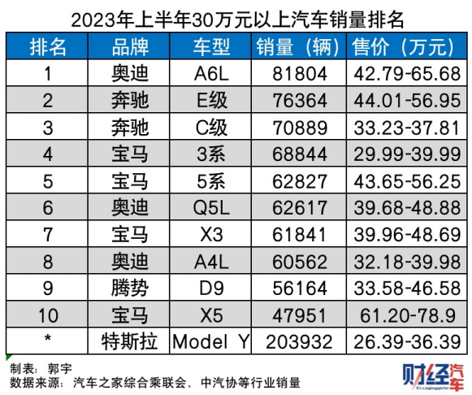
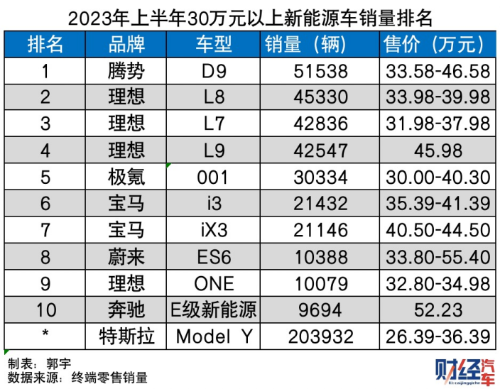
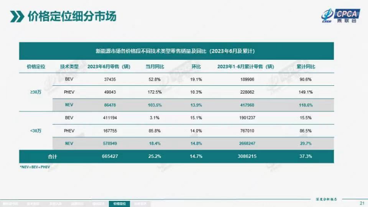
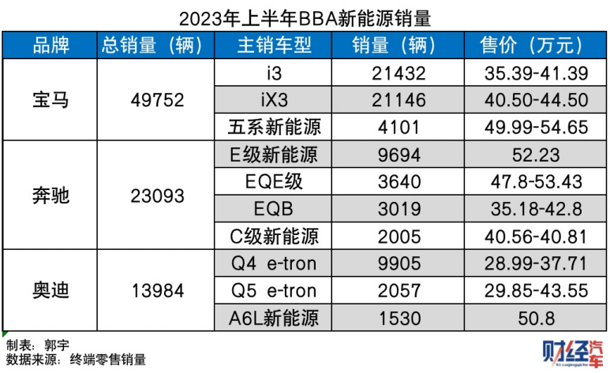
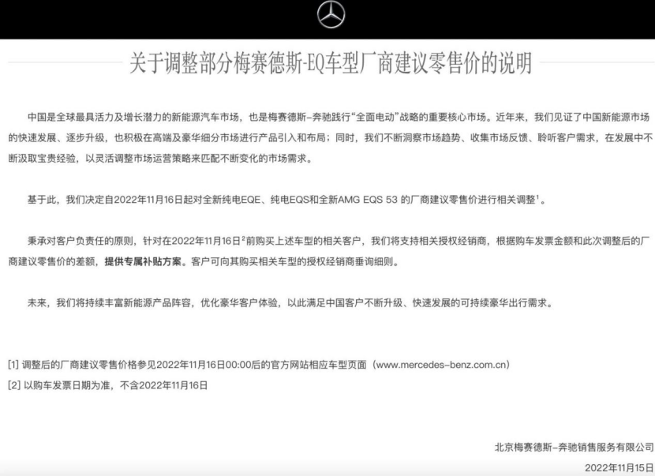

# 在中国开什么车才显得有身份？高端市场宝马、奔驰、奥迪仍是主力

_图/视觉中国_

**文 | 《财经》记者 郭宇 王静仪**

**编辑 | 王静仪**

在中国，买一辆怎样的车，才能体现出尊贵的车主身份？

要么买一辆高价的车：乘联会将起售价在30万元及以上的乘用车（轿车、SUV、MPV）称为高端车；要么买一辆公认为豪华品牌的车：长久以来，业内公认的主流豪华品牌是BBA、凯迪拉克、雷克萨斯、沃尔沃等。这些车的价格也多在30万元以上。

进入2023年，情况有些不一样了。

**一是买高端车的比重高了、人数多了。**

乘联会数据显示，2023年上半年，乘用车销量为952.4万辆，其中30万元以上汽车销量为131.04万辆，占比13.8%，相当于每卖7辆车就有1辆售价超30万元。再往前到2020年，还是每10辆车里只有1辆售价超过30万元。

买高端车的人也越来越多了。2020年至2022年，30万元及以上汽车销量连续增长，分别卖出了183.26万辆、191.49万辆和219.83万辆，2023年上半年，这个数字是131.43万辆，不出意外的话，高端车市场销量将继续增长。

**二是买高端车的选择多了。**

据《财经》不完全统计，2020年上市的新车中，有36个品牌推出了30万元以上的车型。2023年上半年，这个数字达到了48个，新增的12个品牌里有七成推出了新能源车型，且基本为自主品牌。

30万元以上，或者说高端车/豪华车市场，一直以来都是BBA们的主阵地。但当汽车产品类型从燃油变成燃油和新能源并存，长期有着低价标签的国产自主品牌，也掀起了一次次品牌上攻——卖高价车的自主品牌更多了，就是一个信号。

2023年上半年，高端车市场谁是销量主力？BBA和自主品牌，各占多少份额？高端车里又有多少是新能源车型？纯电和插混谁卖得好？《财经》通过终端零售销量，结合乘联会、中汽协等行业销量数据，对上述问题进行解答。

**高端市场什么车卖得好？**

**答：BBA仍是主力，销量前10名里占据9席，新能源车腾势D9是唯一新面孔。**

若以起售价30万元（含29.99万元）为基准线，单一车型销量最高的是奥迪A6L，2023年上半年共卖出了8.18万辆。

紧跟其后的是奔驰E级和奔驰C级；再者是宝马3系和5系。

奥迪A6L是一款C级轿车，也是奥迪的销量“扛把子”，自2005年国产化至今已有近20年的历史。二十年来，奥迪A6L已经迭代到第9代，目前在售的奥迪A6L为2022年8月6日上市的最新款。

从品牌看，销量前10名里，BBA包揽了9名，唯一挤进榜单的新面孔是腾势的MPV产品D9。上述9款BBA销量加起来达59.35万辆，已经占据了30万元以上汽车市场的半壁江山。

从车型来看，轿车更受欢迎，榜单前5名均为轿车。从能源类型看，燃油车仍是主力，销量前10的车型里有9款都是燃油车，腾势D9是唯一一款新能源车。

从价格来看，40万元至50万元区间仍是高端车的主销区间，有半数车型都覆盖了这一区间。值得一提的排名第10的宝马X5（61.2万元至78.9万元），是榜单中售价最高的车型。

盘点完高端车里什么车卖得好，还要回答为什么——为什么买高端车的人变多了？

乘联会数据显示，2023年上半年，30万元以上乘用车销量达131.04万辆，同比增长32%；30万元以下乘用车销量反而同比下滑了0.8%。

这要从消费侧和供给侧两个维度理解。

“从消费侧看，受过去几年外部经济等因素影响，中低收入群体的购车预算和需求下降，中高端市场的消费者相对受影响小，因此30万元以上乘用车销量同比增长了三成。”某汽车行业研究院负责人向《财经》解释道。

该负责人表示，从供给侧看，30万元以上乘用车销量增长，是两大因素导致，一是中高端燃油车大幅度降价 ，二是中国的中高端新能源车销量提升
，像理想、腾势都是代表。

“富人越来越富，豪车也会越卖越多。”宾利汽车主席兼首席执行官艾德恩·霍马克（Adrian
Hallmark）向《财经》表示，20年前，拥有超过100万美元可自由支配资产的大约有600万人，如今，这个数字是20年前的3倍，拥有超过100万美元可自由支配资产的大约有1800万人。

**新能源销量榜谁表现好？**

**答：腾势D9排名第一；理想汽车成最大赢家，四款产品均上榜。**

新能源车型的存在感正越来越高。

乘联会数据显示，2023年上半年，30万元以上新能源车零售销量为41.8万辆，占这一价位总销量的31.9%，和目前新能源整体渗透率保持一致，也和30万元以下汽车32.48%的渗透率接近。

在起售价30万元及以上的新能源车榜单中，身为MPV车型的腾势D9位列第一，也是销量前10榜单中唯一的MPV车型。

腾势D9是腾势品牌焕新后的第一款产品，从2022年10月底开始交付后，已在今年3月实现月交付破万，成交均价41.5万元。

对于D9目前取得的成绩，腾势汽车总经理兼首席共创官赵长江向《财经》总结道，目前D9所在的MPV市场存量还是燃油车，本身的产品已经不能满足用户需求。其次是D9改变了原有MPV的属性，不是宜商宜家的二选一，而是同时兼具，这也能吸引一些SUV转化来的用户。

**从品牌来看，理想汽车是最大赢家。**

其目前在售的4款车型均在榜单中，除了理想ONE，另外三款车上半年销量均在4万辆的水平。据《财经》统计，前10名累计销量为28.42万辆，其中理想汽车的产品有14.1万辆，占比高达50%。

极氪001的表现也可圈可点，按照纯电和插混来细分，其销量位居30万元以上纯电榜第一。纵观榜单，前四名都有插混车型——腾势D9的插混版占据了半数以上的销量份额；理想汽车均为插混类目下的增程式车型。

和同价位的其他产品相比，极氪的优势是什么？极氪方面向《财经》总结了几点：首先是品类创新，极氪001定位为猎装车，市面少有；其次是最高CLTC综合工况续航里程可达1032km，是纯电量产车型续航里程全球第一；最后是安全性高，辅助安全创造了中保研历史最高分纪录，也是唯一辅助安全3项满分车型。

宝马和奔驰的表现倒是与固有认知有些不同，靠着宝马i3和iX3两款销量均突破2万辆的产品，宝马包揽了榜单的第六、七名。售价超50万元的奔驰E级新能源也在半年卖出了近万辆。有关宝马和奔驰的新能源产品销量分析，将在下文“问题4”部分展开。

**插混和纯电，销量为何天差地别？**

**答：电池续航和补能问题，造就了纯电弱、插混强的格局，使得纯电车型难出爆款。**

在30万元以上新能源汽车市场，2022年全年，其纯电车型占比超七成；到了2023年上半年，纯电车型占比已跌到45.44%。

纯电弱、插混强的格局，使得纯电车型难出爆款。

目前30万元以上纯电市场是“ZNB”的天下，即极氪、蔚来和宝马，月销量为3000-6000辆水平。要是细分到该价位的纯电SUV领域，哪怕是常年在销量榜单前列的智己LS7，月销量也在2000辆上下的水平。

对比之下，增程的理想汽车单一车型月销量目前已突破万辆（理想L7）。

“续航和补能是用户选择新能源车型的决定性因素之一，这也是目前阶段插混车型销量相对占优的原因。”智己汽车方面告诉《财经》。

插混（含增程）车型的可油可电属性，能缓解许多人的续航焦虑，未来几年，插混车型占比还会提高。

中国科学院院士、清华大学教授、中国电动汽车百人会副理事长欧阳明高认为，目前电动车价格成本偏高、电池成本也偏高、补贴又在下降，所以未来几年插电混动和增程电动的占比会从2022年的22%逐步提升到30%-40%。

欧阳明高认为，30万-40万元的高端车型由于电池装载太多，增程式电动和插电混动也会是一个重要的市场，占比达到30%-35%也是有可能的。预计2030年后，插电混动和增程式电动车会逐步退出市场。

坚持做纯电，诸如极氪、智己等都有自己的理由。

智己汽车方面向《财经》表示，一是未来城市的补能网络会更完善，中心城区加油站会逐渐退出，充电比加油更方便；二是根据用户调研及反馈，很大一部分之前有“续航焦虑”的用户，在真实使用后焦虑度大大降低，而纯电更安静、更平顺、更低使用成本的优势也进一步凸显；三是整体车市纯电渗透率已经超20％，中大型SUV市场纯电市场仍有较大潜力。

“从长远看，电池商业模式创新和技术创新的潜力巨大，伴随着规模效应，电池成本将会持续下降，纯电的优势会越来越明显，销量占比会逐步提升。”极氪方面向《财经》表示，得益于纯电平台的先天优势，纯电车型在智能化、数字化领域迭代升级有明显优势，更快速地带用户进入智能纯电时代。

但聚焦到当下，纯电销量不高的情况该如何打破？“我觉得还是现在产品不够多，产品的竞争力不够强。”上述研究院负责人评价道。

车型数量是最直观的例证。以新能源SUV为例，在汽车之家app上，20万元至30万元价位有52款车符合条件；而将价格改为30万元至50万元，只有39款车符合条件，再剔除掉起售价低于30万元的车型，只剩24款，“这说明30万元以上的汽车市场还远远不够卷”。

同样是纯电车型，特斯拉Model Y的销量情况就大不相同，打破了高端纯电车型销量不高的情况。

虽然Model Y如今的起售价已经下探到30万元以下，但2021年时，Model Y的起售价还基本在30万元以上，那一年，Model
Y在中国的终端零售销量为17.08万辆。这一成绩放在今天也依旧能打。另外，即使Model
Y的起售价下探到30万元以下，但许多高端新能源SUV车型仍把Model Y当作竞争和追赶对象。

**BBA的新能源表现怎么样？**

**答：宝马卖得最多，i3和iX3两款主销车型贡献了八成销量；奔驰车海战术，但月销量最好的车型也只有一千多辆；奥迪进展最慢，已经和上汽集团合作电动平台。**

一直以来，30万元级汽车市场是BBA的阵营，但新能源时代给了别的品牌超车的机会，那么BBA在同价位新能源汽车上的表现到底如何？

总体来看，宝马的新能源车表现最好。

2023年上半年，宝马卖出4.98万辆，奔驰卖出2.31万辆，奥迪则只有宝马销量的三成左右。

从主销车型看，宝马i3和iX3销量情况最好，半年均达到了两万辆，不仅是BBA里卖得最好的新能源车型，也在30万元以上新能源车销量排名中包揽了第六、七名。

其次奥迪Q4 e-tron和奔驰E级新能源，半年销量均突破9千辆，后者位居30万元以上新能源车销量榜第10名。

前述研究院负责人评价道，宝马的新能源产品主要优势是价格便宜和品牌光环，推行油电同价。一般情况下，同品牌下的同级别车型，新能源版本要比燃油版本更贵。“宝马ix3现在完全是同等级油车的价钱”。

宝马iX3是宝马X3的油改电产品，售价相当。宝马X3售价39.96-48.69万元，而iX3是40.5-44.5万元。

降价优惠也推动了宝马的新能源销量。《财经》了解到，虽然宝马i3和iX3的建议零售价在30万元以上，但这几个月来许多宝马经销商都推出了大额优惠，终端优惠最高能达到10余万元。

奔驰的新能源车型则偏向车海战术。目前，在售的奔驰新能源车型共有13款，但2023年上半年均未有车型累计销量破万。即使是卖得最好的奔驰E级新能源销量，月均销量也在1600辆上下。

“奔驰的EQ新能源系列用力过猛，设计和价格都超出了现在用户的接受度。”前述研究院负责人评价道。

目前奔驰的新能源产品也有了价格下探的趋势。2022年11月15日，奔驰发出《关于调整部分梅赛德斯-
EQ车型厂商建议零售价的说明》，自2022年11月16日起，对全新的纯电EQE、EQS和AMG EQS
53的厂商建议零售价进行降价调整。对比调整前后的建议零售价，奔驰对EQ系列的价格最高降幅达20余万元。

