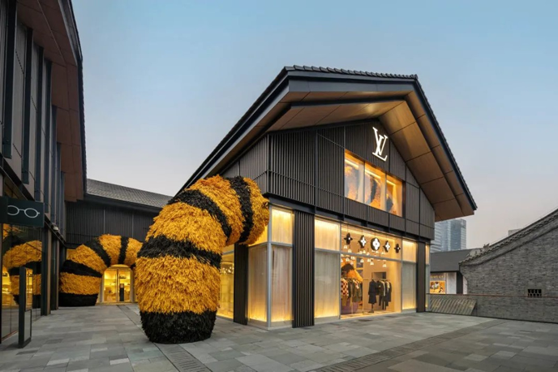

# 奢侈品扎堆成都：两家LV店相距几百米，传西藏富豪买光整面墙的包

腾讯新闻《潜望》 特约作者 卢曦 编辑 杨布丁

在过去的四分之一个世纪里，春熙路日资百货伊藤洋华堂是成都高端消费的地标。传说伊藤每年向气象部门购买详尽的天气数据，以精心调节室内温度，确保客人进门那一刻周身惬意。这本“零售精细化管理的圣经”，在2022年最后一天关闭。

传统百货模式的日落源于新星的崛起，IFS和远洋太古里抢走了伊藤的荣光。2023年6月，屡次问鼎全球首富的LVMH集团老板伯纳德·阿诺访问中国，年逾七旬的他穿着西装，依次走访了三个城市：北京、成都和上海，用足迹宣告了成都“中国奢侈品第三城”的地位。

成都在中国奢侈品地图上的崛起已有些时日。2017年，香奈儿在成都举办了一场大秀，在时装圈可以说是万人空巷。更早几年，香奈儿已经分别走过了上海和北京。对城市的选择可以看出品牌高层的算盘，除了已有的成熟市场，他们还会选择有意发力的新领地，比如越南的胡志明市，比如成都。

差不多就在这个阶段，成都与各路奢侈品进入蜜月期。一些以往只有一线城市才有的高级别“大店”在成都落子，通常叫作“旗舰店”或者“品牌之家”。奢侈品们不再把成都仅仅当成一个卖货的城市，而是一个值得坐下来，和客人慢慢谈感情，施展自己魅力的地方。

2022年1月，LV在太古里开出国内第三个路易威登之家。那年春节，LV在店铺里里外外好一番设计，巨型虎尾贯穿整个空间。2017和2022年，梵克雅宝在成都相继举办胸针展、典藏珍品展。卡地亚精心设计了太古里店铺，把巴蜀文化和品牌细节融为一炉。Ralph
Lauren在成都开酒吧——Ralph's，Moncler开出中国首家数字化概念店。

 _成都太古里路易威登之家虎年春节巨型装饰，来源：LV官网_

春熙路商圈冉冉升起，出现了一个反常的现象：两家LV之间的距离不过几百米，Gucci、Celine也是如此，这些大牌们决心同时占领IFS和太古里——这种贴身肉搏的局面在别的地方是奢侈品们竭力避免的。这也造就了成都最贵的一条街——纱帽街，这条窄窄短短的小路，恰好连接这两座购物中心，路两旁扎堆的是星光璀璨的奢侈品豪门。

2022年底，成都SKP的开业，昭示着成都奢侈品市场已然沸腾。在春熙路-大慈寺商圈业成熟之际，成都南部的金融城-
交子公园商圈成为第二个城市主中心，也是新的奢侈品消费核心。

这是今天的成都，时髦得不像话。

**1、爱马仕包成为入局“门票”**

多年前，香港有个“可以不吃饭，不能不买衫”的女孩叫章小蕙。成都女孩柏鹿有个相似的座右铭——“能花才能赚”。她从小就是个时髦精，身为艺术生十几岁就有很多拍广告和演出的机会，赚到的钱被她一分不剩地投入美丽事业之中。不到20岁，她买下人生第一件奢侈品，一只LV的Speedy老花手袋，奢侈品大门从此打开。

二十出头的柏鹿喜欢在国外买奢侈品，因为价格好，货色更新更全。有一次在日本，帮她把堆成小山的商品结完账之后，爷爷辈的收银员已经精疲力竭，匆匆把“休息”的标识摆上台面，躲了起来。

后来柏鹿在成都开了一家买手店，把一些欧洲小众品牌带到成都，比如被称为“设计界毕加索”的、性冷淡风的Chalayan，以及高定设计师Alexis
Mabille的个人品牌，飘逸垂坠，很“仙女”。这些品牌从未在中国开过店，非常小众，但在柏鹿的买手店里，都能卖得出去。

这么多年过去了，柏鹿对奢侈品的态度也有改变。她越来越多地在成都家门口买东西，因为“等不了”，“喜欢了就买了”。她说成都女孩是性情中人，聊开心了，就冲动刷卡。有次在LV店里，销售因为太忙没来得及招呼她，等她从隔壁Fendi提着大包小包转回来，“店员那种懊恼的眼神我现在都忘不了”，她于是又在LV买了好几件才离开。

在成都IFS的一家大牌时装店铺，销售说，成都有一群能挣、会花的年轻女孩。有客人在店里一次性充值20万～30万，新品一到店，销售就快递过去，客人从中挑选，从账户上“月结”——她们可能在不止一家店铺“充值”。

_连接IFS和太古里的纱帽街被称为“成都最贵的一条街”，图片为作者拍摄_

柏鹿们刚刚开始接触奢侈品的时候，赵雪洁已经财务自由很久了。因为家族提供的资源，她是最早一批在西南地区做汽车生意的人，抓住了改革开放带来的巨大机遇，经历了中国西南地区汽车市场的爆发。如今她买东西不怎么看价格，也根本不需要炫耀或者彰显身份，只选合自己心意的，追求一种随心所欲的状态。

见惯了三教九流的她还是被一件小事触动了。那天她去参加一个企业家小圈子的活动，决定有些临时，年轻的门卫不敢擅自让她进入。在门口气氛刚刚有些僵持的时候，她注意到现场主管看了一眼她随身携带的爱马仕铂金包，那是最珍稀的喜马拉雅。主管立刻明白这只包意味着什么，慌忙将她请进门。

赵雪洁几年前以近百万的价格买下这只喜马拉雅，后来二手市场价格不断攀升她也没在意，没想到自己还是会被“衣帽取人”。

后来，在为自己选新车的时候，她在几大品牌中选了劳斯莱斯。她说自己潜意识里，还是有一种“极致”的情结，只有那种顶级中的王者，才能给自己一种犒赏般的满足感。

乔安雅在成都IFS一家“准独角兽”公司上班，她身边的金融男女是重度奢侈品爱好者。好几次，在圈内年会上，她都会见到一位70后女老板。她从事的是高收益高风险的行业，身家暴涨的那几年行事也十分高调。她个头不高，身型有所发福，执着地追高级定制服，是Dior和Valentino的客户。有次她穿着一件轮廓设计为茧形，以层层叠叠蕾丝缠绕的大裙子现身，看得出来，品牌针对她的身材进行了精心的剪裁。

**2、太古里网红拉低了高级珠宝的消费年龄**

“进退自如，浮沉自安”，有人这样形容成都人的性格。

起源于晚清时代的“袍哥”帮派文化，至今影响着成都人的性格，讲义气、干脆利落、不拖泥带水。成都资深媒体人李果说，重庆靠长江，码头文化、江湖文化更为浓重。而成都作为天府之国，多良田，没有太多战乱，千百年来风调雨顺养出人们安逸的心态。诗人杜甫到了成都，写出“留连戏蝶时时舞，自在娇莺恰恰啼”，找到了他人生中罕有的一段闲适。

安逸，爱吃爱穿，重视享受生活，这样的性格底色，让今天的成都人成为时髦的生活艺术家。有人说成都的消费力排名要远远高出GDP排名，说的是这个城市的人活在当下，不会为了争名逐利而放弃生活的乐趣。安全感强，敢花钱。

年轻的男孩女孩们，享受了“城二代”的福利，父母为他们包办了房子和车子，他们的收入不需要很高，就能享受到高质量的物质生活；做一些小小的生意，比如开一家火锅店，也能把生活过得有滋有味。疫情期间一个成都女孩的流调轨迹惹得众人羡慕，她在24小时内辗转了四家酒馆、酒吧，几天的活动里，还有美甲店、餐厅和电影院。成都人对生活火热的爱，给这座城市注入源源不断的消费动力。

叶冬冬在上海读完大学加入一家互联网大厂，因为他是四川人，公司就把成都一个开拓市场的岗位给了他。叶冬冬拿着上海标准的薪水，在成都过上了有房有车、三天两头火锅的好日子，“感觉比做梦还要好！”

而叶冬冬一位在银行工作、年薪十几万的朋友，每年都要去国外玩上一星期，买个五位数的包或者手表也不成问题。

在成都，“耙耳朵”是好男人，女性自古以来家庭地位高，对家庭财富支配权力大，她们理直气壮地把美当成事业。西晋《蜀都赋》写道“都人士女，袨服靓妆”，唐朝时的蜀锦、蜀绣，展现了对时装的极致追求，成都的时髦还真不是一朝一夕的。

今天在时装圈，不少人都知道，成都是“秀款”卖得最好的城市。时装大牌们为了吸睛，总是用一个系列中最夸张、搞怪的设计来走秀。秀款在店铺里一般被认为很难卖，因为“穿不出去”，上街会很像个异类。但成都人不是这么想的，这是一个国内数一数二“敢穿”的城市。

在太古里，奇装异服随处可见，人们丝毫不在意他人的目光，走得自信自如。各种风格、流派、品牌都有机会找到自己的群落。

挖空心思打扮自己的成都人造就了举国闻名的太古里街拍。漂亮的网红、有趣的博主层出不穷，直播的热闹程度直追电商之都杭州。IFS一家高级珠宝店的销售说，网红们如今拉低了高级珠宝的消费年龄，这些年轻人们思维活跃，人气高、赚钱快，她们痛快地在店里买走五位数甚至六位数的珠宝，转身就上网分享自己的消费体验。

 _成都太古里拥有卡地亚唯一的独栋精品店，图片为作者拍摄_

以抗极寒闻名的羽绒服品牌加拿大鹅在成都IFS开业之后，出现了排队的盛况。有人为之惊奇，因为成都冬季平均温度只有10℃-17℃，加拿大鹅似乎没有用武之地。而成都潮人们是这样盘算的：冬天在里面穿薄的、短的，想怎么美就怎么美，外面裹一件大鹅就可以出门，走进室内大鹅一脱——惊艳全场。如今大鹅在成都已经开第二家店了。

**3、成群结队而来的西南富豪们**

成都人的钱是从哪儿来的？

70后的章源于世纪之交从福建来到成都，白手起家。以福建人灵活的商业头脑，他很快发现房地产有机会。他大胆拿出了所有积蓄，再从银行贷款，买下成都两套房，每套总价二三十万。他与房产圈的老板交朋友，研究成都的城市规划，观察不同板块的发展前景。在接下来的十几年里，他卖房、贷款再买房，滚雪球般坚持自己的投资思路。如今他已有差不多半亿身家，说自己只是个“喝汤的”，真正赚大钱的是房地产开发商，这和中国其他一二线城市没有什么两样。

如果盘点成都的第一代富豪，除了房地产，还来自于制造业，以及煤炭、基建等行业。四川也有“煤老板”，最有名的是“达州帮”。达州位于四川盆地东部，地理环境恶劣，当地人养成了敢打敢拼、喜欢抱团的性格。达州自然资源得天独厚，是四川主要焦煤基地之一，还有天然气等丰富多样的资源。和山西、陕北煤老板的路径相似，达州煤老板也几乎是一夜暴富。很快，他们带着家人迁居成都，成都教育、生活条件优越，又在省内，是理所当然的选择。

达州富豪们住进成都的别墅和大平层，指挥着巨额资金闯荡资本市场，一度抱团成为“达州帮”。而其中成功者寥寥，有人失手巨亏，有人触及红线。资源性暴富的运势似乎告一段落，而他们和家人早已衣食无忧。

四川有一家资源型上市公司，因为锂电池行情的大幅变动，股价大起大落。这类公司背后的大股东们，常常要经历账面上的巨额盈亏。人的心态很难保持平和，几天之内多出上亿身家的人们往往就会疯狂花钱。在当地这个圈子的人看来，走进爱马仕店铺，一次买走几十万，并不罕见。

达州之外，还有不少川内中小城市，源源不断地向成都输送富豪。这些远没有成都名气大的城市往往有一些拳头产业，比如四川德阳有生产重型装备的“二重”，绵阳有军工基础，自贡有页岩气，宜宾有锂电池，泸州有化工……以及散布在四川多个城市，规模惊人的白酒产业。成都吸引的是人口高达8400万的整个四川省内的富豪、精英群体。

甚至还有整个西南。

关于成都IFS有一个江湖传说：来自西藏的富豪成群结队而来，一出手就扫光整面墙的昂贵手袋。真实性已不可考，总之人们认为，成都是一个能把偏远地区隐藏的富豪吸引出动的城市。成都不仅是四川的，还是云南、贵州、西藏等西南诸省、自治区的核心，与西安一南一北，统领了整个中国西部。

西藏与成都有着千丝万缕的联系。丛健同样于世纪之交从成都到西藏去闯荡，开小超市、便利店，把百货日用品运进广袤的西藏腹地。从计划经济到市场经济转变的巨大机遇，西藏比东南沿海晚一步出现。丛健面对的是几乎空白的市场，渠道、物资、服务都极为匮乏。像他这样在西藏淘金成功的四川人不在少数，他们加强了两地之间的联系，最终也都会在成都定居下来。这一切让成都成为多元文化、风俗、资源大融合的地方。

也许从1999年“西部大开发”提出开始，成都在中国西南的核心影响力便开始生长。当时的思路是促使发达地区的资源向西部流动，而成都在这一战略中几乎是必然的核心。

成都的发展是加速的。在《奇葩说》第六季里，一位人大教授说，十年前，成都只是一个三线城市。而在2015年，国务院批复成都升格为国家重要的高新技术产业基地、商贸物流中心和综合交通枢纽。2019年，深谙中国人情世故的英国人胡润把自己的《财富报告》放在成都发布，说四川拥有千万人民币资产的家庭有3.2万个，成都占比约50%。到了2022年，成都经济总量突破了2万亿。

这个以安逸为信仰的城市有着勤奋上进的另一面。一位成都政府内部人士透露，成都一直不遗余力吸引国际大公司。世界五百强虽然不少，但来的主要是客服、行政等职能，成都希望成为一个西部总部，赢得五百强更核心的机构部门。

另一位成都政府官员回忆说，多年前，政府高层就意识到，成都作为一个内陆城市，没有港口，与沿海城市的竞争中有着“运输不便”的短板。成都下决心解决，如今，蓉欧国际快速铁路解决了货运难题。在成都生产的电子产品可以从成都直接运往欧洲，成本低、速度快，成都与欧洲之间的往来也变得更密切起来，每年的欧洽会，成都直通欧洲。

2022年成都有15家公司在A 股市场IPO上市，仅次于北上深苏，和广州杭州并列全国第五。2021年成都合计有14家公司IPO上市，位居全国第七。

传统产业造就的老一代富豪们逐渐退隐，新一代高收入群体在成都接棒。

**4、珠宝品牌老板一口气在成都剪了三次彩**

今天成都的总人口已经超过2100万，与一线城市不相上下，而据报道，其中近半数都是14岁~45岁的青年人口。在成都高新区，刚毕业的硕士有机会拿到高达50万的年薪，收入不逊于一线城市，而他们面对的房价只有上海的三分之一。众多企业家二代留学之后回到成都继承家业，对这些90后、95后来说，奢侈品是他们从小到大的日常。庞大的年轻群体让各路奢侈品牌心动不已。

李楷文从美国回成都后，住进了有名的别墅麓湖。他没有接手父辈的制造业生意，而是把注意力放在新能源电池上。Austin也是从美国回来，做起了父辈不懂的区块链，小有所成。对于路人皆知的“宇宙大牌”他避之不及，他喜欢理查米尔的腕表，也买父辈喜欢的百达翡丽，前提是“限量”，一定得是人无我有才行。

掌管家族企业已有数年的张亦锋居住在成都，也常常去北京上海，或者国外呆上一阵子。为了挑选一块百达翡丽腕表，他飞去了百达翡丽上海的家“源邸”——享受着成都特有的环境、文化、美食，同时是自由的世界人。他喜欢研究腕表，颜值之外，还看重保值增值的能力。不过选表时有很多讲究。见政府官员时，要避免张扬和奢华；去南方商业氛围更浓的城市，要戴上一块好表来表达自己的品味，传递事业成功的信号。

_成都太古里路易威登之家承载着更全面的功能。图片为作者拍摄_

今天，远在欧洲和北美的奢侈品公司总部，老板们也深信不疑，成都很重要，在成都开一家店，就是在中国西南起飞的火箭上占好了座位。在奢侈品牌中国区总部扎堆的上海，当被问及是否有意将生意深入中国更多西部城市的时候，一位奢华腕表的中国区老板说，现在谈中国整个西部奢侈品消费崛起还为时尚早。但成都不一样，成都吸收了整个西南地区的精华，奢侈品对成都是一个大大的YES。

有些戏剧化的是，2023年6月，LVMH集团旗下珠宝品牌Fred，几乎同时在成都揭幕三家店铺。在IFS、太古里和SKP，老板一口气剪了三次彩。品牌对外表示，在成都投入如此之大，看重的是成都对西南的影响力，以及成都年轻群落的巨大活力。

李果认为，中国西南地区，可以和成都形成竞争的只有重庆。放眼整个西部，还有西安。这几座城市中，成都以极强的包容性，造就了更多元化的商业形态。成都的领馆数量全国第三，越来越多的外国人来到成都，更丰富了本地文化，让成都呈现越来越强的国际化特征。成都作为交通枢纽，四通八达，是中国各个地区的交汇点。极强的人口流动性进一步丰富了这座城市的活力，制造了旅行消费的机会。

西部大开发、一带一路、成渝地区双经济圈……2023年7月，世界大学生运动在成都开幕。这样大型赛事选择成都，说明这座城市已经有了不容忽视的综合实力和国际化水平。而针对赛事的筹办，赛后的开发，又是成都的一场新的机遇。场馆的建造推动了旧城的改造，开启了新的规划蓝图。对奢侈品这个行业来说，成都是胃口大开的西南之王。

（文中 柏鹿、赵雪洁、乔安雅、叶冬冬、张源、丛健、李楷文、Austin、张亦锋 均为化名）

