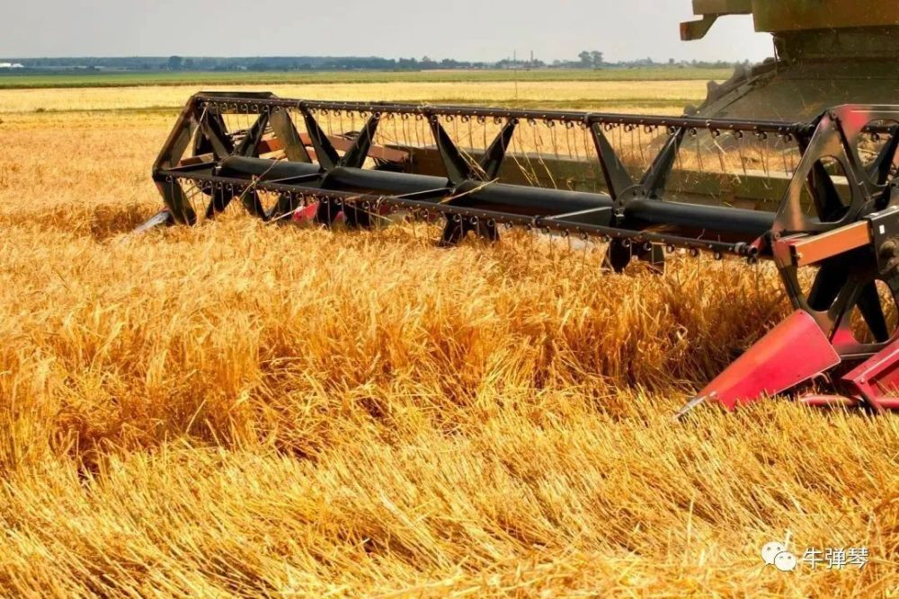
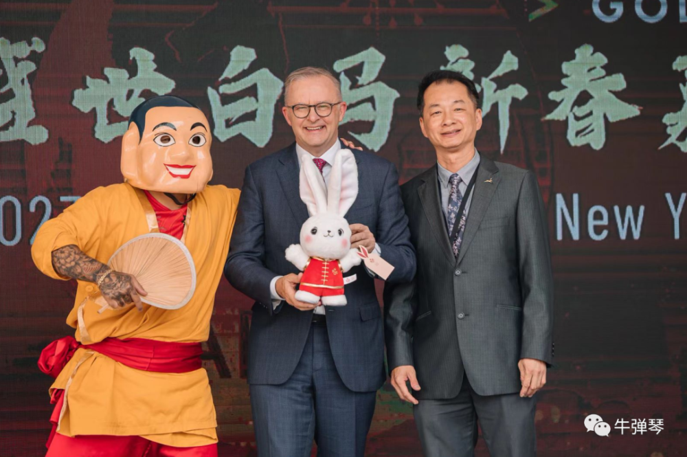

# 澳大利亚大麦重返中国市场，中澳关系正发生微妙变化

_资料图_

**中国和澳大利亚，终于迎来一个好消息。**

澳大利亚的大麦，又可以在中国市场大卖了。

看中国商务部最新的公告： **鉴于中国大麦市场情况发生变化，从8月5日起，终止对澳大利亚大麦征收反倾销税和反补贴税。**

历时三年多的惩罚，就此结束。

记得3年前中方进行“双反”惩罚时，很焦虑的澳大利亚政府宣布，要对中方进行“报复”，要向WTO提起诉讼。

因为澳大利亚确实感到了痛，73.6%的反倾销税和6.9%的反补贴税，让澳大利亚大麦立刻失去了竞争力，丢掉了中国进口大麦第一来源国的帽子。

那损失的都是真金白银，以及澳大利亚农民的支持啊。

针对澳大利亚所谓的“报复”，记得当时外交部发言人汪文斌还回应称，澳大利亚政府应当认真对待中方关切，采取实际行动，纠正针对中国企业的歧视性做法……

三年，一晃就过去了。事情，终于有了圆满的解决。我看到，中方公告发布后，澳大利亚立刻表示欢迎。

澳大利亚外长黄英贤在一份声明中说： **“我们对这一结果表示欢迎，这为我们的大麦出口商重新进入中国市场铺平道路，澳大利亚生产商和中国消费者都获益。”**

澳大利亚总理阿尔巴尼斯也感慨： **这是一个好的结果。**

惩罚有惩罚的背景，终止有终止的理由。中澳关系在风风雨雨之后，似乎也迎来了一个新的开始。

我总有一种强烈的感觉， **中澳关系正在发生微妙而重大的变化。**

因为阿尔巴尼斯去年当上澳大利亚总理后，在对华上出现了一系列较为积极的现象。完全个人观点，至少有三个标志性事件。

**第一件，去年底巴厘岛G20峰会期间，中澳领导人实现了会晤。**

我记得当时很多外媒就评论，6年来的第一次正式会晤，有助于中澳关系的解冻和恢复发展。

**第二件，阿尔巴尼斯多次很积极涉华表态。**

记得去年底在曼谷，有记者询问阿尔巴尼斯：如何看待台湾地区加入CPTPP，是否会支持台湾地区加入？

阿尔巴尼斯当即回答：

CPTPP是被公认的国家之间签署的合作协议。台湾不属于此类，它现在是以一个经济体的身份参加APEC。（澳大利亚）两党均支持一个中国政策。我们支持在台湾问题上维持现状，不希望在台海看到任何改变现状的单边举措。

阿尔巴尼斯的意思很明确，澳大利亚不会支持台湾地区加入CPTTP，看澳媒体的评论，相对于澳上届政府，“这是一个立场转变”。

这就对了，这也是对中国发出的某种信号。

还有，对于是否访问中国，阿尔巴尼斯今年4月明确表示，
**“对话是一件好事情”，“如果收到邀请，我会接受，并为之制定一个时间表。但目前时间表还没有制定出来”。**

什么意思？

阿尔巴尼斯亲自出面，希望中方赶紧发邀请，我好去中国。

今年恰逢澳大利亚总理首次访华50周年， **如果阿尔巴尼斯今年访华，他也将成为特恩布尔（2016年访华）后，近7年来第一位访华的澳大利亚总理。**

时间确实拖得有点久了。在他没去之前，一些澳大利亚州长已经纷纷访华。

**第三件，中澳间的一些棘手问题逐步解决。**

比如，大麦问题。中国宣布，从8月5日起，终止对澳大利亚大麦的“双反”惩罚，相对应的，澳大利亚很快就会撤回WTO诉讼。

之前，外界也注意到，在时隔两年后，澳大利亚动力煤已开始大规模输入中国。澳大利亚龙虾又回到中国人餐桌……

中澳关系开始转圜，但我们还是要清醒，三点清醒吧。

**第一，我们要清醒，澳大利亚毕竟是西方阵营。**

别期望太高，那失望也会更高。别忘了，澳大利亚是五眼联盟的重要成员，还是所谓的四国机制成员，更是臭名昭著的AUKUS（绰号“澳哭死”）的关键角色。

毕竟一直奉美国为大哥，对法国都可以背后一刀，更别提对中国了。

阿尔巴尼斯现在很有魄力，说得很动听，但以后呢？如果澳大利亚又换了一个总理呢？

一朝被蛇咬，十年怕井绳，我们还是多保持一点警惕吧。

**第二，我们要清醒，澳大利亚毕竟不是美国。**

中国一直是澳大利亚最大的市场，没有之一。阿尔巴尼斯就明确承认，“澳大利亚与中国的贸易额超过了与第二、第三、第四大贸易伙伴的贸易总和”。

国际政治，利益还是第一位的。没有中国市场，澳大利亚经济立马崩盘。

​所以，我们看到，不管美国怎么施压，朔尔茨、马克龙纷纷到访中国，欧洲不是美国。同样，澳大利亚也不是美国。

哪怕再亲密的盟友，肯定也有利益差别的。阿尔巴尼斯上台后，积极调整对华政策，有政党轮替的因素，也意识到对华错误政策的巨大代价。当然，也与我们坚决斗争有关，敢于斗争，更善于斗争。

我总认为，辱骂与恐吓绝不是战斗。善于斗争，有时是针锋相对，以牙还牙，但更多时候，还是要博弈，要自信，要从容，要有谋略，也要给对方转圜的机会和空间。

**第三，我们要清醒，要认真吸取经验和教训。**

坦率地说，教训是很深刻的，浓眉大眼的澳大利亚，和中国关系不错的澳大利亚，突然对中国背后一刀又一刀，是很多人打死都想不到的。

尤其在疫情期间，澳方还主动给美国递投名状，各种抹黑造谣攻击中国，最后导致中澳关系急剧恶化，让人实在看不懂。

那中国只能奉陪了。我之前就说过，这个世界，没办法，人善被人欺，马善被人骑，没有一点斗争精神，那就只能被欺负被抹黑被侮辱。

这对澳大利亚真是好事吗？

肯定不是。所以，才有了阿尔巴尼斯的更弦更张，中澳关系终于又要翻开新的一页。

**教训深刻，隐患依然。我们就更要沉住气，要听其言、观其行。**

还是那句话吧。

**这个世界，真正高超的大国外交，就是化强敌为朋友。内修文德，外服友邦，自然近者悦、远者来！政通人和，百姓安乐，我们就更有底气和信心。由此，德不孤，必有邻。**

**将朋友搞得多多的，将敌人搞得少少的，这样的中国，又何惧之有？**

什么是外交艺术？

这应该就是外交艺术吧。

